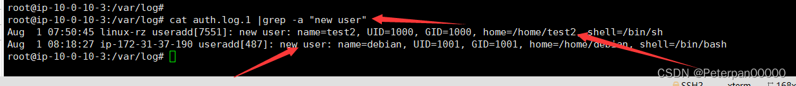

# Linux日志分析

## 一、简介

靶机名：Linux日志分析

靶机账号/密码：root linuxrz

难度-初级

# 二、题目

1.有多少IP在爆破主机ssh的root帐号，如果有多个使用","分割  
2.ssh爆破成功登陆的IP是多少，如果有多个使用","分割  
3.爆破用户名字典是什么？如果有多个使用","分割  
4.登陆成功的IP共爆破了多少次  
5.黑客登陆主机后新建了一个后门用户，用户名是多少

# 三、WriteUp

‍

### 一、前言

题目链接：[第一章 应急响应-Linux日志分析](https://xj.edisec.net/challenges/24)

‍

**什么是Linux日志分析？**

Linux日志分析是指对Linux系统中生成的日志文件进行检查、监控和分析的过程。在Linux系统中，各种服务和应用程序会产生日志文件，记录系统运行状态、用户操作、系统错误、安全事件等信息。分析这些日志可以帮助系统管理员理解系统的运行状况，诊断问题，并确保系统的安全和稳定运行。日志分析可以手动进行，也可以使用各种日志分析工具来自动化这一过程。常见的日志文件包括系统日志（/var/log/syslog 或 /var/log/messages）、认证日志（/var/log/auth.log）、应用程序日志等。

**常见日志文件**

Linux系统中的日志文件通常存储在 `/var/log`​ 目录下，常见的日志文件包括：

*  **/var/log/syslog**：记录系统的各种信息和错误。
*  **/var/log/auth.log**：记录身份验证相关的信息，如登录和认证失败。
*  **/var/log/kern.log**：记录内核生成的日志信息。
*  **/var/log/dmesg**：记录系统启动时内核产生的消息。
*  **/var/log/boot.log**：记录系统启动过程中的消息。
*  **/var/log/messages**：记录系统的广泛消息，包括启动和应用程序信息。
*  **/var/log/secure**：记录安全相关的消息。
*  **/var/log/httpd/** ：记录Apache HTTP服务器的访问和错误日志（若安装了Apache）。
*  **/var/log/nginx/** ：记录Nginx服务器的访问和错误日志（若安装了Nginx）。

### 二、参考文章

[玄机靶第一章 应急响应-Linux日志分析](https://blog.csdn.net/qq_46343633/article/details/139443874)

[【玄机】-----应急响应](https://blog.csdn.net/m0_63138919/article/details/138822190)

‍

### 三、步骤（解析）

**在这里怎么开启靶机使用Xshell连接我就不再此多演示了，看过《第一章 应急响应-webshell查杀wp》应该都明白了；（这里直接上操作）**

#### 步骤#1

##### 1.有多少IP在爆破主机ssh的root帐号，如果有多个使用","分割 小到大排序 例如flag{192.168.200.1,192.168.200.2}

遇到这种题，我们应该怎么办？

首先肯定是先找到日志的位置，一般来说，SSH登录尝试会记录在 `/var/log/auth.log.1`​（这是固定的）

接着那既然是爆破，那肯定会有很多失败的次数对吧？

* **使用grep筛选出SSH失败的登录尝试**： 我们需要筛选出涉及到root帐号的SSH失败登录尝试的日志条目。

最后；

* **提取IP地址**： 从这些日志条目中提取尝试登录的IP地址。
* **统计各个IP地址的尝试次数**： 统计每个IP地址的尝试次数，找出所有尝试暴力破解的IP。

逻辑基本就是上面这样，如果日志少一些那还好，可以一条条进行分析，日志多的话那可能还要进行筛选；

命令：

	cat auth.log.1 | grep -a "Failed password for root" | awk '{print $11}' | sort | uniq -c | sort -nr | more

​  
上面就是我们链接成功给出的提示，这里不在强调；

命令分析：（包详细的）

1. ​**​`cat auth.log.1`​**​:

    * ​`cat`​ 命令用于显示 `auth.log.1`​ 文件的内容。
    * 这里 `auth.log.1`​ 是一个日志文件，通常是系统日志的备份文件。
2. ​ **​`|`​** ​:

    * 管道符号，用于将前一个命令的输出作为下一个命令的输入。
3. ​**​`grep -a "Failed password for root"`​** ​:

    * ​`grep`​ 命令用于在输入中搜索包含特定模式的行。
    * ​`-a`​ 选项表示将文件内容视为文本文件（此选项通常在处理二进制文件时使用，但对于纯文本文件，可以省略）。
    * ​`"Failed password for root"`​ 是搜索模式，即查找所有包含"Failed password for root"的行，这些行表示尝试登录root用户的失败尝试。
4. ​**​`awk '{print $11}'`​** ​:

    * ​`awk`​ 是一个文本处理工具，用于按字段处理文本。
    * ​`{print $11}`​ 表示打印每行的第11个字段。假设日志格式为标准格式，第11个字段通常是IP地址。
5. ​**​`sort`​**​:

    * ​`sort`​ 命令用于对输入行进行排序。
    * 这里是对提取的IP地址进行排序。
6. ​**​`uniq -c`​**​:

    * ​`uniq`​ 命令用于删除重复的行。
    * ​`-c`​ 选项表示对每个唯一的行计数，即统计每个IP地址的出现次数。
7. ​**​`sort -nr`​**​:

    * ​`sort`​ 命令再次用于排序。
    * ​`-n`​ 选项表示按数值进行排序。
    * ​`-r`​ 选项表示按降序排序。
    * 组合起来，即按出现次数从高到低排序。
8. ​**​`more`​**​:

    * ​`more`​ 命令用于分页显示输出。
    * 由于输出可能很长，`more`​ 命令允许用户逐页查看结果。

**总结**

这条命令的具体功能如下：

* 从 `auth.log.1`​ 文件中筛选出所有尝试登录root用户失败的条目。
* 提取这些条目中的IP地址（假设IP地址是日志行中的第11个字段）。
* 对IP地址进行排序和去重，并统计每个IP地址的尝试次数。
* 将结果按尝试次数降序排序，并分页显示。

最终统计如下；

> 4 192.168.200.2  
> 1 192.168.200.32  
> 1 192.168.200.31

一开始提交发现怎么都不对明明已经筛选出来了，按道理说应该没错的啊，后来发现位置整反了。。。

（注意题目要求——小到大排序）

> flag{192.168.200.2,192.168.200.31,192.168.200.32}

#### 步骤#2

##### 2.ssh爆破成功登陆的IP是多少，如果有多个使用","分割

> 其实思路也很简单，那既然上面我们都已经得到三个IP了，最多的次数4次，不用想肯定最可疑啊，直接提交就是；

命令

	cat auth.log.1 | grep -a "Accepted " | awk '{print $11}' | sort | uniq -c | sort -nr | more

​​

> 简单来说就是分析`auth.log.1`​日志文件，提取出所有包含"Accepted "字符串的行，然后使用`awk`​命令提取每行的第11个字段（通常这个字段表示远程IP地址），之后对这些IP地址进行排序和统计，最后按照数量的降序排列，并通过`more`​命令分页显示结果。

**为什么是Accepted？**

> 在Linux系统的认证日志（例如`auth.log`​）中，"Accepted"这个词通常用来标识成功的登录尝试。当一个用户或者系统通过认证机制成功登录时，相关的日志条目会包含"Accepted"这个词。这包括通过SSH、FTP、sudo等方式的成功登录。

命令具体分析；

* ​**​`cat auth.log.1`​**​:

  * 作用：读取日志文件`auth.log.1`​的内容并将其传递到下一步。这个文件通常包含系统的身份验证日志。
* ​**​`grep -a "Accepted "`​** ​:

  * 作用：在日志文件中查找包含“Accepted ”的行。这些行记录了成功的SSH登录事件。
  * ​`-a`​选项：通常用于处理二进制文件时将其视为文本文件，这里一般可以忽略，因为`auth.log.1`​应该是纯文本文件。
* ​**​`awk '{print $11}'`​** ​:

  * 作用：从每一行中提取第11个字段。对于SSH成功登录的记录，第11个字段通常是IP地址。
  * ​`awk`​是一个强大的文本处理工具，这里用来分割每一行的文本并提取所需的部分。
* ​**​`sort`​**​:

  * 作用：对提取出的IP地址进行排序。这是为了后续的计数和去重步骤做准备。
* ​**​`uniq -c`​**​:

  * 作用：对排序后的IP地址进行去重并计数。每个唯一的IP地址会与其出现的次数一起输出。
  * ​`-c`​选项：在每个唯一项的前面显示出现次数。
* ​**​`sort -nr`​**​:

  * 作用：根据出现次数进行降序排序。这样出现次数最多的IP地址会排在最前面。
  * ​`-n`​选项：按照数值排序。
  * ​`-r`​选项：按照降序排序。
* ​**​`more`​**​:

  * 作用：逐页显示结果。这个命令适用于结果较多时，便于用户逐页查看。

**具体总结**

这个命令链条通过以下步骤统计每个IP地址成功登录的次数：

1. 读取日志文件并筛选出成功登录的记录。
2. 提取记录中的IP地址。
3. 对IP地址进行排序、去重和计数。
4. 按登录次数降序排列并逐页显示结果。

> flag{192.168.200.2}

#### 步骤#3

##### 3.爆破用户名字典是什么？如果有多个使用","分割

那做这这种的思路是什么？

那首先我们得了解什么是**爆破用户名字典**？

简单来说指黑客在进行暴力破解攻击时使用的一系列用户名列表。黑客通过自动化工具逐个尝试这些用户名，结合常见或默认密码，试图找到有效的登录凭据。这个过程被称为“字典攻击”或“暴力破解攻击”。

具体操作步骤；

* **识别关键日志条目**：

  * 确定日志中包含攻击相关信息的条目。例如，SSH 失败登录尝试通常包含“Failed password”关键字，成功登录则包含“Accepted”。
* **提取有用信息**：

  * 使用文本处理工具如 `grep`​、`awk`​、`perl`​ 或 `sed`​ 提取出关键数据。例如，可以从日志中提取出失败尝试的用户名、IP地址、时间戳等。
* **统计分析**：

  * 对提取出的信息进行统计分析，以确定被尝试最多的用户名和来源IP等。例如，使用 `uniq`​ 和 `sort`​ 对数据进行去重和排序。

所以下面我就用到了sort以及uniq进行去重和排序等等；（不是平白无故加那么多参数的，肯定是有原因的）

	cat auth.log.1 | grep -a "Failed password" |perl -e 'while($_=<>){ /for(.*?) from/; print "$1\n";}'|uniq -c|sort -nr

​​

通俗易懂的来分析一下这个命令；

> 这个命令链的主要作用是分析`auth.log.1`​文件，提取出所有包含"Failed password"字符串的行，这通常表明有失败的登录尝试。然后，它使用Perl脚本提取出失败尝试的用户名和来源IP地址，统计每个用户名的失败尝试次数，并按照次数降序排列显示结果。

具体分析一下；

* ​**​`cat auth.log.1`​**​:

  * 作用：读取日志文件`auth.log.1`​的内容并将其传递到下一步。这个文件通常包含系统的身份验证日志。
* ​**​`grep -a "Failed password"`​** ​:

  * 作用：在日志文件中查找包含“Failed password”的行。这些行记录了SSH登录失败的事件。
  * ​`-a`​选项：通常用于处理二进制文件时将其视为文本文件，这里一般可以忽略，因为`auth.log.1`​应该是纯文本文件。
* ​**​`perl -e 'while(1\n";}'`​** ​:

  * 作用：使用Perl脚本从每一行提取出失败登录尝试的用户名。
  * ​`while($_=<>)`​：逐行读取输入。
  * ​`/for(.*?) from/`​：使用正则表达式匹配模式“for [username] from”，其中`[username]`​是登录尝试的用户名。
  * ​`print "$1\n"`​：将提取的用户名打印出来。
* ​**​`uniq -c`​**​:

  * 作用：对提取出的用户名进行去重并计数。每个唯一的用户名会与其出现的次数一起输出。
  * ​`-c`​选项：在每个唯一项的前面显示出现次数。
* ​**​`sort -nr`​**​:

  * 作用：根据出现次数进行降序排序。这样出现次数最多的用户名会排在最前面。
  * ​`-n`​选项：按照数值排序。
  * ​`-r`​选项：按照降序排序。

**总结**

这个命令链条通过以下步骤统计每个用户名的SSH失败登录尝试次数：

1. 读取日志文件并筛选出失败登录的记录。
2. 使用Perl脚本从记录中提取用户名。
3. 对用户名进行去重和计数。
4. 按尝试次数降序排列。

> flag{user,hello,root,test3,test2,test1}

#### 步骤#4

##### 4.成功登录 root 用户的 ip 一共爆破了多少次

> 这个就更简单了，其实也和上面第一题重复了，因为问题问：有多少IP在爆破主机ssh的root账号？这里又问成功登录 root 用户的 ip 一共爆破了多少次？而且前面我们在统计IP的时候就已经顺便把次数统计出来了，所以PASS，这里没什么好说的；

（命令还是第一题的命令，这里只是重复一下，不在多做解释）

	cat auth.log.1 | grep -a "Failed password for root" | awk '{print $11}' | sort | uniq -c | sort -nr | more

​​

> flag{4}

#### 步骤#5

##### 5.黑客登陆主机后新建了一个后门用户，用户名是多少

这个又是一个新的知识点，问我们黑客登陆主机后新建了一个后门用户，用户名是多少？

那这种我们怎么操作呢？（其实基本也就是这五个步骤）

**步骤1**：确定日志文件

通常与用户登录和用户管理活动相关的日志文件是 `/var/log/auth.log`​ 或其备份文件如 `/var/log/auth.log.1`​。

**步骤2**：搜索创建用户的关键字

使用 `grep`​ 命令搜索与创建用户相关的关键字，如 `new user`​。这样可以找到所有新建用户的日志条目。

​`cat /var/log/auth.log.1 | grep -a "new user"`​

此命令会列出所有包含 `new user`​ 的日志行，这些行通常记录了用户创建的详细信息。

**步骤3**：提取新用户信息

从日志中提取新用户的详细信息，包括用户名、创建时间等。

例如，假设你得到了如下输出：

​`Jan 12 10:32:15 server useradd[1234]: new user: name=testuser, UID=1001, GID=1001, home=/home/testuser, shell=/bin/bash`​

这条日志显示了创建的新用户 `testuser`​。

**步骤4**：分析执行上下文

确认新用户的创建是否由合法用户执行，或是否有可疑的远程登录记录。

可以使用以下命令查找所有用户登录的情况，以确定是否有可疑的登录行为：

​`grep "Accepted" /var/log/auth.log.1`​

**步骤5**：进一步确认

结合其他日志文件，如 `/var/log/syslog`​，查看是否有异常的命令执行或系统变更。

**总结

* **确定相关日志文件**。
* **搜索特定关键字**，找到新用户创建的记录。
* **提取并分析详细信息**，确认新用户的合法性。
* **结合其他日志文件**，确认是否有异常活动。

那这里我们肯定就是找新建用户，因为题目也已经说明了.黑客登陆主机后新建了一个后门用户；

	cat auth.log.1 |grep -a "new user"

​​

这里的《-a》是什么意思呢？

简单来说就是在 `grep`​ 命令中，`-a`​ 选项的作用是将文件视为文本文件处理，即使文件可能包含一些二进制数据。通常，`grep`​ 会将二进制文件视为二进制数据而不是文本数据，并可能不会显示预期的结果。使用 `-a`​ 选项可以确保 `grep`​ 按文本模式处理文件中的内容。

> flag{test2}

‍

# 四、flag

**1.有多少IP在爆破主机ssh的root帐号，如果有多个使用&quot;,&quot;分割**

	flag{192.168.200.2,192.168.200.31,192.168.200.32}

‍

**2.ssh爆破成功登陆的IP是多少，如果有多个使用&quot;,&quot;分割**

	flag{192.168.200.2}

‍

**3.爆破用户名字典是什么？如果有多个使用&quot;,&quot;分割**

	flag{user,hello,root,test3,test2,test1}

‍

**4.登陆成功的IP共爆破了多少次**

	flag{4}

‍

**5.黑客登陆主机后新建了一个后门用户，用户名是多少**

	flag{test2}
