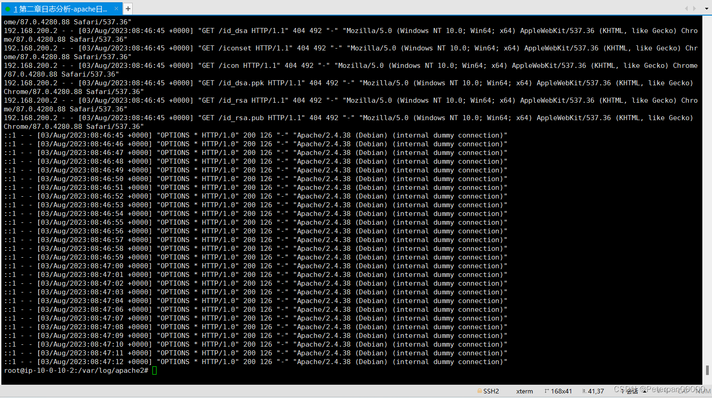
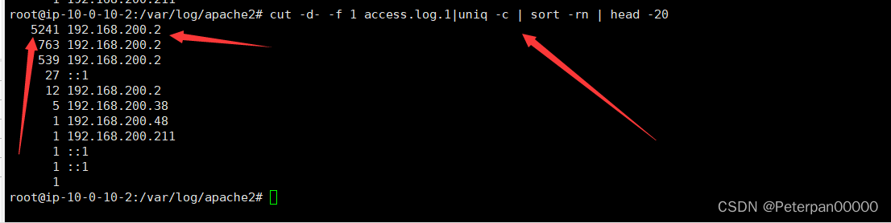
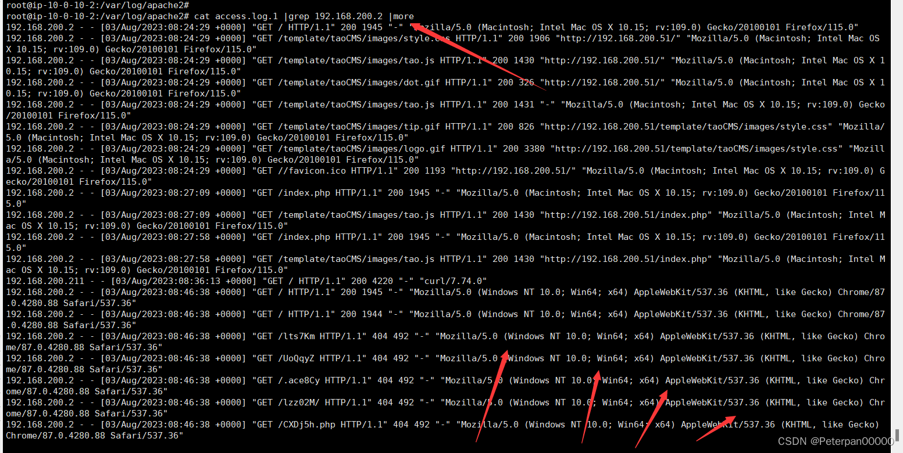
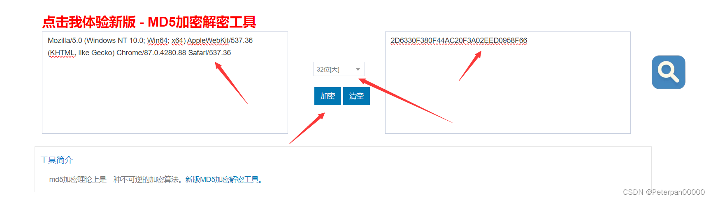
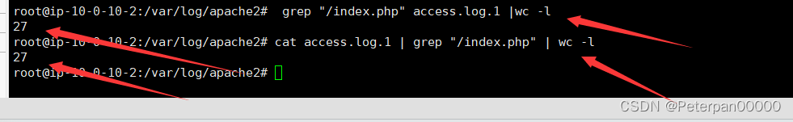
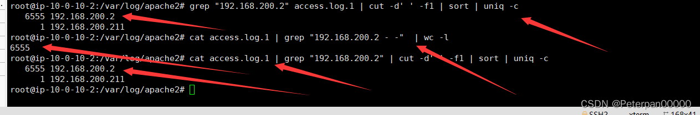
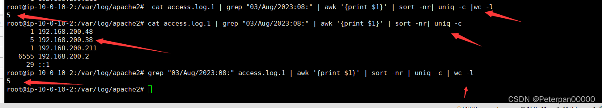

# apache日志分析

## 一、简介

靶机名：apache日志分析

靶机账号/密码：root apacherizhi

# 二、题目

1、提交当天访问次数最多的IP，即黑客IP：  
2、黑客使用的浏览器指纹是什么，提交指纹的md5：  
3、查看index.php页面被访问的次数，提交次数：  
4、查看黑客IP访问了多少次，提交次数：  
5、查看2023年8月03日8时这一个小时内有多少IP访问，提交次数:

# 三、WriteUp

‍

### 一、前言

题目链接：[第二章日志分析-apache日志分析](https://xj.edisec.net/challenges/29)

‍

**什么是apache日志分析？**

日志分析是监控和优化网站性能、安全性和用户体验的重要手段。Apache日志分析是其中的一个重要组成部分，因为Apache是目前最流行的Web服务器之一。Apache日志记录了服务器上的各种活动，包括访问请求、错误信息、用户行为等。通过分析这些日志，可以获取有价值的信息，帮助网站管理员做出更好的决策。

**Apache日志分析**

Apache日志分析是专门针对Apache HTTP服务器生成的日志文件进行分析。Apache服务器主要生成两种类型的日志文件：

1. **访问日志（access log）** ：

    * 记录了所有对Web服务器的请求，包括客户端IP地址、请求时间、请求方式、请求资源、响应状态码、数据传输量等。
2. **错误日志（error log）** ：

    * 记录了服务器在运行过程中遇到的错误和警告信息，包括启动和停止时的信息。

‍

### 二、参考文章

[玄机靶场apache日志](https://blog.csdn.net/m0_62467948/article/details/138656504)

‍

### 三、步骤（解析）

这里怎么使用Xshell链接靶机就不再多叙，如不明白的可以点开我主页找到文章**玄机——第一章 应急响应-webshell查杀 wp（手把手保姆级教学）** 进行查看；（这里直接上实战）

#### 步骤#1.1

##### 提交当天访问次数最多的IP，即黑客IP：

首先我们肯定是要找到日志的位置是吧，接着再对日志进行逐步分析；

这里总结一下常见的日志位置；

**常见日志文件位置**

1. **Apache日志**

    * **访问日志**：默认位置通常是`/var/log/apache2/access.log.1`​（Debian/Ubuntu）或`/var/log/httpd/access_log.1`​（CentOS/RHEL）。
    * **错误日志**：默认位置通常是`/var/log/apache2/error.log.1`​（Debian/Ubuntu）或`/var/log/httpd/error_log.1`​（CentOS/RHEL）。
2. **SSH日志**

    * **身份验证日志**：通常位于`/var/log/auth.log`​（Debian/Ubuntu）或`/var/log/secure`​（CentOS/RHEL）。
3. **系统日志**

    * **系统日志**：通常位于`/var/log/syslog`​（Debian/Ubuntu）或`/var/log/messages`​（CentOS/RHEL）。

那我们肯定是Apache，这点母庸质疑；

先进入日志所在目录；

	cd /var/log/apache2/

先粗略查看一下；

	cat access.log.1

然后你会发现，真的很多条记录，长时间盯着眼睛都要瞎了，还是得筛选；

> 额。。。其实也不需要要怎么麻烦，你仔细看看会发现里面其实IP不是很多，笨一点大不了一个一个提交就行，眼神再好一点的，会发现全部是192.168.200.2这个ip，就拿我这张随便截图来说就全部是192.168.200.2，提交发现正确。。。。（说是这样说，但有时候还是得按流程走哈，因为有时候数据正在庞大的时候是看不到的，光数据就几十w条）；

​​

**那需要怎么筛选呢？（加几个参数即可）**

* ​`cut`​：这是一个命令行工具，用于从每一行中提取特定的部分。
* ​`-d-`​：指定字段的分隔符是`-`​（一个连字符）。
* ​`-f 1`​：指定要提取第一个字段（即连字符前的部分）。
* ​`access.log.1`​：输入文件，假设这是Apache访问日志的文件名。

那有的人就会问了，哎，为什么这个cut和cat就差一个字母，会不会效果一样啊？

​`cat`​（concatenate）用于连接文件并打印到标准输出。通常用于查看文件的内容、合并文件和创建文件。

​`cut`​用于从文件的每一行中提取指定的部分。通常用于处理列格式数据，比如从CSV文件中提取某些列。

**两者区别；**

* **用途不同**：

  * ​`cat`​主要用于连接和显示文件内容。
  * ​`cut`​主要用于从文件中提取特定的列或字段。
* **功能不同**：

  * ​`cat`​可以将多个文件内容合并输出到一个文件或标准输出。
  * ​`cut`​可以根据指定的字符位置、字节位置或分隔符提取部分内容。
* **常见用法不同**：

  * ​`cat`​常用于快速查看文件内容或合并文件。
  * ​`cut`​常用于处理表格数据、日志文件等，需要提取特定列的数据。

***举个例子；***

* 查看文件内容：

  ​`cat file.txt`​
* 提取日志文件中的IP地址（假设IP地址在日志文件的第一个字段，用空格分隔）：

  ​`cut -d' ' -f1 access.log`​

这题完整命令：

	 cut -d- -f 1 access.log.1|uniq -c | sort -rn | head -20

​​

	flag{192.168.200.2}

#### 步骤#1.2

##### 黑客使用的浏览器指纹是什么，提交指纹的md5：

做这题之前，首先我们需要了解什么是**浏览器的指纹？**

> 浏览器指纹（Browser Fingerprinting）是指通过收集和分析浏览器和设备的特征信息，创建一个唯一的标识符，从而识别或跟踪用户。这种技术不仅仅依赖于常规的Cookie，还利用浏览器和设备的多种属性来进行识别。

**常见的；**

* **浏览器类型和版本**：使用的浏览器及其版本。
* **操作系统**：设备所运行的操作系统及其版本。
* **时区**：设备的时区设置。
* **语言和区域设置**：浏览器和操作系统的语言设置。
* **屏幕分辨率和色深**：设备屏幕的分辨率和颜色深度。
* **插件和扩展**：已安装的浏览器插件和扩展。
* **字体**：系统上安装的字体。
* **HTTP头**：浏览器在请求时发送的HTTP头信息，包括User-Agent、Accept、Accept-Language等。
* **Canvas指纹**：使用HTML5 Canvas元素绘制图形并分析生成的图像数据，以获取独特的图形渲染特征。
* **WebGL指纹**：利用WebGL的特性，通过绘制3D图形来获取设备的渲染特性。
* **设备性能特征**：CPU、GPU、内存等硬件信息。

这里拓展一下，**一般黑客使用黑客使用浏览器指纹的目的；**

**常见的；**

* **追踪用户活动**：在用户禁用Cookie或使用隐私保护工具时，仍然能够跟踪用户的在线活动。
* **识别并避开安全系统**：通过识别用户的浏览器指纹，可以绕过某些安全系统或反欺诈措施，假装成合法用户进行恶意活动。
* **目标攻击**：了解目标用户的设备和浏览器特性，从而制定更有针对性的攻击策略，比如利用特定浏览器或操作系统的已知漏洞进行攻击。

所以这题就更so easy了！

思路是什么，现在我们知道黑客的ip了啊，日志位置我们也知道了啊，直接筛选一波黑客ip不就行了；

命令；

	cat access.log.1 |grep 192.168.200.2 |more

​​

> Mozilla/5.0 (Windows NT 10.0; Win64; x64) AppleWebKit/537.36 (KHTML, like Gecko) Chrome/87.0.4280.88 Safari/537.36

这种就是，你随便往下翻翻会发现都一样，所以这里我们直接找个在线MD5加密秒了；

[在线MD5加密](https://www.sojson.com/md5/)

​​

	flag{2D6330F380F44AC20F3A02EED0958F66}

#### 步骤#1.3

##### 查看index.php页面被访问的次数，提交次数：

访问index.php被访问次数，这里我们就使用一个参数秒了；

**这里注意一点就是如果你使用的是cat命令，必须是/index.php，因为这样表示当前目录下的index.php，因为万一别的地方也有呢？这里我就替大家把坑先踩了。。。。**

**流程就是；**

> 1. 使用 `grep`​ 命令筛选 `index.php`​ 的访问记录

​`grep`​ 命令用于搜索日志文件中的特定字符串，这里是 `index.php`​。

​`grep "index.php" access.log`​

这将输出所有包含 `index.php`​ 的访问记录。

> 2. 使用 `wc -l`​ 命令统计行数

​`wc -l`​ 命令用于统计行数，即访问次数。

​`grep "index.php" access.log | wc -l`​

这个命令会输出包含 `index.php`​ 的访问记录的总行数，即 `index.php`​ 被访问的次数。

命令；

	cat access.log.1 | grep "/index.php" | wc -l

有的人就会问了，哎怎么很刚刚说的命令不一样啊？

其实大差不差的，一个道理，这里不在多叙；

​​

	flag{27}

#### 步骤#1.4

##### 查看黑客IP访问了多少次，提交次数：

根据题一，我们就已经知晓黑客ip（192.168.200.2），那我们就根据这个地方下手，逻辑也很简单，不就是问这个ip访问的次数嘛，方法很多（不唯一），下面从三种命令带你逐步分析；

**两cat分析**

> cat access.log.1 | grep "192.168.200.2 - -"  | wc -l

* ​**​`grep "192.168.200.2 - -"`​** ​:

  * 从 `cat`​ 命令输出的内容中筛选出包含字符串 `192.168.200.2 - -`​ 的行。这通常意味着你在查找某个特定 IP 地址的访问记录。
* ​**​`wc -l`​**​:

  * 统计通过 `grep`​ 筛选出的行数，即包含 `192.168.200.2 - -`​ 的行数。（上一题刚刚用过我就不需要多说了吧？）

那这里有人就要问了，**后面--是什么意思？**

在 Apache 访问日志中，格式通常是标准的组合日志格式（Combined Log Format），包含了客户端 IP 地址、客户端身份验证信息、用户 ID、请求时间、请求行、状态码、响应大小、引用来源和用户代理等信息。以下是一个典型的日志条目：

**例如；**

​`192.168.200.2 - - [03/Aug/2023:08:00:00 +0000] "GET /index.php HTTP/1.1" 200 1234 "-" "Mozilla/5.0 (Windows NT 10.0; Win64; x64)"`​

在这个日志条目中，`192.168.200.2`​ 是客户端 IP 地址，`- -`​ 是占位符，表示客户端身份验证信息（客户端身份验证信息为空时用 `-`​ 表示）。

> cat access.log.1 | grep "192.168.200.2" | cut -d' ' -f1 | sort | uniq -c

**作用；这个命令** **​`cat access.log.1 | grep "192.168.200.2" | cut -d' ' -f1 | sort | uniq -c`​**​ **的作用是从** **​`access.log.1`​**​ **文件中筛选出指定 IP 地址的访问记录，并统计每个 IP 地址的出现次数。**

1. ​**​`cut -d' ' -f1`​**​：

    * ​`cut`​ 命令用于从每行中提取指定的字段。
    * ​`-d' '`​ 表示字段分隔符是空格。
    * ​`-f1`​ 表示提取第一个字段，即 IP 地址。
2. ​**​`sort`​**​：

    * ​`sort`​ 命令用于对输入内容进行排序。
    * 这里它对提取出的 IP 地址进行排序。
3. ​**​`uniq -c`​**​：

    * ​`uniq`​ 命令用于去除重复的行。
    * ​`-c`​ 选项表示在输出中包含每个唯一行前出现的次数。
    * 这里它统计每个唯一 IP 地址出现的次数。

**总结：**

* **读取日志文件**：

  * 使用 `cat`​ 命令读取 `access.log.1`​ 的内容。
* **过滤特定 IP 的访问记录**：

  * 使用 `grep "192.168.200.2"`​ 筛选出包含指定 IP 地址的行。
* **提取 IP 地址**：

  * 使用 `cut -d' ' -f1`​ 提取每一行的第一个字段，即 IP 地址。
* **排序**：

  * 使用 `sort`​ 对提取出的 IP 地址进行排序，以便 `uniq`​ 能够正确统计连续出现的相同 IP 地址。
* **统计出现次数**：

  * 使用 `uniq -c`​ 统计每个唯一 IP 地址出现的次数，并在每个 IP 地址前显示其出现的次数。

**grep分析**

> grep "192.168.200.2" access.log.1 | cut -d' ' -f1 | sort | uniq -c

其实也不难看出，这个和我们上面那条cat差不多是把，其实也没错，我们先正常分析，待会再说两者区别；

* ​**​`cut -d' ' -f1`​**​：

  * ​`cut`​ 命令用于从每行中提取指定的字段。
  * ​`-d' '`​ 表示字段分隔符是空格。
  * ​`-f1`​ 表示提取第一个字段，即提取每行的第一个字段。
  * 在典型的访问日志格式中，第一字段通常是 IP 地址，所以这一步提取出所有包含 IP 地址 `192.168.200.2`​ 的记录的 IP 地址部分。
* ​**​`sort`​**​：

  * ​`sort`​ 命令用于对输入内容进行排序。
  * 这里它对提取出的 IP 地址进行排序，以便 `uniq`​ 能够正确统计连续出现的相同 IP 地址。
  * 排序是为了后续步骤中的去重和计数。
* ​**​`uniq -c`​**​：

  * ​`uniq`​ 命令用于去除重复的行。
  * ​`-c`​ 选项表示在输出中包含每个唯一行前出现的次数。
  * 这里它统计每个唯一 IP 地址出现的次数，并在每个 IP 地址前显示其出现的次数。

**简单来说就是；**

* **过滤**：使用 `grep`​ 筛选包含指定 IP 地址 `192.168.200.2`​ 的日志记录。
* **提取字段**：使用 `cut`​ 提取每行的第一个字段，即 IP 地址部分。
* **排序**：使用 `sort`​ 对提取出的 IP 地址进行排序。
* **统计**：使用 `uniq -c`​ 统计每个 IP 地址的出现次数。

**区别**

这两个命令的主要区别在于是否使用了 `cat`​ 命令，这个不用我多说了吧？：

1. ​**​`grep "192.168.200.2" access.log.1 | cut -d' ' -f1 | sort | uniq -c`​**​：

    * 直接使用 `grep`​ 从文件 `access.log.1`​ 中搜索包含 `192.168.200.2`​ 的行。
    * 后续步骤提取、排序和统计。
2. ​**​`cat access.log.1 | grep "192.168.200.2" | cut -d' ' -f1 | sort | uniq -c`​**​：

    * 先使用 `cat`​ 命令读取整个文件 `access.log.1`​，然后将内容通过管道传递给 `grep`​ 进行搜索。
    * 后续步骤与上一个命令相同。

**主要区别**

* **使用** **​`cat`​**​：第一条命令直接使用 `grep`​ 读取文件，避免了 `cat`​ 的额外步骤，更加简洁高效。
* **不使用** **​`cat`​**​：第二条命令多了一步 `cat`​，从功能上讲没有必要，因为 `grep`​ 可以直接读取文件内容。

总体而言，这里博主推荐大家使用第一条命令（直接使用 `grep`​）更简洁和高效。

​​

	flag{6555}

#### 步骤#1.5

##### 查看2023年8月03日8时这一个小时内有多少IP访问，提交次数:

这里让我们查看2023年8月03日8时这一个小时内有多少IP访问；

首先我们得先把日期换成日志里面的格式，然后我们才可使用grep进行筛选，这点大家肯定兜明白我就不说了；

**2023年8月03日8时——03/Aug/2023:08:**

这里我也使用了三条命令（方法不唯一哈）；

> cat access.log.1 | grep "03/Aug/2023:08:" | awk '{print $1}' | sort -nr| uniq -c |wc -l

* ​**​`grep "03/Aug/2023:08:"`​** ​:

  * 从日志内容中过滤出包含特定时间段 `03/Aug/2023:08:`​ 的行。这一步筛选出在 2023 年 8 月 3 日 08:00 到 08:59 之间的所有访问记录。
* ​**​`awk '{print $1}'`​** ​:

  * ​`awk`​ 命令用于从前一步筛选出的日志行中提取第一个字段（一般情况下，这个字段是IP地址）。输出的每一行只包含一个 IP 地址。
* ​**​`sort -nr`​**​:

  * 对提取出的 IP 地址进行逆序排序（`-nr`​ 表示按数值逆序排序）。
* ​**​`uniq -c`​**​:

  * 统计排序后的 IP 地址的出现次数。输出结果的每一行包含两个字段，第一个字段是 IP 地址出现的次数，第二个字段是 IP 地址本身。
* ​**​`wc -l`​**​:

  * 计算统计结果的行数，即不同 IP 地址的数量。（这里出现这么多次，而且我博客里面回回都说，这要再不明白是什么意思，看过我博客的可对不起我了哈）；

**步骤；**

* 读取日志文件。
* 筛选特定时间段的日志行。
* 提取 IP 地址。
* 对 IP 地址进行排序。
* 统计每个 IP 地址的出现次数。
* 计算不同 IP 地址的数量。

> cat access.log.1 | grep "03/Aug/2023:08:" | awk '{print $1}' | sort -nr| uniq -c

这里细心的人就会发现了，哎，怎么这个和上面就少一个wc -l啊？

**区别在于；** （看需要加与不加）

* **不加** **​`wc -l`​**​：显示每个 IP 地址的访问次数。
* **加上** **​`wc -l`​**​：显示不同 IP 地址的总数量。

其它的和上面一样，我就略过了；

> grep "03/Aug/2023:08:" access.log.1 | awk '{print $1}' | sort -nr | uniq -c | wc -l

主要来分析分析这个；（其实一个道理，但是怕有些人看了上文不看下文我还是说说吧）；

1. ​**​`awk '{print $1}'`​** ​:

    * 使用 `awk`​ 从筛选出的日志行中提取第一个字段（通常是 IP 地址）。输出的每一行只包含一个 IP 地址。（**上面刚刚说完**）
2. ​**​`sort -nr`​**​:

    * 对提取出的 IP 地址进行逆序排序（`-nr`​ 表示按数值逆序排序）。（**这个也没少用**）
3. ​**​`uniq -c`​**​:

    * 统计排序后的 IP 地址的出现次数。输出结果的每一行包含两个字段：第一个字段是 IP 地址出现的次数，第二个字段是 IP 地址本身。（**不知道用多少回了，记住了**）
4. ​**​`wc -l`​**​:

    * 计算统计结果的行数，即不同 IP 地址的数量。（**可得记住了**）

* **步骤**：（其实大差不差的）

  1. 从日志文件中筛选特定时间段的日志行。
  2. 提取 IP 地址。
  3. 对 IP 地址进行排序。
  4. 统计每个 IP 地址的出现次数。
  5. 计算不同 IP 地址的数量。

​​

	flag{5}

‍

‍

# 四、flag

**1、提交当天访问次数最多的IP，即黑客IP：**

	flag{192.168.200.2}

**2、黑客使用的浏览器指纹是什么，提交指纹的md5：**

	flag{2D6330F380F44AC20F3A02EED0958F66}

**3、查看index.php页面被访问的次数，提交次数：**

	flag{27}

**4、查看黑客IP访问了多少次，提交次数：**

	flag{6555}

**5、查看2023年8月03日8时这一个小时内有多少IP访问，提交次数:**

	flag{5}
