# Windows 实战-evtx 文件分析

## 一、简介

服务器场景操作系统 None  
点击下载附件获取附件  
任务环境说明  
    注：样本请勿在本地运行！！！样本请勿在本地运行！！！样本请勿在本地运行！！！  
    应急响应工程师在收到设备告警后，在受到攻击的服务器保存了一份log 请你协助分析 LOG 文件提交对应的 FLAG  
开放题目  
    漏洞修复  
参考靶机名：Windows 实战-evtx 文件分析

靶机账号/密码：无

难度-中级

# 二、题目

1.将黑客成功登录系统所使用的IP地址作为Flag值提交；

2.黑客成功登录系统后修改了登录用户的用户名，将修改后的用户名作为Flag值提交；

3.黑客成功登录系统后成功访问了一个关键位置的文件，将该文件名称（文件名称不包含后缀）作为Flag值提交；

4.黑客成功登录系统后重启过几次数据库服务，将最后一次重启数据库服务后数据库服务的进程ID号作为Flag值提交；

5.黑客成功登录系统后修改了登录用户的用户名并对系统执行了多次重启操作，将黑客使用修改后的用户重启系统的次数作为Flag值提交。

‍

# 三、WriteUp

‍

### 一、前言

**题目链接：**​**[第五章 Windows 实战-evtx 文件分析](https://xj.edisec.net/challenges/71)**

‍

**首先要了解.evtx是什么文件，是谁产生.evtx文件？**

.evtx 是 Windows 事件日志文件的扩展名。

**什么是 .evtx 文件？**

.evtx 文件是 Windows 事件日志文件，它们存储由 Windows 操作系统和应用程序生成的事件日志。这些日志文件以二进制格式保存，包含关于系统、应用程序和安全事件的信息。

 **.evtx 文件的作用**

1. **系统监控与维护**：

    * .evtx 文件记录系统运行时的各种事件，如启动和关机、设备驱动程序的加载、服务的启动和停止等。这些信息对于系统管理员监控和维护系统运行状况非常有用。
2. **故障排除**：

    * 当系统或应用程序出现问题时，事件日志可以提供详细的错误信息，帮助管理员和技术支持人员诊断和解决问题。
3. **安全审计**：

    * 安全日志（Security.evtx）记录了登录尝试、权限更改、策略变更等安全相关事件。通过审计这些日志，管理员可以检测到潜在的安全威胁和未授权的访问。
4. **合规性检查**：

    * 某些行业要求企业保持详细的日志记录以满足法律或行业标准的合规性要求。事件日志提供了必要的证据和记录。

**谁产生 .evtx 文件？**

.evtx 文件由 Windows 操作系统自动生成和管理。具体来说，以下组件会生成 .evtx 文件：

1. **Windows 操作系统核心组件**：

    * Windows 系统自身会记录各种系统事件，包括启动、关机、服务状态变更等。这些日志通常存储在 System.evtx 文件中。
2. **应用程序和服务**：

    * 安装在 Windows 上的各种应用程序和服务会将它们的事件日志写入相应的 .evtx 文件，例如 Application.evtx。
3. **安全事件**：

    * 与系统安全相关的事件日志由 Windows 安全审计功能生成，记录在 Security.evtx 文件中。

**常见的 .evtx 文件**

* **Application.evtx**：记录应用程序相关的事件日志。
* **System.evtx**：记录系统级别的事件日志。
* **Security.evtx**：记录安全事件和审计日志。
* **Setup.evtx**：记录与系统安装和升级相关的事件日志。
* **ForwardedEvents.evtx**：用于记录从其他系统转发的事件日志。

**使用 .evtx 文件的工具**

* **Event Viewer (事件查看器)** ：

  * Windows 内置的事件查看器工具允许用户查看、分析和导出 .evtx 文件中的事件日志。可以通过运行 `eventvwr.msc`​ 命令打开事件查看器。
* **第三方工具**：

  * 有许多第三方工具可以用来分析 .evtx 文件，例如 SolarWinds Event Log Analyzer、Splunk 等。

**总结**

.evtx 文件是 Windows 操作系统生成的事件日志文件，用于记录系统、应用程序和安全事件。这些文件在系统监控、故障排除、安全审计和合规性检查中起着至关重要的作用。系统管理员和技术支持人员经常使用事件查看器等工具来分析这些日志文件，以确保系统的正常运行和安全性。

‍

### 二、参考文章

[第五章 Windows 实战-evtx 文件分析](https://blog.csdn.net/qq_33511483/article/details/139585311)

‍

### 三、步骤（解析）

#### 步骤#1

##### 1.将黑客成功登录系统所使用的IP地址作为Flag值提交；

解题思路；

这里下载完成有三个.evtx文件（原则上这三个其实都一样，看谁都一样），这边我们就暂时先双击“安全.evtx”进行分析，题目问我们黑客登录系统所使用的IP地址是什么？找到关键“登录”，可能有过一些基础的师傅就能想到了**事件 ID 4624**，是的没错第一题就是筛选一下**事件 ID 4624**进行分析即可；

​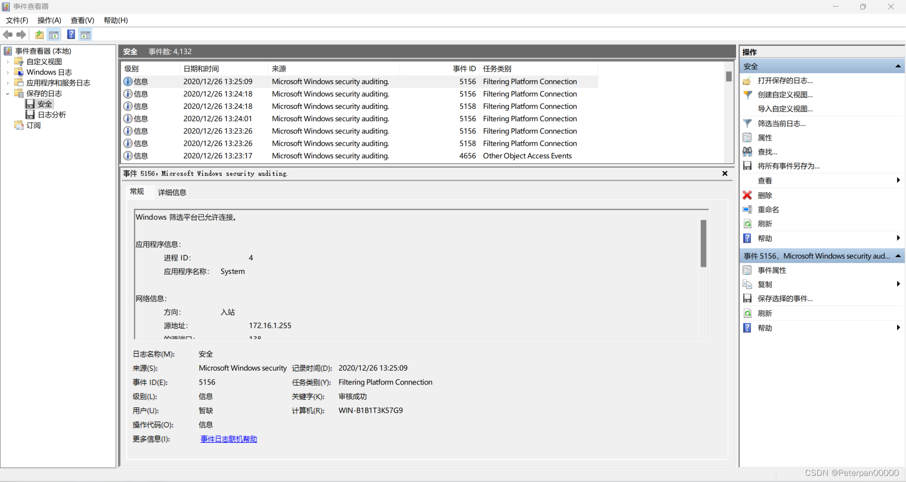​

**那有人就要问了，哎，啥是事件 ID**？

> 事件 ID（Event ID）是 Windows 事件日志中的一个标识符，用于唯一标识特定类型的事件。每个事件 ID 对应一种特定的系统活动、错误或状态变更。通过事件 ID，系统管理员和安全专家可以快速识别和理解日志记录中的不同事件，从而进行系统监控、故障排除和安全分析。

点击筛选事件ID 4624即可；

​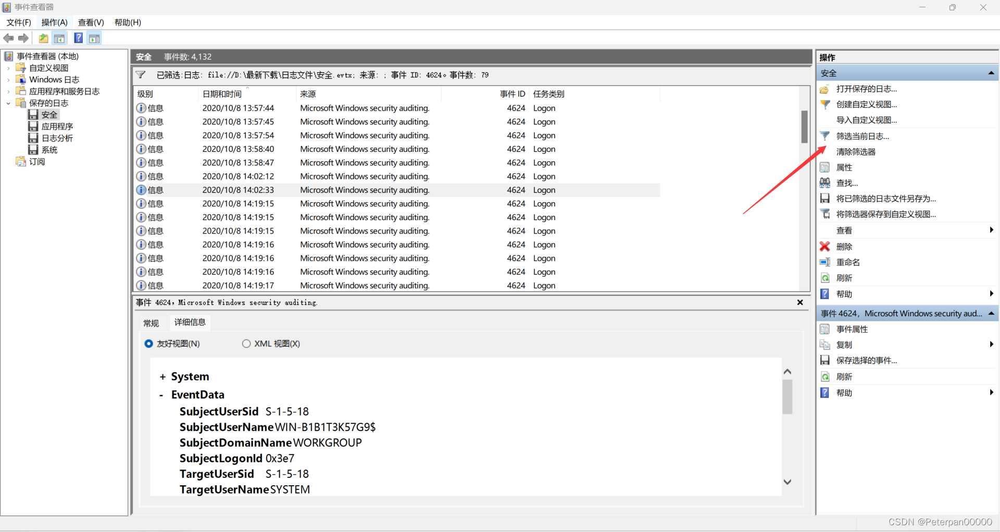  
**输入事件ID号即可**

​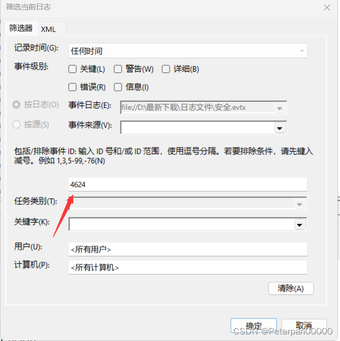​

**筛选完成，点击一下时间排序，从上往下进行查看，最后在14:02:12分发现可疑IP，尝试提交发现正确；**

​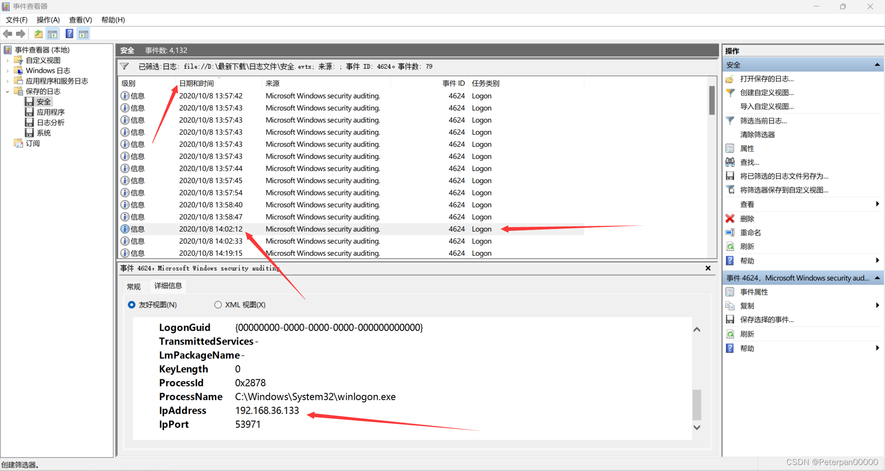​

常规；

	网络信息:  
	工作站名:	WIN-B1B1T3K57G9  
	源网络地址:	192.168.36.133  
	源端口:		53971

所以最后；

	flag{192.168.36.133}

###### 拓展1.1

**总结一下常见的事件 ID说明及详细信息**

**账户登录与注销**

1. **事件 ID 4624** - 成功的账户登录

    * 说明：用户成功登录到系统。
    * 详细信息：登录类型、登录用户、登录来源、IP 地址等。
2. **事件 ID 4625** - 登录失败

    * 说明：用户尝试登录系统但失败。
    * 详细信息：失败原因、登录类型、失败的用户名等。
3. **事件 ID 4634** - 用户注销

    * 说明：用户成功注销系统。
    * 详细信息：注销的用户名、注销类型等。
4. **事件 ID 4647** - 用户主动注销

    * 说明：用户主动注销会话。
    * 详细信息：注销的用户名。

**账户管理**

5. **事件 ID 4720** - 用户账户已创建

    * 说明：系统中创建了新用户账户。
    * 详细信息：新账户名、创建者的账户名等。
6. **事件 ID 4722** - 用户账户已启用

    * 说明：用户账户被启用。
    * 详细信息：启用的账户名。
7. **事件 ID 4725** - 用户账户已禁用

    * 说明：用户账户被禁用。
    * 详细信息：禁用的账户名。
8. **事件 ID 4726** - 用户账户已删除

    * 说明：用户账户被删除。
    * 详细信息：删除的账户名、删除者的账户名等。

**安全策略变更**

9. **事件 ID 4670** - 权限服务状态变更

    * 说明：对象的权限服务状态发生了变更。
    * 详细信息：对象名称、权限变更的细节等。
10. **事件 ID 4719** - 系统审计策略已更改

     * 说明：系统的审计策略发生了更改。
     * 详细信息：更改的策略、变更者的账户名等。

**系统事件**

11. **事件 ID 6005** - 事件日志服务启动

     * 说明：Windows 事件日志服务启动。
     * 详细信息：无。
12. **事件 ID 6006** - 事件日志服务停止

     * 说明：Windows 事件日志服务停止。
     * 详细信息：无。
13. **事件 ID 6008** - 系统意外关机

     * 说明：系统未预期地关闭。
     * 详细信息：关机时间、原因等。

**特权使用**

14. **事件 ID 4672** - 特权服务已分配

     * 说明：分配给用户或组的特权服务。
     * 详细信息：特权类型、用户账户名等。
15. **事件 ID 4673** - 特权服务已请求

     * 说明：请求执行特权服务。
     * 详细信息：请求的服务类型、用户账户名等。

**防火墙事件**

16. **事件 ID 4946** - Windows 防火墙规则添加

     * 说明：新的防火墙规则被添加。
     * 详细信息：规则名称、添加者的账户名等。
17. **事件 ID 4947** - Windows 防火墙规则修改

     * 说明：防火墙规则被修改。
     * 详细信息：规则名称、修改的细节等。

**文件访问**

18. **事件 ID 4663** - 访问对象

     * 说明：用户尝试访问受保护的文件或对象。
     * 详细信息：对象名称、访问的类型、用户账户名等。

**服务状态**

19. **事件 ID 7036** - 服务已更改状态

     * 说明：服务已更改状态（如启动或停止）。
     * 详细信息：服务名称、新状态等。

**总结**

> Windows 事件日志通过唯一的事件 ID 对不同类型的事件进行分类和记录。了解这些常见的事件 ID 和它们的含义，可以帮助系统管理员有效地监控和管理系统的运行状态，快速定位和解决问题，并进行安全审计和合规性检查。

#### 步骤#2

##### 2.黑客成功登录系统后修改了登录用户的用户名，将修改后的用户名作为Flag值提交；

解题思路；

题目问我们黑客登录后修改了用户名，提交修改后的用户名，找到关键字“修改”。在日志中我们使用**事件 ID 4738**进行分析。因为它是用于创建、删除、修改等，是专门用于记录用户账户被修改的事件，包括但不限于用户名的修改。

**事件 ID 4738 的详细信息**

**定义**

* **事件 ID**: 4738
* **名称**: 用户账户已更改
* **类别**: 用户账户管理
* **描述**: 此事件在用户账户的属性被修改时记录。它包括许多可能被修改的属性，如用户名（sAMAccountName）、显示名称、电子邮件地址等。

**记录的内容**

事件 ID 4738 详细记录了以下内容：

1. **修改的属性**：例如 sAMAccountName（用户名）、displayName（显示名称）。
2. **修改前的值**：被修改属性的原始值。
3. **修改后的值**：被修改属性的新值。
4. **执行修改操作的用户**：谁进行了这个修改操作。
5. **目标账户**：被修改的账户。

**筛选“事件 ID 4738**

​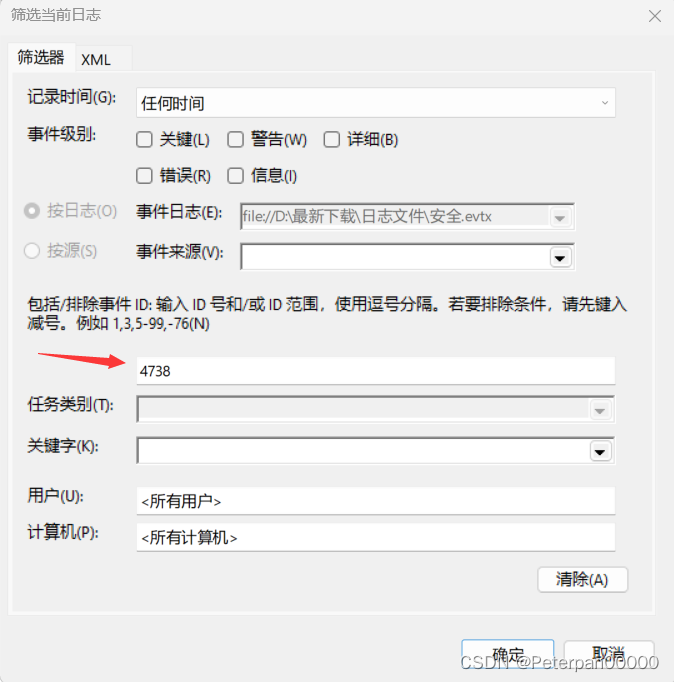​

**因为修改数据没有多少所以很快就发现了被修改的用户名；**

​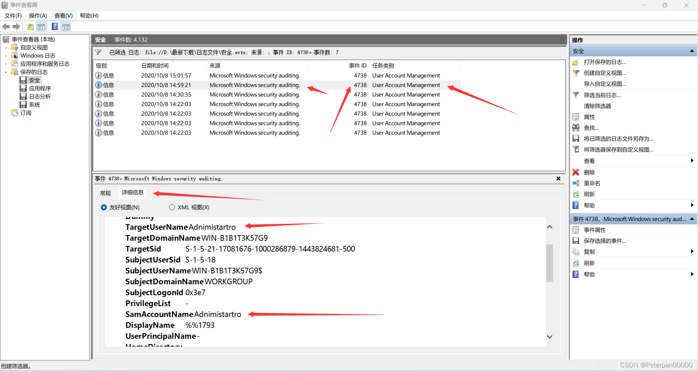​

**简单分析一下为什么可以确认它就是被修改的用户名；**

在此事件中：

* **TargetUserName** 和 **SamAccountName** 字段均为 `Adnimistartro`​，这表明被修改的用户名是 `Adnimistartro`​。
* **SubjectUserName** 是执行此操作的用户，表示为 `WIN-B1B1T3K57G9$`​，这通常表示系统级账户或计算机账户。

因此，可以确定：

**被修改的用户名是** **​`Adnimistartro`​**​ **。**

在此情况下，事件日志中显示的 `TargetUserName`​ 和 `SamAccountName`​ 字段都指向同一个用户名 `Adnimistartro`​，这表明这是被修改的账户的用户名。

	flag{Adnimistartro}

###### 拓展1.2

**示例事件日志**

以下是一个事件 ID 4738 的示例，记录了用户名从 `old_username`​ 被修改为 `new_username`​ 的情况：

	事件 ID: 4738  
	任务类别: 用户账户管理  
	登录名: SYSTEM  
	账户名称: admin  
	目标账户:  
	  账户名: new_username  
	  以前的账户名: old_username  
	  修改的属性: sAMAccountName  
	修改时间: 2023-06-21 15:00:12  
	修改执行者: admin

**如何确认和检查**

1. **打开事件查看器**：

    * 使用 `eventvwr`​ 命令打开事件查看器。
2. **导航到安全日志**：

    * 在事件查看器中，导航到 `Windows 日志 > 安全`​。
3. **过滤事件 ID 4738**：

    * 使用筛选器功能，过滤出事件 ID 4738。
4. **检查详细信息**：

    * 查看每个事件的详细信息，检查 `sAMAccountName`​ 属性的变化。如果看到用户名从一个值变为另一个值，就可以确认是用户名被修改了。

###### 拓展1.3

**事件 ID 4738 示例**

这里是一个典型的事件 ID 4738 日志条目示例：

	A user account was changed.

	Subject:  
		Security ID:		S-1-5-21-17081676-1000286879-1443824681-500  
		Account Name:		Administrator  
		Account Domain:		WIN-B1B1T3K57G9  
		Logon ID:		0x1c913

	Target Account:  
		Security ID:		S-1-5-21-17081676-1000286879-1443824681-500  
		Account Name:		NewUsername  
		Account Domain:		WIN-B1B1T3K57G9

	Changed Attributes:  
		SamAccountName:		OldUsername -> NewUsername  
		DisplayName:		Old Display Name -> New Display Name

在上述示例中，`SamAccountName`​ 字段显示了用户名的更改，`OldUsername`​ 是修改前的用户名，`NewUsername`​ 是修改后的用户名。

#### 步骤#3

##### 3.黑客成功登录系统后成功访问了一个关键位置的文件，将该文件名称（文件名称不包含后缀）作为Flag值提交；

解题思路；

题目让我们找到黑客登录后访问的文件是什么，提交件名。找到关键字“文件”，在window日志里，一般访问成功的文件我们使用**事件 ID 4663**；

**事件 ID 4663简单说明；**

事件 ID 4663 是 Windows 事件日志中用来记录对象访问尝试的安全审计事件，特别是文件和目录的访问尝试。这个事件可以帮助管理员检测并追踪文件和目录的访问，了解哪些用户在何时尝试访问哪些对象。

所以直接筛选“事件 ID 4663”进行分析即可；

​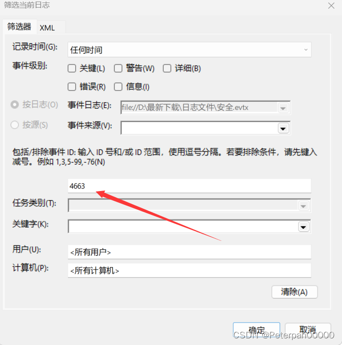​

**最后找到关键文件，为什么说这个是关键文件？（我能跟你说里面的文件我全部都尝试提交一遍嘛？），其实这里的记录也不是很多，因为基本上都是重复的，真正有文件的也就那么几个，如果实在不懂的也没关系，可以都尝试提交；**

​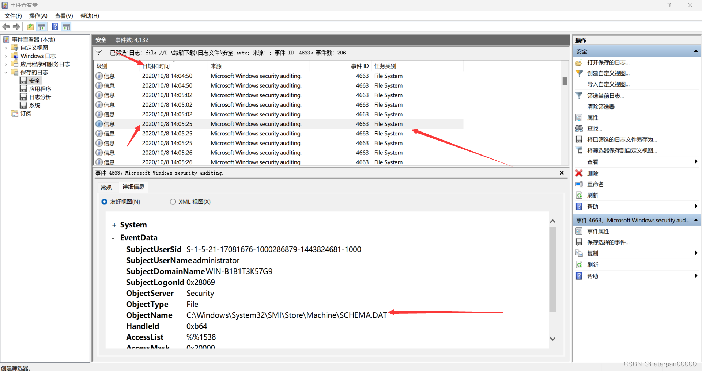  
得到；

	EventData

	  SubjectUserSid S-1-5-21-17081676-1000286879-1443824681-1000  
	  SubjectUserName administrator  
	  SubjectDomainName WIN-B1B1T3K57G9  
	  SubjectLogonId 0x28069  
	  ObjectServer Security  
	  ObjectType File  
	  ObjectName C:\Windows\System32\SMI\Store\Machine\SCHEMA.DAT  
	  HandleId 0xb64  
	  AccessList %%1538
	  AccessMask 0x20000  
	  ProcessId 0x2510  
	  ProcessName C:\Windows\explorer.exe

**言归正传，为什么说这个就是关键文件？**

1. **对象名称**：

    * ​`ObjectName C:\Windows\System32\SMI\Store\Machine\SCHEMA.DAT`​ 清楚地表明了被访问的文件路径和文件名。`SCHEMA.DAT`​ 是 Windows 系统中的一个关键配置文件，通常包含有关系统组件的架构信息。
2. **访问对象类型**：

    * ​`ObjectType File`​ 说明了被访问的对象类型是文件，这进一步确认了具体被访问的目标。
3. **主体用户信息**：

    * ​`SubjectUserName administrator`​ 和 `SubjectDomainName WIN-B1B1T3K57G9`​ 表明发起访问请求的用户是具有管理员权限的用户。这意味着高权限用户可能进行敏感操作，增加了访问文件的可信度。
4. **访问权限**：

    * ​`AccessMask 0x20000`​ 和 `AccessList %%1538`​ 这些值指示了具体的访问权限。虽然十六进制的访问掩码需要转换和解释，但一般涉及读取、写入或修改操作。这些权限对系统关键文件来说非常敏感。
5. **进程信息**：

    * ​`ProcessName C:\Windows\explorer.exe`​ 和 `ProcessId 0x2510`​ 说明了发起访问请求的进程。`explorer.exe`​ 是 Windows 的文件管理器，通常用于文件浏览、复制等操作。

**关键点总结：**

* **重要文件路径**：`C:\Windows\System32\SMI\Store\Machine\SCHEMA.DAT`​ 是 Windows 系统中一个重要的配置文件路径，通常普通用户或正常应用程序不会频繁访问该文件。
* **高权限用户**：`administrator`​ 用户的操作表明这是一个具有高权限的用户进行的访问，这种用户通常可以执行系统级别的操作。
* **访问权限和操作**：`AccessMask 0x20000`​ 表示请求了特定的访问权限（需要进一步解析具体权限）。一般来说，访问系统关键文件需要高级别的权限，这表明了访问的重要性。

> 结合这些信息，可以确认 `SCHEMA.DAT`​ 文件是被黑客成功访问的关键文件，因为它位于系统关键目录中，由高权限用户访问，并且涉及高级别的访问权限。

	flag{SCHEMA}

###### 拓展1.4

示例事件 4663

	Log Name:      Security  
	Source:        Microsoft-Windows-Security-Auditing  
	Date:          2023-06-22 10:50:12  
	Event ID:      4663  
	Task Category: File System  
	Level:         Information  
	Keywords:      Audit Success  
	User:          N/A  
	Computer:      example-PC  
	Description:  
	An attempt was made to access an object.

	Subject:  
		Security ID:		S-1-5-18  
		Account Name:		Administrator  
		Account Domain:		WIN-B1B1T3K57G9  
		Logon ID:		0x3E7

	Object:  
		Object Server:		Security  
		Object Type:		File  
		Object Name:		C:\secret\important-file.txt  
		Handle ID:		0x1234

	Process Information:  
		Process ID:		0x5678  
		Process Name:		C:\Windows\explorer.exe

	Access Request Information:  
		Accesses:		READ_CONTROL  
					SYNCHRONIZE  
					ReadData (or ListDirectory)  
		Access Mask:		0x120089

**如何使用事件 4663 进行分析**

1. **识别敏感文件访问**：通过 Object Name 确定被访问的关键文件或目录。
2. **关联用户活动**：通过 Subject 部分的信息，确定发起访问请求的用户。
3. **分析进程活动**：通过 Process Information，了解发起访问请求的进程，判断是否为恶意程序。
4. **审计访问权限**：检查 Access Request Information 部分，了解请求的具体权限，判断是否有不合规的访问行为。

###### 拓展1.5

**事件 4663 的详细解释**

**事件日志结构**

事件 4663 的日志条目通常包含以下信息：

1. **日志名称**：Security
2. **来源**：Microsoft-Windows-Security-Auditing
3. **日期**：事件发生的日期和时间
4. **事件 ID**：4663
5. **任务类别**：File System（文件系统）
6. **级别**：Information（信息）
7. **关键字**：Audit Success（审核成功）
8. **用户**：N/A
9. **计算机**：记录事件的计算机名称

**事件描述部分**

**Subject（主体）**

* **Security ID**: 发起访问请求的用户或服务的安全标识符 (SID)。
* **Account Name**: 发起访问请求的用户的账户名称。
* **Account Domain**: 用户账户的域。
* **Logon ID**: 用户登录会话的唯一标识符。

**Object（对象）**

* **Object Server**: 处理访问请求的服务器名，一般为 Security。
* **Object Type**: 被访问对象的类型，通常为 File（文件）。
* **Object Name**: 被访问的对象（文件或目录）的完整路径。
* **Handle ID**: 被访问对象的句柄 ID。

**Process Information（进程信息）**

* **Process ID**: 发起访问请求的进程 ID。
* **Process Name**: 发起访问请求的进程名称及路径。

**Access Request Information（访问请求信息）**

* **Accesses**: 请求的访问权限，例如读取、写入等。
* **Access Mask**: 访问掩码，表示请求的具体访问权限。

#### 步骤#4

##### 4.黑客成功登录系统后重启过几次数据库服务，将最后一次重启数据库服务后数据库服务的进程ID号作为Flag值提交；

解题思路；

题目让我们找到黑客多次重启数据库将最后一次重启数据库的进程ID号值提交，既然说了数据库那我们就需要在“应用程序”日志进行查找，因为里面全部是记录关于数据库信息的日志，我们可以从中分析找到黑客最后一次重启的进程号；

**找到“应用程序”日志；**

​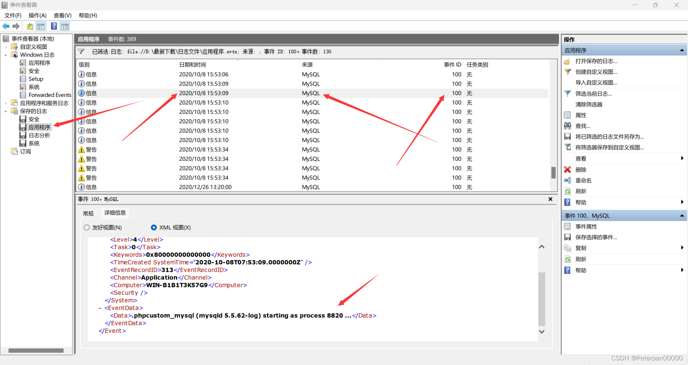​

XML视图（x）

	<Event xmlns="http://schemas.microsoft.com/win/2004/08/events/event">  
	- <System>  
	  <Provider Name="MySQL" />  
	  <EventID Qualifiers="49152">100</EventID>  
	  <Level>4</Level>  
	  <Task>0</Task>  
	  <Keywords>0x80000000000000</Keywords>  
	  <TimeCreated SystemTime="2020-10-08T07:53:09.0000000Z" />  
	  <EventRecordID>313</EventRecordID>  
	  <Channel>Application</Channel>  
	  <Computer>WIN-B1B1T3K57G9</Computer>  
	  <Security />  
	  </System>  
	- <EventData>  
	  <Data>.phpcustom_mysql (mysqld 5.5.62-log) starting as process 8820 ...</Data>  
	  </EventData>  
	  </Event>

**这里我按照时间顺序来进行排序进行分析，终于在&quot;15:53:09&quot;发现最后一次重启的进程ID是8820；**

**为什么可以确认是8820？**

1. **事件来源**：事件的提供者 (`Provider Name`​) 是 `MySQL`​，这意味着事件与 MySQL 数据库服务相关。
2. **事件ID**：事件ID `100`​ 通常用于记录应用程序的启动信息。结合上下文，这个事件ID `100`​ 表示 MySQL 数据库服务的启动事件。
3. **事件描述**：在 `<EventData>`​ 部分，描述了 MySQL 服务器启动的信息，具体为：

    ​`.phpcustom_mysql (mysqld 5.5.62-log) starting as process 8820 ...`​

    这条记录明确指出 MySQL 服务器（`mysqld 5.5.62-log`​）以进程ID `8820`​ 启动。
4. **时间戳**：`<TimeCreated>`​ 字段记录了事件的时间，`2020-10-08T07:53:09.0000000Z`​，这表明事件发生的具体时间。

结合以上信息，可以得出结论：

* **MySQL 启动事件**：由于事件描述明确指出 MySQL 服务启动，并且进程ID为 `8820`​，这个事件表示 MySQL 数据库在该时间点进行了重启。
* **进程ID**：通过事件描述中的 "starting as process 8820" 可以直接获取到 MySQL 服务启动时的进程ID为 `8820`​。

因此，可以确认最后一次重启 MySQL 数据库服务的进程ID是 `8820`​。

**其实也不用这么麻烦，因为这个应用程序日志也不是很多，一共也就那么几个进程ID，都全部尝试提交一遍就行（实在不理解的可以这样操作）**

	flag{8820}

###### 拓展1.6

* **日志类别**：

  * Windows 事件日志分为多个类别，包括系统日志、安全日志和应用程序日志等。
  * **应用程序日志**：记录操作系统上运行的应用程序和服务的事件，包括数据库服务（如 MySQL、SQL Server 等）。这些日志由应用程序开发者定义，并用于跟踪应用程序的运行状态、错误、警告和其他重要事件。
  * **系统日志**：记录操作系统组件的事件，如设备驱动程序和内核事件等。
  * **安全日志**：记录与安全相关的事件，如用户登录、权限更改等。
* **数据库服务事件**：

  * 数据库服务（如 MySQL）通常会在应用程序日志中记录其运行状态，包括启动、关闭和错误等事件。
  * 这些事件由数据库服务本身生成并写入应用程序日志，以便系统管理员和数据库管理员进行监控和故障排除。
* **事件ID 100**：

  * 不同的数据库服务可能使用不同的事件ID来记录其重要事件。对于 MySQL，事件ID 100 通常用于记录服务的启动事件。
  * 当 MySQL 服务启动时，它会在应用程序日志中生成一个事件，描述服务启动的详细信息，包括启动时间、进程ID等。

> 通过应用程序日志查找事件ID 100，能够准确找到 MySQL 服务的启动事件，因为这些日志是由 MySQL 服务生成并记录在应用程序日志中的。这个方法确保我们可以有效地监控和排查数据库服务的重启和运行状态。

#### 步骤#5

##### 5.黑客成功登录系统后修改了登录用户的用户名并对系统执行了多次重启操作，将黑客使用修改后的用户重启系统的次数作为Flag值提交。

解题思路；

题目说黑客登录系统后修改了登录用户并且进行了多次重启，提交黑客修改用户重启的次数，这里我们需要在系统日志里面进行查看，查看**事件ID 1074**；

**为什么在系统日志中查看？**

* **系统日志的内容**：

  * **系统日志**：记录了操作系统组件、驱动程序和关键系统服务的事件。这些事件由操作系统生成，用于跟踪系统运行状态和排除故障。
  * 系统日志包括系统启动、关闭、重启事件，以及服务启动和停止等关键信息。
* **用户修改事件**：

  * 修改用户信息（如更改用户名、密码等）通常会生成与安全相关的事件，并记录在安全日志中（例如事件ID 4738：修改用户账户信息）。
  * 这些事件有时也可能记录在系统日志中，尤其是涉及系统级别的更改。
* **系统重启事件**：

  * 系统重启事件会记录在系统日志中。具体来说，Windows 操作系统会生成特定的事件ID来表示系统的启动和关闭。例如，事件ID 6005 表示事件日志服务启动（即系统启动），事件ID 6006 表示事件日志服务停止（即系统关闭）。

**为什么是查看事件ID 1074**

事件ID 1074 是用于记录由用户、进程或系统管理员启动的系统重启、关闭或注销事件。这个事件ID提供了详细的信息，包括触发重启的进程和触发者的用户信息。在审查黑客活动时，事件ID 1074 是一个关键事件，因为它能帮助我们了解系统重启的详细原因和源头。

* **记录重启的详细信息**：

  * 事件ID 1074 提供了系统重启、关闭或注销的详细信息，包括触发该操作的进程、原因和发起者的身份。这使得它在审查系统重启事件时非常有用，特别是确定是否是人为触发的重启。
* **包含触发重启的进程信息**：

  * 通过事件ID 1074，可以看到触发系统重启的进程名称和进程ID（PID），这有助于识别是哪一个进程或用户引发了系统重启。这对于追踪黑客活动尤其重要。
* **显示发起者信息**：

  * 事件ID 1074 记录了发起重启操作的用户信息，包括用户名和用户SID，这有助于确定哪个用户账户进行了系统重启操作。

**筛选日志事件ID 1074**

​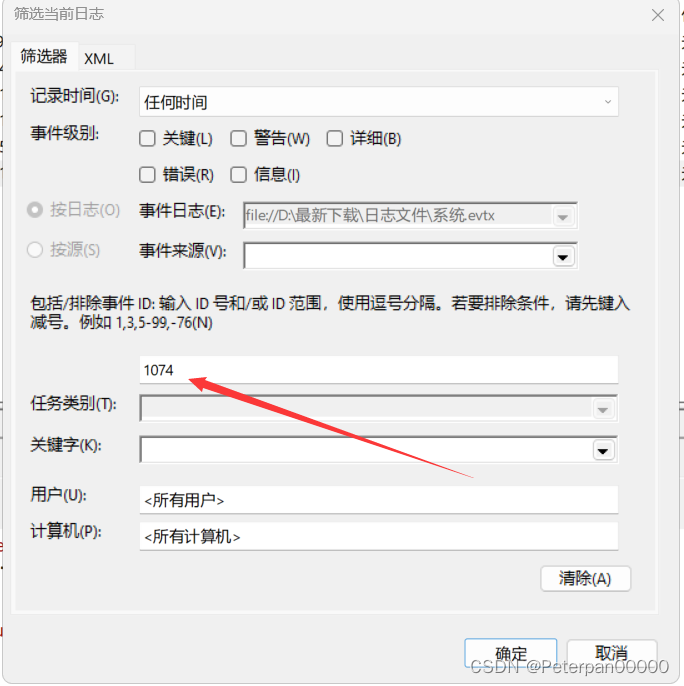​

**也就那么几条数据，我们从第一条分析，发现第一条是“关机”的操作并没有看见重启；**

​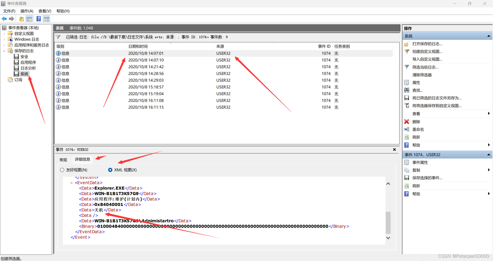​

**第二条是“关闭电源”，也不是重启操作；**

​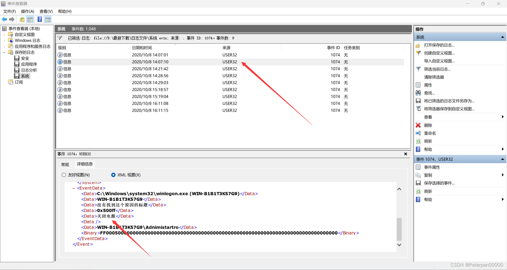​

**终于是在（按时间排序）第三条中发现第一次的重启操作，后面也就那么几条，挨个进行查找即可，最后统计出来的次数是三次（操作系统: 升级/恢复(计划内)）；**

​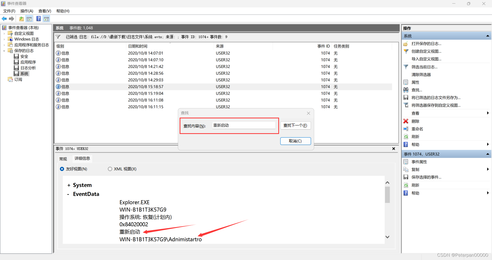​

**一开始以为也就那么几条，但是发现这里值得注意的是并不是所有的重新启动都算在里面，注意看题目要求“修改了登录用户的用户名”，所以并不是所有的都算在，根据题二已知用户名“Adnimistartro”，而不是“Administrator”，这里感觉就是留了个坑，如果不仔细查看还看不出，我说怎么有点不对劲，加上修改过后的重启第一次的次数算在SYSTEM里，所以最后满打满算一共3次；**

	flag{3}

> 这里科普一个师傅分享的小技巧统计重启的次数（如果数据太多可以尝试这种方法较为便捷），这里我们可以直接Ctrl+f直接进行查找关键字，前面我们已经发现第一次“重新启动”，所以后面的我们直接进行定位即可；

跟手动一样注意分辨即可；

​​

‍

‍

# 四、flag

**1.将黑客成功登录系统所使用的IP地址作为Flag值提交；**

	flag{192.168.36.133}

‍

**2.黑客成功登录系统后修改了登录用户的用户名，将修改后的用户名作为Flag值提交；**

	flag{Adnimistartro}

‍

**3.黑客成功登录系统后成功访问了一个关键位置的文件，将该文件名称（文件名称不包含后缀）作为Flag值提交；**

	flag{SCHEMA}

‍

**4.黑客成功登录系统后重启过几次数据库服务，将最后一次重启数据库服务后数据库服务的进程ID号作为Flag值提交；**

	flag{8820}

‍

**5.黑客成功登录系统后修改了登录用户的用户名并对系统执行了多次重启操作，将黑客使用修改后的用户重启系统的次数作为Flag值提交。**

	flag{3}
