# 玄机——第六章 流量特征分析-waf 上的截获的黑客攻击流量

### 一、前言

**题目链接：**​[第六章 流量特征分析-waf 上的截获的黑客攻击流量](https://xj.edisec.net/challenges/45)

三连关注**私信**免费送玄机注册邀请码，**私信**！！！！，看见就回看见就回！！注意看私信；

**如果之前有看过我前几章写的wp，那这章大概率就不是问题，这个数据包的数据比较多，也就是数据量比较多点，其它也没啥了，所以这里我们会用Wireshark的基本查询命令；**

**应急响应工程师小徐在 waf 上下载了一段黑客的攻击流量，请你分析黑客的攻击流量，并且找到对应的关键信息提供给应急小组协助修复漏洞**

### 二、概览

#### 简介

**应急响应工程师小徐在 waf 上下载了一段黑客的攻击流量，请你分析黑客的攻击流量，并且找到对应的关键信息提供给应急小组协助修复漏洞**

**1.黑客成功登录系统的密码 flag{xxxxxxxxxxxxxxx}2.黑客发现的关键字符串 flag{xxxxxxxxxxxxxxxxxxxxxxxxxxxxxxxx}3.黑客找到的数据库密码 flag{xxxxxxxxxxxxxxxx}**

**链接: https://pan.baidu.com/s/1bGiWgzeP6ddaaptGel-npw?pwd=cv7f 提取码: cv7f--来自百度网盘超级会员v6的分享**

### 三、参考文章

[【玄机-应急平台】第六章 流量特征分析-waf上的截获的黑客攻击流量](https://blog.csdn.net/Aluxian_/article/details/139621226)

### 四、步骤（解析）

#### 步骤#1.1

##### 黑客成功登录系统的密码 flag{xxxxxxxxxxxxxxx}

解题思路

问我们成功登录系统的密码，黑客登录系统时，通常会发送包含认证信息的HTTP请求。  
所以这里我们可以使用POST来筛选一下；

	http.request.method == "POST"

​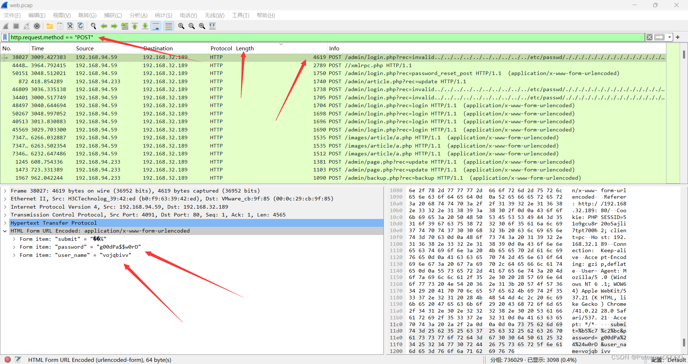​

**不难看出确实有password以及user_name，所以我们也不需要一个个追踪http点进去查看，我这边还是喜欢按内容的大小来进行查看，从上往下，多翻翻，会发现754大小的包存在黑客登录的账号密码；**

​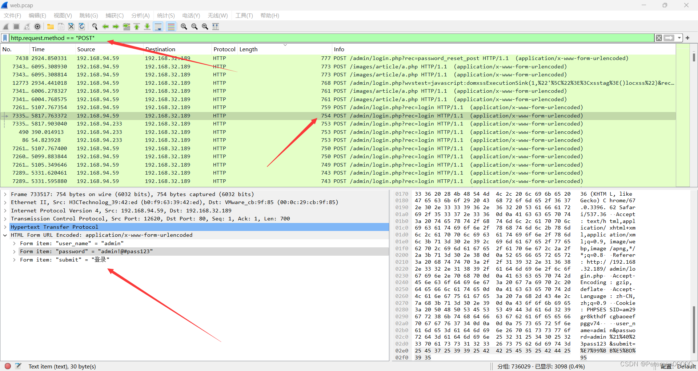​

**那有的人就问了，为什么可以确认这就是黑客登录的？**

那我们http追踪进行分析；

​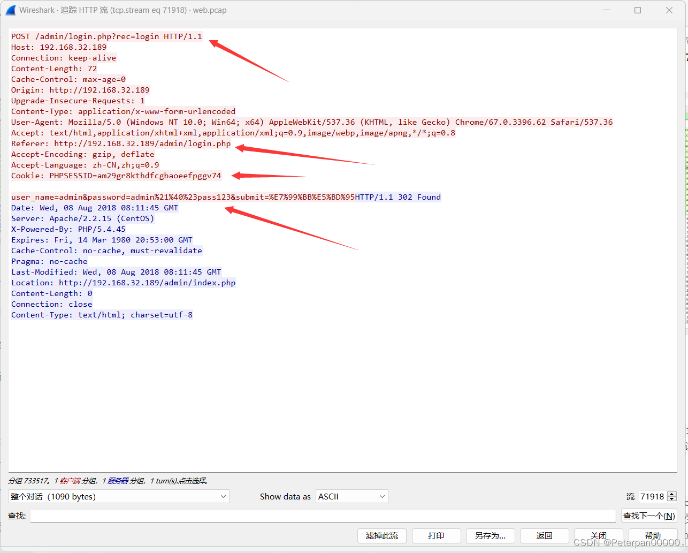​

**查看POST请求的内容**：

* Referer头部包含了请求来源页面的信息。
* 在请求中，可以看到以下内容：

  ​`Referer: http://192.168.32.189/admin/login.php`​

  这表明该请求是从登录页面`/admin/login.php`​发起的，进一步确认这是一个登录请求。

**响应中的重定向信息**：

* HTTP响应头部包含了重定向信息：

  ​`HTTP/1.1 302 Found Location: http://192.168.32.189/admin/index.php`​

  这表示服务器接受了登录请求，并重定向用户到`/admin/index.php`​，通常是登录成功后的管理页面。

**响应中的Cookie信息**：

* 响应包含一个会话Cookie：

  ​`Set-Cookie: PHPSESSID=am29gr8kthdfcgbaoeefpggv74`​

综合以上几点，可以确认这是一次成功的登录请求，并且提供了账号密码：

* **用户名**：`admin`​
* **密码**：`admin!@#pass123`​

> 这里我们不止可以通过筛选http的POST来进行分析查找到账号密码，也可以直接在导出http里进行分析，因为题目中已经说了是登录信息，那经验丰富一些的师傅就大概率可能想到login.php了，所以直接可以筛选一波；

​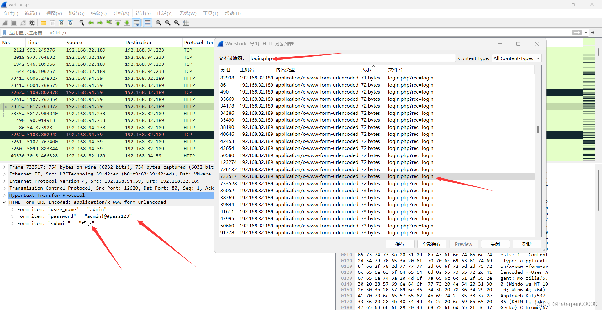​

最后也是在72大小的包里面发现了，方法不唯一，看大家喜欢；

#### 步骤#1.2

##### 黑客发现的关键字符串 flag{xxxxxxxxxxxxxxxxxxxxxxxxxxxxxxxx}

解题思路

这题就比较迷了，啥也没有说，就问我们黑客发现的关键字，那就没啥办法了，不过有一点可以确认的就是还是http，因为一般都是访问什么就返回什么以及响应什么的，不过这里我们就可以使用Wireshark的查找关键字功能（Ctrl+F）;

​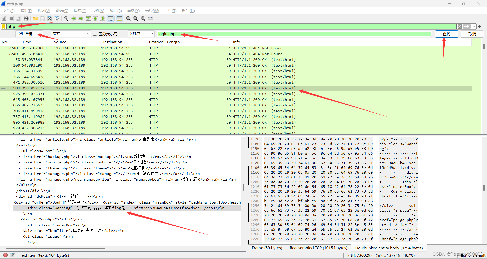​

**为什么这里我查找login.php？**

主要也没啥查找的，就想着碰碰运气，猜测登录之后会有一些操作，然后就发现了flag，有login.php也不是很多，随便往下多翻翻就找了（需要有点耐心）；

	  flag{319fc83ee5304a6b4319ce1f9e4d9dc1}

提交你会发现不对，那就扩大查找范围直接查找login试试看；

​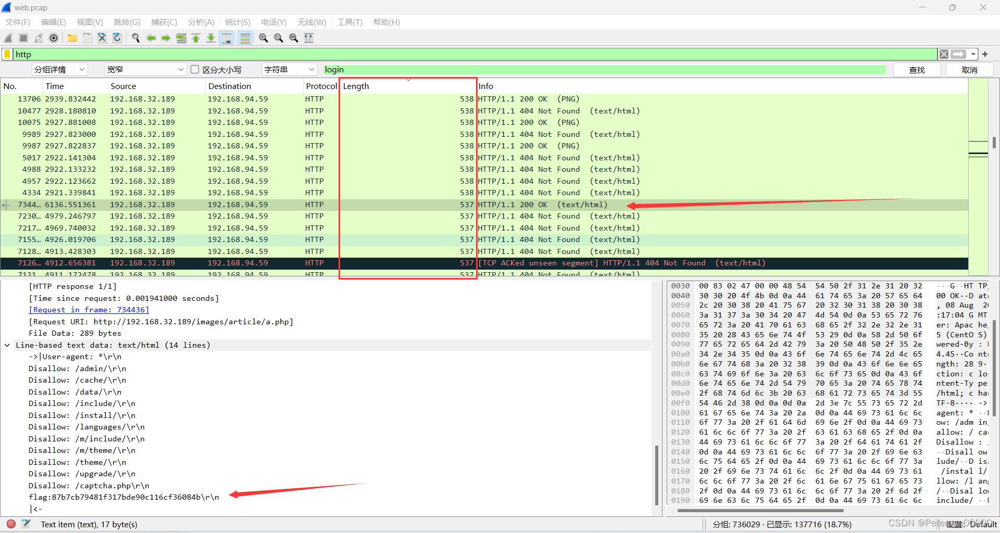​

​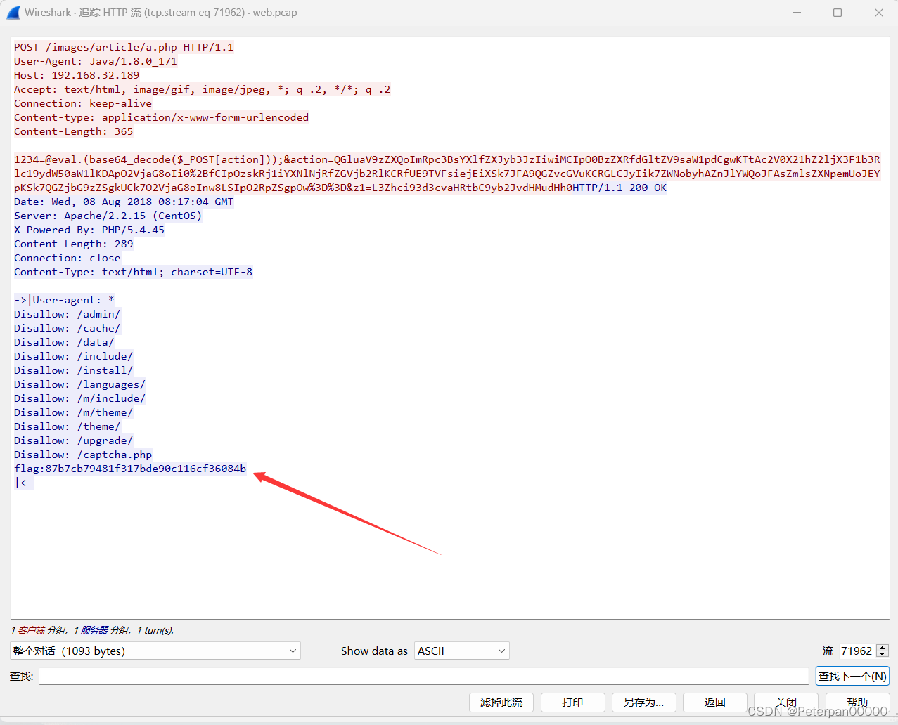​

最后也不算是查找字符串发现的，我是按照大小来进行排序，在537和538的包大小交界处发现537有一个200的返回包发现flag，最后提交发现是正确的；

**不过我们可以分析一下这个包；**

**HTTP 请求头**

1. **POST /images/article/a.php HTTP/1.1**:

    * 请求方法是POST，目标是服务器上的一个PHP文件`/images/article/a.php`​。这种路径通常是用来上传文件或执行特定任务的地方。
2. **User-Agent: Java/1.8.0_171**:

    * 这个User-Agent表示请求是由一个Java应用程序发出的，版本是1.8.0_171。这可以表明攻击者可能使用了一个自动化脚本或工具。
3. **Host: 192.168.32.189**:

    * 目标服务器的IP地址，表明这是一个内部网络中的请求。
4. **Accept** 和 **Connection**:

    * 标准的HTTP头，指定接受的内容类型和连接类型。
5. **Content-Type: application/x-www-form-urlencoded**:

    * 表示请求主体的MIME类型是表单数据编码。
6. **Content-Length: 365**:

    * 表示请求主体的长度。

**HTTP 请求体**

	1234=@eval.(base64_decode($_POST[action]));&action=QGluaV9zZXQoImRpc3BsYXlfZXJyb3JzIiwiMCIpO0BzZXRfdGltZV9saW1pdCgwKTtAc2V0X21hZ2ljX3F1b3Rlc19ydW50aW1lKDApO2VjaG8oIi0%2BfCIpOzskRj1iYXNlNjRfZGVjb2RlKCRfUE9TVFsiejEiXSk7JFA9QGZvcGVuKCRGLCJyIik7ZWNobyhAZnJlYWQoJFAsZmlsZXNpemUoJEYpKSk7QGZjbG9zZSgkUCk7O2VjaG8oInw8LSIpO2RpZSgpOw%3D%3D&z1=L3Zhci93d3cvaHRtbC9yb2JvdHMudHh0

* **1234=@eval.(base64_decode($_POST[action]));** :

  * 这是一个恶意代码，试图利用PHP中的`eval()`​函数执行被base64编码的POST参数`action`​中的内容。
* **action=QGluaV9zZXQoImRpc3BsYXlfZXJyb3JzIiwiMCIpO0BzZXRfdGltZV9saW1pdCgwKTtAc2V0X21hZ2ljX3F1b3Rlc19ydW50aW1lKDApO2VjaG8oIi0%2BfCIpOzskRj1iYXNlNjRfZGVjb2RlKCRfUE9TVFsiejEiXSk7JFA9QGZvcGVuKCRGLCJyIik7ZWNobyhAZnJlYWQoJFAsZmlsZXNpemUoJEYpKSk7QGZjbG9zZSgkUCk7O2VjaG8oInw8LSIpO2RpZSgpOw%3D%3D**:

  * 这个值是一个base64编码的字符串。解码后，它包含实际要在服务器上执行的PHP代码。
* **z1=L3Zhci93d3cvaHRtbC9yb2JvdHMudHh0**:

  * 这个参数可能是用来传递额外的数据的，通常在这种攻击中用来指定目标路径或文件。

**这题就是需要些耐心，我个人也找了很久，没办法，在没有确切的信息时（flag），只能比谁的眼睛更锋利；**

	flag{87b7cb79481f317bde90c116cf36084b}

#### 步骤#1.3

##### 黑客找到的数据库密码 flag{xxxxxxxxxxxxxxxx}

解题思路

**让我们查找数据库的密码，那这里我们就可以通过关键词去查找，例如“dbpass”、“dbuser”、“password”等。那有的人就会问了，password我知道，那为什么要筛选另外两个？**

**在Wireshark中筛选包含数据库用户名和密码的包时，使用关键词“dbuser”和“dbpass”是因为这些关键词通常出现在应用程序的配置文件中，用于定义数据库连接的凭据。**

1. **常见配置文件变量名称**：

    * 在许多应用程序的配置文件中，数据库用户名和密码通常被定义为变量，如“dbuser”和“dbpass”。这些变量名是常见的约定，很多开发者在代码中使用这些命名。
2. **快速定位敏感信息**：

    * 使用“dbuser”和“dbpass”作为关键词，可以快速缩小搜索范围，直接定位到包含数据库连接信息的配置文件或代码片段。这些文件通常包含敏感信息，是黑客重点关注的目标。

所以这里我们可以查找“dbpass"发现密码；

	http contains "dbpass"

​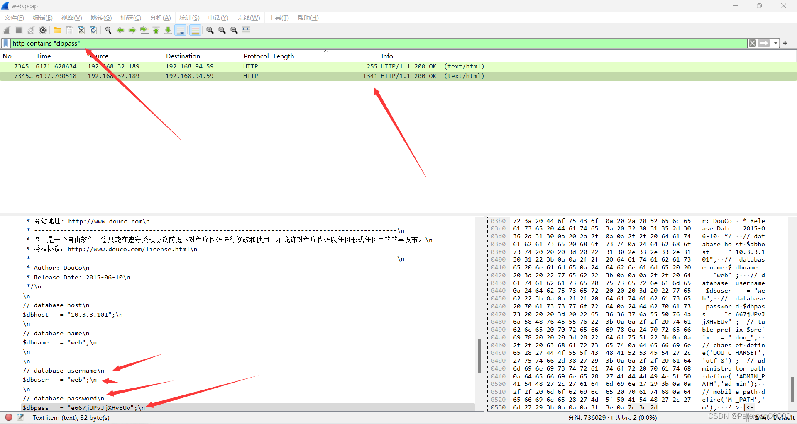​

**以及&quot;dbuser&quot;也是可以找到的；**

	http contains "dbuser"

​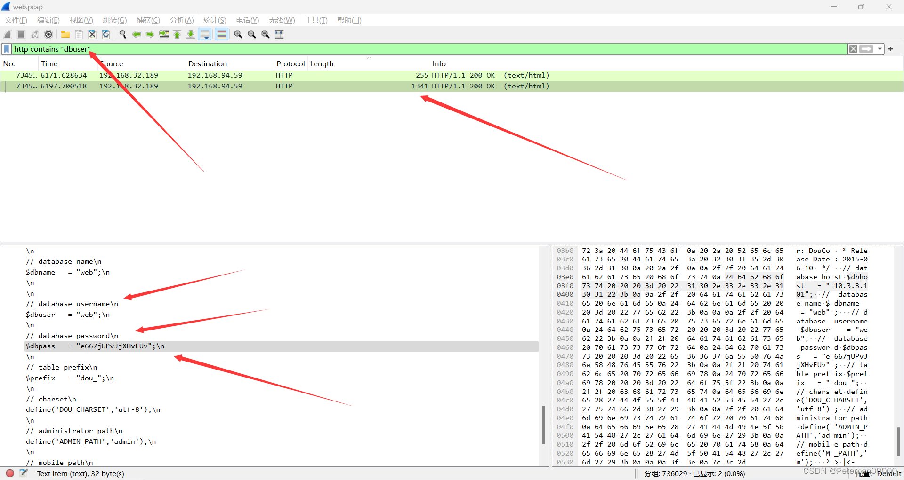​

**还有最后的“password”，有点不太推荐因为包含password的包有点多，如果需要看的是需要一点时间的；**

​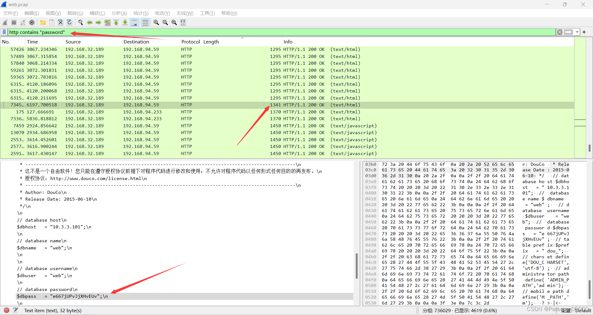​

**那我们来分析一下包的具体内容；**

​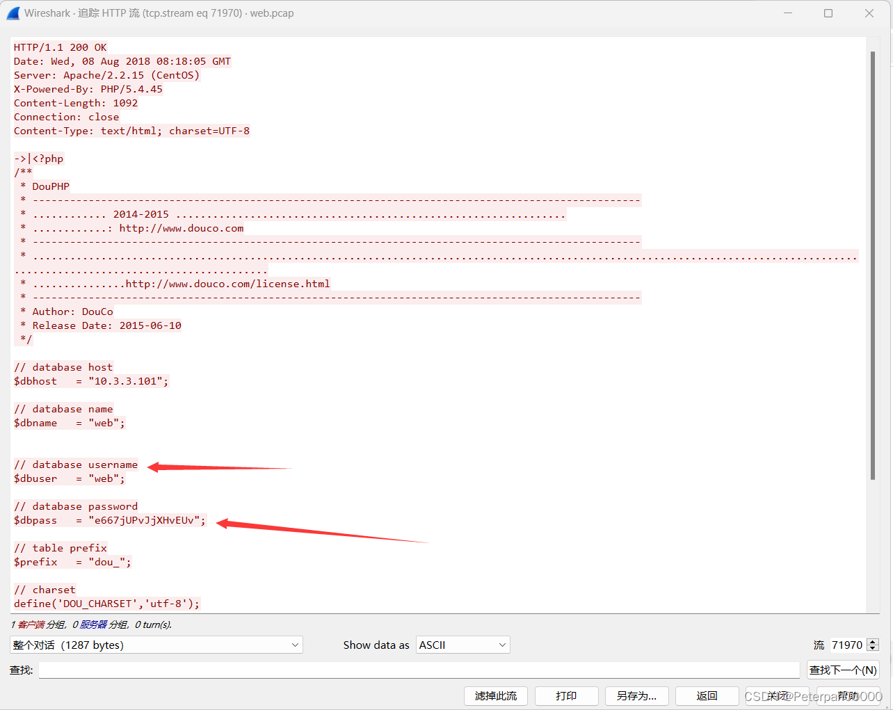​

分析：

这段HTTP响应消息包含了一个PHP配置文件的内容，其中明确列出了数据库的连接信息，包括主机、数据库名称、用户名和密码。

这段HTTP响应消息显示，攻击者成功地获得了一个PHP文件，其中包含了以下信息：

* **数据库主机 (dbhost):**  `10.3.3.101`​
* **数据库名称 (dbname):**  `web`​
* **数据库用户名 (dbuser):**  `web`​
* **数据库密码 (dbpass):**  `e667jUPvJjXHvEUv`​

在之前的分析中，重点在于通过HTTP请求中的信息来查找黑客登录的用户名和密码。通常，我们关注的是登录请求（例如POST请求）中包含的认证信息。然而，有些情况下，攻击者通过各种手段（如文件上传、远程代码执行等）获得了服务器上的敏感文件或配置信息，并通过HTTP响应返回给客户端。

**如何找到这种信息**

1. **使用Wireshark或其他抓包工具**：

    * 过滤HTTP流量：`http`​
    * 查找包含敏感信息的HTTP响应包，例如包含配置文件、数据库连接信息等的响应。
2. **关注HTTP响应内容**：

    * 右键点击HTTP包，选择“Follow” > “HTTP Stream”。
    * 在HTTP响应内容中查找类似PHP配置文件、数据库连接信息等敏感数据。
3. **利用关键词搜索**：

    * 使用关键词搜索功能查找HTTP响应中可能包含的敏感信息，例如“dbpass”、“dbuser”、“config”等关键词。

**结论**

> 在这段HTTP响应消息中，我们可以清楚地看到数据库配置信息。黑客通过这种方式获取数据库连接信息，然后可以进一步攻击数据库。这种情况提示我们在分析流量时，不仅要关注HTTP请求中的信息，还需要仔细检查HTTP响应中的内容，特别是当存在文件上传、远程代码执行等攻击方式时。那我们使用“dbuser”和“dbpass”作为关键词进行筛选是基于实际应用中数据库连接信息的常见命名习惯。这样做的目的是提高查找效率，快速定位包含数据库用户名和密码的包，从而帮助分析和确认黑客的攻击行为。

	flag{e667jUPvJjXHvEUv}
