# 玄机——第六章 流量特征分析-小王公司收到的钓鱼邮件

### 一、前言

题目链接：[第六章 流量特征分析-小王公司收到的钓鱼邮件](https://xj.edisec.net/challenges/58)

三连免费送玄机注册邀请码噢~（随时都有效）私信私信私信！！！看见就回！！！！

简单来说说什么是钓鱼邮件？

钓鱼邮件是一种网络攻击手段，攻击者通过发送伪装成合法和可信的电子邮件，诱使受害者泄露敏感信息或执行某些操作（如点击恶意链接或下载恶意附件）。以下是钓鱼邮件的具体特点和运作方式：

**钓鱼邮件的特点**

1. **伪装来源**：钓鱼邮件通常伪装成来自可信的来源，如银行、电子商务平台、社交媒体网站、政府机构或公司的IT部门。邮件的发件人地址、内容和格式都可能与这些机构的正规邮件非常相似。
2. **紧急或诱人的内容**：邮件内容往往设计得令人感到紧急或诱人，比如通知账户异常、要求密码重置、声称中奖或提供折扣优惠。
3. **恶意链接和附件**：邮件中可能包含看似正常但实际上是恶意的网站链接或附件。一旦点击链接或下载附件，可能会安装恶意软件、勒索软件，或引导受害者进入伪造的网站。
4. **社交工程技术**：钓鱼邮件利用社交工程技术，通过引起受害者的恐慌、好奇心或贪欲，促使其忽视安全警告而进行危险操作。

**钓鱼邮件的运作方式**

1. **收集信息**：攻击者通过各种途径（如数据泄露、社交媒体、公共信息等）收集潜在目标的信息，以便定制钓鱼邮件。
2. **伪造邮件**：利用收集到的信息，攻击者伪造邮件，使其看起来像是来自受害者信任的来源。邮件中可能会包含逼真的公司标识、官方语调和格式。
3. **发送邮件**：攻击者通过垃圾邮件服务或被攻陷的邮件服务器大规模发送钓鱼邮件，目标可能是特定的个人或大批不特定的用户。
4. **引导操作**：一旦受害者收到邮件并被其内容迷惑，可能会点击恶意链接或下载附件，从而泄露敏感信息或让恶意软件感染其设备。
5. **收集信息或实施攻击**：攻击者使用收集到的敏感信息进行身份盗用、金融欺诈或进一步的网络攻击。

**如何识别和防范钓鱼邮件**

1. **检查发件人地址**：仔细检查发件人的电子邮件地址是否与实际机构的官方地址一致。
2. **注意邮件内容**：警惕紧急要求提供敏感信息或立即执行某些操作的邮件。正规机构通常不会通过邮件要求敏感信息。
3. **不要点击可疑链接或下载附件**：在点击邮件中的链接前，将鼠标悬停在链接上，查看实际网址是否与显示的一致。避免下载不明附件。
4. **验证信息**：直接通过官方网站或官方客服验证邮件内容的真实性，而不是通过邮件中的联系方式。
5. **使用安全软件**：安装并更新防病毒和反钓鱼软件，以检测和阻止恶意邮件。
6. **教育和培训**：定期进行网络安全教育和培训，提高对钓鱼邮件的警惕性和识别能力。

### 二、概览

#### 简介

服务器场景操作系统 None  
服务器账号密码 None None  
任务环境说明  
   注：样本请勿在本地运行！！！样本请勿在本地运行！！！样本请勿在本地运行！！！  
   应急响应工程师小王在 WAF 上发现了一段恶意流量，请分析流量且提交对应 FLAG

### 三、参考文章

[【玄机】流量特征分析-小王公司收到的钓鱼邮件](https://blog.csdn.net/qq_40923603/article/details/136370536)

[【玄机-应急平台】第六章 流量特征分析-小王公司收到的钓鱼邮件](https://blog.csdn.net/Aluxian_/article/details/139654147)

### 四、步骤（解析）

#### 1.1

##### 下载数据包文件 hacker1.pacapng，分析恶意程序访问了内嵌 URL 获取了 zip 压缩包，该 URL 是什么将该 URL作为 FLAG 提交 FLAG（形式：flag{xxxx.co.xxxx/w0ks//?YO=xxxxxxx}） (无需 http、https)；

解题思路1.1

1、按照题目要求下载完hacker1.pacapng，文件后缀既然是pacapng，那就肯定不需要想直接丢进Wireshark进行分析即可；  
2、题目让我们“分析恶意程序访问了内嵌 URL 获取了 zip 压缩包”，然后将该URL（链接地址）进行提交；  
3、那这里我们先了解一下恶意程序访问了内嵌 URL 并获取了 zip 压缩包时，整个过程包括哪几个步骤？；（拓展1.1总结了实例）

**1. 恶意程序运行**

恶意程序通过某种方式（例如钓鱼邮件、恶意网站、漏洞利用等）被执行，开始在受害者的系统上运行。

**2. 访问内嵌 URL**

恶意程序包含一个或多个硬编码或动态生成的 URL，这些 URL 通常指向攻击者控制的服务器。恶意程序在执行过程中访问这些 URL，以获取进一步指令或资源。

**3. 下载压缩包**

访问 URL 后，恶意程序从攻击者的服务器下载一个 zip 压缩包。这个压缩包可能包含更多的恶意软件、配置文件、工具或其他与攻击相关的资源。

**4. 解压缩和执行**

恶意程序将下载的压缩包解压缩，并访问其中的内容。解压后的文件可能包含新的恶意可执行文件、脚本、配置文件等，这些文件可能被立即执行以继续攻击链。

分析过程的主要步骤：

**1. 捕获和记录网络流量**

使用网络流量捕获工具（如 Wireshark）记录恶意程序的网络通信活动。这些工具能够捕获所有网络数据包，并将其保存为 pcap 文件。

**2. 分析网络流量**

使用 Wireshark 打开捕获的 pcap 文件，分析恶意程序的网络行为。

* **过滤 HTTP/HTTPS 请求**：使用过滤器找出恶意程序发出的 HTTP 或 HTTPS 请求，找到它访问的 URL。
* **检查响应数据**：查看服务器返回的数据，确认是否包含 zip 压缩包。

**3. 提取和解压缩压缩包**

从捕获的流量中提取 zip 压缩包，并使用解压工具（如 7-Zip）解压缩。

**4. 静态分析解压后的文件**

对解压后的文件进行静态分析：

* **文件类型检查**：确认解压出的文件类型（可执行文件、脚本、配置文件等）。
* **反病毒扫描**：使用反病毒软件扫描解压后的文件，检查是否包含已知恶意代码。
* **代码审查**：使用反编译工具（如 IDA Pro、Ghidra）分析可执行文件的代码，了解其行为。

**5. 动态分析恶意程序**

在隔离的虚拟机或沙箱环境中执行解压后的恶意程序，观察其行为：

* **系统调用监控**：记录恶意程序的系统调用，分析其对系统的影响。
* **网络通信监控**：监控恶意程序的进一步网络通信，检查是否有数据泄露或指令获取行为。
* **文件系统监控**：观察恶意程序对文件系统的修改行为。

所以这里我们直接筛选http协议进行分析即可；

​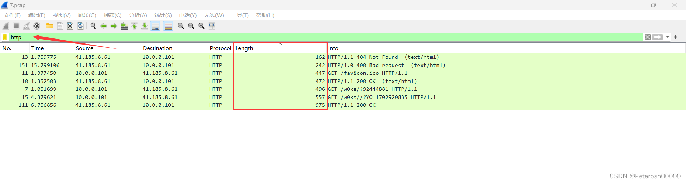​

我还是比较喜欢从大到小看（包的大小），点击Length进行简单排序；

​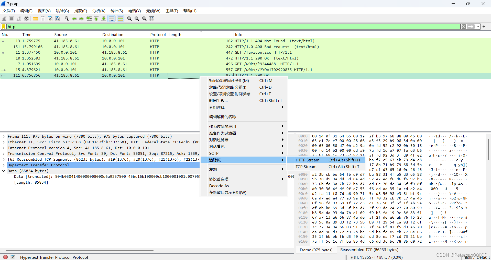​

右键-->追踪流-->HTTP即可；

​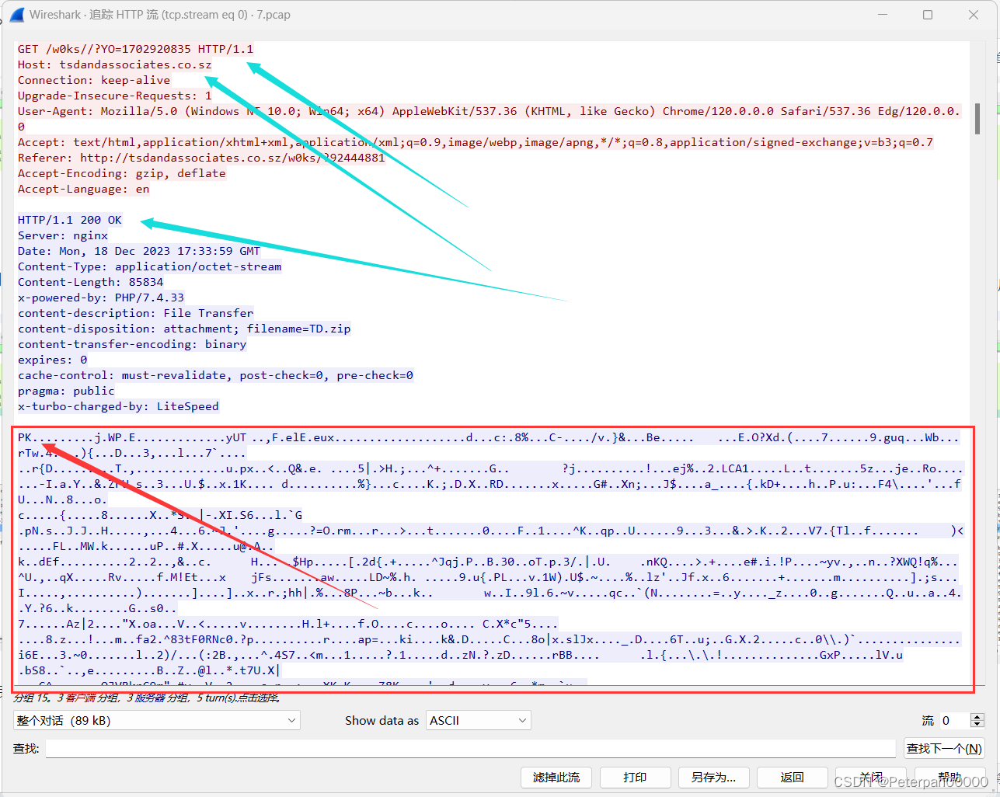​

> 根据题目已知黑客是获取了 zip 压缩包，所以里面肯定是会有获取 zip 压缩包时所产生的流量。有过一些基础的看这个pk那可就太了解了，拓展1.2已总结常见的文件头，那我们在上一期中已为大家总结过常见的响应，那这里的200 OK那肯定就是访问成功了也就证实了这个pk已经被获取成功，题目要求我们提交格式为：flag{xxxx.co.xxxx/w0ks//?YO=xxxxxxx}，所以基本可以确认"/w0ks//?YO=1702920835"；

	flag{tsdandassociates.co.sz/w0ks//?YO=1702920835}

###### 拓展1.1

**实例分析**

假设我们有一个恶意程序样本，它访问了一个 URL 并下载了一个名为 `malicious.zip`​ 的文件。

1. **捕获流量**：使用 Wireshark 捕获恶意程序的网络通信，保存为 `traffic.pcap`​ 文件。
2. **分析流量**：打开 `traffic.pcap`​ 文件，找到恶意程序访问的 URL `http://malicious.example.com/malicious.zip`​。
3. **提取压缩包**：从捕获的流量中提取 `malicious.zip`​，并解压缩，得到 `malware.exe`​ 和 `config.txt`​。
4. **静态分析**：扫描 `malware.exe`​，发现其包含已知恶意代码签名；查看 `config.txt`​，发现其包含配置指令。
5. **动态分析**：在沙箱环境中运行 `malware.exe`​，观察到它尝试连接另一个 C2 服务器，并下载更多恶意模块。

###### 拓展1.2

**常见的文件头**

文件头（也称为文件签名或魔数）是文件开头的一段特定字节序列，用于标识文件类型。

**常见的图片文件头**

压缩文件

* **ZIP**: `50 4B 03 04`​（对应ASCII为 `PK`​）

位图（Bitmap）

* **BMP**: `42 4D`​（对应ASCII为 `BM`​）

图像交换（Interchange）

* **GIF**: `47 49 46 38`​（对应ASCII为 `GIF8`​）

JPEG文件

* **JPEG**: `FF D8 FF`​

便携式网络图形（Portable Network Graphics）

* **PNG**: `89 50 4E 47 0D 0A 1A 0A`​（对应ASCII为 `.PNG....`​）

#### 1.2

##### 下载数据包文件 hacker1.pacapng，分析获取到的 zip 压缩包的 MD5 是什么 作为 FLAG 提交 FLAG（形式：flag{md5}）；

解题思路1.2

根据题一我们可知确实存在一个zip（pk），这题的意思简单来说就是让我们把这个zip导出来并且进行一个MD5加密提交即可，我们已经筛选出http所以这里我们直接查看协议分级即可，看看文件的位置在哪导出即可；

​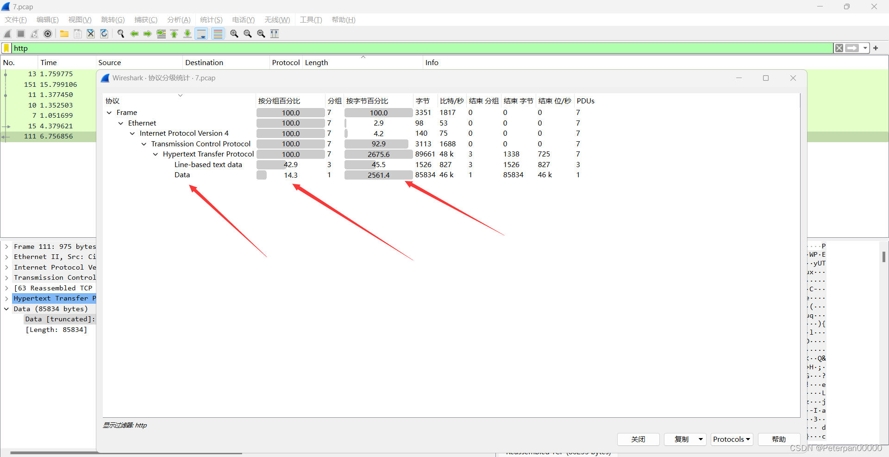​

**看见data，接着占比这么多，这里不用想就知道是啥了吧？那我们直接右键点击选中即可；**

​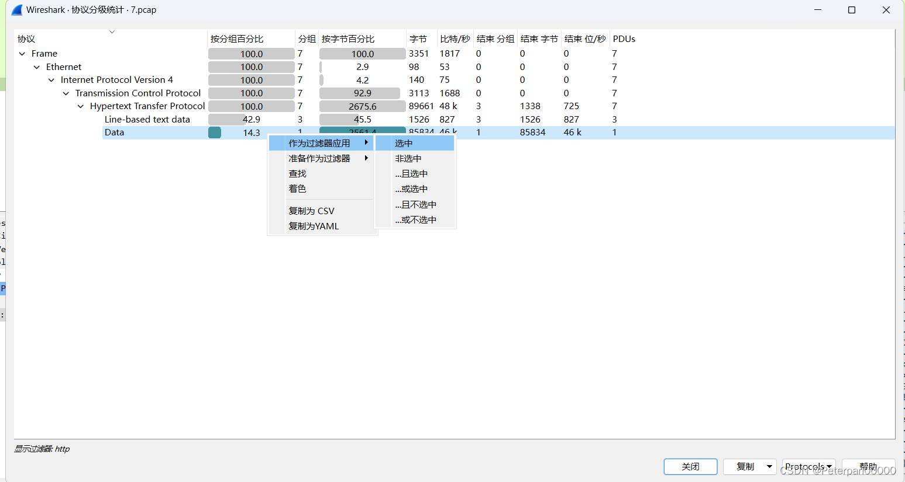​

**哎，这边直接默认就定位到这个数据包，看见data，又看见504b0304（zip的头部），那肯定母庸质疑了；**

注意：这里直接追踪http，点击另存为是不可取的，虽然里面有pk，按照正常操作确实只需要删掉前面即可，但也是不行；

​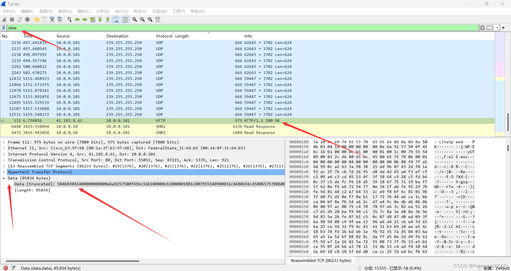​

**正确的操作的是，直接在这里右键导出分组字节流即可；（注意后缀改为zip）**

​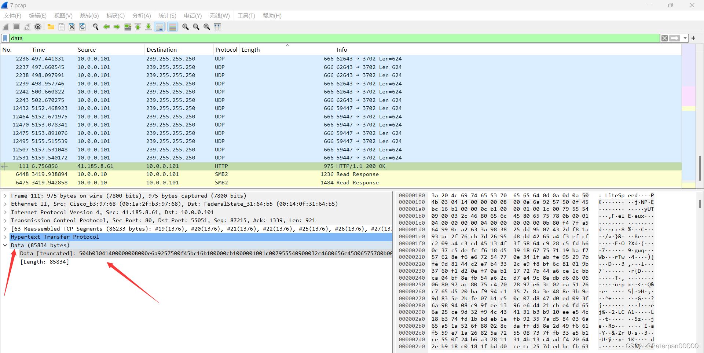​

打开zip可以确认里面有内容，那我们直接进行MD5进行加密；

这里教大家一个简单的办法，直接对整个zip进行MD5加密；

​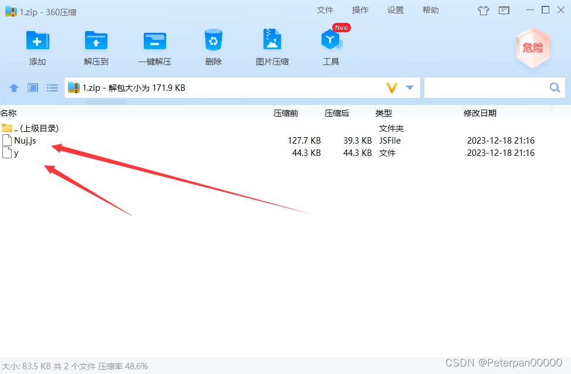​

	certutil -hashfile 1.zip MD5

​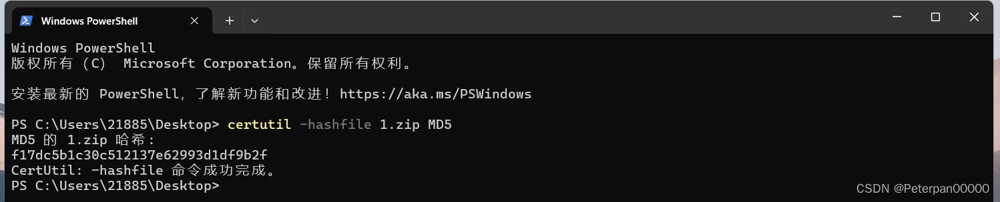​

> PS C:\Users\21885\Desktop> certutil -hashfile 1.zip MD5  
> MD5 的 1.zip 哈希:  
> f17dc5b1c30c512137e62993d1df9b2f  
> CertUtil: -hashfile 命令成功完成。

flag{f17dc5b1c30c512137e62993d1df9b2f}

#### 1.3

##### 下载数据包文件 hacker1.pacapng，分析 zip 压缩包通过加载其中的 javascript 文件到另一个域名下载后续恶意程序， 该域名是什么?提交答案:flag{域名}(无需 http、https)；

解题思路1.3

根据题二我们已经成功导出zip，也发现了里面确实有个js文件，题目的意思就是让我们在js找出另一个域名下载后续恶意程序，问我们，这个域名是什么，那就右键记事本打开查看分析；

​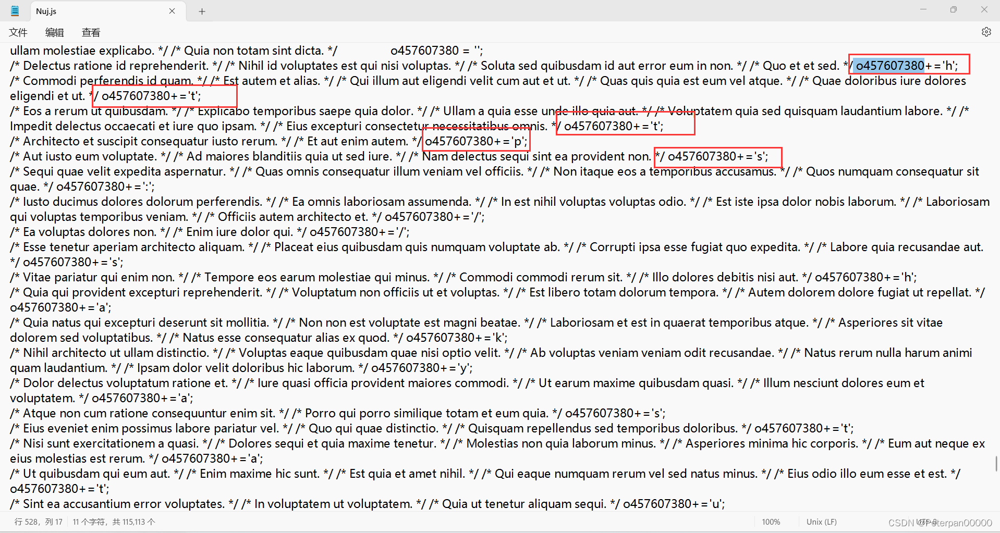​

**简单分析；**

这段代码包含了一些注释以及一个对 `o457607380`​ 变量的操作。

1. **注释部分**

    * 注释部分包含一些看似随机的拉丁文句子，它们并不影响代码的执行，只是对代码进行了说明或者掩盖了代码的实际意图。
    * 这些注释通常用于混淆代码，使得代码阅读和分析变得更加困难。
2. **代码执行部分**

    * ​`o457607380 += 'h';`​
    * ​`o457607380 += 't';`​

    这两行代码对变量 `o457607380`​ 进行了字符串追加操作。

**详细分析**

1. **字符串操作**

    * ​`o457607380 += 'h';`​ 将字符串 'h' 追加到 `o457607380`​ 变量的当前值之后。
    * ​`o457607380 += 't';`​ 将字符串 't' 追加到 `o457607380`​ 变量的当前值之后。
2. **变量** **​`o457607380`​**​ **的用途**

    * 从代码来看，`o457607380`​ 变量被用来存储字符串，这些字符串通过逐步追加的方式构建。
    * 具体用途可以是任何需要动态构建字符串的场景，比如生成特定的标识符、构建 URL 或路径等。
3. **混淆技术**

    * 使用大量的注释和无关的文字是一种常见的代码混淆技术，目的是使恶意行为不那么显而易见。
    * 这类混淆技术常用于恶意软件中，以绕过简单的静态分析工具和提高分析难度。

**总结**

这段代码通过逐步向变量 `o457607380`​ 追加字符串的方式构建一个新的字符串值。同时，代码中插入了大量无关的注释，可能是为了混淆和掩盖其实际目的。这种技术在恶意软件中比较常见，目的是增加逆向工程和分析的难度。

那既然这样我们把注释去掉，接着进行总结并且美化一下；

得到；

> o457607380 = '';  
> o457607380+='h';  
> o457607380+='t';  
> o457607380+='t';  
> o457607380+='p';  
> o457607380+='s';  
> o457607380+=':';  
> o457607380+='/';  
> o457607380+='/';  
> o457607380+='s';  
> o457607380+='h';  
> o457607380+='a';  
> o457607380+='k';  
> o457607380+='y';  
> o457607380+='a';  
> o457607380+='s';  
> o457607380+='t';  
> o457607380+='a';  
> o457607380+='t';  
> o457607380+='u';  
> o457607380+='e';  
> o457607380+='s';  
> o457607380+='t';  
> o457607380+='r';  
> o457607380+='a';  
> o457607380+='d';  
> o457607380+='e';  
> o457607380+='.';  
> o457607380+='c';  
> o457607380+='o';  
> o457607380+='m';  
> o457607380+='/';  
> o457607380+='A';  
> o457607380+='6';  
> o457607380+='F';  
> o457607380+='/';  
> o457607380+='6';  
> o457607380+='1';  
> o457607380+='6';  
> o457607380+='2';  
> o457607380+='3';  
> o457607380+='1';  
> o457607380+='6';  
> o457607380+='0';  
> o457607380+='3';  
> l988241708 = '';  
> l988241708+='q';  
> l988241708+='u';  
> l988241708+='i';  
> l988241708+='.';  
> l988241708+='q';  
> console.log(o457607380, l988241708);

然后就运行呗，运行js的方式有很多种，这里我直接使用的是火狐里面的console（控制台）,得到一个链接，尝试访问发现提示有病毒，那就猜测就是这个域名；

​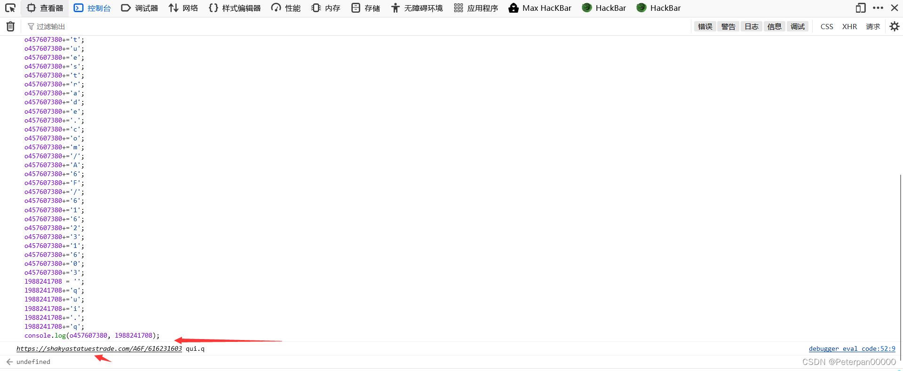​

​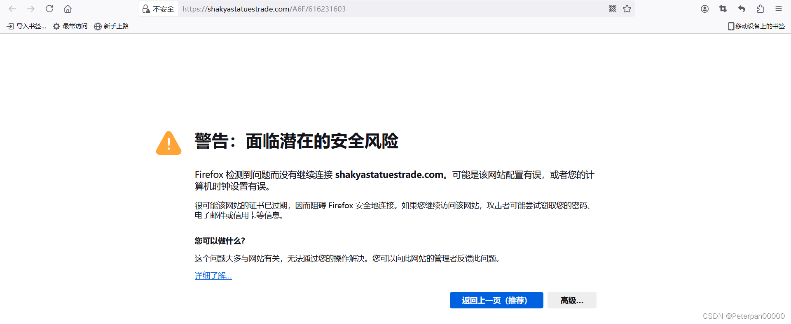​

	https://shakyastatuestrade.com/A6F/616231603 qui.q

注意：提交格式不需要https；

	flag{shakyastatuestrade.com}
