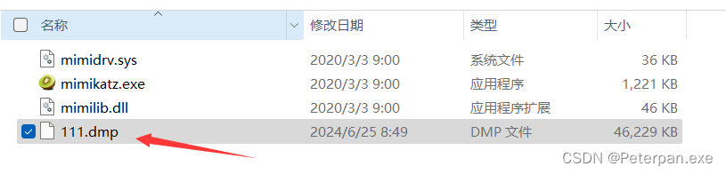

# 玄机——第六章 流量特征分析-蚂蚁爱上树

### 一、前言

**题目链接：**​**[第六章 流量特征分析-蚂蚁爱上树](https://xj.edisec.net/challenges/44)**

**三连私信免费送玄机注册邀请码私信！！！看见就回！！注意私信！！**

“蚂蚁爱上树”，一听这个名字就知道又是一题蚁剑流量分析的，这题其实也是包特别大，查起包来的时候加载特别慢（所以也是需要大家耐心些等等就好了），不过也就这点了，其它的也还好，难度中规中矩，那我们话不多说直接上操作；

注意：这题需要用到工具“[mimikatz](https://github.com/ParrotSec/mimikatz)”，没有的师傅可以提取先下载一下，不会用到太深就简单的一些查密码命令；（如果主机上爆毒了，不能正常下载，建议移置虚拟机进行操作）

**网盘下载，解压即用；**

[mimikatz](https://www.123pan.com/s/q2J1jv-oWavd.html)  提取码:0905

### 二、概览

#### 简介

@老狼  
应急响应小组成员老狼在 waf 上下载了一段流量，请你分析黑客攻击手法，并且解答下面问题

1. 管理员Admin账号的密码是什么？
2. LSASS.exe的程序进程ID是多少？
3. 用户WIN101的密码是什么?

### 三、参考文章

[【玄机-应急平台】第六章 流量特征分析-蚂蚁爱上树](https://blog.csdn.net/Aluxian_/article/details/139519805)

### 四、步骤（解析）

#### 步骤#1.1

##### 管理员Admin账号的密码是什么？

解题思路

解压完成mayishangshu.pcapng，丢进Wireshark进行分析，题目让我们找到账号密码是什么，那我们可以尝试定位一下http的password试试看；

​​

发现只有两个包，但是都没啥用，突然又想起来这题是蚁剑流量，所以肯定会有大量的Base64编码数据或其他编码形式的数据，那我们可以先大致查看一下POST请求；

	http.request.method == "POST"

​​

查出来这边简单的排了个序（从大到小），发现包大的文件都同时访问了 **“product2.php“** 这个文件，怀疑这个文件就是黑客上传的文件（也就shell），那就Ctrl+F进行查找一下关键字试试看有没有啥发现；（接下来就是漫长的解码分辨账号密码环节咯）

​​

那怎么个解码法呢？操作其实也很简单，我红色圈起来的框框，里有base64编码右键复制去base64在线网站解码即可，或者为了方便就是还有一种方法，

**右键--&gt;显示分组字节..--&gt;base64编码--&gt;&quot;开始&quot;选择1（基本固定是1）；**

​​

**右键——base64——开始为“1”**

​  
解码得到；

> cd /d "C:\\phpStudy\\PHPTutorial\\WWW\\onlineshop"&rundll32.exe comsvcs.dll, MiniDump 852 C:\Temp\OnlineShopBackup.zip full&echo [S]&cd&echo [E]

**那就进行解码找密码呗，密码肯定会很明显的，比如啥password显示或者user（用户）等，反正肯定不会像上面那样的；（查找也是需要点技巧，流量包的建议先从大往小查，问就是经验）**

> cd /d "C:\\phpStudy\\PHPTutorial\\WWW\\onlineshop"&net share&echo [S]&cd&echo [E]  
> cd /d "C:\\phpStudy\\PHPTutorial\\WWW\\onlineshop"&powershell -ep bypass Set-Mppreference -DisableRaltimeMonitoring $true&echo [S]&cd&echo [E]  
> cd /d "C:\\phpStudy\\PHPTutorial\\WWW\\onlineshop"&rundll32.exe comsvcs.dll, MiniDump 852 C:\Temp\OnlineShopBackup.zip full&echo [S]&cd&echo [E]

这边发现个特别像账号密码的，尝试提交发现不对，简单查了一下发现这就是个将名为 `admin`​ 的用户添加到本地管理员组而已，那我们继续找；

> cd /d "C:\\phpStudy\\PHPTutorial\\WWW\\onlineshop"&net localgroup administrators admin /add&echo [S]&cd&echo [E]

​​

哎，刚刚查完一个，往下查两包又发现个特别像的，那我们就尝试提交一下试试看（反正不限制提交次数），提交正确；

​​

**右键解码分析；**

​​

> C:\\phpStudy\\PHPTutorial\\WWW\\onlineshop"&net user admin Password1 /add&echo [S]&cd&echo [E]7

**简单分析一下；**

这条命令在 Windows 系统上执行了一系列操作，包括导航到特定目录并添加一个名为 `admin`​ 的用户，同时设置密码。

**总体操作分析**

1. **导航到指定目录**:

    * 首先，命令行会切换到目录 `C:\phpStudy\PHPTutorial\WWW\onlineshop`​，这个目录可能是一个 Web 服务器的根目录或一个项目目录。
2. **添加新用户**:

    * 然后，命令行会创建一个名为 `admin`​ 的新用户，并设置其密码为 `Password1`​。这将把 `admin`​ 用户添加到本地用户列表中。
3. **输出提示信息**:

    * 最后，命令行会输出 `[S]`​、当前目录路径和 `[E]7`​。这些输出信息可以用于确认命令执行的过程和结果。

所以密码为；（这真让人好找啊，没办法在没有具体的信息下只能慢慢看慢慢分析，然后会发现流量看多了会发现也就那么回事~）

	flag{Password1}

#### 步骤#1.2

##### LSASS.exe的程序进程ID是多少？

解题思路

首先简单了解一下什么是“LSASS.exe“；

> ​`rundll32.exe`​ 是一个 Windows 系统进程，允许用户调用 Windows DLL 文件中的函数。这通常用于执行系统功能或脚本任务。`rundll32.exe`​ 被用来调用 `comsvcs.dll`​ 中的 `MiniDump`​ 函数，生成一个包含系统账户和密码信息的 `lsass.dmp`​ 文件。
>
> LSASS.exe 是 Windows 操作系统中负责管理本地安全策略、用户认证和访问控制的关键系统进程。由于其在系统安全中的重要性，LSASS.exe 常常成为攻击者的目标。通过适当的监控、访问控制和安全工具，管理员可以有效地检测和防止对 LSASS 进程的恶意攻击。

**详细分析**

**Rundll32.exe**

​`rundll32.exe`​ 是 Windows 操作系统中的一个实用程序，允许用户通过命令行运行基于 DLL 的函数。攻击者可以利用这个合法的系统工具来执行恶意操作，例如调用特定 DLL 文件中的函数来执行恶意代码。

**comsvcs.dll 和 MiniDump 函数**

​`comsvcs.dll`​ 是 Windows 系统中的一个 DLL 文件，包含与 COM+ 服务相关的功能。这个 DLL 文件中的 `MiniDump`​ 函数可以用来创建内存转储文件（memory dump），这些文件包含了系统内存的快照，可能包括敏感信息，如用户凭证。

**攻击流程**

1. **调用 rundll32.exe** 攻击者使用 `rundll32.exe`​ 来调用 `comsvcs.dll`​ 中的 `MiniDump`​ 函数。命令格式如下：

    ​`rundll32.exe comsvcs.dll, MiniDump <PID> <DUMP_FILE_PATH> full`​

    * ​`<PID>`​ 是目标进程的进程 ID，例如 LSASS 的进程 ID。
    * ​`<DUMP_FILE_PATH>`​ 是要生成的转储文件路径，例如 `C:\Windows\Temp\lsass.dmp`​。
2. **生成 lsass.dmp 文件** 这个命令会生成一个包含 LSASS 进程内存内容的转储文件，通常命名为 `lsass.dmp`​。LSASS 进程管理着系统的用户凭证，因此这个转储文件可能包含敏感信息，如密码哈希。
3. **使用 Mimikatz 读取凭证** 攻击者随后使用 Mimikatz 等工具来读取和提取转储文件中的凭证。Mimikatz 是一个广泛使用的安全工具，可以从内存转储文件中提取密码、哈希和其他敏感信息。（这是为啥之前备一个的原因）

**那有的人就要问了，巴拉巴拉这么久，所以进程号呢？**

那到这里我只能说，可能细心的人就会发现了，题一解码的时候，由大到小依次进行解码，解到一个包含带有“rundll32.exe comsvcs.dll”的程序；（题一，第一次解码，包大小为：4172）

> cd /d "C:\\phpStudy\\PHPTutorial\\WWW\\onlineshop"&rundll32.exe comsvcs.dll, MiniDump 852 C:\Temp\OnlineShopBackup.zip full&echo [S]&cd&echo [E]

回忆一下；

​​

**选中——&gt;右键——&gt;分组字节显示..——&gt;base64解码——&gt;开始“1”**

​​

简单分析一下这里到底做了啥操作；

**执行了一个 DLL 文件以生成进程的转储文件，并将结果保存到一个压缩文件中。**

具体分析：

* ​**​`cd /d "C:\\phpStudy\\PHPTutorial\\WWW\\onlineshop"`​** ​

  * 这条命令将当前目录切换到 `C:\\phpStudy\\PHPTutorial\\WWW\\onlineshop`​ 目录。
  * ​`/d`​ 参数表示切换驱动器和目录。
* ​**​`rundll32.exe comsvcs.dll, MiniDump 852 C:\Temp\OnlineShopBackup.zip full`​**​

  * ​`rundll32.exe`​ 是一个 Windows 命令，用于加载并运行一个 DLL 文件中的函数。
  * ​`comsvcs.dll`​ 是一个包含多个 COM+ 服务的动态链接库。
  * ​`MiniDump`​ 是一个从 `comsvcs.dll`​ 中调用的函数。
  * ​`852`​ 是进程 ID（PID），代表需要进行转储的进程。在这个例子中，假设进程 ID 为 `852`​。
  * ​`C:\Temp\OnlineShopBackup.zip`​ 是生成的转储文件的保存路径和文件名。
  * ​`full`​ 参数表示生成完整的内存转储文件，包含进程的所有内存信息。
* ​**​`echo [S]`​** ​

  * 这条命令在命令行窗口中打印出 `[S]`​，用于标记一个步骤或状态。
* ​**​`cd`​**​

  * 这条命令只是显示当前目录，通常是为了确认操作的目录路径。
* ​**​`echo [E]`​** ​

  * 这条命令在命令行窗口中打印出 `[E]`​，用于标记操作的结束。

**总结**

这段命令组合执行了以下操作：

1. 切换到指定的工作目录 `C:\\phpStudy\\PHPTutorial\\WWW\\onlineshop`​。
2. 使用 `rundll32.exe`​ 调用 `comsvcs.dll`​ 中的 `MiniDump`​ 函数，生成进程 ID 为 `852`​ 的完整内存转储，并将其保存为 `C:\Temp\OnlineShopBackup.zip`​。
3. 打印 `[S]`​ 以标记一个步骤的完成。
4. 显示当前工作目录。
5. 打印 `[E]`​ 以标记整个命令序列的结束。

这种操作通常用于调试或分析程序，尤其是当需要获取一个进程的内存状态时。在攻击场景中，生成进程转储文件可能用于提取敏感信息，如凭据或其他机密数据。

	flag{852}

###### 拓展1.1

**示例命令**

假设 LSASS 的进程 ID 为 1234，生成转储文件的命令如下：

	rundll32.exe comsvcs.dll, MiniDump 1234 C:\Windows\Temp\lsass.dmp full

生成转储文件后，攻击者使用 Mimikatz 读取转储文件：

	mimikatz # sekurlsa::minidump C:\Windows\Temp\lsass.dmp  
	mimikatz # sekurlsa::logonpasswords

#### 步骤#1.3

##### 用户WIN101的密码是什么?

解题思路

**这题也就是真正需要用我们下载的工具“mimikatz”，工具简单说明一下（拓展1.2），这里就直接说思路工具使用大家感兴趣的可以看看，我挑了主要工具使用进行说明；言归正传，刚刚上面也是解码完，如果仔细的师傅可能就发现了，有一个“OnlineShopBackup.zip”，是的没错zip，我们使用http正常导出，接着zip解压，然后010或者winhex打开，简单修改一下头部即可（dmp文件的——MDMP），逻辑是这么个逻辑，就是不知道能不能找到zip，不过我们可以尝试一下；**

> 小型转储文件头部（Minidump）；
>
> 00000000: 4D 44 4D 50 93 A7 00 00 00 00 00 00 00 00 00 00  MDMP............  
> 00000010: 00 00 00 00 00 00 00 00 00 00 00 00 00 00 00 00  ................  
> 00000020: 00 00 00 00 00 00 00 00 00 00 00 00 00 00 00 00  ................  
> ...

**但是看了一圈我发现啥都有，就是没看着zip，然后猛的突然想起来，其实不存在zip，因为它已经被文件**​**​`product2.php`​**​**包裹在里面了，所以其实我们只需要正常导出文件product2.php即可，那问题又来了，不查不知道啊，一查吓一跳啊，很多product2.php文件，那到底那一个才是真正的product2.php呢？（dmp文件）**

​​

**这么多。。。。不过也不用担心，dmp文件也是有一些特征的**

​​

dmp文件特点；

转储文件（dump file）的大小可以变化很大，取决于生成的转储文件类型以及系统的配置。转储文件主要有两种类型：**小型转储文件**（minidump）和**完整内存转储文件**（full dump）。这两种文件在大小和包含的信息上有很大的不同。

**小型转储文件（Minidump）**

* **大小**：通常比较小，几百KB到几MB。
* **特点**：

  * 包含进程崩溃时的基本信息，如线程、调用堆栈、部分内存数据和加载的模块。
  * 适用于快速调试和分析崩溃原因。
  * 生成速度快，占用存储空间小。

**所以基本就是KB或者MB，再者就是dmp文件头部我们已经知道，所以直接按大小排序一波，然后直接锁定最底下三个，依次进行排查；**

​​

**一个一个进行保存并且排查，最后发现47MB的就是dmp文件，保存下来的时候使用010打开发现了dmp文件的头部。只不过它的头部并没有那么明显，有一些多余的数据，只需要删掉最后保存的格式为dmp即可；**

010打开发现明显的头部特征，删除并且Ctrl+s进行保存（后缀格式为dmp）；

​​

得到；

​​

最后做好这一切，就只差使用工具“mimikatz”分析dmp文件中MD5密码的值，这边话不多说，直接上操作，双击运行（注意别被安全中心当做木马删掉）；

这边用的是x64的，接着需要提取分析的dmp文件放在同一目录下（如果没有具体目录解析不到）；

​​

同一目录；

​​

接着使用命令开始提取；

	sekurlsa::minidump 111.dmp  
	sekurlsa::logonpasswords

这里需要注意的是，命令依次进行运行即可，不需要多余的操作；

​​

**大概看一眼是win101名称正确，primary认证没问题，所以基本可以确认这是MD5；（哈希）**

​​

**Primary**: `[00000003]`​

* 表示主要的认证信息。

**NTLM**: `282d975e35846022476068ab5a3d72df`​

* 这是用户的NTLM（NT LAN Manager）哈希值。NTLM哈希值是Windows系统中用于身份验证的密码哈希。（MD5）

最后一步找一个MD5在线解密；

[MD5在线](https://www.somd5.com/)

得到；

​​

	flag{admin#123}

> 这最后一题其实就是考察对dmp文件的了解以及“Mimikatz”提取密码工具的使用，一开始我以为dmp文件是在zip中，毕竟解码的时候看见了一个zip嘛想着直接http导出但是看了一圈并没有发现zip，后来突然想起来我解码的这个包zip数据是包含在里面的，所以想到了直接导出数据包找dmp文件，一开始也没想直接找到，肯定要删掉一些啥的，谁知道去查了一下dmp文件的特征就发现了，在加上题目问我们的WIN101的密码是什么，立马就联想到了后面的操作；

###### 拓展1.2

Mimikatz是一款开源的Windows安全工具，主要用于提取和操控Windows系统中的身份验证凭据。它由Benjamin Delpy开发，常用于渗透测试和红队评估，但也被黑客用于恶意目的。

**主要功能**

1. **提取明文密码**：

    * 可以从内存中提取用户的明文密码，特别是从LSASS（Local Security Authority Subsystem Service）进程中。
2. **哈希提取和传递哈希**：

    * 能提取用户的NTLM哈希，并通过“Pass-the-Hash”技术使用这些哈希进行身份验证，而无需明文密码。
3. **Kerberos票据操作**：

    * 提取、伪造和注入Kerberos票据（TGT和TGS），进行票据传递攻击（Pass-the-Ticket）。
4. **凭据导出**：

    * 从Windows Credential Manager、LSA Secrets和SAM数据库中提取凭据。

**主要用途**

1. **渗透测试**：

    * 渗透测试人员使用Mimikatz来评估Windows网络的安全性，发现并修补潜在的漏洞。
2. **安全研究**：

    * 安全研究人员分析Windows身份验证机制和凭据存储方式。
3. **恶意活动**：

    * 黑客利用Mimikatz进行横向移动、权限提升和数据窃取。
