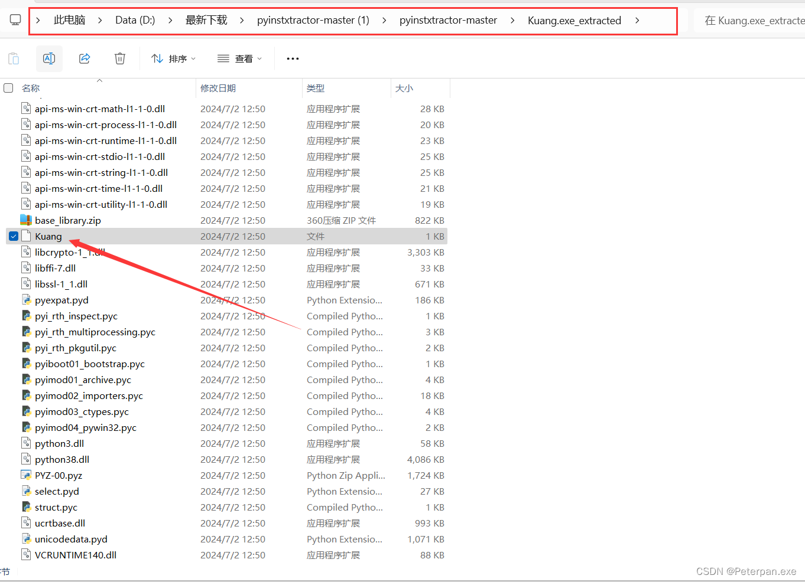

# 玄机——第四章 windows实战-emlog

### 一、前言

**题目链接：**​**[第四章 windows实战-emlog](https://xj.edisec.net/challenges/61)**

**三连私信免费送玄机注册邀请码私信！！！看见就回！！注意私信！！**

 **&lt;font color=&quot;#ff0000&quot;&gt;首先简单了解一下什么是emlog；&lt;/font&gt;**

Emlog 是一款开源的轻量级博客系统，其名称来自 "Every Memory Log"，旨在为用户提供简单易用的博客平台。Emlog 的设计理念是简洁、高效和轻量，适合个人用户和小型网站。

**主要特点**

1. **轻量级**

    * Emlog 代码简洁，不依赖复杂的架构，安装和运行都很轻便，资源消耗较低。
2. **易用性**

    * 提供简洁直观的管理后台，用户界面友好，适合没有技术背景的用户。
3. **插件扩展**

    * Emlog 支持插件扩展，用户可以根据需求安装插件来增加功能。
4. **模板支持**

    * 支持模板更换，用户可以选择或自定义模板来改变网站的外观。
5. **静态页面生成**

    * 支持生成静态页面，提高网站访问速度和 SEO 效果。
6. **多语言支持**

    * Emlog 提供多语言支持，适合不同语言背景的用户。

**应用场景**

1. **个人博客**

    * Emlog 适合个人用户创建和管理博客，记录日常生活和思想。
2. **小型网站**

    * 由于其轻量级和高效性，Emlog 也适合用于创建小型企业网站或作品展示网站。
3. **自媒体平台**

    * 自媒体从业者可以使用 Emlog 搭建个人博客平台，发布和管理内容，建立个人品牌。

**总结**

**Emlog 是一款简洁、高效的轻量级博客系统，适合个人用户和小型网站使用。其易用性和扩展性使其成为许多用户的首选博客平台。通过支持插件和模板，Emlog 可以灵活地扩展功能和定制外观，满足不同用户的需求。**

### 二、概览

#### 简介

**服务器场景操作系统 Windows**  
**服务器账号密码 administrator xj@123456**  
**题目来源公众号 知攻善防实验室**  
**https://mp.weixin.qq.com/s/89IS3jPePjBHFKPXnGmKfA**  
**任务环境说明**  
    **注：样本请勿在本地运行！！！样本请勿在本地运行！！！样本请勿在本地运行！！！**   
    **应急响应工程师小王某人收到安全设备告警服务器被植入恶意文件，请上机排查**  
**开放题目**  
    **漏洞修复**  
**参考**  
**https://mp.weixin.qq.com/s/1gebC1OkDgtz4k4YtN10dg**

**1、通过本地 PC RDP到服务器并且找到黑客植入 shell,将黑客植入 shell 的密码 作为 FLAG 提交;**   
**2、通过本地 PC RDP到服务器并且分析黑客攻击成功的 IP 为多少,将黑客 IP 作为 FLAG 提交;**   
**3、通过本地 PC RDP到服务器并且分析黑客的隐藏账户名称,将黑客隐藏账户名称作为 FLAG 提交;**   
**4、通过本地 PC RDP到服务器并且分析黑客的挖矿程序的矿池域名,将黑客挖矿程序的矿池域名称作为(仅域名)FLAG 提交;**

### 三、参考文章

[第四章 windows 实战 - emlog](https://tryhackmyoffsecbox.github.io/Target-Machines-WriteUp/docs/Xuanji/Unit-4/61/)

[玄机-windows实战](https://lintian31.github.io/2024/06/01/%E7%8E%84%E6%9C%BA-windows%E5%AE%9E%E6%88%98/)

### 四、步骤（解析）

#### 准备阶段#1.0

**使用远程桌面连接靶机；（详细操作：**​**[玄机——第四章 windows实战-wordpress wp](https://blog.csdn.net/administratorlws/article/details/140104287?spm=1001.2014.3001.5501)**​ **）**

**靶机的IP；**

​​

**输入进行保存，返回进入即可；**

​​

**成功连接靶机；**

​​

#### 步骤#1

##### 通过本地 PC RDP到服务器并且找到黑客植入 shell,将黑客植入 shell 的密码 作为 FLAG 提交;

解题思路

> 题目让我们通过本机连接靶机（已连接成功），将黑客写入的shell的密码提交，简单来说就是找shell嘛，看过我文章的肯定就已经知道如何查杀shell了（已经不知道说明多少遍了），老规矩嘛，查杀webshell，也就只有工查杀以及工具查杀，这里既然能用工具那肯定就使用工具（工具相对于手工来说更便捷），如对手工查杀webshell感兴趣师傅请移步至：[webshell查杀](https://blog.csdn.net/administratorlws/article/details/139521078?spm=1001.2014.3001.5502)。那这里同样我更喜欢用D盾进行查杀shell（工具不唯一，仅供参考）；

**简单扫一眼，就在桌面上发现“PHPStudy”，PHPStudy是一款集成了 PHP、Apache、MySQL、Nginx 等常用 Web 开发环境的本地集成开发环境工具。简单来说就是一普通搭建网站的，既然是搭建网站的，那黑客肯定就是从这边下手的咯；（详细：**​**[PHPStudy简介](https://baike.baidu.com/item/phpStudy/7894712)**​ **）；**

**所以那我们直接鼠标右键PHPStudy“打开文件位置”，接着返回到PHPStudy_pro目录下；**

​​

**接着找到PHPStudy_pro目录下的WWW目录，为什么只找WWW目录？**

因为在 PHPStudy Pro 中，WWW 目录通常是存放 Web 项目的根目录。这个目录是 Apache 或 Nginx 等 Web 服务器的默认站点目录，所有的 Web 项目文件和代码都会放在这个目录中。

**总之，WWW 目录是 PHPStudy Pro 中存放所有 Web 项目文件的地方，是开发和测试 Web 应用的核心目录。**

那题目问我们黑客写入的shell，所以我们直接压缩一下WWW目录，导到本机使用D盾进行分析；（所谓的导到本机，就是Ctrl+c，Ctrl+v，注意要先压缩）

​​

**接着使用D盾进行扫描解压之后的WWW目录；**

​​

**很快就发现了黑客植入的后门shell.php，那我们跟进分析；**

得到；

​​

题目问我们连接的密码；

所以；

	flag{rebeyond}

###### 拓展1.1

简单分析一下这个shell；

**这是一个典型的后门程序（backdoor shell），包含了一些隐蔽和加密的特性。**

1. ​`@error_reporting(0);`​

    * 关闭所有错误报告，以防止暴露错误信息。
2. ​`session_start();`​

    * 启动一个新的会话或继续当前会话。
3. ​`$key="e45e329feb5d925b";`​

    * 设置一个密钥，这个密钥是一个 16 字节的字符串，通常是某个32位MD5值的前16位。
4. ​`key;`​

    * 将密钥存储在会话变量中。
5. ​`session_write_close();`​

    * 写入会话数据并关闭会话存储，以优化性能。
6. ​`$post=file_get_contents("php://input");`​

    * 获取原始 POST 数据。这通常用于接收二进制数据或较大的数据块。
7. 检查是否加载了 `openssl`​ 扩展:

    * ​`if(!extension_loaded('openssl'))`​

      * 如果没有加载 `openssl`​ 扩展，则使用 XOR 和 Base64 解码。

        * ​`base64_decode`​ 解码 POST 数据。
        * 使用 XOR 操作对数据进行解密，每个字符与密钥的对应字符进行异或运算。
    * ​`else`​

      * 如果加载了 `openssl`​ 扩展，则使用 AES-128 加密算法解密数据。

        * ​`openssl_decrypt`​ 解密 POST 数据，使用 AES128 和密钥。
8. ​`explode('|', $post);`​

    * 将解密后的数据用 `|`​ 分割成一个数组，第一个元素是函数名，第二个元素是参数。
9. 定义一个类 `C`​:

    * ​`class C{public function __invoke(p."");}}`​

      * 这个类定义了一个魔术方法 `__invoke`​，它接受一个参数 `$p`​ 并执行 `eval($p."");`​。
      * ​`eval`​ 函数会执行传入的 PHP 代码，这是一种非常危险的函数，允许执行任意 PHP 代码。
10. ​`@call_user_func(new C(),$params);`​

     * 使用 `call_user_func`​ 调用类 `C`​ 的实例，并将参数 `$params`​ 传递给它。
     * 最终的效果是执行解密后从 POST 数据中提取出来的 PHP 代码。

**简单总结**

这段代码实际上是一个加密的后门程序。它通过接收加密的数据，然后解密并执行其中的 PHP 代码。这使得攻击者可以通过发送特定的加密请求来执行任意的 PHP 代码，从而完全控制服务器。

**主要危险点包括：**

* **使用** **​`eval`​**​ **函数执行任意 PHP 代码。**
* **通过加密隐藏恶意代码，难以被普通的扫描工具检测到。**
* **利用会话和加密机制，使得攻击通信难以被识别和拦截。**

这种后门程序常用于网络攻击中的持久访问，通过隐蔽手段保持对受感染服务器的控制。

#### 步骤#2

##### 通过本地 PC RDP到服务器并且分析黑客攻击成功的 IP 为多少,将黑客 IP 作为 FLAG 提交;

 **&lt;font color=&quot;#ff0000&quot;&gt;解题思路&lt;/font&gt;**

**题目让我们提交黑客的IP，这种没什么说的，基本上就是分析日志了（在别的文章中也强调很多遍，分析日志，这里就不再强调了），那就找PHPStudy_pro存放日志的地方呗；**

定位到了，Nginx日志但是发现大小都是0，所以那这里就不是Nginx日志了，去看看Apache2的日志；

​​

**找到Apache日志，发现access.log存在信息很多，右键记事本打开进行分析；**

​​

**题一既然说了黑客写入了shell.php，那我们直接Ctrl+f查找关键字“shell”即可；**

得到

​​

得到；

> 192.168.126.1 - - [26/Feb/2024:22:46:23 +0800] "GET /content/plugins/tips/shell.php HTTP/1.1" 200 -  
> 192.168.126.1 - - [26/Feb/2024:22:46:35 +0800] "POST /content/plugins/tips/shell.php HTTP/1.1" 200 -  
> 192.168.126.1 - - [26/Feb/2024:22:46:35 +0800] "POST /content/plugins/tips/shell.php HTTP/1.1" 200 -  
> 192.168.126.1 - - [26/Feb/2024:22:46:35 +0800] "GET /content/plugins/tips/shell.php?888666=619 HTTP/1.1" 200 -  
> 192.168.126.1 - - [26/Feb/2024:22:47:54 +0800] "POST /content/plugins/tips/shell.php HTTP/1.1" 200 -  
> 192.168.126.1 - - [26/Feb/2024:22:47:54 +0800] "POST /content/plugins/tips/shell.php HTTP/1.1" 200 -  
> 192.168.126.1 - - [26/Feb/2024:22:48:47 +0800] "POST /content/plugins/tips/shell.php HTTP/1.1" 200 -

简单分析一下；

> 不难看出，黑客在短时间内对 `/content/plugins/tips/shell.php`​ 进行了多次请求。这些操作表明，黑客在利用 `shell.php`​ 文件进行远程代码执行或文件操作。这是一个典型的 Webshell 攻击，攻击者上传或利用现有的 Webshell 文件，然后通过这些文件执行恶意命令。

所以；

	flag{192.168.126.1}

#### 步骤#3

##### 通过本地 PC RDP到服务器并且分析黑客的隐藏账户名称,将黑客隐藏账户名称作为 FLAG 提交;

 **&lt;font color=&quot;#ff0000&quot;&gt;解题思路&lt;/font&gt;**

题目让我们找出黑客隐藏的用户名称，既然说用户名称了，那肯定就是查靶机的用户组了呗（window应急的基础操作），“本地用户和组”是在“计算机管理”里面，想找到“计算机管理”其实也简单，直接在搜索栏搜索即可；

**搜索栏搜索“计算机管理”；**

​​

**接着点击“本地用户和组”进行分析即可；**

​​

**可以从描述这边发现，其它都有，就只有这个没有；（或者要不确定，可以都提交一次）**

​​

**当然也是可以从用户里面发现；**

​​

**最后也是可以发现；**

​​

**当然，也可以直接使用“net user”进行查询计算机的所有用户，但是这里好像隐藏了，并没有发现；**

​​

所以最后；

	flag{hacker138}

#### 步骤#4

##### 通过本地 PC RDP到服务器并且分析黑客的挖矿程序的矿池域名,将黑客挖矿程序的矿池域名称作为(仅域名)FLAG 提交;

解题思路

**让我们找出黑客的挖矿程序的矿池域名，题三既然找到了黑客隐藏的用户，那就跟进分析，一个一个文件进行分析，后来在“桌面”这个目录下发现了，使用英文写的kuang，完事了它还是个exe，所以这里就不必多言，那现在既然找到了挖矿程序，那如何找到矿的域池名呢？**

> 既然现在已经知道挖矿程序了（kuang.exe），那我们直接使用脚本工具“pyinstxtractor.py”把kuang.exe转换成pyc文件，接着随便找一个pyc在线反编译即可发现池域名；

​​

**那我们先来进行实操一下，老规矩想把文件从靶机里面导出之前（kuang.exe），必须先把压缩一下；**

**[pyinstxtractor工具下载](https://github.com/extremecoders-re/pyinstxtractor)**

使用方法：[Pyinstaller 反编译教程(exe转py)](https://blog.csdn.net/qq_41273999/article/details/139420400)

**下载完毕，接着把kuang.exe复制到脚本工具“pyinstxtractor”目录下；**

​​

**接着直接在当前目录“cmd”即可；**

​​

**命令执行；**

	python pyinstxtractor.py kuang.exe

得到；

​​

**返回目录进行查看多了一个“Kuang.exe_extracted”文件，接着跟进，翻到底下会发现在zip下有一个“Kuang”空白文件（注意，这里如果是直接的kuang.pyc，那就直接在线工具pyc反编译即可），我们重命名，后缀加上.pyc即可，接着找一个pyc在线反编译即可；**

​​

**[pyc在线反编译](https://www.jyshare.com/compile/9/)**

**接着把刚刚修改后缀的文件上传就发现了池域名；**

​​

得到；

> http://wakuang.zhigongshanfang.top

**根据提交格式：仅域名；**

所以最后；

	flag{wakuang.zhigongshanfang.top}

**当然不想找在线也可以，直接拖进010进行查找也可以；**

也是发现了：http://wakuang.zhigongshanfang.top；

​​
