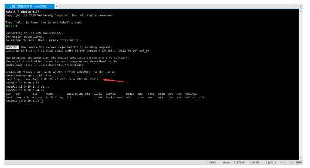

# Redis应急

## 一、简介

靶机名：网站入侵应急响应

靶机账号/密码：root/websecyjxy

难度-初级

# 二、题目

1、黑客的IP是？ flag格式：flag{黑客的ip地址}，如：flag{127.0.0.1}

2、黑客攻陷网站的具体时间是？ flag格式：flag{年-月-日 时:分:秒}，如：flag{2023-12-24 22:23:24}

3、黑客上传webshell的名称及密码是？ flag格式：flag{黑客上传的webshell名称-webshell密码}，如：flag{webshell.php-pass}

4、黑客提权后设置的后门文件名称是？ flag格式：flag{后门文件绝对路径加上名称}，如：flag{/etc/passwd}

5、排查出黑客进行挖矿的痕迹，获取最终的Flag。

# 三、WriteUp

### 一、前言

 **&lt;font color=&quot;#ff0000&quot;&gt;首先简单了解一下什么是redis？&lt;/font&gt;**

**Redis 是一个开源的、内存中的数据结构存储系统，用作数据库、缓存和消息代理。它支持多种数据结构，如字符串、散列、列表、集合、有序集合、位图、HyperLogLogs 和地理空间索引半径查询。以下是 Redis 的一些关键特性和用途：**

**关键特性：**

1. **高性能**：

    * 由于 Redis 是内存数据库，数据存储和读取的速度非常快。每秒可以执行数百万次操作。
2. **多种数据结构**：

    * Redis 支持多种数据结构，使其非常灵活，能够适应不同类型的应用场景。
    * 支持的结构包括：字符串（Strings）、列表（Lists）、集合（Sets）、有序集合（Sorted Sets）、哈希（Hashes）、位图（Bitmaps）等。
3. **持久化**：

    * 虽然 Redis 是内存数据库，但它支持将数据持久化到磁盘上，以防数据丢失。
    * 两种持久化方式：RDB（快照）和 AOF（追加文件）。
4. **复制（Replication）** ：

    * Redis 支持主从复制，可以将数据从一个 Redis 服务器复制到多个从服务器，提供数据冗余和高可用性。
5. **高可用性**：

    * Redis 通过 Redis Sentinel 提供高可用性。Sentinel 监控 Redis 主从实例，并在主服务器不可用时自动进行故障转移。
6. **集群（Cluster）** ：

    * Redis Cluster 提供自动分片和高可用性，允许 Redis 数据分布在多个节点上。
7. **事务**：

    * 支持事务，可以保证一组命令的原子性。
8. **脚本**：

    * Redis 支持 Lua 脚本，使得可以在 Redis 服务器端执行复杂的逻辑。

**基本的常见用途：**

1. **缓存**：

    * 由于 Redis 的高性能，常被用作缓存来存储频繁访问的数据，减少数据库负载和提高应用响应速度。
2. **会话存储**：

    * Redis 可以用来存储用户会话数据，如网站的用户登录会话等。
3. **消息队列**：

    * Redis 支持发布/订阅、列表和有序集合，因此可以用作简单的消息队列系统。
4. **实时分析**：

    * Redis 可以用于实时数据分析和统计，如计数器、唯一用户统计等。
5. **排行榜/计分板**：

    * 由于有序集合的支持，Redis 非常适合实现排行榜和计分板功能。
6. **地理空间数据**：

    * Redis 提供了内置的地理空间数据类型和命令，可以处理和查询地理位置数据。

**Redis 的强大功能和灵活性使其在现代应用中得到了广泛的应用，包括社交网络、实时分析、缓存、会话管理和队列处理等领域。**

 **&lt;font color=&quot;#ff0000&quot;&gt;简单了解一下攻击Redis的手法；&lt;/font&gt;**

* **未授权访问**：

  * **缺乏身份验证**：默认情况下，Redis 不要求身份验证，攻击者可以直接连接到 Redis 实例并执行任意命令。
  * **开放的网络接口**：如果 Redis 监听在一个公共的 IP 地址上，攻击者可以通过网络远程访问 Redis 实例。
* **远程代码执行**：

  * **CONFIG 命令**：攻击者可以利用未授权访问，通过 CONFIG 命令修改配置，例如设置 `dir`​ 和 `dbfilename`​ 来写入恶意文件，从而在目标服务器上执行代码。
  * **模块加载**：Redis 允许加载自定义模块，如果没有进行适当的访问控制，攻击者可以加载恶意模块并执行任意代码。
* **持久化攻击**：

  * **持久化文件劫持**：攻击者可以修改 Redis 的持久化配置（如 RDB 或 AOF 文件），然后写入恶意数据，当 Redis 重启时执行恶意操作。
  * **恶意数据注入**：通过注入恶意数据到持久化文件中，攻击者可以在数据恢复时触发恶意行为。
* **拒绝服务攻击（DoS）** ：

  * **资源耗尽**：通过发送大量请求或存储大量数据，攻击者可以耗尽 Redis 服务器的内存或 CPU 资源，导致服务不可用。
  * **大键值操作**：操作超大键值（如大列表或集合）可能会导致 Redis 性能下降，甚至崩溃。
* **数据篡改和泄露**：

  * **数据窃取**：未经授权的访问可以导致敏感数据的泄露。
  * **数据篡改**：攻击者可以修改或删除关键数据，影响系统的正常运行。

### 二、概览

#### 简介

**服务器场景操作系统 Linux服务器账号密码 root xjredis**

**任务环境说明**    **注：样本请勿在本地运行！！！样本请勿在本地运行！！！样本请勿在本地运行！！！**     **应急响应工程师小王某人收到安全设备告警服务器被植入恶意文件，请上机排查**

### 三、参考文章

[日志分析-redis应急响应](https://www.cnblogs.com/NoCirc1e/p/18164579)

[玄机-第二章 日志分析-redis应急响应](https://blog.csdn.net/JACKBREAK/article/details/139048283)

### 四、步骤（解析）

##### 准备工作#1.0

‍

​​

‍

‍

# 四、flag

1、黑客的IP是？

flag{192.168.10.135}

2、黑客攻陷网站的具体时间是？

flag{2023-12-22 19:08:34}

3、黑客上传webshell的名称及密码是？

flag{404.php-cmd}

4、黑客提权后设置的后门文件名称是？

flag{/usr/bin/find}

5、排查出黑客进行挖矿的痕迹，获取最终的Flag。

flag{websec_True@888!}

‍
